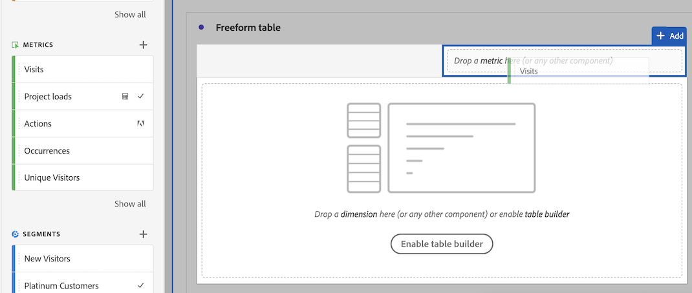

# Utilizzare componenti in un progetto

I componenti costituiscono i dati effettivi di ogni progetto in Analysis Workspace. I componenti sono costituiti da dimensioni, metriche, segmenti e intervalli di date. Puoi aggiungere componenti a un progetto trascinandoli nelle visualizzazioni o nei pannelli.

Per informazioni sui tipi di componenti che è possibile aggiungere, consulta [Panoramica dei componenti](/help/analyze/analysis-workspace/components/analysis-workspace-components.md).

>[!TIP]
>
>Per informazioni su ciascun componente, utilizza . Per ulteriori informazioni, consulta [Informazioni sui componenti](#component-info).

## Aggiungere componenti a un progetto

1. [Creare un progetto in Analysis Workspace](/help/analyze/analysis-workspace/build-workspace-project/create-projects.md).

1. [Aggiungi un pannello](/help/analyze/analysis-workspace/c-panels/panels.md#create-a-panel) o [aggiungi una visualizzazione](/help/analyze/analysis-workspace/visualizations/freeform-analysis-visualizations.md#add-visualizations-to-a-panel) al progetto in Analysis Workspace. Se aggiungi un componente a un progetto vuoto, viene già creata una visualizzazione con tabella a forma libera.

1. Seleziona  **[!UICONTROL Components]** dal pannello dei pulsanti. Tutti i componenti disponibili sono visualizzati nel pannello a sinistra. Per ulteriori dettagli, consulta [Interfaccia](/help/analyze/analysis-workspace/home.md#interface).

1. Scorri fino al componente che desideri aggiungere oppure cercalo, quindi trascinalo su un pannello o su una visualizzazione all’interno del progetto.

1. Facoltativamente, puoi trascinare un componente nella zona di rilascio nell’intestazione di un pannello. Questo trascinamento definisce il componente come un segmento e lo applica a tutto il contenuto all’interno del pannello.
Per informazioni su come utilizzare la zona di rilascio dei segmenti in un pannello per segmentare il pannello, vedi [Zona di rilascio](/help/analyze/analysis-workspace/c-panels/panels.md#drop-zone) in [Panoramica dei pannelli](/help/analyze/analysis-workspace/c-panels/panels.md).

1. Per informazioni dettagliate, consulta le sezioni seguenti:

   * [Aggiungere dimensioni a un progetto](#add-dimensions-to-a-project)

   * [Aggiungere metriche a un progetto](#add-metrics-to-a-project)

   * [Aggiungere segmenti a un progetto](#add-segments-to-a-project)

   * [Aggiungere intervalli di date a un progetto](#add-date-ranges-to-a-project)

### Aggiungere dimensioni a un progetto

[Le dimensioni](/help/components/dimensions/overview.md) sono variabili in Adobe Analytics che in genere contengono valori stringa. Al contrario, le [metriche](/help/components/c-calcmetrics/cm-overview.md) contengono valori numerici che si legano a una dimensione. Un rapporto di base mostra righe di valori stringa (dimensioni) rispetto a una colonna di valori numerici (metriche).

1. Inizia aggiungendo una dimensione al progetto in Analysis Workspace, come descritto in [Aggiungere componenti in un progetto](#add-components-to-a-project).

1. Scegli uno dei metodi seguenti per aggiungere dimensioni e determinare il tipo di dati che desideri analizzare:

   

   * Trascina una dimensione in una visualizzazione (ad esempio una tabella a forma libera) in Analysis Workspace.

   * Dal pannello a sinistra, trascina una o più dimensioni nella zona di rilascio dei segmenti per creare un segmento rapido, come descritto in [Aggiungere segmenti a un progetto](#add-filters-to-a-project).

1. Facoltativamente, puoi suddividere dimensioni ed elementi dimensionali in Analysis Workspace con altri componenti. Per ulteriori informazioni, consulta [Suddividere dimensioni in Workspace](/help/analyze/analysis-workspace/components/dimensions/t-breakdown-fa.md).

Per ulteriori informazioni sull’utilizzo delle dimensioni in Analysis Workspace, consulta [Anteprima delle dimensioni](/help/analyze/analysis-workspace/components/dimensions/view-dimensions.md), [Suddividere le dimensioni](/help/analyze/analysis-workspace/components/dimensions/t-breakdown-fa.md) e [Dimensioni suddivise in base al tempo](/help/analyze/analysis-workspace/components/dimensions/time-parting-dimensions.md).

### Aggiungere metriche a un progetto

Le metriche consentono di quantificare i punti di dati in Analysis Workspace. Sono solitamente utilizzate come colonne in una visualizzazione e associate alle dimensioni.

Per aggiungere una metrica a un progetto in Analysis Workspace:

1. Inizia ad aggiungere una metrica al progetto in Analysis Workspace, come descritto in [Aggiungere componenti a un progetto](#add-components-to-a-project).

1. Per aggiungere una metrica in Analysis Workspace, scegli uno dei seguenti metodi:

   

   * Per visualizzare la tendenza di una metrica nel periodo di date del progetto, trascinala nella zona di rilascio delle metriche in una tabella a forma libera vuota.

   * Per visualizzare una metrica per ciascun elemento di dimensione, trascinala quando è presente una dimensione.

   * Per sostituire una metrica esistente, trascina una metrica sopra l’intestazione della metrica da sostituire.

   * Per aggiungerne una nuova, trascinala vicino al lato destro o sinistro dell’intestazione di una metrica esistente.

   * Per creare una sovrapposizione di metrica, trascina una metrica sopra o sotto l’intestazione di una metrica esistente.

Per ulteriori informazioni sulle metriche, consulta la sezione [Metriche](/help/analyze/analysis-workspace/components/apply-create-metrics.md).

### Aggiungere segmenti a un progetto

I [segmenti](/help/components/segmentation/seg-overview.md) ti consentono di identificare sottoinsiemi di persone, sessioni o eventi in base a caratteristiche o interazioni specifiche.

Puoi utilizzare i segmenti in Analysis Workspace in uno dei seguenti modi:

* Aggiungere segmenti a un pannello
Quando aggiungi segmenti a un pannello, questi vengono applicati a tutto il contenuto al suo interno.
Per informazioni su come utilizzare la zona di rilascio dei segmenti in un pannello per segmentare il pannello, vedi [Zona di rilascio](/help/analyze/analysis-workspace/c-panels/panels.md#drop-zone) in [Panoramica dei pannelli](/help/analyze/analysis-workspace/c-panels/panels.md).

* Aggiungere segmenti a una visualizzazione
Quando aggiungi segmenti a una colonna in una tabella a forma libera, i segmenti si applicano a tutto il contenuto della colonna. Puoi anche aggiungere segmenti come parte di una visualizzazione del fallout.

* Utilizzare i segmenti nei componenti
Quando definisci componenti come [metriche calcolate](/help/components/c-calcmetrics/c-workflow/cm-workflow/c-build-metrics/metrics-with-segments.md), [annotazioni](/help/analyze/analysis-workspace/components/annotations/create-annotations.md#annotation-builder) o anche [segmenti](/help/components/segmentation/segmentation-workflow/seg-build.md) puoi utilizzare i segmenti come parte della definizione.

### Aggiungere intervalli di date a un progetto

[Gli intervalli di date](/help/analyze/analysis-workspace/components/calendar-date-ranges/calendar.md) determinano l&#39;intervallo di tempo di reporting in Analysis Workspace. Inoltre, un intervallo di dati può essere applicato ai pannelli all’interno di un progetto e anche ad alcune visualizzazioni (come la tabella a forma libera).

Per impostazione predefinita, ogni pannello include un intervallo di date. Esistono diversi modi per aggiornare un intervallo di date per un pannello. Un modo per aggiornare l’intervallo di date di un pannello in Analysis Workspace consiste nel trascinare un componente intervallo di date dal pannello a sinistra:

1. Facoltativamente, aggiungi un intervallo di date al progetto in Analysis Workspace, come descritto in [Aggiungere componenti al progetto](#add-components-to-a-project).

1. Trascina e rilascia un intervallo di date dal pannello a sinistra in:

   * l’intervallo di date corrente, per modificare quello del pannello.

     

   * Una metrica o dimensione in una visualizzazione Tabella a forma libera. Per ulteriori informazioni, consulta [Utilizzare intervalli di date](/help/analyze/analysis-workspace/components/calendar-date-ranges/calendar.md#use-date-ranges).

Per ulteriori informazioni su come utilizzare e gestire gli intervalli di date in Analysis Workspace, consulta [Panoramica sugli intervalli di date](/help/analyze/analysis-workspace/components/calendar-date-ranges/calendar.md).

## Informazioni componente

Puoi passare il puntatore su qualunque componente per visualizzare . Quando si seleziona , viene visualizzato un popup con informazioni aggiuntive sul componente.

In base al controllo degli accessi, puoi:

* Accedere alla definizione  [!UICONTROL Data dictionary] per il componente.
* Accedi al generatore di componenti  in cui è definito il componente.

<!--
# Use components in Analysis Workspace

Components make up the actual data of any project in Analysis Workspace. Components consist of dimensions, metrics, segments, and date ranges. You can add components to a project by dragging them into visualizations or panels.

For overview information about the types of components you can add, see [Components overview](/help/analyze/analysis-workspace/components/analysis-workspace-components.md).

>[!TIP]
>
>For information about each component, select the Info icon next to a component's name in the left rail of Analysis Workspace, or see the [Analytics Components Guide](/help/components/home.md).

## Begin adding components to a project

1. [Create a project in Analysis Workspace](/help/analyze/analysis-workspace/build-workspace-project/create-projects.md) if you haven't already.

1. [Add a panel](/help/analyze/analysis-workspace/c-panels/panels.md) or [add a visualization](/help/analyze/analysis-workspace/visualizations/freeform-analysis-visualizations.md#add-visualizations-to-a-panel) to the project in Analysis Workspace. 

   If you add a component to a blank project, a freeform table visualization is automatically created.

1. Select the **[!UICONTROL Components]** icon in the left rail.

   

1. Scroll to or search for the component you want to add, then drag it to a panel or visualization within your project. 

1. (Optional) Drag a component to the segment drop zone in a panel header. 

   Segments apply to all content within the panel.

   For information about how you can use the segment drop zone on a panel to filter your panel, see [Drop zone](/help/analyze/analysis-workspace/c-panels/panels.md#drop-zone) in [Panels overview](/help/analyze/analysis-workspace/c-panels/panels.md).

   

1. For more detailed information, continue with one of the following sections, depending on the component type you are adding:

   * [Add dimensions to a project](#add-dimensions-to-a-project)

   * [Add metrics to a project](#add-metrics-to-a-project)

   * [Add segments to a project](#add-segments-to-a-project)

   * [Add date ranges to a project](#add-date-ranges-to-a-project)

## Add dimensions to a project

[Dimensions](/help/components/dimensions/overview.md) are variables in Adobe Analytics that typically contain string values. Common dimensions include [Page](/help/components/dimensions/page.md), [Referring domain](/help/components/dimensions/referring-domain.md), or an [eVar](/help/components/dimensions/evar.md). In contrast, [metrics](/help/components/metrics/overview.md) contain numeric values that tie to a dimension. A basic report shows rows of string values (dimension), against a column of numeric values (metric).

1. Start adding a dimension to your project in Analysis Workspace, as described in [Begin adding components to a project](#begin-adding-components-to-a-project).

1. Choose one of the following methods to add dimensions and determine the type of data you want to analyze:

   * Drag a dimension to a visualization (such as a freeform table) in Analysis Workspace.

     
   
   * Drag one or more dimensions from the left rail onto the segment drop zone to create an ad hoc segment, as described in [Add segments to a project](#add-segments-to-a-project).

     

1. (Optional) You can break down dimensions and dimension items in Analysis Workspace with other components. 

   For more information, see [Break down dimensions](/help/analyze/analysis-workspace/components/dimensions/t-breakdown-fa.md).

For more information about how to use dimensions in Analysis Workspace, see [Preview dimensions](/help/analyze/analysis-workspace/components/dimensions/view-dimensions.md), [Break down dimensions](/help/analyze/analysis-workspace/components/dimensions/t-breakdown-fa.md), and [Time-parting dimensions](/help/analyze/analysis-workspace/components/dimensions/time-parting-dimensions.md).

## Add metrics to a project

[Metrics](/help/analyze/analysis-workspace/components/apply-create-metrics.md) allow you to quantify data points in Analysis Workspace. They are most commonly used as columns in a visualization and tied to dimensions.

To add a metric to a project in Analysis Workspace:

1. Start adding a metric to your project in Analysis Workspace, as described in [Begin adding components to a project](#begin-adding-components-to-a-project).

1. Choose one of the following methods to add a metric in Analysis Workspace:

   * Drag a metric to the metric drop zone in an empty Freeform table to see that metric trended over the project's date period. 

     

   * Drag a metric when a dimension is present to see that metric compared to each dimension item. 

   * Drag a metric on top of an existing metric header to replace it.

   * Drag a metric next to a header to see both metrics side-by-side.

For more information about how to use metrics in Analysis Workspace, see [Metrics](/help/analyze/analysis-workspace/components/apply-create-metrics.md).

## Add segments to a project

[Segments](/help/components/segmentation/seg-overview.md) allow you to identify subsets of visitors based on characteristics or specific interactions.

You can use segments in Analysis Workspace in any of the following ways:

### Add segments to a panel

When you add segments to a panel, the segments apply to all content within the panel.

For information about how you can use the segment drop zone on a panel to filter your panel, see [Drop zone](/help/analyze/analysis-workspace/c-panels/panels.md#drop-zone) in [Panels overview](/help/analyze/analysis-workspace/c-panels/panels.md).

### Add segments to a column in a freeform table

When you add segments to a column in a freeform table, the segments apply to all content within the table column.

### Use segments when creating calculated metrics

In the Calculated metric builder, you can apply segments within your metric definition. 

For more information, see [Segmented metrics](/help/components/c-calcmetrics/c-workflow/cm-workflow/c-build-metrics/metrics-with-segments.md).

## Add date ranges to a project

[Date ranges](/help/analyze/analysis-workspace/components/calendar-date-ranges/custom-date-ranges.md) determine the reporting time frame in Analysis Workspace, and can be applied to one or more panels within a project.

Each panel includes a date range by default. There are multiple ways to update a date range for a panel. One way to update a date range for a panel in Analysis Workspace is to drag a date range component from the left rail:

1. Start adding a date range to your project in Analysis Workspace, as described in [Begin adding components to a project](#begin-adding-components-to-a-project).

1. Drag a date range from the left rail onto the current date range in the upper-right portion of the panel.

     

For more information about how to use calendars and date ranges in Analysis Workspace, see [Calendar and date ranges overview](/help/analyze/analysis-workspace/components/calendar-date-ranges/calendar.md).

-->