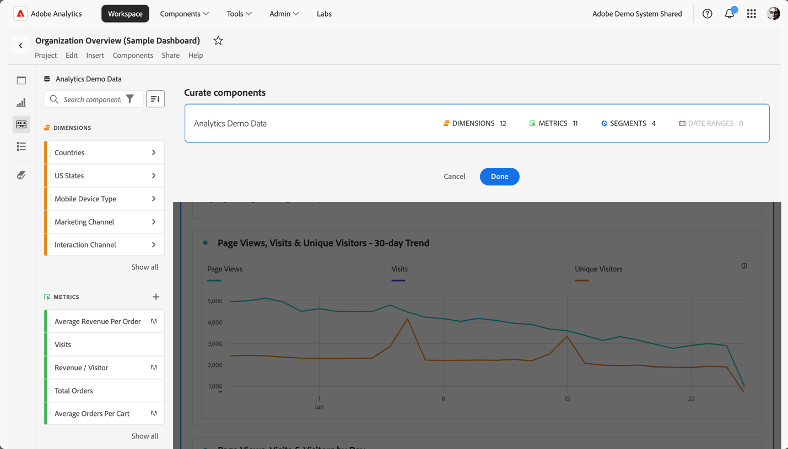

# Curare progetti Workspace

La cura ti consente di limitare i componenti (dimensioni, metriche, segmenti, intervalli di date) prima di condividere un progetto. Quando un destinatario apre il progetto, vedrà un set limitato di componenti che hai curato per lui. La cura è un passaggio facoltativo ma consigliato prima di condividere un progetto.

>[!NOTE]
> I profili di prodotto sono il meccanismo principale per determinare quali componenti può vedere un utente. Vengono gestiti tramite l’Admin Console di Adobe Experience Cloud. La cura è un filtro secondario.

## Applicare la cura del progetto

1. Fai clic su **[!UICONTROL Share]** > **[!UICONTROL Curate Project Data]**.
I componenti utilizzati nel progetto verranno aggiunti automaticamente.
   **Nota**: se un progetto ha più suite di rapporti, visualizzerai un campo curato per ciascuna suite di rapporti presente nel progetto.
1. Per aggiungere altri componenti, trascina i componenti da condividere dalla barra a sinistra al campo [!UICONTROL Curate Components] (facoltativo).
1. Fai clic su **[!UICONTROL Done]**.

È inoltre possibile applicare la cura dal menu [!UICONTROL Share] facendo clic su **[!UICONTROL Curate and Share]**. Questa opzione cura automaticamente il progetto con i componenti in uso nel progetto. Puoi aggiungere altri componenti seguendo la procedura descritta sopra.

## Vista del progetto curato

Quando un destinatario apre un progetto curato, vedrà solo il set curato di componenti che hai definito:

## Rimuovere la cura del progetto

Per rimuovere la cura del progetto e ripristinare l’intero set di componenti nella barra a sinistra:

1. Fai clic su **[!UICONTROL Share]** > **[!UICONTROL Curate Project Data]**.
1. Fai clic su **[!UICONTROL Remove Curation]**.
1. Fai clic su **[!UICONTROL Done]**.

## Cura di suite di rapporti virtuali (VRS, Virtual Report Suite)

Per applicare la cura a livello di suite di rapporti in modo che venga applicata a più progetti contemporaneamente, puoi [curare i componenti in una suite di rapporti virtuale (VRS, Virtual Report Suite)](https://docs.adobe.com/content/help/it-IT/analytics/components/virtual-report-suites/vrs-components.html).

>[!NOTE]
> La cura VRS viene sempre applicata prima della cura del progetto. Ciò significa che anche se il progetto curato include alcuni componenti, essi verranno filtrati se la VRS curata non li include.

## Opzione Show All per mostrare tutti i componenti

In un progetto curato o in una VRS, al destinatario verrà offerta l’opzione **[!UICONTROL Show All]** per mostrare tutti i componenti nella barra a sinistra. [!UICONTROL Show All] mostra diversi set di componenti in base a:

* Livello di autorizzazione dell’utente (amministratore o non amministratore)
* Ruolo di progetto (proprietario/editor o meno)
* Tipo di cura applicata (VRS o del progetto)

| Tipo di cura | Amministratori | Ruolo di proprietario del progetto o editor non amministratore | Ruolo di duplicazione o visualizzazione non amministratore |
|---|---|---|---|
| VRS curate | Tutti i componenti VRS non curati | I componenti VRS non curati di cui è proprietario l’utente con questo ruolo e che sono stati condivisi con l’utente | I componenti VRS non curati di cui è proprietario l’utente con questo ruolo e che sono stati condivisi con l’utente |
| Progetto curato | Tutti i componenti di progetto non curati | Tutti i componenti di progetto non curati | I componenti di progetto non curati di cui è proprietario l’utente con questo ruolo e che sono stati condivisi con l’utente |
| Progetto curato in una VRS curata | Tutti i componenti non curati, visualizzati in **[!UICONTROL Non-Curated Project Components]** e **[!UICONTROL Non-Curated VRS Components]** | Tutti i componenti di progetto non curati E i componenti VRS non curati di cui è proprietario l’utente con questo ruolo e che sono stati condivisi con l’utente | I componenti VRS e di progetto non curati di cui è proprietario l’utente con questo ruolo e che sono stati condivisi con l’utente |
