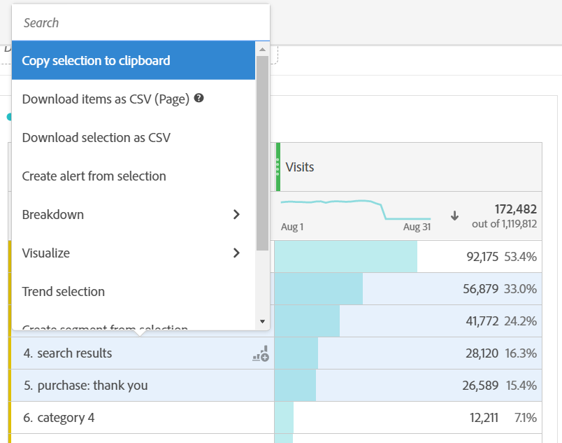

# Scaricare file PDF o CSV

Esistono diversi modi per esportare dati da Analysis Workspace. Il metodo scelto dipende dal set di dati che si desidera analizzare e da chi deve accedervi.

I dati esportati possono essere sotto forma di dati copiati, CSV o PDF. Un PDF è in genere consigliato se desideri includere le visualizzazioni nel file. Se desideri semplicemente dati in formato testo, puoi usare CSV e dati copiati.

## Scaricare un progetto come CSV o PDF {#download-project}

1. Effettua una delle seguenti operazioni, a seconda del formato in cui desideri scaricare il progetto:

   * **PDF:** Seleziona **[!UICONTROL Project]** > **[!UICONTROL Download PDF]**.

      Scegli questa opzione se vuoi che il file scaricato contenga tutte le tabelle e le visualizzazioni visualizzate (visibili) nel progetto.

   * **CSV:** Seleziona **[!UICONTROL Project]** > **[!UICONTROL Download CSV]**.

      Scegliere questa opzione se si desidera utilizzare dati in formato testo normale.
   

1. (Condizionale) Se hai scelto di scaricare un PDF, viene visualizzato un messaggio dopo che il progetto è pronto per essere scaricato. Clic [!UICONTROL **Scarica**].

Per i download dei progetti, considera i seguenti aspetti:

* Il progetto può essere salvato o non salvato quando si richiede il download di un progetto. Tuttavia, solo i progetti salvati possono essere [pianificati](https://experienceleague.adobe.com/docs/analytics/analyze/analysis-workspace/curate-share/t-schedule-report.html?lang=it).
* I PDF scaricati nel browser possono richiedere alcuni minuti per l’esportazione, perché il progetto viene rieseguito sui server di Adobe prima di generare il formato PDF. È consigliabile non uscire dal progetto fino al completamento del download del PDF nel browser. Tuttavia, puoi continuare ad apportare modifiche al progetto mentre attendi. Se la generazione di un PDF richiede più di 5 minuti, ti verrà chiesto di usare l’e-mail.
* I download dei PDF vengono riprodotti come una singola pagina senza impaginazione.
* Quando viene generato il PDF di un progetto in PDF, questo conterrà ciò che si trova sulla pagina. Se un progetto contiene pannelli e visualizzazioni di dimensione personalizzata, dovrai impostarne ridimensionamento automatico (con il pulsante in alto a destra) in modo da evitare che alcuni contenuti vengano troncati.

## Copiare i dati negli Appunti (scelta rapida: Ctrl + C) {#copy-data}

Opzione di scelta rapida **[!UICONTROL Copy to clipboard]** consente di copiare rapidamente i dati da Workspace e incollarli in uno strumento di terze parti.

* Se si desidera copiare la tabella visualizzata, fare clic con il pulsante destro del mouse sull&#39;intestazione della tabella e scegliere **Copiare i dati negli Appunti**.
* Se desideri copiare un sottoinsieme di dati, effettua una selezione nella tabella, quindi fai clic con il pulsante destro del mouse e scegli **Copia selezione negli Appunti**.

>[!TIP]
>
>È possibile utilizzare il tasto di scelta rapida `Ctrl+C` per copiare la selezione negli Appunti, quindi utilizzare `Ctrl+V` per incollarlo in uno strumento di terze parti.

## Scaricare i dati come CSV {#download-data}

L’opzione di scelta rapida **[!UICONTROL Download data as CSV]** consente di scaricare come CSV una tabella di dati o l’origine dati di qualsiasi visualizzazione.

* Nell’intestazione di una tabella o visualizzazione, fai clic con il pulsante destro del mouse e scegli **[!UICONTROL Download data as CSV]**. In questo modo i dati visualizzati nella tabella o nell’origine dati sottostante per una visualizzazione vengono scaricati come CSV.

   >[!NOTE]
   >
   >  Nota: la visualizzazione Mappa non supporta questa opzione.

* All’interno di una tabella, fai clic con il pulsante destro del mouse e scegli **[!UICONTROL Download selection as CSV]**. Questa opzione consente di scaricare solo la selezione, anziché tutta la tabella visualizzata.

## Scaricare elementi come CSV {#download-items}

Per analizzare più delle 400 righe di dati visibili in una tabella, fai clic con il pulsante destro del mouse sull’intestazione della tabella o su una riga qualsiasi e seleziona (Analizza) **Scarica elementi come CSV (_Nome Dimension_)**. Questa opzione esporta fino a 50.000 elementi dimensionali (in base all’ordinamento della tabella) per la dimensione selezionata, con l’applicazione di filtri e segmenti. Se scegli questa opzione nella parte superiore della tabella, verrà esportata la prima dimensione della tabella. Anche se la tabella a forma libera non prevede alcun limite, per prestazioni ottimali si consiglia di utilizzare l’opzione Scarica elementi solo per le tabelle con meno di 20 colonne.

>[!TIP]
>
> Se la dimensione supera i 50.000 elementi, scarica il file con diverse metriche di ordinamento oppure applica un filtro. Ad esempio, esegui un download con i dati in ordine decrescente in base a Visite, quindi un secondo download in ordine crescente. Questo consente di recuperare gli elementi in fondo alle liste.

Mentre il download è in corso, puoi eseguire più attività all’interno del progetto e persino passare a un nuovo progetto Workspace nella stessa scheda. Il download si interrompe se apri una nuova scheda del browser. Il download viene annullato se esci completamente da Workspace o se chiudi la scheda del browser.

### File di elementi scaricati

Le funzioni della tabella vengono applicate al file scaricato come segue:

* Tutti i segmenti dei pannelli vengono applicati come filtri.
* Le suddivisioni **al di sopra** della dimensione selezionata nella tabella vengono applicate come filtri sopra ogni colonna.
* Le suddivisioni **al di sotto** della dimensione selezionata nella tabella vengono rimosse.

Nell’esempio precedente, gli elementi Pagina vengono scaricati con il segmento del pannello (Clienti nuovi visitatori) e i componenti al di sopra (Canale marketing = E-mail) vengono applicati come filtri. I componenti al di sotto (Tipo di dispositivo mobile) vengono rimossi dal CSV scaricato.

### Notifiche relative al download

Quando il file viene scaricato, viene visualizzata una notifica informativa sull’avanzamento. In qualsiasi momento, puoi annullare il download facendo clic su **[!UICONTROL Cancel download]**. La chiusura dell’avviso popup **non** annulla il download.

Al termine, verrà visualizzata una notifica di completamento e il file verrà scaricato sul browser.

Se richiedi più di un download alla volta, una notifica ti segnala che ogni download aggiuntivo sarà messo in coda fino al completamento del download precedente.

## Domande frequenti {#faq}

| Domanda | Risposta |
| --- | --- |
| Perché il PDF scaricato ha una sola pagina? | Al momento, Workspace non impagina i PDF scaricati. |
| Posso esportare più di 50.000 elementi con l’opzione &quot;Scarica elementi come CSV&quot;? | Anche se ogni download può contenere un masimo di 50.000 elementi dimensionali, puoi cambiare l’ordine nella tabella in modo da recuperare gli elementi che erano in fondo alla tabella secondo il precedente ordine, o applicare un filtro per scaricare specifici elementi. |
| Che funzione svolge **[!UICONTROL Copy visualization]**? | A differenza di [!UICONTROL **Copiare i dati negli Appunti**] o [!UICONTROL **Copia selezione negli Appunti**], il **[!UICONTROL Copy visualization]** l’opzione di scelta rapida non è un’opzione di esportazione. Consente di copiare una visualizzazione o un pannello da una posizione in Workspace a un’altra. Ad esempio, da un pannello all’altro nello stesso progetto oppure da un progetto a un altro. [Video sui collegamenti interni al progetto](https://experienceleague.adobe.com/docs/analytics-learn/tutorials/analysis-workspace/visualizations/intra-linking-in-analysis-workspace.html?lang=it) |
