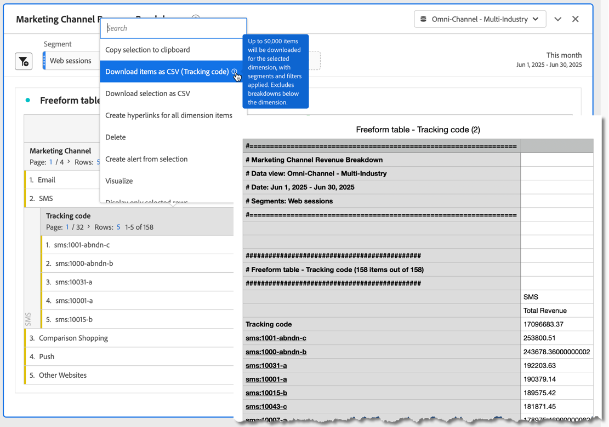

# Scaricare progetti e dati

Puoi scaricare i progetti e i dati di Analysis Workspace sul tuo dispositivo locale. Questo download può essere un file di dati copiato, un file CSV (valori separati da virgole) o un documento PDF (formato di documento portatile).

* Se vuoi includere le visualizzazioni nel file scaricato, seleziona l’opzione PDF.
* Se hai semplicemente bisogno di dati in formato testo, seleziona le opzioni CSV e dati copiati.

Ulteriori metodi per esportare i dati di Adobe Analytics sono descritti nella [Guida all&#39;esportazione](/help/export/home.md).

## Scaricare un progetto come file PDF o CSV {#download-project}

### Scaricare un progetto come file PDF

Quando scarichi un progetto come PDF, considera quanto segue:

* Non uscire dal progetto finché non viene scaricato sulla workstation. Il download può richiedere alcuni minuti, poiché il progetto viene rieseguito sui server Adobe per consentire al PDF di eseguire il rendering. Puoi continuare ad apportare modifiche al progetto mentre è in corso il rendering del download. Se il rendering di un PDF richiede più di 5 minuti, ti viene richiesto di [inviare un&#39;e-mail a PDF](../curate-share/send-schedule-files.md).
* I file scaricati vengono riprodotti come una singola pagina senza impaginazione.
* Il PDF contiene ciò che è visibile nella pagina del browser in Analysis Workspace. Per evitare contenuti troncati, seleziona  per ridimensionare automaticamente qualsiasi visualizzazione o pannello con dimensioni personalizzate.
* È possibile fare clic su [Collegamenti ipertestuali](/help/analyze/analysis-workspace/visualizations/freeform-table/freeform-table-hyperlinks.md) nelle tabelle a forma libera nel PDF scaricato.

Per scaricare un progetto come file PDF:

1. Seleziona **[!UICONTROL Project]** > **[!UICONTROL Download PDF]**.

   Viene visualizzata una barra verde con il seguente messaggio:  **[!UICONTROL Your download has been requested. Please wait.]**

1. Quando il download è pronto, viene visualizzata una barra verde con il seguente messaggio:  **[!UICONTROL *Il nome del progetto *PDF è pronto.]**

1. Selezionare **[!UICONTROL Download]** sulla barra verde.

   A seconda delle impostazioni del browser, PDF viene scaricato automaticamente nella cartella configurata in precedenza oppure viene richiesto di scegliere una cartella in cui scaricare PDF.

   Il nome file è composto da *nome progetto* - *nome suite di rapporti* - *data*. Ad esempio: `Example Project - Omni-Channel - Luma - Jun 30, 2025.pdf`.

### Scaricare un progetto come file CSV

1. Seleziona **[!UICONTROL Project]** > **[!UICONTROL Download CSV]**.

   A seconda delle impostazioni del browser, il file CSV viene scaricato automaticamente in una cartella configurata in precedenza oppure viene richiesto di scegliere una cartella in cui scaricare il file CSV.

   Il nome file è composto da *nome progetto* - *nome suite di rapporti* - *data*. Ad esempio: `Example Project - Omni-Channel - Luma - Jun 30, 2025.csv`.

## Copiare i dati di una visualizzazione negli Appunti {#copy-data}

L&#39;opzione **[!UICONTROL Copy to clipboard]** del menu di scelta rapida consente di copiare rapidamente i dati da Analysis Workspace e incollarli in uno strumento di terze parti.

* Se si desidera copiare i dati della tabella visualizzata, selezionare l&#39;intestazione della tabella e selezionare **Copia dati negli Appunti** dal menu di scelta rapida.
* Se desideri copiare un sottoinsieme di dati, effettua una selezione nella tabella e seleziona **Copia selezione negli Appunti** dal menu di scelta rapida.

>[!TIP]
>
>È possibile utilizzare il tasto di scelta rapida **_cmd + c_** (macOS) o **_ctrl + c_** (Windows) per copiare la selezione negli Appunti. Quindi utilizzare **_cmd + v_** (macOS) o **_ctrl + v_** (Windows) per incollare i dati.

{zoomable="yes"}

## Scaricare i dati all’interno di una visualizzazione come file CSV {#download-data}

Le opzioni Scarica come CSV del menu di scelta rapida consentono di scaricare come CSV una tabella di dati o l’origine dati di qualsiasi visualizzazione.

A tale scopo, effettua le seguenti operazioni:

* Dall&#39;intestazione di qualsiasi tabella o visualizzazione, selezionare **[!UICONTROL Download data as CSV]** dal menu di scelta rapida. In questo modo i dati mostrati nella tabella o nell’origine dati sottostante per una visualizzazione vengono scaricati come CSV.

<!-- Only relevant as soon as CJA supports Map visualization 
  >[!NOTE]
  >
  >  Note: the Map visualization does not support this option.
-->

* In una tabella, selezionare **[!UICONTROL Download selection as CSV]** dal menu di scelta rapida. Questa opzione consente di scaricare solo la selezione, anziché tutta la tabella visualizzata.

## Scaricare elementi come file CSV {#download-items}

Per analizzare più delle 400 righe di dati visibili in una tabella, seleziona **Scarica elementi come CSV (_Nome Dimension_)** dal menu di scelta rapida dell&#39;intestazione della tabella o di qualsiasi riga. Questa opzione consente di esportare fino a 50.000 elementi dimensionali (in base all’ordinamento della tabella) per la dimensione selezionata, con l’applicazione di opzioni di ordinamento e filtri. Se si seleziona questa opzione nella parte superiore della tabella, viene esportata la prima dimensione della tabella.

La tabella a forma libera non prevede alcun limite. Per garantire prestazioni ottimali, si consiglia di utilizzare questa opzione nelle tabelle con meno di 20 colonne.

>[!TIP]
>
> Se la dimensione supera i 50.000 elementi, scarica il file con diverse metriche di ordinamento oppure applica un segmento. Ad esempio, esegui un download con i dati in ordine decrescente in base a Visite, quindi un secondo download in ordine crescente. Questo consente di recuperare gli elementi in fondo alle liste.

Mentre il download è in corso, puoi eseguire più attività all’interno del progetto e persino passare a un nuovo progetto Workspace nella stessa scheda. Se apri una nuova scheda del browser, il download verrà messo in pausa. Se esci completamente da Workspace o se chiudi la scheda del browser, il download verrà annullato.

### File di elementi scaricati {#items-file}

Al file scaricato vengono applicate le seguenti funzioni di una tabella a forma libera:

* Tutti i segmenti dei pannelli vengono applicati come filtri.
* Le suddivisioni **al di sopra** della dimensione selezionata nella tabella vengono applicate come filtri sopra ogni colonna.
* Le suddivisioni **al di sotto** della dimensione selezionata nella tabella vengono rimosse.

### Notifiche relative al download {#notifications}

Durante il download del file vengono visualizzate le notifiche seguenti:

* È stato richiesto un **[!UICONTROL _nome tabella _blu -_Dimension _.csv._x _% completato]**che indica l&#39;avanzamento. Per annullare il download, selezionare **[!UICONTROL Cancel download]**. Selezionare  se si desidera chiudere il messaggio senza annullare il download.
* Una notifica di completamento verde **[!UICONTROL _Nome tabella _-_Dimension _.csv è stato scaricato]**una volta completato il download del file. Il file viene scaricato nella cartella dei download configurata per il browser.

Se richiedi più di un download alla volta, ricevi una notifica che indica che ogni download aggiuntivo è in coda fino al completamento del download precedente.

## Domande frequenti {#faq}

| Domanda | Risposta |
| --- | --- |
| Perché il mio PDF scaricato è costituito da una sola pagina? | La funzionalità [Scarica PDF](#download-as-csv-or-pdf) non impagina i PDF scaricati. |
| È possibile esportare più di 50.000 elementi con l&#39;opzione **[!UICONTROL Download items as CSV]**? | Anche se ogni download può contenere un masimo di 50.000 elementi dimensionali, puoi cambiare l’ordine nella tabella in modo da recuperare gli elementi che erano in fondo alla tabella secondo il precedente ordine, o applicare un filtro per scaricare specifici elementi. |
| Che funzione svolge **[!UICONTROL Copy visualization]**? | A differenza di [!UICONTROL **Copia dati negli Appunti**] o [!UICONTROL **Copia selezione negli Appunti**], l&#39;opzione del menu di scelta rapida **[!UICONTROL Copy visualization]** non è un&#39;opzione di esportazione. Questa opzione ti consente di [copiare una visualizzazione](/help/analyze/analysis-workspace/visualizations/freeform-analysis-visualizations.md#context-menu) o [copiare un pannello](/help/analyze/analysis-workspace/c-panels/panels.md#context-menu) da una posizione in Workspace a un&#39;altra. Ad esempio, da un pannello all’altro nello stesso progetto o da un progetto a un altro. |

<!--

# Download 

There are several ways to export data from Analysis Workspace. The method you choose depends on what set of data you want to analyze and who needs to access it.

Exported data can be in the form of copied data, CSV, or PDF. A PDF is typically preferred if you want visualizations included in the file. CSV and copied data is preferred if you simply want plain-text data.

## Download a project as CSV or PDF {#download-project}

Consider the following when downloading projects:

* When downloading projects as a CSV or PDF, the project can be saved or unsaved when you request a project download. However, only saved projects can be [scheduled](/help/analyze/analysis-workspace/curate-share/t-schedule-report.md). 

* When downloading projects as a PDF:
  * Downloads can take several minutes to export because the project is re-run on Adobe servers before rendering in PDF format. We recommend not leaving the project until the PDF downloads in your browser. However, you can continue to make changes to the project while you wait. If a PDF takes longer than 5 minutes to render, you will be prompted to email it instead.
  * Downloads are rendered as a single page with no pagination applied.
  * PDF renderings contain what is on the page in Workspace. If a project has custom-sized visualizations and panels, you need to change them to be auto-sized (button in top-right corner) so that there will be no truncated content.
  * Any [hyperlinks](/help/analyze/analysis-workspace/visualizations/freeform-table/freeform-table-hyperlinks.md) that exist within freeform tables are not functional in the downloaded PDF. 

To download a project as a CSV or PDF file:

1. Do either of the following, depending on what format you want to download the project in:

   * **PDF:** Select **[!UICONTROL Project]** > **[!UICONTROL Download PDF]**.

     Choose this option if you want the downloaded file to contain all the displayed (visible) tables and visualizations in the project.

   * **CSV:** Select **[!UICONTROL Project]** > **[!UICONTROL Download CSV]**. 

     Choose this option if you want plain-text data.

   

1. (Conditional) If you chose to download a PDF, a message is shown after the project is ready to be downloaded. Click [!UICONTROL **Download**].
1. Click the **[!UICONTROL Download this file]** icon and save the file to a folder of your choice.

## Copy data to clipboard (hotkey: cmd + c) {#copy-data}

The right-click option **[!UICONTROL Copy to clipboard]** lets you quickly copy data from Workspace and paste it in a third-party tool. 

* If you want the displayed table copied, right-click the table header and choose **Copy data to clipboard**. 
* If you want a subset of data copied, make a selection in the table and then right-click > **Copy selection to clipboard**.

>[!TIP]
>
>You can use the hotkey `Ctrl+C` to copy your selection to the clipboard, then use `Ctrl+V` to paste it into a third-party tool.

## Download data as CSV {#download-data}

The right-click option **[!UICONTROL Download data as CSV]** allows you to download a table of data or the data source of any visualization as a CSV.

* From the header of any table or visualization, right-click and choose **[!UICONTROL Download data as CSV]**. This downloads the displayed data in the table or the underlying data source for a visualization as a CSV. 

  >[!NOTE]
  >
  >  Note: the Map visualization does not support this option.

* Within a table, right-click and choose **[!UICONTROL Download selection as CSV]**. Only the selection is downloaded with this option, as opposed to the full, displayed table.

## Download items as CSV {#download-items}

If you want to analyze more than the visible 400 rows of data in a table, right-click the table header or any row and select **Download items as CSV (_Dimension name_)**. This option exports up to 50,000 dimension items (based on the table sort) for the selected dimension, with filters and segments applied. If you chose this option from the top of the table, the first dimension in the table will be exported. While no limits are enforced in the freeform table, it is recommended that the Download items option be used in tables with less than 20 columns to ensure optimal performance.

>[!TIP]
>
> If your dimension exceeds 50,000 items, download the file with different sort metrics applied or apply a filter. For example, sort descending by Visits in one download and then ascending by Visits in a second download. This tip can help you retrieve longer-tail items.

You can multi-task within the project and even navigate to a new Workspace project in the same tab while the download is in progress. The download pauses if you open a new browser tab. The download is canceled if you leave Workspace completely or close the browser tab.

### Downloaded items file 

Features of the table will be applied to the downloaded file as follows:

* All panel segments are applied as filters.
* Breakdowns **above** the selected dimension in the table are applied as filters above each column. 
* Breakdowns **below** the selected dimension in the table are removed.

In the example above, Page items are downloaded with the panel segment (New Visitors Customers) and components above (Marketing Channel = Email) applied as filters, and the components below (Mobile Device Type) removed from the downloaded CSV.

### Download notifications

As the file downloads, you will see an informational notification with the progress. At any time, you can cancel the download by clicking **[!UICONTROL Cancel download]**. Closing the toast **will not** cancel the download. 

Once the file completes, you will see a completion notification and the file will download to your browser.

If you request more than one download at a time, you will receive a notification that each additional download will be queued until the prior download completes.

## FAQ {#faq}

| Question | Answer |
| --- | --- |
| Why is my downloaded PDF one page? | Workspace does not paginate downloaded PDFs at this time. |
| Can I export more than 50,000 items with the "Download items as CSV" option? | While each download can contain up to 50,000 dimension items, you can change the sort of your table to retrieve longer tail items, or apply a filter to download more specific items. |
| What does **[!UICONTROL Copy visualization]** do? | Unlike [!UICONTROL **Copy data to clipboard**] or [!UICONTROL **Copy selection to clipboard**], the **[!UICONTROL Copy visualization]** right-click option is not an export option. It allows you to copy a visualization or panel from one place in Workspace to another. For example, from one panel to another in the same project, or from one project to another project. [Intra-linking video](https://experienceleague.adobe.com/docs/analytics-learn/tutorials/analysis-workspace/visualizations/intra-linking-in-analysis-workspace.html) |

-->