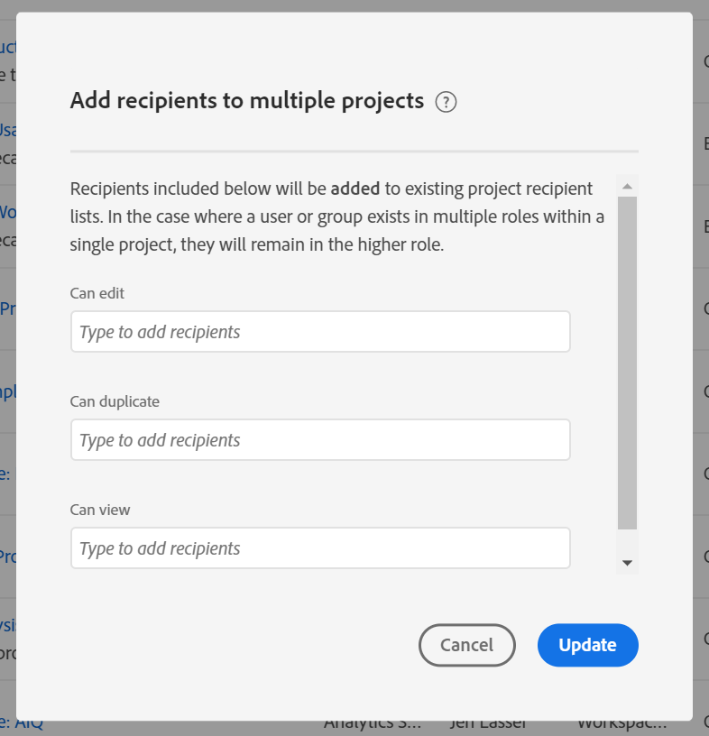

# Condivisione di progetti Workspace

La condivisione rende un progetto disponibile ad altri utenti Analysis Workspace &#39;organizzazione. Qualsiasi [cura](curate.md) applicata viene visualizzata all’apertura del progetto da parte dei destinatari.

## Ruoli del progetto

Puoi aggiungere i destinatari a uno dei tre ruoli di progetto. I ruoli del progetto sono legati all&#39;utente e all&#39;ID progetto specifico. I ruoli del progetto sono indipendenti dalle autorizzazioni utente gestite nella [console](https://docs.adobe.com/content/help/it-IT/core-services/interface/manage-users-and-products/admin-getting-started.html)di amministrazione di Experience Cloud.

| Ruolo | Controllo progetto |
|---|---|
| Può modificare | I destinatari possono salvare le modifiche apportate a un progetto e fungere da co-proprietari. Questo ruolo è utile se desiderate collaborare con i colleghi su un progetto. |
| Può duplicare | I destinatari possono salvare con nome e accedere alla barra a sinistra. Le interazioni non sono limitate. Questo ruolo è utile se desiderate condividere un progetto con utenti che conoscono i dati dell’organizzazione e come utilizzare  Analysis Workspace, ma non desiderate che il progetto salvato venga alterato. |
| Può visualizzare | I destinatari non possono salvare con nome e non hanno accesso alla barra a sinistra. Anche le interazioni sono limitate. Questo ruolo è utile se desiderate condividere un progetto con utenti che hanno meno familiarità con la struttura dei dati della vostra organizzazione,  Analysis Workspace o Adobe  Analytics in genere. Tuttavia, è comunque necessario che utilizzino dati e informazioni in un ambiente sicuro. Scopri di più sull&#39;esperienza Può visualizzare il progetto. |

>[!IMPORTANT]
> I destinatari del progetto aggiunti prima del 18 giugno 2020 sono stati trasferiti in un ruolo di progetto. Gli utenti amministratore sono passati al **[!UICONTROL Can edit]** ruolo e gli utenti non amministratori sono passati al **[!UICONTROL Can duplicate]** ruolo. Questi ruoli forniscono la stessa esperienza di progetto che avevano in precedenza. Inoltre, tutti i gruppi (incluso &quot;All&quot;) sono migrati al **[!UICONTROL Can duplicate]** ruolo.

### Nessun ruolo assegnato

Se a un destinatario non è assegnato un ruolo e riceve un collegamento al progetto (**[!UICONTROL Share]>[!UICONTROL Get project link]**), per impostazione predefinita verrà inserito nel **[!UICONTROL Can view]**ruolo.

### Più ruoli assegnati

Se un destinatario viene posizionato in più ruoli, avrà sempre il controllo più alto. Ciò potrebbe verificarsi se un utente viene aggiunto sia come singolo che come parte di un gruppo. Ad esempio, se all&#39;utente 1 è assegnato Can edit e **[!UICONTROL Can view]** i ruoli, questi avranno **[!UICONTROL Can edit]** il controllo del progetto.

### Amministratori e ruoli

Gli amministratori inseriti in un ruolo **[!UICONTROL Can duplicate]** o **[!UICONTROL Can view]** ruolo riceveranno tali esperienze limitate quando aprono un progetto. Se necessario, un amministratore può incrementare il proprio ruolo in **[!UICONTROL Can edit]** qualsiasi momento tramite **[!UICONTROL Components]>[!UICONTROL Projects]**.

## Aggiunta di destinatari al progetto condiviso

Per aggiungere dei destinatari al progetto condiviso:

1. Fai clic su **[!UICONTROL Share]** > **[!UICONTROL Share project]**.
In presenza di modifiche non salvate, vi verrà richiesto di salvare prima il progetto.
1. Aggiungi destinatari o gruppi di utenti.
Fate riferimento all&#39;icona della guida nella parte superiore per le descrizioni di ciascun ruolo.
1. (Facoltativo) Condividi componenti di progetto incorporati (segmenti, metriche calcolate e intervalli di date) con tutti i destinatari.
Dopo essere stati condivisi, questi componenti verranno visualizzati nel menu a discesa Componenti dell&#39;area di lavoro del destinatario. Tenete presente che questa impostazione non persiste, ma rappresenta una singola azione al momento della condivisione.
1. (Facoltativo) Imposta questa pagina come pagina di destinazione per i destinatari.
Questa impostazione non è persistente; è una singola azione da eseguire al momento della condivisione.
1. Fai clic su Condividi.
Potete anche fare clic **[!UICONTROL Curate and Share]** per applicare automaticamente la cura del progetto. Se un progetto è già stato condiviso, questi pulsanti indicano **[!UICONTROL Update]** e **[!UICONTROL Curate & Update]**. Ulteriori informazioni sulla cura dei [progetti](https://docs.adobe.com/content/help/it-IT/analytics/analyze/analysis-workspace/curate-share/curate.html).

## Condivisione a gruppi di destinatari

Tutti gli utenti possono condividere i progetti a gruppi, che sono una raccolta di destinatari. In Adobe  Analytics, i gruppi sono definiti dai profili di prodotto in Adobe Experience Cloud.

* Gli amministratori possono condividere con qualsiasi gruppo, incluso &quot;All&quot;.
* I non amministratori possono condividere con i gruppi di cui sono membri, ad eccezione di &quot;All&quot;.

## Condivisione di progetti in Project Manager

I progetti possono essere condivisi anche da **[!UICONTROL Components]>[!UICONTROL Projects]**. Un singolo progetto può essere condiviso seguendo gli stessi passaggi indicati sopra.

Se sono stati selezionati più progetti da condividere, i destinatari verranno aggiunti all&#39;elenco esistente di destinatari per ciascun progetto. Ad esempio:

* Il progetto A è condiviso con gli utenti 1, 2, 3
* Il progetto B è condiviso con gli utenti 4, 5, 6
* Con i progetti A e B selezionati, gli utenti 4 e 7 vengono aggiunti agli elenchi dei destinatari. Il nuovo elenco di destinatari per ciascun progetto è ora:
   * Progetto A: 1, 2, 3, 4, 7
   * Progetto B: 4, 5, 6, 7
   
