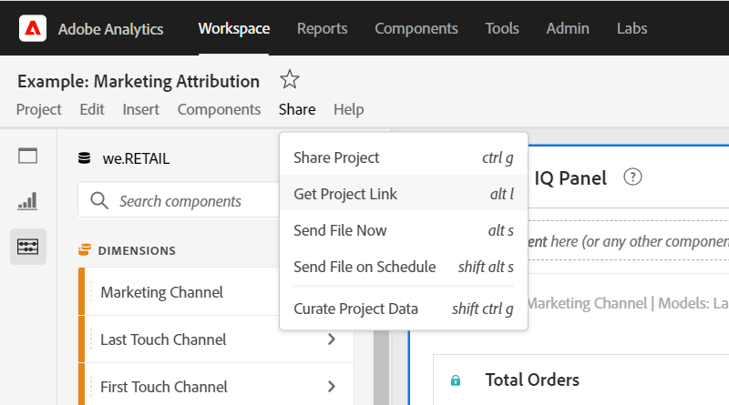

# Creare collegamenti condivisibili

 Analysis Workspace offre diversi modi per condividere un progetto con gli utenti, inclusa la possibilità di ottenere un collegamento a un progetto o a una parte specifica di un progetto. Gli utenti che ricevono un collegamento devono accedere a  Adobe Analytics prima di poter accedere al progetto.

## Get project link {#project-link}

Per condividere un collegamento all&#39;intero progetto, vai a **[!UICONTROL Share > Get project link]**. Se al destinatario del collegamento non è stato assegnato un ruolo [di](https://docs.adobe.com/content/help/it-IT/analytics/analyze/analysis-workspace/curate-share/share-projects.html)progetto, gli amministratori ricevono **[!UICONTROL Can edit]** e i non amministratori ricevono **[!UICONTROL Can duplicate]** esperienze.

## Ottieni pannello o collegamento di visualizzazione {#panel-link}

Puoi anche condividere un collegamento a una parte specifica di un progetto, ad esempio un pannello o una visualizzazione individuale. Talvolta viene definito intra-link. Questo può essere utile per attirare l’attenzione degli utenti sulle informazioni chiave all’interno del progetto.

* Fate clic con il pulsante destro del mouse sull’intestazione di un pannello **[!UICONTROL Get panel link]**
* Da qualsiasi intestazione di tabella o visualizzazione, fai clic con il pulsante destro del mouse **[!UICONTROL Get visualization link]**

[Guardate il video](https://www.youtube.com/watch?v=lvmAdKNfWQw) su come creare collegamenti e usarli per indirizzare i destinatari verso parti specifiche del progetto.

## Utilizzare i collegamenti in un sommario {#TOC}

Un suggerimento per sfruttare le varie opzioni di collegamento è quello di includere sempre un sommario nella parte superiore del progetto Workspace. Nel sommario, puoi collegare altri progetti rilevanti, pannelli specifici e visualizzazioni specifiche. In questo modo, il destinatario del progetto potrà navigare più facilmente.

[Guardate il video](https://www.youtube.com/watch?v=Xo6fTguWm-M) su come creare un sommario utilizzando i collegamenti e l’editor Rich Text di Workspace.

