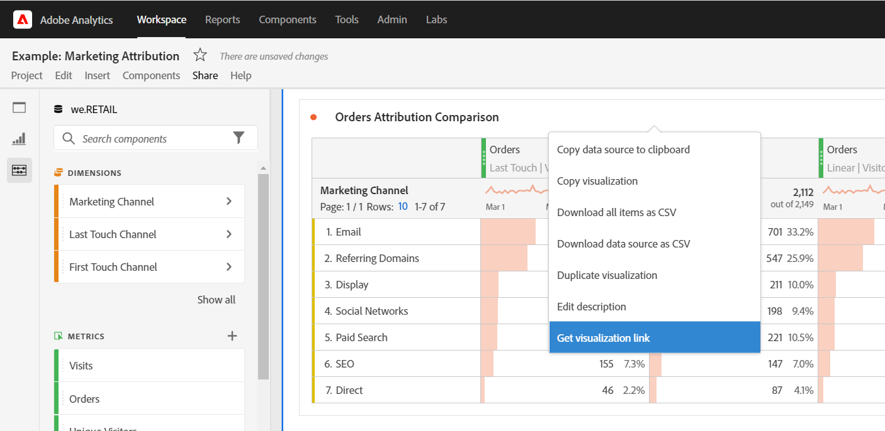

# Creare collegamenti condivisibili

Analysis Workspace offre diversi modi per condividere un progetto con gli utenti, inclusa la possibilità di ottenere un collegamento a un progetto o a una parte specifica di un progetto. Alcuni tipi di collegamento richiedono che il destinatario acceda ad Adobe Analytics prima di accedere al progetto, altri no.

## Ottenere un collegamento al progetto da condividere con altri utenti di Workspace {#project-link}

Per condividere un collegamento a un progetto, passa al progetto che desideri condividere, quindi seleziona vai a **[!UICONTROL Share]** > **[!UICONTROL Get project link]** (o **[!UICONTROL Share]** > **[!UICONTROL Share with Workspace users]** > **[!UICONTROL Share by link]**). Gli utenti con cui condividi il collegamento devono effettuare l’accesso.

Se al destinatario del collegamento non è stato assegnato un ruolo di [progetto](/help/analyze/analysis-workspace/curate-share/share-projects.md), gli amministratori riceveranno **[!UICONTROL Edit original]** e i non amministratori **[!UICONTROL Edit copy]** esperienze.

## Ottenere un collegamento di sola lettura da condividere con chiunque

Puoi condividere un collegamento in sola lettura ai progetti Analysis Workspace con persone che non hanno accesso ad Adobe Analytics.

Per ulteriori informazioni, vedere [Condividi con chiunque](/help/analyze/analysis-workspace/curate-share/share-projects.md#share-a-project-with-anyone-no-login-required).

## Ottenere un collegamento a un pannello o a una visualizzazione {#panel-link}

Puoi anche condividere un collegamento a una parte specifica del progetto, ad esempio un pannello o una visualizzazione individuale. Questa pratica viene talvolta definita intralinking e può essere utile per attirare l’attenzione degli utenti sulle informazioni chiave all’interno del progetto.

* Dal menu di scelta rapida di un&#39;intestazione del pannello, selezionare **[!UICONTROL Get panel link]**
* Dal menu di scelta rapida di un&#39;intestazione di visualizzazione, selezionare **[!UICONTROL Get visualization link]**

[Guarda il video](https://experienceleague.adobe.com/docs/analytics-learn/tutorials/analysis-workspace/visualizations/intra-linking-in-analysis-workspace.html?lang=it) sulla creazione di collegamenti e sul loro utilizzo per indirizzare i destinatari verso parti specifiche del progetto.

## Utilizzare i collegamenti in un sommario {#TOC}

Un suggerimento per sfruttare le varie opzioni di collegamento è includere sempre un sommario nella parte superiore del progetto Workspace. Nel sommario puoi inserire collegamenti ad altri progetti rilevanti, pannelli specifici e visualizzazioni specifiche. In questo modo il destinatario del progetto potrà navigare più facilmente.

[Guarda il video](https://experienceleague.adobe.com/docs/analytics-learn/tutorials/analysis-workspace/navigating-workspace-projects/create-a-toc-in-analysis-workspace.html?lang=it) sulla creazione di un sommario utilizzando i collegamenti e l’editor Rich Text di Workspace.

<!--
# Create shareable links

Analysis Workspace offers many ways to share a project to your users, including the ability to get a link to a project or a specific part of a project. Some link types require the recipient to log in to Adobe Analytics before accessing the project, while others do not. 

## Get a project link to share with other Workspace users {#project-link} 

To share a link to a project, go to the project you want to share, then select go to [!UICONTROL **Share**] > [!UICONTROL **Share with Workspace users**] > [!UICONTROL **Share by link**]. Users you share the link with are required to log in. 

If the recipient of the link has not been assigned a [project role](/help/analyze/analysis-workspace/curate-share/share-projects.md), admins receive **[!UICONTROL Edit original]** and non-admins receive **[!UICONTROL Edit copy]** experiences.

## Get a read-only link to share with anyone

You can share a read-only link to Analysis Workspace projects with people who don't have access to Adobe Analytics. Users you share the link with are not required to log in. 

For more information, see "Share a project with anyone (no login required)" in the article [Share projects](/help/analyze/analysis-workspace/curate-share/share-projects.md).

## Get panel or visualization link {#panel-link} 

You can also share a link to a specific part of a project, such as a panel or individual visualization. This is sometimes referred to as intra-linking. This can be useful to draw your users' attention to key insights within the project.  

* From any panel header, right-click **[!UICONTROL Get panel link]** 
* From any table or visualization header, right-click **[!UICONTROL Get visualization link]** 

[Watch the video](https://experienceleague.adobe.com/docs/analytics-learn/tutorials/analysis-workspace/visualizations/intra-linking-in-analysis-workspace.html) on how to create links and use them to drive recipients to specific parts of your project. 

-->