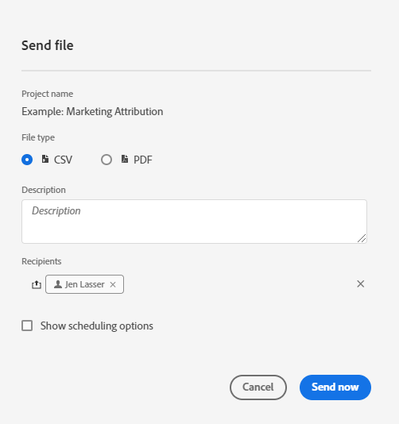

# Programmare progetti

Dal **menu Share** di Workspace, puoi inviare progetti Analysis Workspace tramite e-mail a destinatari selezionati. I file possono essere inviati in formato CSV o PDF.

## Invia subito file

Per inviare immediatamente un file ai destinatari tramite e-mail:

1. Fai clic su **[!UICONTROL Share]>[!UICONTROL Export file]**.
1. Specifica il tipo di file:
   * [!UICONTROL **CSV**]: scegli questa opzione se desideri dati in formato testo normale.
   * [!UICONTROL **PDF**]: scegli questa opzione se vuoi che il file scaricato contenga tutte le tabelle e le visualizzazioni visualizzate (visibili) nel progetto.
1. (Facoltativo) Aggiungi una descrizione da includere nell’e-mail per spiegare il file ricevuto.
1. Aggiungi destinatari o gruppi. È inoltre possibile inserire gli indirizzi e-mail.
1. Fai clic su **[!UICONTROL Send Now]** (Usa modello di attribuzione non predefinito).
1. (Facoltativo) Fai clic su **[!UICONTROL Show scheduling options]** per specificare una pianificazione di consegna.

## Invia file secondo programma

Per inviare un file tramite e-mail secondo una pianificazione periodica:

1. Fai clic su **[!UICONTROL Share]>[!UICONTROL Schedule file export]**.
1. Specifica il tipo di file (CSV o PDF).
1. (Facoltativo) Aggiungi una descrizione del file che verrà inclusa nell’e-mail.
1. Aggiungi destinatari o gruppi. È inoltre possibile inserire gli indirizzi e-mail.
1. Specifica l’intervallo per il quale la pianificazione deve essere consegnata modificando l’opzione Inizia e Termina negli input. La data di fine deve essere compresa entro un anno dal giorno in cui la pianificazione viene creata o modificata.
1. Specifica la frequenza di consegna. Ogni frequenza consente diverse personalizzazioni.
1. Fai clic su **[!UICONTROL Send on schedule]** (Usa modello di attribuzione non predefinito).

## Gestisci progetti programmati

I progetti programmati di Analysis Workspace possono essere gestiti in **Analytics > Componenti > Progetti programmati**.

Per ulteriori informazioni, vedi  
