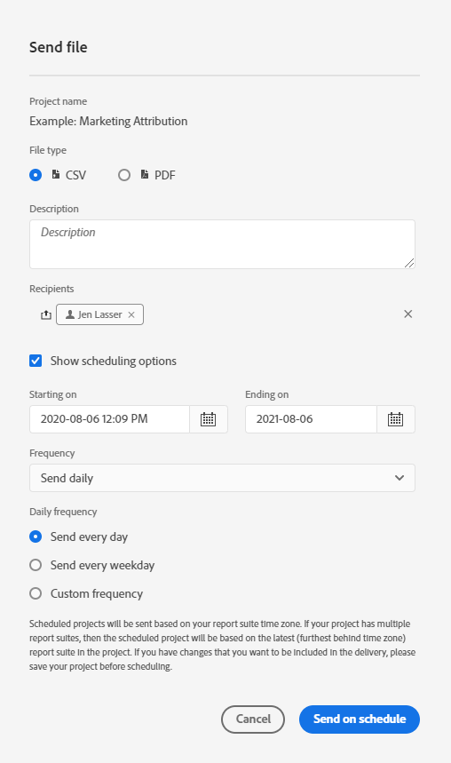

# Progetti programmati

Dal menu **** Condivisione area di lavoro, potete inviare  progetti Analysis Workspace tramite e-mail a destinatari selezionati. I file possono essere inviati in formato CSV o PDF.

## Invia file ora

Per inviare immediatamente un file ai destinatari tramite e-mail:

1. Click **Share > Send File Now**.
1. Specificate il tipo di file (CSV o PDF).
1. (Facoltativo) Aggiungete una descrizione che verrà inclusa nel messaggio e-mail per spiegare il file ricevuto.
1. Aggiungete destinatari o gruppi. È inoltre possibile inserire gli indirizzi e-mail.
1. Fate clic su **Invia ora**.
1. (Facoltativo) Fate clic su **Mostra opzioni** di programmazione per specificare una pianificazione di consegna.

## Invia file secondo programma

Per inviare un file a una pianificazione periodica ai destinatari tramite e-mail:

1. Click **Share > Send File on Schedule**.
1. Specificate il tipo di file (CSV o PDF).
1. (Facoltativo) Aggiungete una descrizione che verrà inclusa nel messaggio e-mail per spiegare il file ricevuto.
1. Aggiungete destinatari o gruppi. È inoltre possibile inserire gli indirizzi e-mail.
1. Specificate l&#39;intervallo per il quale la pianificazione deve essere consegnata modificando l&#39;opzione Inizia e Termina in input. La data di fine deve essere compresa entro un anno dal giorno in cui la pianificazione viene creata o modificata.
1. Specificate la frequenza di consegna. Ogni frequenza consente diverse personalizzazioni.
1. Fate clic su **Invia secondo programma**.

## Gestione progetti programmati

I progetti Analysis Workspace pianificati  possono essere gestiti in **Analytics > Componenti > Progetti** pianificati.

In Gestione progetti programmati potete modificare ed eliminare le pianificazioni di progetti ricorrenti. Cercate una pianificazione nella barra di ricerca o utilizzando le opzioni filtro nella barra a sinistra. Potete filtrare per tag, programmi approvati, proprietari e altro ancora.

Di seguito sono riportate le azioni comuni di Gestione progetti programmati:

| Azione | Descrizione |
|---|---|
| **Modifica pianificazione** | Fate clic sul titolo della pianificazione per aggiornarne le impostazioni di consegna. |
| **Elimina pianificazione** | Selezionate il progetto pianificato nell&#39;elenco, quindi fate clic su Elimina dal menu. In questo modo verrà eliminata la pianificazione selezionata per il progetto; il progetto stesso non verrà eliminato. |
| **Aggiungere tag** | Selezionate il progetto pianificato nell&#39;elenco, quindi scegliete &quot;Tag&quot; o &quot;Approva&quot; per organizzare le pianificazioni e semplificarne la ricerca. |
| **Visualizza pianificazioni non riuscite** | Passare alla barra a sinistra > Altri filtri > Impossibile visualizzare le pianificazioni che hanno avuto esito negativo. |
| **Visualizza pianificazioni scadute** | Andate alla barra a sinistra > Altri filtri > Scaduto per visualizzare le pianificazioni scadute. Fate clic sul titolo della pianificazione per impostare una nuova pianificazione di consegna. |
| **Visualizza ID pianificazione** | Passa alle opzioni della colonna in alto a destra e aggiungi la colonna ID pianificazione alla tabella. L&#39;ID pianificato è spesso utile per il debug. |

Lo strumento di gestione dei progetti programmati mostra gli elementi creati da uno specifico utente. Se l’account dell’utente è disabilitato nell’applicazione, tutte le consegne programmate vengono interrotte. La proprietà pianificata del progetto può essere **trasferita** a un nuovo utente in **Amministratore > Utenti e risorse di Analytics > Trasferisci risorse**.
