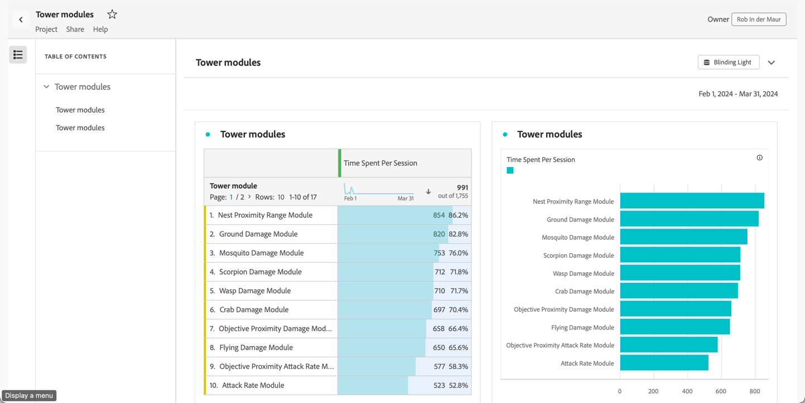

# Progetti di sola lettura

Puoi condividere i progetti in sola lettura con i destinatari tramite la funzionalità [condividi](share-projects.md). I destinatari inseriti nella mansione **[!UICONTROL Read only]** riceveranno un&#39;esperienza di progetto più limitata.

Potresti desiderare di fare ciò se condividi un progetto con utenti che hanno meno familiarità con la struttura dei dati dell’organizzazione, Analysis Workspace o Adobe Analytics in genere, ma desideri comunque che utilizzino dati e approfondimenti in un ambiente sicuro.

Le interazioni per i destinatari di sola lettura sono limitate.

## Interazioni disattivate

Le interazioni disattivate in un progetto di sola visualizzazione includono:

* Pannello sinistro nascosto
* Intervallo date del calendario del pannello. Nota: se desideri concedere il controllo del calendario ai destinatari, aggiungi un [segmento a discesa con intervalli di date](https://experienceleague.adobe.com/docs/analytics-learn/tutorials/analysis-workspace/using-panels/using-drop-down-filters.html?lang=it).
* Segmentazione a forma libera
* Numero di righe a forma libera visibili
* Impostazioni di riga, colonna o visualizzazione a forma libera
* Segmenti del pannello
* Menu Edit, Insert e Component
* Suggerimenti per Workspace

## Interazioni abilitate

Alcune delle interazioni abilitate più rilevanti in un progetto di sola visualizzazione includono:

| Area | Interazioni abilitate |
| --- | --- |
| Tabella a forma libera | <ul><li>Impaginazione e ordinamento</li><li>Passaggio del mouse</li><li>Selezioni di celle che aggiornano le visualizzazioni collegate</li><li>Dal menu di scelta rapida > Ottieni collegamento visualizzazione</li><li>Dal menu di scelta rapida > Copia negli Appunti</li></ul> |
| Visualizzazioni | <ul><li>Clic per attivare/disattivare la legenda</li><li>Passaggio del mouse</li><li>Dal menu di scelta rapida > Ottieni collegamento visualizzazione</li><li>Comprimi/espandi</li><li>Flow (espandi nodi Flow)</li><li>Map (zoom)</li></ul> |
| Pannelli | <ul><li>Segmenti a discesa interattivi</li><li>Dal menu di scelta rapida > Ottieni collegamento pannello</li><li>Comprimi/espandi</li></ul> |
| Progetto | <ul><li>Analisi di tutte le icone delle informazioni</li><li>Menu Progetto (Nuovo, Apri, Imposta come pagina di destinazione, Aggiorna, Scarica CSV/PDF, Informazioni e impostazioni progetto limitate)</li><li>Menu Share (Get project link, Send file now)</li><li>Menu Help (tutte le azioni tranne le opzioni Tips e Debugger)</li></ul> |

## Condividi con chiunque

Se hai selezionato un progetto utilizzando [Condividi con qualcuno](share-projects.md#share-a-project-with-anyone-no-login-required), il destinatario del collegamento può solo visualizzare il progetto e non interagire con esso.

