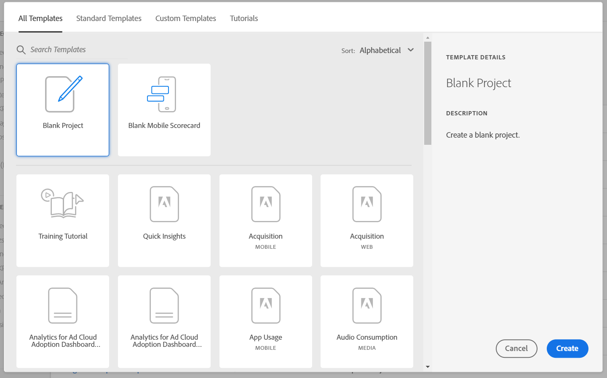

# Panoramica di Analysis Workspace

Analysis Workspace è uno strumento basato su browser flessibile che consente di creare rapidamente le analisi e condividere i dati rilevati. Tramite un’interfaccia in cui è possibile eseguire semplici operazioni di trascinamento, puoi definire le analisi, aggiungere visualizzazioni per riprodurre i dati in modo facilmente comprensibili, curare un set di dati, condividere e pianificare progetti con chiunque all’interno della tua organizzazione.

Se hai solo pochi minuti, guarda questa breve panoramica per scoprire le varie possibilità.

>[!VIDEO](https://video.tv.adobe.com/v/26266/?quality=12)

## Accedere ad Adobe Analytics {#login}

Per iniziare a utilizzare Analysis Workspace, accedi ad Adobe Analytics da [experience.adobe.com/analytics](http://experience.adobe.com/analytics). Se non è già stato selezionato un progetto specifico, verrà visualizzata la pagina home di Workspace, con un elenco di progetti.

## Utilizzare il tutorial di formazione {#training-tutorial}

Una volta effettuato l’accesso, segui il tutorial di formazione su Analysis Workspace: illustra la terminologia e i passaggi più comuni per creare la prima analisi in Workspace. Per iniziare il tutorial, fai clic su **[!UICONTROL Create New Project]** e seleziona **Training Tutorial** (Tutorial di formazione), nella finestra modale Nuovo progetto.

## Creare un nuovo progetto {#new-project}

Completato il tutorial, puoi iniziare a creare il primo progetto. La **finestra modale Nuovo progetto** offre diverse opzioni per avviare l’analisi. Puoi scegliere se iniziare da un progetto vuoto oppure da una [scheda di valutazione mobile vuota](https://experienceleague.adobe.com/docs/analytics/analyze/mobapp/curator.html?lang=it), per condividere l’analisi rispettivamente dal browser oppure dai dashboard dell’app mobile Adobe Analytics.

Puoi anche iniziare l’analisi dai **modelli** standard forniti da Adobe o da modelli personalizzati creati dalla tua organizzazione. Sono disponibili diversi modelli, adatti a diversi tipi di analisi o casi d’uso. [Qui trovi ulteriori informazioni](https://experienceleague.adobe.com/docs/analytics/analyze/analysis-workspace/build-workspace-project/starter-projects.html?lang=it) sulle diverse opzioni di modelli disponibili.

## Generare l’analisi {#analysis}

Nel progetto Workspace, puoi accedere a **pannelli, tabelle, visualizzazioni e componenti** dalla barra a sinistra. Si tratta degli elementi di base del progetto.

### Componenti

I **componenti** sono dimensioni, metriche, segmenti o intervalli di date, che possono essere combinati in una **[!UICONTROL Freeform table]** per iniziare a rispondere a specifiche domande di business. Prima di iniziare con le analisi, impara a conoscere i diversi [tipi di componente](/help/analyze/analysis-workspace/components/analysis-workspace-components.md). Dopo aver acquisito dimestichezza con la terminologia dei componenti, puoi iniziare a trascinarli per [generare le analisi](https://experienceleague.adobe.com/docs/analytics/analyze/analysis-workspace/build-workspace-project/t-freeform-project.html?lang=it) in una **[!UICONTROL Freeform table]**.

### Visualizzazioni

Le **visualizzazioni**, ad esempio i grafici a barre o a linee, vengono quindi aggiunte ai dati per riprodurli in modo visivo. Nella barra a sinistra, seleziona l’icona **[!UICONTROL Visualizations]** centrale per ottenere l’elenco di tutte le [visualizzazioni](https://experienceleague.adobe.com/docs/analytics/analyze/analysis-workspace/visualizations/freeform-analysis-visualizations.html?lang=it) disponibili.

### Pannelli

I **pannelli** servono per organizzare l’analisi all’interno di un progetto e possono contenere diverse tabelle e visualizzazioni. Molti dei pannelli forniti in Analysis Workspace generano una serie completa di analisi basate su alcuni input dell’utente. Nella barra a sinistra, seleziona l’icona **[!UICONTROL Panels]** superiore per visualizzare l’elenco di tutti i [panelli](https://experienceleague.adobe.com/docs/analytics/analyze/analysis-workspace/panels/panels.html?lang=it) disponibili.

## Risorse aggiuntive {#resources}

* Adobe offre centinaia di [tutorial di formazione video per Analytics](https://experienceleague.adobe.com/docs/analytics-learn/tutorials/overview.html?lang=it).
* Scopri le [novità di Analysis Workspace](/help/analyze/analysis-workspace/new-features-in-analysis-workspace.md) per ottenere informazioni aggiornate sulle funzioni.
