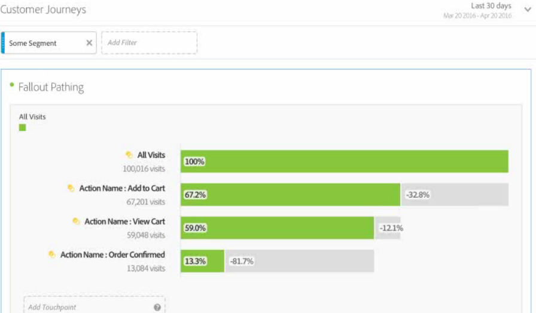
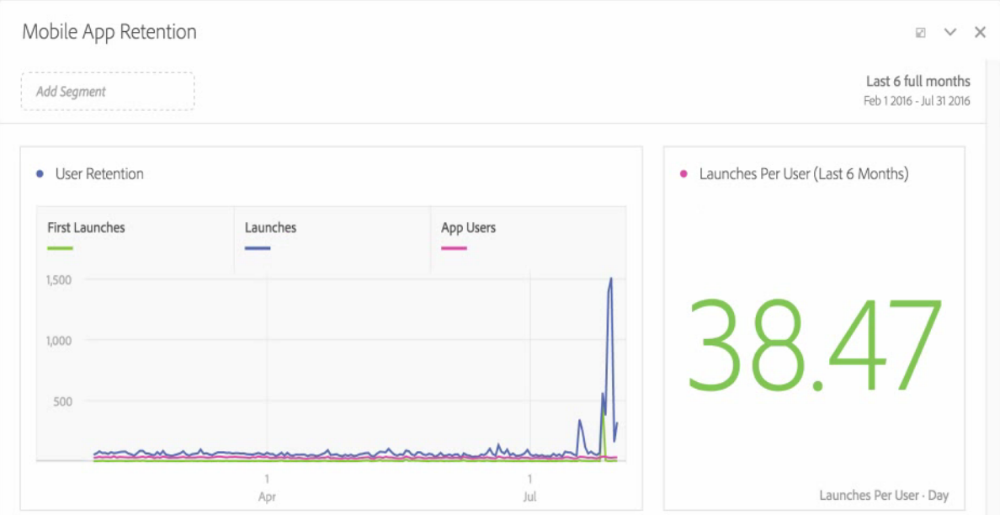

# Scopri le novità di Analysis Workspace

## 2020 luglio

Nuova funzionalità rilasciata il 16 luglio 2020.

| Funzione | Descrizione |
|--- |--- |
| Nuovi predefiniti per intervalli di date | Aggiunti 4 nuovi intervalli di date: ([!UICONTROL This week/month/quarter/year (excluding today)]) Questo consente di scegliere tra intervalli di date che non includono dati per giorni parziali a partire da oggi. |

## Giugno 2020

Nuove funzionalità rilasciate il 18 giugno 2020.

| Funzione | Descrizione |
|--- |--- |
| Attribution IQ: attribuzione algoritmica | Il modello attribuzione algoritmica di Analysis Workspace utilizza tecniche statistiche per determinare in modo dinamico l’allocazione ottimale del credito per la metrica selezionata. Disponibile per i clienti Adobe Analytics Ultimate. [Ulteriori informazioni...](https://docs.adobe.com/content/help/en/analytics/analyze/analysis-workspace/attribution/algorithmic.html) |
| Attribution IQ: finestre di lookback personalizzate | Ora puoi configurare qualsiasi modello di attribuzione in Attribution IQ in modo da includere punti di contatto risalenti a un massimo di 90 giorni prima del periodo di tempo di reporting. In genere, ciò aumenta la precisione dell’attribuzione per gli eventi che si verificano all’inizio del periodo di reporting tenendo conto delle interazioni avvenute nei mesi precedenti. Disponibile per i clienti Adobe Analytics Foundation, Select, Prime, Premium, Premium Attribution, Premium Complete e Ultimate. [Ulteriori informazioni...](https://docs.adobe.com/content/help/en/analytics/analyze/analysis-workspace/attribution/models.html#lookback-windows) |
| Ruoli di progetto per progetti Workspace condivisi | Ora quando condividi un progetto Workspace puoi assegnare ai destinatari uno dei tre ruoli di progetto, a seconda di come desideri che interagiscano con il progetto: Modifica, Duplica e Visualizza. [Ulteriori informazioni...](https://docs.adobe.com/content/help/it-IT/analytics/analyze/analysis-workspace/curate-share/share-projects.html) |
| Progetti Workspace solo visualizzazione | I progetti Workspace possono essere condivisi con gli utenti solo con la modalità di accesso “Può visualizzare”. Quando un destinatario con ruolo Visualizza apre il progetto condiviso, lo vedrà con alcune restrizioni, senza barra a sinistra e con interazioni limitate. [Ulteriori informazioni...](https://docs.adobe.com/content/help/it-IT/analytics/analyze/analysis-workspace/curate-share/view-only-projects.html) |
| Possibilità di collaborare alla modifica dei progetti Workspace | I destinatari aggiunti al ruolo “Può modificare” possono salvare in sovrascrittura un progetto condiviso con loro. Questo vale sia per gli amministratori che per i non amministratori. [Ulteriori informazioni...](https://docs.adobe.com/content/help/it-IT/analytics/analyze/analysis-workspace/curate-share/share-projects.html) |
| Pannello vuoto aggiornato | Il pannello vuoto ora include pannelli e visualizzazioni, garantendo così una maggiore facilità nella scelta del flusso di lavoro di analisi più adatto alle tue esigenze. |
| Pannello Quick Insights (25 giugno 2020) | Quick Insights fornisce indicazioni ai non analisti e ai nuovi utenti di Analysis Workspace per scoprire come rispondere alle domande aziendali in modo rapido e semplice. [Ulteriori informazioni...](/help/analyze/analysis-workspace/c-panels/quickinsight.md) |
| Pannello Analytics for Target in Workspace (25 giugno 2020) | Il pannello Analytics for Target (A4T) consente di analizzare le attività e le esperienze Adobe Target in Analysis Workspace con incremento e affidabilità. [Ulteriori informazioni...](/help/analyze/analysis-workspace/c-panels/a4t-panel.md) |
| Pagina Informazioni su Workspace | La pagina Informazioni su Workspace contiene informazioni sull’ambiente Analysis Workspace e sugli amministratori di Adobe Analytics (in caso tu abbia bisogno di supporto) e offre una modalità per fornire feedback all’interno del prodotto. È disponibile in Workspace > Aiuto > Informazioni su Workspace. |

## Maggio 2020

Nuove funzionalità rilasciate il 21 maggio 2020.

| Funzione | Descrizione |
|--- |--- |
| creazione automatica di tabelle a mano libera da uno stato vuoto | In precedenza non era possibile rilasciare le componenti direttamente in un progetto o in un pannello vuoto, bisognava prima aggiungere una Tabella a mano libera. Ora è possibile rilasciare le componenti direttamente in un progetto o in un pannello vuoto e una Tabella a mano libera viene creata automaticamente in un formato raccomandato. Inoltre sono stati apportati miglioramenti alla gestione dei tipi di componenti misti (quali dimensioni e metriche) quando vengono rilasciati insieme in una tabella a mano libera vuota. |
| Miglioramenti all’accessibilità | Il team di Adobe Analytics ha apportato diversi miglioramenti ad Analysis Workspace in termini di accessibilità, tra cui la navigazione da tastiera, il contrasto del colore e il supporto per la lettura dello schermo. [Ulteriori informazioni...](https://docs.adobe.com/content/help/it-IT/analytics/analyze/analysis-workspace/workspace-faq/aw-accessibility.html) |

## Aprile 2020

Nuova funzionalità rilasciata il 16 aprile 2020.

| Funzione | Descrizione |
|--- |--- |
| Generare automaticamente [!UICONTROL Freeform Tables] da uno stato vuoto | In precedenza, non era possibile rilasciare componenti direttamente in un progetto o un pannello vuoto, ma era necessario aggiungere prima una tabella a forma libera. Ora è possibile rilasciare i componenti direttamente in un progetto o pannello vuoto, e verrà automaticamente creata una tabella a forma libera in un formato consigliato. Sono stati inoltre effettuati miglioramenti alla gestione dei tipi di componenti misti (ad es. dimensioni e metriche) quando vengono rilasciati insieme in una [!UICONTROL Freeform Table] vuota. |

## Marzo 2020

Nuove funzionalità rilasciate il 12 marzo 2020.

| Funzione | Descrizione |
|--- |--- |
| Supporto per più suite di rapporti in Workspace | Ora è possibile inserire dati da più suite di rapporti in un singolo progetto per visualizzarli affiancati. [Ulteriori informazioni...](https://docs.adobe.com/content/help/it-IT/analytics/analyze/analysis-workspace/build-workspace-project/multiple-report-suites.html) |
| Modello per le esercitazioni | Questo nuovo modello standard spiega la terminologia e i passaggi comuni per lo svolgimento della prima analisi in Workspace. È disponibile come modello standard nel modale Nuovo progetto e sostituisce il progetto di esempio attuale per i nuovi utenti che non hanno altri progetti nel loro elenco. [Ulteriori informazioni...](/help/analyze/analysis-workspace/build-workspace-project/starter-projects.md) |

## Febbraio 2020

Nuove funzionalità rilasciate il 20 febbraio 2020.

| Funzione | Descrizione |
|--- |--- |
| Nuovo modello di Workspace per le organizzazioni che utilizzano Cross-Device Analytics | Questo modello mostra l’efficacia di CDA nel raggruppare le visite e fornisce informazioni sulle dimensioni e sulle metriche esclusive di CDA. È necessaria una suite di report che utilizza CDA. Per ulteriori informazioni, consulta [Configurazione di Cross-Device Analytics](https://docs.adobe.com/content/help/it-IT/analytics/components/cda/cda-setup.html). |
| Nuovi tasti di scelta rapida in Workspace | <ul><li>Collapse/Expand All panels (Comprimi/espandi tutti i pannelli): `alt + m`</li><li>Collapse/Expand Active panel (Comprimi/espandi pannello attivo): `alt + ctrl + m`</li><li>Barra sinistra di ricerca: `ctrl + /`</li><li>Move to next panel (Passa al pannello successivo): `alt + Right Key`</li><li>Move to previous panel (Passa al pannello precedente): `alt + Left Key`</li></ul>[Ulteriori informazioni...](https://docs.adobe.com/content/help/it-IT/analytics/analyze/analysis-workspace/build-workspace-project/fa-shortcut-keys.html) |
| Altri miglioramenti di Workspace | <ul><li>Quando un pannello o una visualizzazione vengono rilasciati in Workspace, la barra sinistra ora passa ai componenti in modo automatico garantendo un workflow più agevole.</li><li>È ora possibile compiere delle azioni sui componenti del modello (ad esempio taggarli, aggiungerli ai preferiti, approvarli).</li><li>Le liste filtrate di metriche e segmenti offrono il pulsante + per aggiungere un nuovo componente in caso non si trovi quello desiderato.</li></ul> |
| Debugger di Workspace | Il debugger di Workspace è stato aggiunto al menu Aiuto per consentirti di eseguire il debug delle richieste di Workspace in modo più semplice. [Ulteriori informazioni...](https://www.adobe.io/apis/experiencecloud/analytics/docs.html#!AdobeDocs/analytics-2.0-apis/master/reporting-tricks.md) |

## Gennaio 2020

Nuova funzionalità rilasciata il 16 gennaio 2020.

| Funzione | Descrizione |
|--- |--- |
| [Generatore di tabelle a forma libera](https://docs.adobe.com/content/help/it-IT/analytics/analyze/analysis-workspace/visualizations/freeform-table.html) | Con il Generatore di tabelle abilitato, puoi trascinare e rilasciare più dimensioni, raggruppamenti, metriche e segmenti per creare tabelle che rispondano a esigenze aziendali più complesse. I dati non verranno aggiornati immediatamente. Al contrario, gli aggiornamenti si verificano dopo aver fatto clic su **[!UICONTROL Build]** Genera: sapendo quale tabella desideri creare, ciò ti permette di risparmiare tempo. Questa funzione offre inoltre:<ul><li>**Anteprima**: Puoi visualizzare in anteprima il formato di una tabella prima di trascorrere del tempo a eseguire il rendering dei dati reali.</li><li>**Impostazioni di riga flessibile e raggruppamento**: Puoi impostare i livelli di riga e raggruppamento per ogni riga delle dimensioni. In precedenza, Workspace impostava valori predefiniti che non potevano essere modificati fino a quando non venivano restituiti i dati.</li><li>**Raggruppamento per posizione**: Puoi impostare le righe delle dimensioni in modo da effettuare sempre il _raggruppamento per posizione_ anziché _per elemento specifico_ (impostazione predefinita).</li><li>**Ordinamento manuale delle righe statiche**: Puoi ordinare manualmente le righe statiche in modo che vengano visualizzate esattamente come necessario. In precedenza, le righe statiche potevano essere ordinate solo in base a una colonna metrica o in ordine alfabetico.</li></ul> |

## ottobre 2019

Miglioramenti rilasciati il 10 ottobre 2019.

| Miglioramento | Descrizione |
|--- |--- |
| Aggiornamento dei totali delle tabelle a forma libera | Le tabelle a forma libera ora includono due totali, **[!UICONTROL Table total]** e **[!UICONTROL Grand total]**. Il conteggio delle righe totali della tabella tiene ora conto i [filtri dei report](https://docs.adobe.com/content/help/it-IT/analytics/analyze/analysis-workspace/build-workspace-project/pagination-filtering-sorting.html) applicati. Precedentemente, solo la segmentazione interessava i totali. [Ulteriori informazioni](https://docs.adobe.com/content/help/it-IT/analytics/analyze/analysis-workspace/build-workspace-project/workspace-totals.html) Inoltre, sono state aggiunte le opzioni **[!UICONTROL Show Totals]** e **[!UICONTROL Show Grand Total]** a **[!UICONTROL Column Settings]**. Con questa modifica ai totali delle tabelle a forma libera verranno aggiornate le visualizzazioni dipendenti (ad esempio le visualizzazioni **[!UICONTROL Summary Number]** Numero di riepilogo collegate), nonché i dati CSV e PDF esportati. |
| Opzione per rimuovere Non specificato/Nessuno | La possibilità di rimuovere facilmente “Non specificato (Nessuno)” è stata aggiunta come opzione per segnalare i filtri. |
| deprecazione dei componenti di granularità viola | I componenti tempo per granularità di colore viola (Minuto, Ora, Giorno, Settimana, Mese, Trimestre, Anno) sono stati resi obsoleti. I componenti tempo viola si sono sempre comportati esattamente come le loro controparti di colore arancione relativi alle dimensioni, pertanto questa modifica semplificherà l’esperienza. **Non è necessario eseguire alcuna azione** se in precedenza è stato utilizzato uno dei componenti tempo viola. Con questa modifica, anche la sezione viola **[!UICONTROL Time]** è stata rinominata in **[!UICONTROL Date Ranges]**. |

## Agosto 2019

Miglioramento rilasciato l&#39;8 agosto 2019.

| Miglioramento | Descrizione |
|--- |--- |
| limite di elementi per filtro a discesa aumentato da 50 a 200 | Il limite di elementi che possono essere inseriti in un filtro a discesa è stato aumentato da 50 a 200. Questo miglioramento è utile per una serie di casi d’uso, ad esempio per poter aggiungere a un filtro tutti i paesi (195), oppure tutti gli stati e le province degli Stati Uniti (52). |

## Luglio 2019

Miglioramenti rilasciati il 18 luglio 2019.

| Miglioramento | Descrizione |
|--- |--- |
| Miglioramenti dell’analisi per coorte | Sono state aggiunte nuove [impostazioni di Analisi per coorte](https://docs.adobe.com/content/help/it-IT/analytics/analyze/analysis-workspace/visualizations/cohort-table/t-cohort.html): <ul><li>Only show percent (Mostra solo percentuale)</li><li>Round percent to nearest whole (Arrotonda percentuale a intero più prossimo)</li><li>Show average percent row (Mostra riga di media percentuale)</li></ul> |
| Mostra elementi degli ultimi 18 mesi | Nella barra a sinistra, gli utenti ora possono _visualizzare gli elementi degli ultimi 18 mesi_. In precedenza, il periodo di lookback era limitato a 6 mesi. Questo semplifica il confronto con pagine o campagne dell’anno prima, fino a 18 mesi fa. |
| Nuovo modello Analysis Workspace | In Analysis Workspace è stato aggiunto il nuovo modello [“Magento: Marketing e commerce”](https://docs.adobe.com/content/help/it-IT/analytics/analyze/analysis-workspace/build-workspace-project/starter-projects.html). È progettato appositamente per i clienti e-commerce di Magento, ma può essere usato da chiunque desideri ottenere informazioni specifiche sulle proprie attività di e-commerce. |

## Giugno 2019

Miglioramento rilasciato il 13 giugno 2019.

| Miglioramento | Descrizione |
|--- |--- |
| Nuovi filtri pronti all’uso | Alla barra di ricerca di sinistra sono stati aggiunti dei nuovi filtri pronti all’uso. Oltre a quelli già disponibili (Dimensioni, Metriche, Approvato, ecc.), sono stati aggiunti nuovi filtri come Metriche calcolate, Attributi cliente, eVar, Prop, Video e così via per facilitare la ricerca dei componenti necessari. |

## Maggio 2019

Miglioramento rilasciato il 09 maggio 2019.

| Miglioramento | Descrizione |
|--- |--- |
| Una nuova impostazione è stata aggiunta alle impostazioni di visualizzazione del Flusso: Includi istanze ripetute. | [Impostazioni di Flusso](/help/analyze/analysis-workspace/visualizations/c-flow/flow-settings.md) |

## Aprile 2019

Miglioramento rilasciato l’11 aprile 2019.

| Miglioramento | Descrizione |
|--- |--- |
| Miglioramenti alle procedure consigliate di ottimizzazione | [Ottimizzazione delle prestazioni](/help/analyze/analysis-workspace/new-features-in-analysis-workspace.md) |

## Gennaio 2019

Nuove funzionalità e miglioramenti rilasciati il 17 gennaio 2019.

| Funzione | Descrizione |
|--- |--- |
| [Analisi per coorte](/help/analyze/analysis-workspace/visualizations/cohort-table/cohort-analysis.md) | I miglioramenti principali dell’Analisi per coorte consentono di:<ul><li>Applicare separatamente le metriche di inclusione e di restituzione di un segmento. </li><li>Visualizzare l’abbandono invece della fidelizzazione.</li><li>Visualizzare tabelle di latenza (tempo trascorso prima e dopo un evento di inclusione).</li><li>Personalizzare la dimensione delle coorti (per raggruppare i visitatori in base a una eVar, non solo al tempo).</li><li>Eseguire un calcolo continuo per coorti: calcolare fidelizzazione e abbandono in base al periodo di tempo precedente, non alla coorte originale. </li><li>Aggiungere più metriche nei campi di inclusione e di ritorno, oltre che applicare i segmenti. (Le metriche calcolate non sono supportate)</li></ul> |
| [Densità di visualizzazione](/help/analyze/analysis-workspace/build-workspace-project/view-density.md) | Questa nuova impostazione consente di visualizzare più dati in una singola schermata riducendo la spaziatura verticale della barra a sinistra, tabelle a forma libera e tabelle a coorte. Accessibile da Progetto > Informazioni e impostazioni progetto. |
| [Supporto per variabili con più valori in Attribution IQ](attribution/overview.md) | Alcune dimensioni in Analytics possono contenere più valori in un singolo hit, come ad esempio listVars, la variabile di prodotto, proprietà di elenco o eVars per merchandising. Analysis Workspace consente di applicare Attribution IQ a uno qualsiasi di questi tipi di variabili a livello di hit. |
| Miglioramenti delle prestazioni | È stata migliorata la velocità delle visualizzazioni con suddivisioni: i progetti con molte suddivisioni vengono caricati più rapidamente. |

## Novembre 2018

Nuove funzionalità e miglioramenti rilasciati il 1° novembre 2018.

| Funzione | Descrizione |
|--- |--- |
| [Cura di progetti e VRS - Miglioramenti](/help/analyze/analysis-workspace/curate-share/curate.md) | Le presenti modifiche sono state implementate in ottobre 2018. Sono state apportate modifiche ai componenti che amministratori e non amministratori possono visualizzare nei progetti Workspace curati e nelle suite di report virtuali (VRS) curate.   In precedenza, chiunque poteva vedere i componenti non curati facendo clic sul pulsante Mostra tutti i componenti. L’esperienza di gestione aggiornata consente un controllo più dettagliato sui componenti visibili.  |

## Ottobre 2018

Nuove funzionalità e ottimizzazioni rilasciate l’11 ottobre 2018.

<table id="table_3DDC812B2F66416F868004416D248BF3"> 
 <thead> 
  <tr> 
   <th colname="col1" class="entry"> Funzione </th> 
   <th colname="col2" class="entry"> Descrizione </th> 
  </tr> 
 </thead>
 <tbody> 
  <tr> 
   <td colname="col1"> 
<b>Gestione degli elenchi a discesa dei pannelli</b> 
 </td> 
   <td colname="col2"> 
Sono state apportate alcune modifiche alla gestione degli elenchi a discesa dei pannelli, introdotti con la versione di settembre. Quando si fa clic con il pulsante destro del mouse nell’elenco a discesa, ora è possibile: 
 
    <ul id="ul_4BDEC66EEB2243628FE32B43E377E5BD"> 
     <li id="li_EF8277BE972540D3B2604D82BC7C0918">Eliminare un elenco a discesa (questa opzione è sempre presente) </li> 
     <li id="li_6A991208F2744274817DBE1E9D1B443F">Eliminare un’etichetta (se era visualizzata) </li> 
     <li id="li_5C1CFC465C2E41D2B35E8841EFDC82AA">Aggiungere un’etichetta (se non era visualizzata) </li> 
    </ul> </td> 
  </tr> 
  <tr> 
   <td colname="col1"> 
<b>Collegamenti nelle descrizioni a comparsa per pannelli e visualizzazioni</b> 
 </td> 
   <td colname="col2"> 
Nelle descrizioni a comparsa per pannelli e visualizzazioni sono stati aggiunti dei collegamenti per accedere a documentazione e video pertinenti. 
 </td> 
  </tr> 
 </tbody> 
</table>

## Settembre 2018

Nuove funzionalità e ottimizzazioni rilasciate il 13 settembre 2018.

<table id="table_137719BFA03C44A78FDE872DF8B228A4"> 
 <thead> 
  <tr> 
   <th colname="col1" class="entry"> Funzione </th> 
   <th colname="col2" class="entry"> Descrizione </th> 
  </tr> 
 </thead>
 <tbody> 
  <tr> 
   <td colname="col1"> 
<b>Elenco a discesa nei pannelli</b> 
 </td> 
   <td colname="col2"> 
La zona di rilascio dei pannelli ora dispone di funzionalità di elenco a discesa. Gli elenchi a discesa consentono agli utenti finali di interagire con i dati di un progetto in modo controllato. Esempio: se hai diverse versioni di un progetto per ottenere rapporti specifici per diversi paesi, ora puoi comprimerle in un singolo progetto e aggiungere un elenco a discesa Paese. 
 </td> 
  </tr> 
  <tr> 
   <td colname="col1"> 
<b>Palette di colori</b> 
 </td> 
   <td colname="col2"> 
Ora puoi cambiare la combinazione di colori utilizzata in Workspace, scegliendo una diversa palette di colori o specificandone una personalizzata. Questa funzione interessa numerosi elementi in Workspace, compresa la maggior parte delle visualizzazioni. <b>Non</b> influisce sulle modifiche di riepilogo, sulla formattazione condizionale nelle tabelle a forma libera e sulla vista Mappa. 
 
Nota: il supporto per la palette di colori non è attivato per Internet Explorer 11. 
 </td> 
  </tr> 
  <tr> 
   <td colname="col1"> 
<b>Nuovo modello: Consumo audio</b> 
 </td> 
   <td colname="col2"> 
Vedere <a href="https://docs.adobe.com/content/help/it-IT/media-analytics/using/media-reports/media-workspace-templates.html"  >Audio Analytics</a>. 
 </td> 
  </tr> 
 </tbody> 
</table>
## agosto 2018

Nuove funzionalità e ottimizzazioni rilasciate il 9 agosto 2018.

<table id="table_DD77C02344414DCD9AC0A6A22E648B72"> 
 <thead> 
  <tr> 
   <th colname="col1" class="entry"> Funzione </th> 
   <th colname="col2" class="entry"> Descrizione </th> 
  </tr> 
 </thead>
 <tbody> 
  <tr> 
   <td colname="col1"> 
<b>Guide delle zone di rilascio</b> 
 </td> 
   <td colname="col2"> 
Queste guide ti aiutano a capire più facilmente quale sia l’effetto di ciascuna azione di trascinamento. Ad esempio, quando passi il cursore su una colonna, verranno visualizzati elementi come Aggiungi, Sostituisci, Filtra per e Suddivisione. 
 
Inoltre, sono state aggiunte guide gialle e rosse per segnalare azioni non consigliate o vietate, per esempio se si tenta di sovrapporre due metriche (che risulterebbero in dati non validi). 
 </td> 
  </tr> 
  <tr> 
   <td colname="col1"> 
<b>Aggiunta opzione Pannello vuoto</b> 
 </td> 
   <td colname="col2"> 
È stato aggiunto un simbolo + sotto il pannello iniziale, per facilitare l’aggiunta di ulteriori pannelli. 
 </td> 
  </tr> 
 </tbody> 
</table>

## Luglio 2018

Nuove funzionalità e ottimizzazioni rilasciate il 19 luglio 2018.

<table id="table_336E121310204DC492EA004F40830B0F"> 
 <thead> 
  <tr> 
   <th colname="col1" class="entry"> Funzione </th> 
   <th colname="col2" class="entry"> Descrizione </th> 
  </tr> 
 </thead>
 <tbody> 
  <tr> 
   <td colname="col1"> 
<b> <a href="attribution/overview.md"  > Attribution IQ </a> </b> 
 </td> 
   <td colname="col2"> 
Attribution IQ consente di eseguire analisi più sofisticate e intelligenti sulle prestazioni di marketing. È possibile utilizzare nuovi modelli di attribuzione per le metriche in Analysis Workspace (su qualsiasi tabella o suddivisione) e le metriche calcolate. Il nuovo pannello Attribuzione facilita la visualizzazione e il raffronto. 
 </td> 
  </tr> 
  <tr> 
   <td colname="col1"> 
<b> Miglioramenti apportati alla barra a sinistra </b> 
 </td> 
   <td colname="col2"> 
Sono stati apportati miglioramenti alla barra a sinistra, per renderla più intuitiva e facile da utilizzare: 
 
    <ul id="ul_087BEDF4338946DA857CD82CB69F98C2"> 
     <li id="li_C751AACAC60442DC93118F0819F8EEA7"> Risolte le incongruenze della funzione di Creazione (+) per componenti (metriche, segmenti, date) con le intestazioni. </li> 
     <li id="li_DE2EB184A02D4CE58C23F518DB85EFDD"> Aggiunto il pulsante “+ Vedi tutto” in fondo all’elenco di ogni sezione per segnalare che sono presenti più di 5 opzioni. </li> 
     <li id="li_5208F3C6026647B09F4A85131B175175">Azioni (come tag, preferiti) con icone quando sono selezionati dei componenti. </li> 
     <li id="li_11E601488A844515928231E09889BC54">Miglioramenti estetici all’interfaccia utente. </li> 
    </ul> </td> 
  </tr> 
  <tr> 
   <td colname="col1"> 
<b>Totali per metriche calcolate </b> 
 </td> 
   <td colname="col2"> 
Quando è possibile, vengono visualizzati i totali per le metriche calcolate, comprese le percentuali. 
 </td> 
  </tr> 
  <tr> 
   <td colname="col1"> 
<b>Nuovo <a href="/help/analyze/analysis-workspace/components/calendar-date-ranges/calendar.md"  >predefinito </a>di intervallo date </b> 
 </td> 
   <td colname="col2"> 
È stata aggiunta l’opzione “Ultime 13 settimane complete” ai predefiniti degli intervalli di date di Analysis Workspace. 
 </td> 
  </tr> 
 </tbody> 
</table>

## Giugno 2018

Nuove funzionalità e miglioramenti rilasciati il 14 giugno 2018.

<table id="table_57035A06D99447A6BE6ED825A648ED3F"> 
 <thead> 
  <tr> 
   <th colname="col1" class="entry"> Funzione </th> 
   <th colname="col2" class="entry"> Descrizione </th> 
  </tr> 
 </thead>
 <tbody> 
  <tr> 
   <td colname="col1"> 
<b> <a href="/help/analyze/analysis-workspace/components/dimensions/view-dimensions.md"  > Colonne delle dimensioni dinamiche </a> </b> 
 </td> 
   <td colname="col2"> 
Prima, quando una dimensione veniva rilasciata in una colonna, venivano mostrati i primi 5 valori per le dimensioni non temporali (e 15 per le dimensioni temporali); questi valori rimanevano statici (ovvero, i 5 valori selezionati non cambiavano mai). 
 
Da questo momento, per impostazione predefinita, vengono visualizzati valori dinamici anziché statici, con la possibilità di trasformarli in valori statici. Altri aspetti degni di nota: 
 
    <ul id="ul_C802BC32CB084E30B4E58E9E90B9A63D"> 
     <li id="li_452466AB416F4737B532849C604BD4CC">Fai clic su (i) sulla dimensione dinamica per visualizzare la classificazione (1 di 5) e il tipo di dimensioni. </li> 
     <li id="li_588F6199E38D47869AC855A4C2A4D1B7">Man mano che i dati vengono aggiornati, le colonne delle dimensioni dinamiche vengono aggiornate per mostrare i 5/15 elementi di dimensioni correnti. </li> 
     <li id="li_19D47638D4D94416B0DAD2B2FB835ABE">Una colonna delle dimensioni dinamiche copiata o spostata diventa statica. </li> 
     <li id="li_B95411689AE04774B7B9BA128F2DB96F">Quando si passa il cursore del mouse su una colonna delle dimensioni statiche, viene visualizzata l’icona di un lucchetto, che indica che la dimensione è statica. </li> 
    </ul> </td> 
  </tr> 
  <tr> 
   <td colname="col1"> 
<b>Finestra modale delle nuove funzioni di Workspace </b> 
 </td> 
   <td colname="col2"> 
Analogamente ai Suggerimenti del giorno introdotti lo scorso mese, questa finestra modale presenta le nuove funzioni di Workspace quando accedi per la prima volta a Workspace dopo il rilascio di una nuova versione. 
 </td> 
  </tr> 
 </tbody> 
</table>

## Maggio 2018

Nuove funzionalità e miglioramenti rilasciati il 10 maggio 2018.

<table id="table_EE4C690A178B4F80BDAF2BB4424D6020"> 
 <thead> 
  <tr> 
   <th colname="col1" class="entry"> Funzione </th> 
   <th colname="col2" class="entry"> Descrizione </th> 
  </tr> 
 </thead>
 <tbody> 
  <tr> 
   <td colname="col1"> 
<b>Suggerimento del giorno</b> 
 </td> 
   <td colname="col2"> 
Nell’angolo in fondo a destra dell’interfaccia saranno presenti i suggerimenti del giorno (insieme a un breve video). I suggerimenti ti consentono di acquisire familiarità con tantissime utili funzioni di Analysis Workspace. Puoi scegliere di ignorarli o di accedervi in qualsiasi momento tramite Guida &gt; Suggerimenti. 
 
 
 </td> 
  </tr> 
  <tr> 
   <td colname="col1"> 
<b> <a href="/help/analyze/analysis-workspace/components/t-freeform-project-segment.md"  > Modelli di segmento </a> e <a href="/help/analyze/analysis-workspace/components/apply-create-metrics.md"  > modelli di metriche calcolate </a></b> 
 </td> 
   <td colname="col2"> 
La barra a sinistra mostra ora i modelli di segmento e i modelli di metriche calcolate. 
 </td> 
  </tr> 
  <tr> 
   <td colname="col1"> 
<b>Possibilità di scorrimento durante il trascinamento dei componenti</b> 
 </td> 
   <td colname="col2"> 
È ora possibile scorrere verso l’alto e verso il basso mentre si trascinano i componenti per spostarli in una nuova posizione. 
 </td> 
  </tr> 
  <tr> 
   <td colname="col1"> 
<b>Informazioni aggiuntive sulle <a href="/help/analyze/analysis-workspace/virtual-analyst/c-anomaly-detection/view-anomalies.md"  > anomalie </a></b> 
 </td> 
   <td colname="col2"> 
Quando si passa il mouse su un’anomalia in un grafico a linee, l’informazione mostra la data e il valore non elaborato dell’anomalia. 
 </td> 
  </tr> 
 </tbody> 
</table>

## Aprile 2018

Nuove funzionalità e miglioramenti rilasciati il 12 aprile 2018.

<table id="table_B9E784CD14A1453EB360FCCDC612250F"> 
 <thead> 
  <tr> 
   <th colname="col1" class="entry"> Funzione </th> 
   <th colname="col2" class="entry"> Descrizione </th> 
  </tr> 
 </thead>
 <tbody> 
  <tr> 
   <td colname="col1"> 
 <a href="/help/analyze/analysis-workspace/build-workspace-project/column-row-settings/column-settings.md"  > Opzione Testo a capo nelle intestazioni attivata per impostazione predefinita </a> 
 </td> 
   <td colname="col2"> 
L’impostazione per colonne Testo a capo nelle intestazioni è ora attivata per impostazione predefinita per le tabelle a forma libera. 
 </td> 
  </tr> 
  <tr> 
   <td colname="col1"> 
 <a href="/help/analyze/analysis-workspace/build-workspace-project/column-row-settings/table-settings.md"  > Nuova impostazione per righe </a> 
 </td> 
   <td colname="col2"> 
La nuova impostazione Calcola percentuale per riga nelle tabelle a forma libera forza il calcolo delle percentuali delle celle di una riga, anziché di una colonna. Questa funzione è particolarmente utile per le percentuali di tendenza, ad esempio per il modo in cui un elemento di dimensione viene equo rispetto al resto nel tempo. L’opzione è attivata per impostazione predefinita quando si fa clic sull’icona Visualizza. 
 </td> 
  </tr> 
  <tr> 
   <td colname="col1"> 
 <a href="/help/analyze/analysis-workspace/visualizations/freeform-analysis-visualizations.md#section_D3BB5042A92245D8BF6BCF072C66624B"  > Impostazione di visualizzazione “Sovrapposizione 100%” </a> 
 </td> 
   <td colname="col2"> 
Una nuova impostazione per la visualizzazione dei grafici Superfici sovrapposte, Barre sovrapposte e Barre orizzontali sovrapposte converte il grafico in una visualizzazione con sovrapposizione 100%, permettendo di misurare le proporzioni relative. 
 
 
 </td> 
  </tr>
  <tr> 
   <td colname="col1"> 
 Le funzioni <a href="/help/analyze/analysis-workspace/virtual-analyst/overview.md"  >Rilevamento anomalie e Analisi contributi</a> sono ora disponibili solo in Analysis Workspace 
 </td> 
   <td colname="col2"> 
Le funzioni Rilevamento delle anomalie e Analisi contributi sono state rimosse da Reports &amp; Analytics e sono ora disponibili solo in Analysis Workspace. 
 
I clienti Select e Foundation di Adobe Analytics possono accedere solo alla funzione Rilevamento anomalie con granularità giornaliera in Workspace. 
 </td> 
  </tr> 
 </tbody> 
</table>

## Marzo 2018

Nuove funzionalità e miglioramenti rilasciati l’8 marzo 2018.

<table id="table_580CF2C1322E4FB78870BE2B1F497B2F"> 
 <thead> 
  <tr> 
   <th colname="col1" class="entry"> Funzione </th> 
   <th colname="col2" class="entry"> Descrizione </th> 
  </tr> 
 </thead>
 <tbody> 
  <tr> 
   <td colname="col1"> 
 <a href="/help/analyze/analysis-workspace/build-workspace-project/column-row-settings/column-settings.md"  > Ritorno a capo nel testo delle intestazioni </a> 
 </td> 
   <td colname="col2"> 
Ora è possibile impostare con ritorno a capo automatico il testo delle intestazioni nelle tabelle a forma libera, per agevolare la lettura delle intestazioni e la condivisione delle tabelle. Nelle impostazioni delle colonne è stata aggiunta l’opzione “Wrap Header Text” (Testo a capo nelle intestazioni). Questa opzione è utile per la creazione di file PDF e per le metriche con nomi lunghi. 
 </td> 
  </tr> 
  <tr> 
   <td colname="col1"> 
 <a href="/help/analyze/analysis-workspace/components/apply-create-metrics.md"  > Clic con il pulsante destro per creare una metrica </a> 
 </td> 
   <td colname="col2"> 
Per accelerare e semplificare la creazione delle metriche calcolate, al menu di scelta rapida delle tabelle a forma libera è stato aggiunto il comando Crea metrica da selezione. Questa opzione viene visualizzata quando è selezionata almeno una cella di intestazione di colonna. 
 </td> 
  </tr> 
  <tr> 
   <td colname="col1"> 
 <a href="/help/analyze/analysis-workspace/visualizations/map-visualization.md"  > Miglioramenti alla visualizzazione Mappa </a> 
 </td> 
   <td colname="col2"> 
Per visualizzare i dati a confronto per periodi specifici (ad esempio, su base annuale) nella visualizzazione Mappa, sono stati aggiunti i seguenti miglioramenti: 
 
    <ul id="ul_F570E6AB174C45788620CF50E2742A08"> 
     <li id="li_746E329037764644A9CCF79161C26350">La visualizzazione Mappa ora può presentare numeri negativi. Ad esempio, per rappresentare una metrica annuale, la mappa può visualizzare -33% per New York. </li> 
     <li id="li_E05F0380627044E6A4E8A60C98494BF7">Con metriche di tipo percentuale, la funzione cluster calcola le medie delle percentuali. </li> 
     <li id="li_44C04306EA1B413E91B8256B340D5296">Nuovo schema di colori: positivo/negativo (verde/rosso) </li> 
    </ul> </td> 
  </tr> 
  <tr> 
   <td colname="col1"> 
 <a href="/help/analyze/analysis-workspace/build-workspace-project/starter-projects.md"  > Aggiornamenti dei modelli personalizzati </a> 
 </td> 
   <td colname="col2"> 
Per gli ultimi modelli rilasciati: 
 
    <ul id="ul_787F48253F454163B99F6DD50F199FE2"> 
     <li id="li_828DD547DDB54A81B9FFB9FE92790F6C">È stata aggiunta un’icona modello nella parte superiore del progetto (vicino al titolo) che permette di differenziare meglio la modalità di modifica del modello rispetto all’utilizzo del modello come punto di partenza per un progetto. </li> 
     <li id="li_EEAA4D115CB74A57BABD524B2561E0CC">Gli utenti non amministratore possono creare (con Salva con nome) e modificare modelli di progetto Workspace, purché sia stata loro concessa l’autorizzazione per creare e curare i progetti in Analysis Workspace. ( Admin (Amministratore) &gt; User Management (Gestione utenti) &gt; Groups (Gruppi) &gt; Edit All Report Access (Modifica accesso a tutti i rapporti) &gt; Customize Analytics Tools (Personalizza strumenti di Analytics) &gt; Create/Curate Projects in Analysis Workspace (Crea/Cura progetti in Analysis Workspace)). </li> 
    </ul> </td> 
  </tr> 
 </tbody> 
</table>

## Febbraio 2018

Nuove funzionalità e ottimizzazioni rilasciate l’8 febbraio 2018.

<table id="table_824BBE4A554B4DB092ADA9044383D0FA"> 
 <thead> 
  <tr> 
   <th colname="col1" class="entry"> Funzione </th> 
   <th colname="col2" class="entry"> Descrizione </th> 
  </tr> 
 </thead>
 <tbody> 
  <tr> 
   <td colname="col1"> 
 <a href="/help/analyze/analysis-workspace/build-workspace-project/starter-projects.md#create-custom-template"  > Modelli Workspace personalizzati </a> 
 </td> 
   <td colname="col2"> 
Ora puoi creare e salvare i tuoi modelli Workspace, consentendo ad altri utenti all’interno della tua organizzazione di iniziare a lavorare con dati pertinenti per le loro mansioni. 
 </td> 
  </tr> 
  <tr> 
   <td colname="col1"> 
 <a href="/help/analyze/analysis-workspace/build-workspace-project/t-freeform-project.md"  > Finestra modale per l’avvio di un nuovo progetto </a> 
 </td> 
   <td colname="col2"> 
Facendo clic su “nuovo progetto” si apre una nuova finestra che permette di iniziare da: 
 
    <ul id="ul_FE90E6B9AF334A029D66A43901F8FA0B"> 
     <li id="li_F1DFD9AE140C4E5B849D4C522D5968DB">un progetto vuoto, oppure </li> 
     <li id="li_23BD391D68674C299858A97BFE10598B">un modello Workspace standard (integrato), oppure </li> 
     <li id="li_04D84FE375B84BF88843AA0D43A234BF">un modello Workspace personalizzato (vedi sopra). </li> 
    </ul> </td> 
  </tr> 
  <tr> 
   <td colname="col1"> 
Opzione Copia con pulsante destro 
 </td> 
   <td colname="col2"> 
Abbiamo aggiunto l’opzione “Copia negli Appunti”, selezionabile facendo clic con il pulsante destro del mouse, per consentirti di copiare agevolmente intere celle/tabelle. 
 </td> 
  </tr> 
  <tr> 
   <td colname="col1"> 
 <a href="/help/analyze/analysis-workspace/build-workspace-project/column-row-settings/column-settings.md"  > Miglioramento della colonna % </a> 
 </td> 
   <td colname="col2"> 
La “percentuale del totale” visualizzata nelle colonne era limitata al 100%, anche quando alcuni scenari generavano righe superiori al 100% del totale (ad esempio con le medie). 
 
Ora, per garantire maggiore precisione, è possibile visualizzare percentuali superiori al 100%. Inoltre, il limite superiore è ora 1.000% per assicurare che le colonne possano crescere anche in larghezza. 
 </td> 
  </tr> 
  <tr> 
   <td colname="col1"> 
 <a href="/help/analyze/analysis-workspace/build-workspace-project/column-row-settings/column-settings.md#section_3DD847151DA14914888A70FC4FD7BDFB"  > Formattazione condizionale nelle suddivisioni </a> 
 </td> 
   <td colname="col2"> 
L’applicazione della formattazione condizionale (colori, ecc.) nelle tabelle a forma libera ora è abilitata automaticamente nelle suddivisioni, a meno che non venga selezionata l’opzione per limiti “personalizzati”. 
 </td> 
  </tr> 
  <tr> 
   <td colname="col1"> 
Modifiche alla vista <a href="/help/analyze/analysis-workspace/components/calendar-date-ranges/calendar.md"  > calendario </a> predefinita 
 </td> 
   <td colname="col2"> 
Ora, per impostazione predefinita, il calendario Workspace visualizza il mese in corso e quello precedente, invece del mese in corso e quello successivo. 
 </td> 
  </tr> 
  <tr> 
   <td colname="col1"> 
Miglioramento dei colori di passaggio del mouse/selezione nelle tabelle Workspace 
 </td> 
   <td colname="col2"> 
Esiste ora una differenza più marcata tra il colore che indica il passaggio del cursore del mouse sulla cella di una tabella a forma libera e quello che indica la selezione di una determinata cella. 
 </td> 
  </tr> 
 </tbody> 
</table>

## Gennaio 2018

Nuove funzionalità e miglioramenti rilasciati il 18 gennaio 2018.

<table id="table_7A2E678577F94BDABB1276C826E6554F"> 
 <thead> 
  <tr> 
   <th colname="col1" class="entry"> Funzione </th> 
   <th colname="col2" class="entry"> Descrizione </th> 
  </tr> 
 </thead>
 <tbody> 
  <tr> 
   <td colname="col1"> 
Nuove <a href="/help/analyze/analysis-workspace/build-workspace-project/pagination-filtering-sorting.md"  > opzioni filtro </a> per gli elementi dimensionali nelle tabelle a forma libera 
 </td> 
   <td colname="col2"> 
Sono state introdotte le seguenti opzioni di filtro (avanzate) per gli elementi dimensionali (in aggiunta alle opzioni esistenti “contiene” e “non contiene”): 
 
    <ul id="ul_869B3E943E304C0282D56AD96BB79E18"> 
     <li id="li_81A49BA0CA3041C7AB892FAD2D129E5A">Contiene tutti i termini </li> 
     <li id="li_2AB564F917844F82839A91949D0B684A">Contiene qualsiasi termine </li> 
     <li id="li_16C7938EDC8F422EA006FB63F2881EF1">Contiene la frase </li> 
     <li id="li_5130EBE9A7A54CCFA313F3C3C268B367">Non contiene alcun termine </li> 
     <li id="li_861825154EDC49EBA57514FD0A2AE462">Non contiene la frase </li> 
     <li id="li_5364BFB73ECF4B92A6663693ABD4BCF5">È uguale a </li> 
     <li id="li_1EBF3119B6364842A35D39BAD645F4AF">Non è uguale a </li> 
     <li id="li_487886E0A6EC4245A0E85D2E8B4A20FB">Inizia con </li> 
     <li id="li_A73F54DFBAAB44D4A4134342A3124E47">Termina con </li> 
    </ul> </td> 
  </tr> 
  <tr> 
   <td colname="col1"> 
 <a href="/help/analyze/analysis-workspace/visualizations/freeform-analysis-visualizations.md#section_05B7914D4C9E443F97E2BFFDEC70240C"  > Copia e incolla di visualizzazioni/pannelli </a> tra pannelli e progetti 
 </td> 
   <td colname="col2"> 
Ora puoi fare clic con il pulsante destro del mouse e copiare una visualizzazione o un pannello, quindi incollare (inserire) l’elemento copiato in un’altra posizione all’interno del progetto o in un progetto diverso. 
 
Puoi utilizzare questa funzionalità per creare “blocchi costitutivi” (visualizzazioni/pannelli predefiniti) che possono essere copiati in altri progetti da avviare più rapidamente, con dati specifici della tua attività. 
 </td> 
  </tr> 
  <tr> 
   <td colname="col1"> 
 <a href="/help/analyze/analysis-workspace/build-workspace-project/starter-projects.md"  > Nuovi modelli mobili per “Messaggi” e “Posizione” </a> 
 </td> 
   <td colname="col2"> 
Sono stati aggiunti due nuovi modelli di progetto: 
 
    <ul id="ul_2F5976C849474A2B8A6BCDA2559F2855"> 
     <li id="li_51B7830E062A4CFDBDF219C56249A733">Un nuovo modello di progetto mobile per “messaggi” che si focalizza sulle prestazioni di messaggi in-app e push. </li> 
     <li id="li_D2FB258EF3AF4EB19CEB258D08F4EBBE">Un nuovo modello di progetto mobile per “posizione” che include una mappa che mostra i dati della posizione. </li> 
    </ul> </td> 
  </tr> 
  <tr> 
   <td colname="col1"> 
Miglioramento del ridimensionamento colonne 
 </td> 
   <td colname="col2"> 
Quando si ridimensiona la colonna più a sinistra, Workspace mantiene ora le proporzioni delle altre colonne (non regola semplicemente la larghezza della colonna successiva a destra). Questa modifica velocizza la creazione di tabelle per l’analisi e la condivisione. 
 </td> 
  </tr> 
  <tr> 
   <td colname="col1"> 
Visualizzare <a href="/help/analyze/analysis-workspace/visualizations/freeform-table.md"  >400 righe</a> in una tabella 
 </td> 
   <td colname="col2"> 
Ora puoi visualizzare 400 righe in una tabella (rispetto alle 200 di prima) per osservare le tendenze di 365 giorni. 
 </td> 
  </tr> 
  <tr> 
   <td colname="col1"> 
 Supporto della <a href="/help/analyze/analysis-workspace/visualizations/map-visualization.md"  >visualizzazione mappa</a> in PDF 
 </td> 
   <td colname="col2"> 
È ora possibile effettuare il rendering della visualizzazione mappa, introdotta a ottobre 2017, in PDF. 
 </td> 
  </tr> 
  <tr> 
   <td colname="col1"> 
 <a href="/help/analyze/analysis-workspace/build-workspace-project/t-freeform-project.md"  > Intra-link relativi </a> quando si copia/salva con nome il progetto 
 </td> 
   <td colname="col2"> 
Precedentemente, quando copiavi un progetto o utilizzavi il comando “salva con nome”, tutti gli intra-link salvati nel progetto puntavano al progetto originale e non a quello copiato. 
 
Gli intra-link ora fanno riferimento al progetto a cui sono collegati, dopo l’operazione di copia o salvataggio con nome. 
 </td> 
  </tr> 
  <tr> 
   <td colname="col1"> 
Analisi dei contributi:<a href="https://docs.adobe.com/content/help/it-IT/analytics/analyze/analysis-workspace/virtual-analyst/anomaly-detection/anomaly-detection.html"  > notifica token </a> 
 </td> 
   <td colname="col2"> 
Se la tua società ha un numero limitato di token di analisi dei contributi, ora puoi visualizzare una notifica nell’interfaccia utente di Analysis Workspace ogni volta che consumi un token. Puoi quindi sapere quanti token sono ancora disponibili.  
 
(Gli utenti amministratori possono limitare il numero di utenti che possono utilizzare i token modificando l’autorizzazione del gruppo. Il titolo dell’autorizzazione è “Anomaly Detection and Contribution Analysis” (Rilevamento anomalie e Analisi contributi), alla voce Analytics &gt; Amministratore &gt; Gestione utente &gt; Modifica gruppi &gt; Modifica accesso a tutti i rapporti &gt; Personalizza strumenti della suite di rapporti &gt; Strumenti e rapporti).  
 </td> 
  </tr> 
  <tr> 
   <td colname="col1"> 
File CSV con caratteri multibyte 
 </td> 
   <td colname="col2"> I file CSV inviati via e-mail contenenti caratteri multibyte ora possono essere aperti in MS Excel. </td> 
  </tr> 
  <tr> 
   <td colname="col1"> 
Modifiche a event#, eVar# e prop# 
 </td> 
   <td colname="col2"> 
Event#, eVar# e prop#, aggiunti ai nomi di dimensioni nella a barra a sinistra (nel 2017), saranno visualizzati solo quando <b>cerchi</b> il componente. 
 
(Applicabile anche al generatore di suite per rapporti virtuali.) 
 </td> 
  </tr> 
  <tr> 
   <td colname="col1"> 
Modifiche a Nessuno/Non specificato 
 </td> 
   <td colname="col2"> 
È stato modificato il funzionamento di Nessuno/Non specificato in  Analysis Workspace in modo che sia coerente con Reporting e  Analytics, il Generatore di segmenti e il menu delle voci di dimensioni in  Analysis Workspace. 
 
Ciò significa che il valore sarà visualizzato come “Non specificato” al posto di “Nessuno” nella maggior parte dei progetti in Analysis Workspace. 
 </td> 
  </tr> 
 </tbody> 
</table>

## Novembre 2017

Nuova funzionalità rilasciata il 9 novembre 2017.

<table id="table_C502E81253634E6CBAE7F12C7B62F7B6"> 
 <thead> 
  <tr> 
   <th colname="col1" class="entry"> Funzione </th> 
   <th colname="col2" class="entry"> Descrizione </th> 
  </tr> 
 </thead>
 <tbody> 
  <tr> 
   <td colname="col1"> 
Elenco dei componenti non compatibili 
 </td> 
   <td colname="col2"> 
A volte non tutti i componenti inclusi in un progetto sono inclusi nella suite di rapporti. In tal caso, quando si carica un progetto o si passa a una suite di rapporti, viene visualizzato il messaggio “suite di rapporti non compatibile”, in cui ora vengono elencati i componenti non compatibili. 
 </td> 
  </tr> 
 </tbody> 
</table>

## Ottobre 2017

Nuove funzionalità rilasciate il 26 ottobre 2017.

<table id="table_892279F2B4AF4DB38C64AA9AFC5657A7"> 
 <thead> 
  <tr> 
   <th colname="col1" class="entry"> Funzione </th> 
   <th colname="col2" class="entry"> Descrizione </th> 
  </tr> 
 </thead>
 <tbody> 
  <tr> 
   <td colname="col1"> 
 <a href="/help/analyze/analysis-workspace/visualizations/map-visualization.md"  > Visualizzazione mappa </a> 
 </td> 
   <td colname="col2"> 
La nuova visualizzazione mappa permette di visualizzare agevolmente le interazioni dei clienti nel contesto della loro posizione. La visualizzazione spazia dalla modalità macro (globale) a quella micro (città) e permette di ingrandire e ridimensionare una serie di livelli gerarchici, per visualizzare i cluster di utenti nelle varie regioni. 
 
È possibile visualizzare i dati relativi alla posizione tramite indirizzo IP (per i set di dati non mobili) oppure riportare i dati di latitudine e longitudine (per i clienti che utilizzano SDK per Mobile) in Analysis Workspace.  
 </td> 
  </tr> 
  <tr> 
   <td colname="col1"> 
 <a href="/help/analyze/analysis-workspace/visualizations/line.md"  > Selettore di granularità per le visualizzazioni con tendenze </a> 
 </td> 
   <td colname="col2"> 
Ora è possibile attivare e disattivare alternativamente le diverse granularità temporali disponibili, se la dimensione nell’origine dati è di tipo temporale. La selezione delle granularità viene effettuata mediante un apposito elenco a discesa nelle impostazioni di visualizzazione. 
 </td> 
  </tr> 
  <tr> 
   <td colname="col1"> 
 <a href="/help/analyze/analysis-workspace/components/t-freeform-project-segment.md"  > Dimensioni ed eventi completi nella zona di rilascio segmenti </a> 
 </td> 
   <td colname="col2"> 
In precedenza, nella zona di rilascio segmenti era possibile rilasciare solo elementi dimensionali, intervalli di date o segmenti. Ora, al contrario, nella stessa zona è possibile rilasciare una dimensione o un evento completi. In entrambi i casi, Analysis Workspace provvederà a creare segmenti di hit di tipo “esiste”. 
 
Esempi: “Hit dove esiste eVar1” oppure “Hit dove esiste event1”. 
 
Nota: non è consentito rilasciare metriche calcolate in una zona segmenti. Solo le dimensioni/metriche per le quali è possibile generare dei segmenti sono idonee per la zona segmenti. 
 </td> 
  </tr> 
  <tr> 
   <td colname="col1"> 
 <a href="/help/analyze/analysis-workspace/visualizations/t-sync-visualization.md"  > Visualizzazioni collegate elencate in Impostazioni origine dati </a> 
 </td> 
   <td colname="col2"> 
Se sono presenti visualizzazioni collegate a una tabella a forma libera o di coorti, ora al punto superiore sinistro (Impostazioni origine dati) sono elencate le visualizzazioni collegate. Passa il mouse sulla visualizzazione collegata per evidenziarla; fai clic per aprirla. 
 
Inoltre, è presente una casella di controllo “Mostra/Nascondi tabella dati” che permette di visualizzare o nascondere la tabella di dati. 
 </td> 
  </tr> 
  <tr> 
   <td colname="col1"> 
 <a href="/help/analyze/analysis-workspace/build-workspace-project/t-freeform-project.md"  > Aggiunta del numero evento (Event#) ai nomi degli eventi nella barra a sinistra </a> 
 </td> 
   <td colname="col2"> 
Prima della versione di ottobre 2017 era possibile aggiungere ai nomi delle dimensioni i numeri relativi a variabili (evar#) e proprietà (prop#) ed eseguire delle ricerche in base a tali numeri. La stessa funzione è ora disponibile per gli eventi. 
 
Esempio: “Sottoscrizioni” ora viene visualizzato nella barra a sinistra come “Sottoscrizioni (evento1)”. 
 
Nota bene: 
 
    <ul id="ul_5DF85C65F7004539949DDC4F23922296"> 
     <li id="li_A685834B4914460D87568583BB39C474">Il numero dell’evento non compare nella tabella (per contenere la lunghezza dei titoli). </li> 
     <li id="li_D742D04470244633900335B7F5A79FD9">Per coerenza, nelle tabelle non vengono più riportati i numeri relativi a proprietà e variabili (prop ed eVar). </li> 
    </ul> </td> 
  </tr> 
  <tr> 
   <td colname="col1"> 
 <a href="/help/analyze/analysis-workspace/build-workspace-project/t-freeform-project.md"  > Dimensioni predefinite suddivise in ordine logico per impostazione predefinita </a> 
 </td> 
   <td colname="col2"> 
L’ordinamento predefinito di alcune dimensioni predefinite è stato aggiornato nei seguenti casi: 
 
    <ul id="ul_B9C0C761F39E43A4977EC028F4D4525C"> 
     <li id="li_FE72ADDCD32A4FF7907462726D6E7758">Quando vengono trascinate in una tabella a forma libera. </li> 
     <li id="li_5D78DD0DCB7347AC85E260F53109010C">Quando vengono visualizzate nella barra a sinistra. </li> 
    </ul> 
Ad esempio, se la dimensione “Ora del giorno” viene rilasciata in una tabella, verrà ordinata secondo il criterio 00:00 alle 23:00. L’opzione di ordinamento per qualsiasi colonna di metrica rimane valida. 
 </td> 
  </tr> 
  <tr> 
   <td colname="col1"> 
 <a href="/help/analyze/analysis-workspace/virtual-analyst/c-anomaly-detection/view-anomalies.md"  > Opzione che consente all’intervallo di attendibilità di ridimensionare un grafico </a> 
 </td> 
   <td colname="col2"> 
L’intervallo di attendibilità per il rilevamento delle anomalie non ridimensiona automaticamente l’asse Y di una visualizzazione per rendere potenzialmente più leggibile il grafico. 
 
Ora è disponibile un’opzione che consente all’intervallo di attendibilità di ridimensionare il grafico. 
 </td> 
  </tr> 
  <tr> 
   <td colname="col1"> 
 <a href="/help/components/c-alerts/alert-manager.md"  > Avvisi: aggiunta dell’opzione <b>Rinnova</b> </a> 
 </td> 
   <td colname="col2"> 
In Gestione avvisi, quando sono selezionati uno o più avvisi, è possibile rinnovarli facendo clic su Rinnova. 
 
Questa funzione sposta le rispettive date di scadenza a 1 anno dal giorno in cui l’utente ha fatto clic su Rinnova , indipendentemente dalla data di scadenza originale. 
 </td> 
  </tr> 
  <tr> 
   <td colname="col1"> 
Miglioramenti dell’interfaccia utente 
 </td> 
   <td colname="col2"> 
    <ul id="ul_645B43AC6F554353B887DD58F0AA86E8"> 
     <li id="li_05B16A84008E4DA3A5DE91AF3C942D55">Pannello vuoto: per iniziare, ora sono evidenziate tutte le visualizzazioni che possono essere aggiunte al pannello, come Mappa, Abbandono, Flusso, Istogramma, Coorte e Venn. È possibile salvare il pannello ottenuto come stato iniziale predefinito del progetto. </li> 
     <li id="li_9F1ED138DB0E453DA6BD4B4A512492CC">Il nuovo stile della barra a sinistra rende più visibili e meglio utilizzabili elementi quali Pannelli, Visualizzazioni e Componenti nella barra stessa. </li> 
     <li id="li_5DF6177F0EFD4D4D9D432768DEA3F37D">Tabella a forma libera: le tabelle a forma libera vuote ora presentano un GIF animato che illustra il funzionamento con trascinamento di Analysis Workspace. </li> 
    </ul> </td> 
  </tr> 
 </tbody> 
</table>

## Settembre 2017

Nuove funzionalità rilasciate il 21 settembre 2017.

<table id="table_DC0DA93B8A3B481080FCB2BA8F985753"> 
 <thead> 
  <tr> 
   <th colname="col1" class="entry"> Funzione </th> 
   <th colname="col2" class="entry"> Descrizione </th> 
  </tr> 
 </thead>
 <tbody> 
  <tr> 
   <td colname="col1"> 
 <a href="/help/analyze/analysis-workspace/components/dimensions/time-parting-dimensions.md"  > Suddivisione delle dimensioni in base al tempo in Analysis Workspace </a> 
 </td> 
   <td colname="col2"> 
Le dimensioni in base al timestamp sono state aggiunte come funzione integrata di Analysis Workspace. Le dimensioni comprendono: 
 
    <ul id="ul_9BDBC0B344504E85840040E493873A47"> 
     <li id="li_826A8CBF4FDB4C98AC176C7145C09DB2">Ora del giorno (ad esempio 01, 12, 15, 23) </li> 
     <li id="li_FD6AAD4D3F544224A757D8124F973BE5">AM/PM (ad esempio AM, PM) </li> 
     <li id="li_5CAE35FB8E3E490A8FCF72DF8AC619CC">Giorno della settimana (ad esempio lunedì, martedì, mercoledì, ecc.) </li> 
     <li id="li_930DFC6BFCC740A392EC7FA859FF0E73">Fine settimana/Giorno feriale (ad esempio fine settimana, giorno feriale) </li> 
     <li id="li_C09F8BF8C598498392732C183C5BB720">Giorno del mese (ad esempio 1, 2, ... 30, 31) </li> 
     <li id="li_E80A8932C32B4410A9BC703090FB5CFF">Mese dell’anno (ad esempio gennaio, febbraio, marzo, ecc.) </li> 
     <li id="li_67620F09B58244B2B17317E0DB97067A">Giorno dell’anno (ad esempio Giorno 1, Giorno 2, ecc.) </li> 
     <li id="li_A96CD77357064FC19D92EFA8244560D6">Trimestre dell’anno (ad esempio Q1, Q2, ecc.) </li> 
    </ul> </td> 
  </tr> 
  <tr> 
   <td colname="col1"> 
 <a href="/help/analyze/analysis-workspace/build-workspace-project/column-row-settings/column-settings.md"  > Gestione di più colonne alla volta nelle tabelle a forma libera </a> 
 </td> 
   <td colname="col2"> 
Ora è possibile modificare le impostazioni di più colonne alla volta. Seleziona più colonne e fai clic sull’icona delle impostazioni di una delle colonne. Le modifiche apportate verranno applicate a tutte le colonne contenenti celle selezionate. 
 </td> 
  </tr> 
  <tr> 
   <td colname="col1"> 
 <a href="/help/analyze/analysis-workspace/visualizations/c-flow/multi-dimensional-flow.md"  > Flusso: etichette interdimensionali </a> 
 </td> 
   <td colname="col2"> 
Una nuova etichetta di dimensione all’inizio di ogni colonna Flusso facilita l’utilizzo di più dimensioni in una visualizzazione di flusso. 
 </td> 
  </tr> 
  <tr> 
   <td colname="col1"> 
 <a href="/help/analyze/analysis-workspace/visualizations/histogram.md#section_09D774C584864D4CA6B5672DC2927477"  > Metodo di conteggio degli hit per istogramma </a> 
 </td> 
   <td colname="col2"> 
Precedentemente, erano disponibili 2 metodi di conteggio in una visualizzazione Istogramma: Visita e Visitatore (impostazione predefinita). 
 
Ora puoi usare un terzo metodo di conteggio, Hit, come contenitore di segmento. “Occorrenze” viene utilizzato come metrica dell’asse y nella tabella a forma libera. 
 </td> 
  </tr> 
  <tr> 
   <td colname="col1"> 
 Pulsante Cancella tutto per la configurazione di Segment Comparison (Confronto fra segmenti) e Contribution Analysis (Analisi di contributo). 
 </td> 
   <td colname="col2"> 
Invece di eliminare singolarmente ogni elemento, ora puoi usare il pulsante Clear All (Cancella tutto) per eliminare tutti gli elementi nelle seguenti aree di Workspace: 
 
    <ul id="ul_73E06D64CDCA4E83B9FEC2FD99D41CD3"> 
     <li id="li_A51EF8FADFA04CC19FD79C1675597659"> <a href="/help/analyze/analysis-workspace/virtual-analyst/contribution-analysis/run-contribution-analysis.md#section_F6932F4BF74544B5872164E7B1E0C6FC"  > Componenti esclusi da Contribution Analysis (Analisi contributi) </a> </li> 
     <li id="li_30E612D5A7584484967260931DB9E30E"> <a href="/help/analyze/analysis-workspace/c-panels/c-segment-comparison/segment-comparison.md"> Componenti esclusi da Segment Comparison (Confronto fra segmenti) </a> </li> 
    </ul> </td> 
  </tr> 
  <tr> 
   <td colname="col1"> 
 <a href="/help/analyze/analysis-workspace/visualizations/summary-number-change.md"  > Nomi aggiornati per i tipi di visualizzazioni Summary Change (Variazione di riepilogo) </a> 
 </td> 
   <td colname="col2"> 
Sono state rinominate due opzioni di Summary Change (Variazione di riepilogo): 
 
    <ul id="ul_7301D1C73E72424F911EE8DAAD9247A0"> 
     <li id="li_89D94632E0C94263A84887AF5B360E27">Show Change &gt; Show Percent Change (Mostra modifica &gt; Mostra modifica percentuale) </li> 
     <li id="li_D48EB4055019449DAF2998CB9A5D23DF">Show Difference &gt; Show Raw Difference (Mostra differenza &gt; Mostra differenza raw) </li> 
    </ul> </td> 
  </tr> 
  <tr> 
   <td colname="col1"> 
 <a href="/help/analyze/analysis-workspace/visualizations/summary-number-change.md"  > Cifre decimali estese per visualizzazioni Summary Number/Changes (Numero/Variazione di riepilogo) abbreviate </a> 
 </td> 
   <td colname="col2"> 
Precedentemente, le visualizzazioni Summary Number/Changes (Numero/Variazione di riepilogo) abbreviate non prevedevano cifre decimali. 
 
Ora puoi scegliere da 0 a 3 cifre decimali, per migliorare i dati di reporting. 
 </td> 
  </tr> 
 </tbody> 
</table>

## Agosto 2017

Nuove funzionalità rilasciate il 17 agosto 2017.

<table id="table_C29887097C894B1C91AD7086F0DAEC73"> 
 <thead> 
  <tr> 
   <th colname="col1" class="entry"> Funzione </th> 
   <th colname="col2" class="entry"> Descrizione </th> 
  </tr> 
 </thead>
 <tbody> 
  <tr> 
   <td colname="col1"> 
 <a href="/help/analyze/analysis-workspace/build-workspace-project/t-freeform-project.md"  > Assegnare tag a un progetto durante il salvataggio </a> 
 </td> 
   <td colname="col2"> 
Ora puoi assegnare tag a un progetto mentre salvi il progetto stesso. 
 </td> 
  </tr> 
  <tr> 
   <td colname="col1"> 
 <a href="/help/analyze/analysis-workspace/build-workspace-project/freeform-overview.md"  > Colonna dei tag nella pagina dell’elenco dei progetti </a> 
 </td> 
   <td colname="col2"> 
Alla pagina dell’elenco dei progetti Workspace è stata aggiunta la colonna Tag dove vengono visualizzati i tag di ogni progetto. 
 </td> 
  </tr> 
  <tr> 
   <td colname="col1"> 
 <a href="/help/analyze/analysis-workspace/visualizations/c-flow/flow.md"  > Visualizzazioni del flusso di esportazione come file CSV </a> 
 </td> 
   <td colname="col2"> 
Scaricando le visualizzazioni del flusso come file .csv, puoi analizzarne i risultati in Microsoft Excel (sotto forma di tabella) o altra applicazione. 
 </td> 
  </tr> 
  <tr> 
   <td colname="col1"> 
 <a href="/help/components/c-alerts/intellligent-alerts.md"  > Avvisi intelligenti: intervalli di attendibilità aggiuntivi </a> 
 </td> 
   <td colname="col2"> 
Per gli avvisi basati sul rilevamento di anomalie, sono stati aggiunti due nuovi livelli di attendibilità (99,75% e 99,9%). Sono state modificate anche le impostazioni predefinite di alcune selezioni di granularità: 
 
    <ul id="ul_EB1F07A4D2204D57B2DDD9838CE4F5D9"> 
     <li id="li_542AAACE703F4EBFBD91F11F5ABC2929">Ogni ora: 99,75% </li> 
     <li id="li_D01E4598FB33473FAAC5D60441FD081B"> Ogni giorno: 99% </li> 
    </ul> </td> 
  </tr> 
 </tbody> 
</table>

## Luglio 2017

Nuove funzionalità rilasciate il 20 luglio 2017.

<table id="table_64E3A9960F314E2F9FFC738696EACDF7"> 
 <thead> 
  <tr> 
   <th colname="col1" class="entry"> Funzione </th> 
   <th colname="col2" class="entry"> Descrizione </th> 
  </tr> 
 </thead>
 <tbody> 
  <tr> 
   <td colname="col1"> 
<b> <a href="/help/analyze/analysis-workspace/visualizations/text.md"  > Editor Rich Text </a></b> 
 </td> 
   <td colname="col2"> 
Consente di modificare le impostazioni dei font (grassetto, corsivo, ecc.) e i collegamenti ipertestuali nelle visualizzazioni di caselle di testo e nelle descrizioni di pannelli e visualizzazioni. 
 </td> 
  </tr> 
  <tr> 
   <td colname="col1"> 
<b> <a href="/help/analyze/analysis-workspace/home.md#section_253EA04E067F4A29A8B54CE2B7631086"  > Collegamenti intra-link (collegamenti di visualizzazione rapida) </a></b> 
 </td> 
   <td colname="col2"> 
I collegamenti di tipo <b>intra-link</b> consentono di impostare collegamenti a specifici pannelli e visualizzazioni all’interno di un progetto da una casella di testo, ad esempio per creare il sommario di un progetto. Tali collegamenti possono essere condivisi come i normali collegamenti dei progetti, per indirizzare un utente a specifici pannelli o visualizzazioni di un progetto. Sono state aggiunte nuove opzioni accessibili mediante clic con il pulsante destro del mouse: “Ottieni collegamento pannello” e “Ottieni collegamento visualizzazione”. 
 </td> 
  </tr> 
  <tr> 
   <td colname="col1"> 
<b> <a href="/help/analyze/analysis-workspace/visualizations/freeform-analysis-visualizations.md#section_94F1988CB4B9434BA1D9C6034062C3DE"  > Modifica delle etichette della legenda </a></b> 
 </td> 
   <td colname="col2"> 
Consente di modificare i nomi delle serie nelle legende delle visualizzazioni (Abbandono, Superfici, Superfici sovrapposte, Barre, Barre sovrapposte, Anello, Istogramma, Barre orizzontali, Barre orizzontali sovrapposte, Linee, Dispersione e Venn) per facilitare la lettura dei grafici. 
 
La modifica della legenda <b>non</b> è applicabile alle visualizzazioni Mappa ad albero, Bullet, Variazione di riepilogo o Numero di riepilogo, Testo, Forma libera, Istogramma, Coorte o Flusso. 
 </td> 
  </tr> 
  <tr> 
   <td colname="col1"> 
<b> <a href="/help/analyze/analysis-workspace/visualizations/t-sync-visualization.md"  > Aggiornamenti di “Gestisci origini dati” </a></b> 
 </td> 
   <td colname="col2"> 
Abbiamo modificato il modo in cui vengono gestite le origini di dati (che stanno alla base delle visualizzazioni). Quando blocchi l’origine di dati a una tabella, non vengono più generate tabelle distinte e nascoste. 
 
Gli elementi visivi ora restano associati alla tabella da cui sono stati creati. Questo consente anche di risolvere un bug associato a tabelle con collegamenti dinamici, a causa del quale quando si modificava la granularità, al successivo caricamento del progetto veniva ripristinata la granularità precedente. 
 </td> 
  </tr> 
  <tr> 
   <td colname="col1"> 
<b> <a href="/help/analyze/analysis-workspace/virtual-analyst/contribution-analysis/run-contribution-analysis.md"  > Possibilità di evidenziare una specifica anomalia </a></b> 
 </td> 
   <td colname="col2"> 
Un punto blu evidenzia l’anomalia nell’analisi dei contributi e nei relativi progetti di avvisi intelligenti. Questo offre un’indicazione più chiara dell’anomalia analizzata. 
 </td> 
  </tr> 
  <tr> 
   <td colname="col1"> 
<b>“Ottieni collegamento progetto” per accessi da Experience Cloud</b> 
 </td> 
   <td colname="col2"> 
Precedentemente, quando si effettuava l’accesso con le credenziali di Experience Cloud e si passava quindi ad Analytics, non era possibile usare la funzione Condividi &gt; Ottieni collegamento progetto. Tale problema è stato risolto. Prima di poter usare questa opzione, è tuttavia necessario salvare il progetto. 
 </td> 
  </tr> 
  <tr> 
   <td colname="col1"> 
<b> <a href="/help/analyze/analysis-workspace/curate-share/schedule-projects.md"  > Filtro “Progetti scaduti” nella gestione Progetti programmati </a></b> 
 </td> 
   <td colname="col2"> 
Ora è possibile filtrare i progetti scaduti nella gestione Progetti programmati, che possono quindi essere riavviati o eliminati. 
 </td> 
  </tr> 
 </tbody> 
</table>

## Giugno 2017

Nuove funzionalità rilasciate il 8 giugno 2017.

<table id="table_5B859A64363A44A98FC55E7AFB3C1D0C"> 
 <thead> 
  <tr> 
   <th colname="col1" class="entry"> Funzione </th> 
   <th colname="col2" class="entry"> Descrizione </th> 
  </tr> 
 </thead>
 <tbody> 
  <tr> 
   <td colname="col1"> Miglioramenti della funzione <b><a href="/help/analyze/analysis-workspace/visualizations/fallout/configuring-fallout.md"  >Abbandono</a></b> </td> 
   <td colname="col2"> 
    <ul id="ul_8A979BC0BE0F4D008F68B019A2D83A08"> 
     <li id="li_C8093834980B43A094FA9E2A7906E135">Segmenti illimitati da confrontare. </li> 
     <li id="li_45D709C9B04F4E6A9BD94FD03E0C80FA">Possibilità di assegnare un nome e gestire più facilmente i gruppi di punti di contatto (Aggiungi, Rimuovi, Sposta, ecc.). </li> 
     <li id="li_BC609CDFD9AA4EB081987922DB318040">Clic con il pulsante destro &gt;  Tendenza punto di contatto (%) : visualizza la tendenza della percentuale di abbandono totale. </li> 
     <li id="li_C72BB725368644DDA3FCE479A918CDB3">Clic con il pulsante destro &gt;  Tendenza tutti i punti di contatto (%): visualizza la tendenza di tutte le percentuali dei punti di contatto nell’abbandono (tranne  Tutte le visite , se incluso) nello stesso grafico. </li> 
     <li id="li_40D0A8B481B04F21BEC0A4E421C77865">Possibilità di vincolare singoli punti di contatto all’hit successivo (anziché alla fine) all’interno del percorso. </li> 
    </ul> </td> 
  </tr> 
  <tr> 
   <td colname="col1"> <a href="/help/analyze/analysis-workspace/visualizations/c-flow/flow-settings.md"  ><b> Miglioramenti al </b></a>flusso </td> 
   <td colname="col2"> 
    <ul id="ul_54675DB3F59E4B24AF0C8F6E6AB2F3C1"> 
     <li id="li_DEF7D9BF03CD4A2D86A4BDD89FB3731A">Aggiunta di una nuova impostazione di visualizzazione dal titolo Disable Label Truncation (Disabilita troncamento etichetta) (impostazione predefinita = non selezionata). </li> 
    </ul> </td> 
  </tr> 
  <tr> 
   <td colname="col1"> Modifiche al <b><a href="/help/analyze/analysis-workspace/components/calendar-date-ranges/calendar.md"  >calendario</a></b> </td> 
   <td colname="col2"> Modifiche al calendario per risolvere incongruenze con quello di Reports &amp; Analytics: 
    <ul id="ul_BD706B07369F4339BF4925F22FEC1C7F"> 
     <li id="li_33A47BAAD3C04C8784D2FC00A6F6782E">Fai un primo clic per iniziare la selezione di un intervallo di date. Evidenzia quindi l’intervallo desiderato in una direzione e fai di nuovo clic per selezionare la data di fine. Se tieni premuto il tasto Maiusc (o usi il pulsante destro del mouse) al momento del clic sulla prima data, questa viene aggiunta all’intervallo. </li> 
     <li id="li_C3BEC56ABCED482C82A41EA0550B3077">Periodi di lookback estesi per le diverse date di scorrimento (ad esempio, per scorrere i giorni indietro di due anni). </li> 
    </ul> </td> 
  </tr> 
  <tr> 
   <td colname="col1"> 
<b>Ricerca migliorata delle dimensioni</b> 
 </td> 
   <td colname="col2"> 
    <ul id="ul_E955585818FF4553A869003B94DDB697"> 
     <li id="li_A37D2DB6290842578FE752DD8E712B73">Velocità ottimizzata. </li> 
     <li id="li_BADFD0FF3D574F1C8F19EFB37F95969C">Opzione  Mostra articoli principali degli ultimi 6 mesi per recuperare più dati, se necessario. </li> 
    </ul> </td> 
  </tr> 
  <tr> 
   <td colname="col1"> 
<b> <a href="/help/analyze/analysis-workspace/build-workspace-project/column-row-settings/column-settings.md"  > Casella di controllo “Use Percent Limits” (Usa limiti percentuali) </a></b> 
 </td> 
   <td colname="col2"> 
    <ul id="ul_7B6B794EDF874A4D87770AB9BAB42F33"> 
     <li id="li_0B403D892320434FBAD9A7F7B808947C"> È stata aggiunta una casella di controllo per indicare i limiti percentuali, specialmente per le metriche basate su percentuali (ma funziona anche con le metriche non basate su percentuali). </li> 
    </ul> </td> 
  </tr> 
  <tr> 
   <td colname="col1"> 
<b>Miglioramenti a </b>Component Manager (Gestione componenti) 
 </td> 
   <td colname="col2"> 
    <ul id="ul_BB22F84ABFB04685A9752AD4BDE6E60A"> 
     <li id="li_B3D460C15C454911A9D7254F50815355">Aggiunte date di scadenza di avvisi e progetti pianificati. </li> 
    </ul> </td> 
  </tr> 
  <tr> 
   <td colname="col1"> 
<b><a href="/help/components/c-alerts/alert-manager.md"  >Miglioramenti ad </a></b>Alert Manager (Gestione avvisi) 
 </td> 
   <td colname="col2"> 
    <ul id="ul_72464DC499744290BA37DB3B1E143F74"> 
     <li id="li_C687F0A3A99F4CC39B482BDA0F7B75DD">Aggiunta la possibilità di abilitare/disabilitare gli avvisi. </li> 
     <li id="li_F7415EE7DF29417FAF416594E36A38A4">Aggiunta la colonna abilitato/disabilitato. </li> 
     <li id="li_61B3A60A2AFB4BD0AA4D83803AB95B1E">Aggiunto un filtro per gli avvisi abilitati/disabilitati. </li> 
    </ul> </td> 
  </tr> 
  <tr> 
   <td colname="col1"> 
Nuovo <b> <a href="/help/analyze/analysis-workspace/build-workspace-project/fa-shortcut-keys.md"  > tasti di scelta rapida </a></b> 
 </td> 
   <td colname="col2"> 
Sono stati aggiunti i seguenti tasti di scelta rapida: 
 
    <ul id="ul_5AE965D910DA4883BC2067CDFDBBA75A"> 
     <li id="li_6DBD6DFB9CA54F89B9A0627F3B1D5928">Alt + Maiusc + 1 = vai al riquadro Panels (Pannelli) </li> 
     <li id="li_1B7E7C1115A84DB8A1BC07EA1C3AB15F">Alt + Maiusc + 2 = vai al riquadro Visualizations (Visualizzazioni) </li> 
     <li id="li_1BDB09DDEEDC4E7DB0D1C08A4E02A613">Alt + Maiusc + 3 = vai al riquadro Components (Componenti). </li> 
    </ul> </td> 
  </tr> 
 </tbody> 
</table>

## Aprile 2017

Nuove funzionalità rilasciate il 20 aprile 2017.

<table id="table_53EEFB870ED943F5BFD71FAB2DBCE49B"> 
 <thead> 
  <tr> 
   <th colname="col1" class="entry"> Funzione </th> 
   <th colname="col2" class="entry"> Descrizione </th> 
  </tr> 
 </thead>
 <tbody> 
  <tr> 
   <td colname="col1"> 
 <a href="/help/analyze/analysis-workspace/build-workspace-project/starter-projects.md"  > Modello Persone </a> 
 </td> 
   <td colname="col2"> 
Nota: il modello Persone e la metrica Persone corrispondente sono disponibili per l’uso unicamente nell’ambito di <a href="https://docs.adobe.com/content/help/it-IT/device-co-op/using/data/people.html"  >Adobe Experience Cloud Device Co-op</a>. 
 
Il modello è basato sulla metrica Persone, che è una versione deduplicata della metrica Visitatori unici. La metrica Persone misura la frequenza con cui i consumatori che utilizzano più dispositivi interagiscono con il tuo marchio. 
 </td> 
  </tr> 
  <tr> 
   <td colname="col1"> 
Miglioramenti all’opzione Annulla/Ripeti 
 </td> 
   <td colname="col2"> 
Questi elenchi mostrano quali azioni si possono <a href="/help/analyze/analysis-workspace/build-workspace-project/undo-redo.md"  >annullare/ripetere in Analysis Workspace</a>. 
 </td> 
  </tr> 
 </tbody> 
</table>

## Febbraio 2017

Nuova funzionalità rilasciata il 16 febbraio 2017:

<table id="table_227D3668E9FD4FF4A1906FC619DCAFBF"> 
 <thead> 
  <tr> 
   <th colname="col1" class="entry"> Funzione </th> 
   <th colname="col2" class="entry"> Descrizione </th> 
  </tr> 
 </thead>
 <tbody> 
  <tr> 
   <td colname="col1"> 
 <a href="/help/analyze/analysis-workspace/build-workspace-project/column-row-settings/table-settings.md"  > Suddivisione per posizione </a> 
 </td> 
   <td colname="col2"> 
Consente le suddivisioni secondo la posizione della tabella. Esempio: “Desidero sempre che le prime sette righe di una tabella a forma libera vengano suddivise”. Quando crei una tabella a forma libera che ti consente di abilitare l’opzione “Suddivisione per posizione”, è ora disponibile una casella di controllo. Questa impostazione è disattivata per impostazione predefinita. 
 
In precedenza, i valori elencati nella suddivisione erano “bloccati”. Ciò portava a una situazione in cui, ad esempio, se eseguivi una suddivisione di Data per Pagina, ottenevi un elenco delle prime 50 pagine per l’intervallo date selezionato. 
 
Se avessi salvato questo rapporto e lo avessi eseguito di nuovo un mese più tardi, le prime 50 pagine sarebbero probabilmente cambiate. Analysis Workspace considerava comunque come “affidabili” i risultati della suddivisione originale e restituiva le stesse pagine, ma con il mese corrente come intervallo di date. 
 </td> 
  </tr> 
 </tbody> 
</table>

## Gennaio 2017

Nuova funzionalità rilasciata il 19 gennaio 2017:

<table id="table_0AB06B81BFA34521A9BF1150E64663C3"> 
 <thead> 
  <tr> 
   <th colname="col1" class="entry"> Funzione </th> 
   <th colname="col2" class="entry"> Descrizione </th> 
  </tr> 
 </thead>
 <tbody> 
  <tr> 
   <td colname="col1"> 
 <a href="/help/analyze/analysis-workspace/curate-share/download-send.md"  > Inviare e scaricare un PDF senza dover salvare un progetto </a> 
 </td> 
   <td colname="col2"> 
Ora puoi inviare e scaricare un PDF in Workspace senza dover salvare il progetto. Il nome del PDF corrisponde al nome corrente del progetto. Il PDF scaricato include le modifiche non salvate del progetto. Non è possibile pianificare progetti non salvati. (È inoltre possibile inviare e scaricare file CSV non salvati, ma non è possibile pianificarli.) 
 </td> 
  </tr> 
  <tr> 
   <td colname="col1"> 
 <a href="/help/analyze/analysis-workspace/curate-share/curate.md"  >Condivisione automatica dei componenti del progetto</a> 
 </td> 
   <td colname="col2"> 
Ora puoi condividere automaticamente i componenti di un progetto (segmenti, metriche calcolate e intervalli di date) con tutti i destinatari. Una volta condivisi, tali componenti sono disponibili nel menu a discesa Components nell’interfaccia Workspace del destinatario. 
 </td> 
  </tr> 
  <tr> 
   <td colname="col1"> 
Visualizzazione dell’abbandono in formato CSV 
 </td> 
   <td colname="col2"> 
È stato aggiunto il supporto per la visualizzazione dei dati di Abbandono nel formato CSV. 
 </td> 
  </tr> 
  <tr> 
   <td colname="col1"> 
 <a href="/help/analyze/analysis-workspace/components/t-freeform-project-segment.md"  > Intervalli di date nei segmenti </a> 
 </td> 
   <td colname="col2"> 
È possibile rilasciare intervalli di date nelle zone di rilascio dei segmenti (ad esempio, zone di rilascio dei segmenti nei pannelli, nella visualizzazione Abbandono e così via). Gli intervalli di date vengono automaticamente convertiti in segmenti. Gli intervalli di date possono essere personalizzati o meno, ma senza granularità quali ora, giorno, settimana, mese, trimestre o anno. 
 </td> 
  </tr> 
  <tr> 
   <td colname="col1"> 
 <a href="/help/analyze/analysis-workspace/components/calendar-date-ranges/time-comparison.md"  > Aggiungere un periodo di tempo in tutte le colonne di una tabella </a> 
 </td> 
   <td colname="col2"> 
Ora puoi aggiungere a ciascuna colonna di una tabella un periodo di tempo diverso da quello impostato nel calendario corrente. Questa funzione ti offre un altro metodo per confrontare le date. Puoi inoltre allineare le date di ogni colonna affinché inizino tutte sulla stessa riga. 
 </td> 
  </tr> 
 </tbody> 
</table>

## Novembre 2016

Nuova funzionalità rilasciata il 10 novembre 2016:

<table id="table_9B2B9CC7A3574A99A716BF1C9745E32B"> 
 <thead> 
  <tr> 
   <th colname="col1" class="entry"> Funzione </th> 
   <th colname="col2" class="entry"> Descrizione </th> 
  </tr> 
 </thead>
 <tbody> 
  <tr> 
   <td colname="col1"> 
 <a href="/help/analyze/analysis-workspace/components/calendar-date-ranges/time-comparison.md"  > Confronto delle date </a> 
 </td> 
   <td colname="col2"> 
La nuova funzione di confronto delle date consente di utilizzare qualsiasi colonna per creare un confronto tra date comuni, ad esempio anno su anno, trimestre su trimestre, mese su mese e così via. 
 
I confronti tra date includono automaticamente una colonna Differenza, che mostra la variazione percentuale. 
 </td> 
  </tr> 
 </tbody> 
</table>

## Ottobre 2016

Nuove funzionalità rilasciate il 20 ottobre 2016:

<table id="table_56258080C60F480AA83E1D5DE7D2C782"> 
 <thead> 
  <tr> 
   <th colname="col1" class="entry"> Nuova funzionalità </th> 
   <th colname="col2" class="entry"> Come utilizzarla </th> 
  </tr> 
 </thead>
 <tbody> 
  <tr> 
   <td colname="col1"> <b> <a href="/help/analyze/analysis-workspace/visualizations/fallout/fallout-flow.md"  > Analisi abbandono </a></b> </td> 
   <td colname="col2"> 
La nuova funzione Abbandono integra in Analysis Workspace le funzionalità di marketing funnel. Un funnel consente di identificare dove i clienti abbandonano una campagna di marketing o deviano da un percorso di conversione definito durante l’interazione con il sito Web o una campagna su più canali. Analisi abbandono consente di creare funnel solidi con nuove visualizzazioni e con la flessibilità offerta da Analysis Workspace per identificare la conversione per metriche chiave di misurazione del successo. Analisi abbandono consente di: 
 
 
 
    <ul id="ul_E7C8255BA5D84F74ABBC6CC0E148DFB0"> 
     <li id="li_B7AC104F2A9348DCB2BCAA2FC9D3F3E6">Trascinare, rilasciare e spostare i passaggi funnel (punti di contatto). </li> 
     <li id="li_CC85524BC64546CD84794CC02C24CF21">Effettuare analisi multidimensionali (combinando diversi valori, da varie dimensioni e metriche). </li> 
     <li id="li_FA59CEE0211E4894B9109FF6A2FA3F80">Identificare i passaggi successivi per sapere dove vanno i clienti immediatamente dopo l’abbandono. </li> 
    </ul> 
 
 </td> 
  </tr> 
  <tr> 
   <td colname="col1"> <b> <a href="/help/analyze/analysis-workspace/visualizations/c-flow/flow.md"  > Visualizzazione Flusso </a></b> </td> 
   <td colname="col2"> 
La nuova funzione flusso consente di visualizzare il flusso o il percorso dei clienti attraverso siti o app, tramite nuove visualizzazioni flessibili disponibili in Analysis Workspace, per scoprire come si spostano i clienti nei siti e nelle app. Flusso consente di: 
 
 
 
    <ul id="ul_F1D4A99743664CB3B17E9485CF5E72FC"> 
     <li id="li_0F7AF953EAB746DC95032FF9A533E560">Visualizzare il percorso seguito dal cliente attraverso le risorse. </li> 
     <li id="li_697A47BE06CF4284ACA3DBE4CA4012BF">Analizzare i passaggi immediatamente successivi all’entrata, all’uscita o a uno specifico elemento dimensione nel percorso del cliente. </li> 
     <li id="li_D13AD928AC434D599D43836FB334B14D">Creare in modo dinamico un segmento di utenti designando un punto specifico nel percorso scelto. </li> 
    </ul> 
 
 </td> 
  </tr> 
  <tr> 
   <td colname="col1"> <b> <a href="/help/components/c-alerts/intellligent-alerts.md"  > Avvisi intelligenti </a></b> </td> 
   <td colname="col2"> 
Il nuovo sistema di avvisi globale di Adobe Analytics, Avvisi intelligenti, consente di creare e gestire gli avvisi in Analysis Workspace, anche con l’ausilio di anteprime e regole. È possibile: 
 
 
 
    <ul id="ul_02BD64D3047942009880B8F1DA1F2A40"> 
     <li id="li_01504AABBC514DF38354683843222541">Creare avvisi basati su anomalie (soglie del 90%, 95% o 99%; modifica della percentuale; superiore/inferiore). </li> 
     <li id="li_9BFE2B4C429D441287F1A37A08E62A40">Visualizzare in anteprima la frequenza di attivazione degli avvisi. </li> 
     <li id="li_08D310196581483DB499C00358835B73">Inviare avvisi tramite e-mail o SMS con collegamenti ai progetti di Analysis Workspace generati automaticamente. </li> 
     <li id="li_2ADF9465EE474CDB839ED867662CCE6F">Creare avvisi “impilati” in grado di acquisire più metriche in un singolo avviso. </li> 
    </ul> 
 
 </td> 
  </tr> 
  <tr> 
   <td colname="col1"> <b> <a href="/help/analyze/analysis-workspace/virtual-analyst/c-anomaly-detection/anomaly-detection.md"  > Rilevamento delle anomalie e Analisi contributi </a></b> </td> 
   <td colname="col2"> 
Consentono di verificare se le modifiche dei dati con tendenze sono significative e di conoscerne le cause. 
 
Rilevamento delle anomalie e Analisi del contributo sono adesso flussi di lavoro principali in Analysis Workspace. 
 
Importante: Analisi contributi è disponibile soltanto per i clienti Premium di Adobe Analytics. 
 
È possibile: 
 
 
 
    <ul id="ul_9CEE47788F3640838D8598F2E2C020D6"> 
     <li id="li_787236BB5EA545B8833B311C06C24337">Rilevare automaticamente anomalie di dati statisticamente rilevanti. </li> 
     <li id="li_2FB3D94DEEF14DD5ADA6AD69E15F243D">Eseguire Analisi contributi rispetto a qualsiasi anomalia giornaliera e incorporarla nel progetto Analysis Workspace. </li> 
    </ul> 
 
 
 
 </td> 
  </tr> 
  <tr> 
   <td colname="col1"> <b> <a href="/help/analyze/analysis-workspace/build-workspace-project/starter-projects.md"  > Progetti iniziali </a></b> </td> 
   <td colname="col2"> Per agevolare l’utilizzo di Analysis Workspace, sono disponibili alcuni modelli di progetto per problemi di business comuni, quali: 
 
 
    <ul id="ul_603F5ACC16F74D53AEB9F762FAC91656"> 
     <li id="li_6B3F2E5D4B044EC19D45E5501E33DB91">Mantenimento utenti. </li> 
     <li id="li_7240EE8852FC4642B3AD4837C990A775">Acquisizione da app mobile. </li> 
    </ul> 
 
 </td> 
  </tr> 
  <tr> 
   <td colname="col1"> <b><a href="/help/analyze/analysis-workspace/visualizations/freeform-analysis-visualizations.md">Visualizzazione Istogramma</a></b> </td> 
   <td colname="col2"> 
Gli istogrammi permettono di vedere la distribuzione degli utenti in un qualsiasi evento di successo. Puoi personalizzare gli intervalli e le loro dimensioni per qualsiasi distribuzione e per individuare gli utenti di elevato valore e quelli di minor valore. 
 
 
 </td> 
  </tr> 
  <tr> 
   <td colname="col1"> Aggiornamenti vari </td> 
   <td colname="col2"> 
    <ul id="ul_2585F74DC7754C819017F280E16BF06F"> 
     <li id="li_412446013E7F42DBB1BF50F9E2C4D92F"> 
      <!--AN-124610: -->Opzione “Conta istanze ripetute” aggiunta come impostazione a livello di progetto (Progetto &gt;  Informazioni e impostazioni progetto). Questa impostazione consente di specificare se le istanze ripetute vengono conteggiate nei rapporti. Se sono presenti più valori sequenziali per la stessa variabile, è possibile conteggiarli come una singola istanza o più istanze della variabile. </li> 
     <li id="li_480E1B307C62418CBC2F50ADE32B9EE9">Nuovo pulsante “Applica a tutti i pannelli” aggiunto accanto ai pulsanti “Annulla” ed “Esegui” nel Calendario. Pulsante “Esegui” modificato in “Applica”. Dopo aver fatto clic sul nuovo pulsante, l’intervallo di date verrà modificato non solo per il pannello corrente, ma anche per tutti gli altri pannelli nel progetto. </li> 
     <li id="li_4D10DFE307344D06AA60792FABE5B57E"> 
      <!--AN-124168: -->Pulsante “Azioni” aggiunto nella barra di navigazione a sinistra su cui sono presenti le azioni: Tag, Preferiti, Approva, <b>Condividi (novità!)</b>, <b>Elimina (novità!)</b>. </li> 
     <li id="li_946EC05568D4447193E9307546DF6F9B">Filtro aggiunto alla barra di ricerca che consente di filtrare tag, preferiti, elementi approvati e componenti. </li> 
     <li id="li_4EA118ACCD3B4F88B0ECF72717F631FA">Icona di anteprima aggiunta alle righe manuali (non alle righe dinamiche in cui vengono elencati gli elementi dimensione) tramite cui è possibile visualizzare in anteprima segmenti, metriche e intervalli di date. </li> 
     <li id="li_81D5241EA3FD49CEA0E9F412837D87A8"> 
      <!--AN-128702: -->Collegamento YouTube alle esercitazioni di Analysis Workspace aggiornato in: <a href="https://www.youtube.com/playlist?list=PL2tCx83mn7GuNnQdYGOtlyCu0V5mEZ8sS"  >https://www.youtube.com/playlist?list=PL2tCx83mn7GuNnQdYGOtlyCu0V5mEZ8sS</a>. </li> 
     <li id="li_D81DB98C49664D2884CCCC1DB0058CD8"> 
      <!--AN-124004:-->Per le visualizzazioni, è stata aggiunta al menu di scelta rapida l’opzione Ricomincia (puoi utilizzarla da Flusso, Venn, Istogramma) che consente di eliminare la configurazione della visualizzazione corrente e di aprirla in un nuovo pannello da cui sarà possibile riconfigurarla. </li> 
     <li id="li_84632BFCE1794B49A31FF45067FA04B7">Una nuova impostazione di visualizzazione denominata “Visualizzazione legenda” consente di nascondere il testo dei dettagli del filtro della visualizzazione Numero di riepilogo/Variazione di riepilogo. </li> 
     <li id="li_EE8C48642DD54A04B08F4222F9565BF6">Una nuova impostazione di visualizzazione delle visualizzazioni Variazione di riepilogo consente di “visualizzare le differenze” tra 2 valori percentuali. Per i valori non percentuali, se viene selezionata l’opzione “Mostra differenza”, verrà visualizzato un numero. </li> 
     <li id="li_17AAABCA7B3A477182FB70453CA2EEBB">Correzione del numero di righe delle dimensioni tempo. </li> 
     <li id="li_35A91D50CD514CD0B939C24AEEC64BF4">Aspetto della barra di navigazione a sinistra migliorato in Generatore segmenti e Generatore metrica calcolata, per renderlo più simile ad Analysis Workspace. </li> 
    </ul> </td> 
  </tr> 
 </tbody> 
</table>

## Giugno 2016

Nuove funzionalità rilasciate il 16 giugno 2016:

* [Nuova autorizzazione di gruppo](https://docs.adobe.com/content/help/it-IT/analytics/admin/user-product-management/user-groups/groups.html), che consente agli amministratori di concedere o negare l’accesso alla scheda **[!UICONTROL Analytics]** > **[!UICONTROL Workspace]**. Dal 16 giugno 2016, tutti gli utenti possono accedere a questa scheda. Per negare l’accesso, basta rimuovere gli utenti dal gruppo Accesso ad Analysis Workspace.
* Il [Pannello Confronto segmenti](/help/analyze/analysis-workspace/c-panels/c-segment-comparison/segment-comparison.md) rileva le differenze più importanti dal punto di vista statistico tra due segmenti attraverso un’analisi automatizzata di ciascuna metrica e dimensione a cui accedi.
* [Nuova struttura menu di progetti](/help/analyze/analysis-workspace/build-workspace-project/freeform-overview.md), che ridispone il menu principale e lo rende più estendibile. Ad esempio, la creazione di un **new Cohort Panel** (nuovo pannello coorte) implica la creazione di un pannello vuoto e il trascinamento nella tabella coorte.
* [Nuova barra a sinistra](/help/analyze/analysis-workspace/build-workspace-project/freeform-overview.md): Pannelli, Visualizzazioni, Componenti.
* Nuovo [tipo di visualizzazione Venn](/help/analyze/analysis-workspace/visualizations/venn.md), che consente di trascinare fino a 3 segmenti e una metrica e di creare un diagramma di Venn.
* La [selezione dei trend](/help/analyze/analysis-workspace/home.md#section_34930C967C104C2B9092BA8DCF2BF81A) (grafico lineare) secondo graduatoria è ora collegata.
* [Icona “Crea elemento visivo”](/help/analyze/analysis-workspace/visualizations/freeform-analysis-visualizations.md): facendo clic su questa icona, è possibile ottenere una stima ragionata dell’azione successiva (grafico a barre, diagramma di Venn, ecc.).
* Funzionalità ampliata [Righe manuali](/help/analyze/analysis-workspace/build-workspace-project/column-row-settings/manual-vs-dynamic-rows.md).
* Zona di rilascio [Aggiungi segmento](/help/analyze/analysis-workspace/components/t-freeform-project-segment.md).
* Aggiornamenti minori:

   * Possibilità di eliminare tutte le visualizzazioni in un pannello e tutti i pannelli in un progetto. (In precedenza, era necessario mantenere almeno una visualizzazione o un pannello).
   * Modifiche dei [tasti di scelta rapida](/help/analyze/analysis-workspace/build-workspace-project/fa-shortcut-keys.md) (tasti di scelta) che possono facilitare l’utilizzo di Analysis Workspace.
   * Modifiche dello stile: font più piccoli nelle visualizzazioni; campioni colore sulle righe; spostamento in basso del selettore data (sui pannelli).

## Aprile 2016

Nuove funzionalità rilasciate il 21 aprile 2016:

<table id="table_2649645FDED84B71952F741ABB3FC20E"> 
 <thead> 
  <tr> 
   <th colname="col1" class="entry"> Funzione </th> 
   <th colname="col2" class="entry"> Descrizione </th> 
  </tr> 
 </thead>
 <tbody> 
  <tr> 
   <td colname="col1"> Invia file </td> 
   <td colname="col2"> 
Invia un progetto di Analysis Workspace via e-mail o programmane la consegna. Vedi <a href="/help/analyze/analysis-workspace/curate-share/t-schedule-report.md"  >Invio di file - Programmazione di un progetto per la consegna</a>. 
 </td> 
  </tr> 
  <tr> 
   <td colname="col1"> Scarica PDF </td> 
   <td colname="col2"> 
Dal menu Azioni, puoi scaricare un progetto di Analysis Workspace in formato PDF (simile al download in formato CSV). 
 </td> 
  </tr> 
 </tbody> 
</table>

## Gennaio 2016

Nuove funzionalità rilasciate il 21 gennaio 2016.

* [Possibilità di annullare le azioni](/help/analyze/analysis-workspace/new-features-in-analysis-workspace.md#section_12890C393D5E4FC8A3CF050318BD8482)
* [Collega a questo progetto](/help/analyze/analysis-workspace/new-features-in-analysis-workspace.md#section_453E70F7409F4501B8E976A0D18C9A46)
* [Visualizzazioni con grafico bullet, grafico a dispersione e mappa ad albero](/help/analyze/analysis-workspace/new-features-in-analysis-workspace.md#section_B19EA50EBF5546E99D3A142827153FD6)
* [Opzione Salva con nome per segmenti, metriche e date](/help/analyze/analysis-workspace/new-features-in-analysis-workspace.md#section_04C8B10A0751453AAE5F1BC35938C6CE)
* [Pulsante Aggiungi nuovo segmento](/help/analyze/analysis-workspace/new-features-in-analysis-workspace.md#section_85CC88C02C79456EA2B41F2BFBB64FC4)
* [Formattazione condizionale](/help/analyze/analysis-workspace/new-features-in-analysis-workspace.md#section_5775B505D83041408B8C3EAEC5D7C32B)
* [Anteprima dimensione](/help/analyze/analysis-workspace/new-features-in-analysis-workspace.md#section_F519EBF889B244E8B25BB6BA2833325A)
* [Visualizzazione legenda](/help/analyze/analysis-workspace/new-features-in-analysis-workspace.md#section_28D10D86CAE343AB838808C1DD2E7983)
* [Ancoraggio asse Y su zero](/help/analyze/analysis-workspace/new-features-in-analysis-workspace.md#section_83DF5DE79EF04F9F8DCB3154F5E799B3)
* [Nome progetto nel titolo della scheda](/help/analyze/analysis-workspace/new-features-in-analysis-workspace.md#section_497C61A030984BCCA2CEA553312C3226)
* [Trasferimento della proprietà del progetto](/help/analyze/analysis-workspace/new-features-in-analysis-workspace.md#section_989C2CCB80B5408EB85E6B12C8D943E3)

## Possibilità di annullare le azioni {#section_12890C393D5E4FC8A3CF050318BD8482}

Puoi annullare la maggior parte delle azioni effettuate in Analysis Workspace.

Per annullare, fai clic su **[!UICONTROL Undo]** nel menu Azioni.

Per annullare è inoltre possibile utilizzare i [tasti di scelta rapida](/help/analyze/analysis-workspace/build-workspace-project/fa-shortcut-keys.md) standard di Windows e Mac (Ctrl/Comando+Z).

*`Undo`* (Annulla) è un comando particolarmente utile quando si vogliono annullare le analisi nella tabella.

Azioni *`not`* (non) eseguibili:

* Modifica della configurazione [!UICONTROL Cohort Table] (Tabella coorte) (come trascinamento di dati e modifica di valori). Tuttavia, puoi fare clic su **[!UICONTROL Undo]** dopo aver fatto clic su **[!UICONTROL Run]**.

* Ridimensionamento o spostamento di pannelli e sottopannelli.

Azioni che eliminano la cronologia degli annullamenti:

* Salvataggio del progetto.
* Modifica della suite di rapporti.

## Collega a questo progetto {#section_453E70F7409F4501B8E976A0D18C9A46}

In un progetto, fai clic su **[!UICONTROL Link to This Project]** nel menu Azioni per inviare ad altri utenti, tramite e-mail, l’URL di un progetto salvato. In questo modo, i destinatari con autorizzazioni di livello amministratore potranno modificare e salvare un progetto condiviso. Diversamente, i progetti sono di sola lettura.

>[!NOTE]
>
>La condivisione di collegamenti ai rapporti non è disponibile se l’azienda utilizza l’accesso single sign-on (sia legacy sia con accesso tramite Experience Cloud).

## Visualizzazioni con grafico bullet, grafico a dispersione e mappa ad albero {#section_B19EA50EBF5546E99D3A142827153FD6}

Le seguenti nuove visualizzazioni sono disponibili nella versione di gennaio 2016.

**Grafico bullet**

È possibile vedere come un valore al quale sei interessato si confronta con altre gamme di prestazioni (obiettivi).

Il grafico bullet è dotato di un dato primario singolo (ad esempio, le entrate dall’inizio dell’anno), confronta tale dato con uno o più dati diversi per fornire un valore più completo (ad esempio, a fronte di un obiettivo di fatturato), e lo visualizza nel contesto delle gamme di prestazioni qualitative, come alto, medio e basso. È possibile specificare una gamma di obiettivi in [!UICONTROL Visualization Settings].

**Grafico a dispersione**

Mostra le impressioni e quanti utenti unici le hanno visualizzate. Le dimensioni di ogni punto corrispondono a un dato visivo sul numero medio di volte in cui un visualizzatore è stato esposto a una pubblicità. Le dimensioni e i dati sono variabili in base a dimensioni, intervallo di date e filtri selezionati.

>[!NOTE]
>
>Una tabella associata a un grafico a dispersione deve avere almeno due colonne. La prima colonna definisce l’asse delle X e la seconda definisce l’asse delle Y. Nel caso in cui sia presente una terza colonna, il grafico a dispersione la utilizzerà per determinare il raggio del punto. In altre parole: le colonne *1*, *2* e *3* corrispondono a *X*, *Y* e *raggio del punto*.

**Mappa ad albero**

Visualizza i dati gerarchici (con struttura ad albero) come un insieme di rettangoli nidificati. A ogni sezione dell’albero viene assegnato un rettangolo, che racchiude al suo interno rettangoli più piccoli che rappresentano le sottosezioni.

Quando il colore e le dimensioni sono in qualche modo legate con la struttura dell’albero, spesso si notano modelli che sarebbe difficile individuare in altri modi, ad esempio se un determinato colore è particolarmente rilevante. Un secondo vantaggio della struttura ad albero è rappresentato, per sua stessa natura, da un utilizzo efficiente dello spazio.

## Opzione Salva con nome per segmenti, metriche e date {#section_04C8B10A0751453AAE5F1BC35938C6CE}

Durante la modifica di un segmento esistente (salvato) con il Generatore di segmenti di Analysis Workspace, fai clic su **[!UICONTROL Save As]** (Salva con nome) per creare una copia.

Il nuovo segmento viene visualizzato nel gruppo [!UICONTROL Segments] nel pannello [!UICONTROL Components].

*`Save As`* (Salva con nome) è disponibile anche per il [!UICONTROL Calculated Metric Builder] e il [!UICONTROL Date Range Builder].

## Pulsante Aggiungi nuovo segmento {#section_85CC88C02C79456EA2B41F2BFBB64FC4}

Il pulsante **[!UICONTROL Add New Segment]** è stato aggiunto nel punto in cui vengono trascinati i segmenti in un progetto.

Questo miglioramento è utile se preferisci creare segmenti direttamente durante un progetto, piuttosto che utilizzare il pannello [!UICONTROL Segment].

## Formattazione condizionale {#section_5775B505D83041408B8C3EAEC5D7C32B}

In Impostazioni colonna, puoi applicare la formattazione condizionale ai dati della cella.

<table id="table_4285E6982FBD4B66AC95AAF6C5C7B347"> 
 <thead> 
  <tr> 
   <th colname="col1" class="entry"> Elemento </th> 
   <th colname="col2" class="entry"> Descrizione </th> 
  </tr> 
 </thead>
 <tbody> 
  <tr> 
   <td colname="col1"> Formattazione condizionale </td> 
   <td colname="col2"> 
 Applica i seguenti colori alle celle sulla base dei valori dei dati: 
 
    <ul id="ul_97E3AD5F6B41460C882D8B4EE0A8C77A"> 
     <li id="li_88874B4250224DE781C03E4A5931D6A2">Verde: valori massimi </li> 
     <li id="li_B4863F967C7544D7AA2847696FB85525">Giallo: valori intermedi </li> 
     <li id="li_5B06D7CD0C39437898DA55EA653A1124">Rosso: valori minimi </li> 
    </ul> 
La sostituzione di una dimensione nella tabella ridefinisce i limiti della formattazione condizionale. La sostituzione di un dato ricalcola i limiti per la colonna (dove il dato si trova sull’asse X e la dimensione sull’asse Y). 
 </td> 
  </tr> 
  <tr> 
   <td colname="col1"> Generazione automatica </td> 
   <td colname="col2"> 
Genera i limiti per la formattazione condizionale in modo automatico. Il limite superiore corrisponde al valore massimo nella colonna. Il limite inferiore corrisponde a quello minimo e il punto intermedio è la media fra il limite superiore e quello inferiore. 
 </td> 
  </tr> 
  <tr> 
   <td colname="col1"> Personalizzato </td> 
   <td colname="col2"> 
Puoi assegnare manualmente i valori per i campi Limite superiore, Punto intermedio e Limite inferiore per la formattazione condizionale. Ciò offre la flessibilità di poter determinare quando il valore di una colonna diventa buono, medio o scarso. 
 </td> 
  </tr> 
 </tbody> 
</table>

## Anteprima dimensione {#section_F519EBF889B244E8B25BB6BA2833325A}

Nel pannello dei componenti [!UICONTROL Dimensions], puoi passare il cursore sull’icona delle informazioni accanto a una dimensione per visualizzare un’anteprima delle cinque dimensioni principali.

## Visualizzazione legenda {#section_28D10D86CAE343AB838808C1DD2E7983}

In [!UICONTROL Visualization Settings] l’opzione **[!UICONTROL Legend Visible]** mostra o nasconde la legenda della visualizzazione.

## Ancoraggio asse Y su zero {#section_83DF5DE79EF04F9F8DCB3154F5E799B3}

A seconda dei valori specificati per i grafici a linee o area, la parte inferiore dell’asse Y potrebbe non corrispondere a zero. Attivando l’opzione **[!UICONTROL Anchor Y Axis at Zero]** in [!UICONTROL Visualization Settings], si forza la corrispondenza a zero dell’asse Y per ottenere una visualizzazione più precisa delle tendenze. Gli esempi che seguono mostrano come un grafico sulle entrate possa variare con questa impostazione abilitata o disabilitata:

**Opzione Ancoraggio asse Y su zero disattivata**

**Opzione Ancoraggio asse Y su zero attivata**

## Nome progetto nel titolo della scheda {#section_497C61A030984BCCA2CEA553312C3226}

Quando si salva un progetto, il titolo della scheda nel browser verrà visualizzato come “`<Project Name>` (Nome progetto) - Analysis Workspace”. Questo miglioramento è utile se apri più progetti in più schede del browser.

## Trasferimento della proprietà del progetto {#section_989C2CCB80B5408EB85E6B12C8D943E3}

Gli amministratori possono trasferire i progetti di [!UICONTROL Analysis Workspace] da un utente all’altro.

Accedi a **[!UICONTROL Admin]** > **[!UICONTROL User Management]** > **[!UICONTROL Transfer]** per trasferire i progetti.
