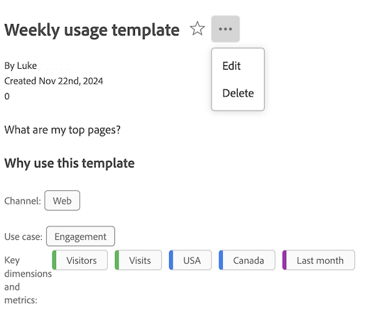
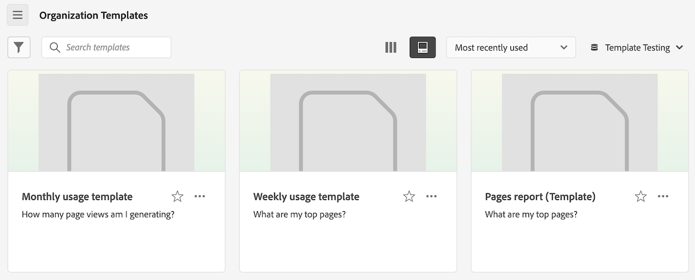

# Creare e gestire i modelli

Gli amministratori possono creare modelli e salvarli per l’utilizzo da parte di altri nella società di accesso.

Gli utenti della società di accesso possono utilizzare questi modelli aziendali come descritto in [Utilizzare i modelli](/help/analyze/analysis-workspace/templates/use-templates.md).

## Creare un modello

Per creare un nuovo modello utilizzabile dalle persone della società di accesso:

1. In Analysis Workspace, crea un progetto con lo stato desiderato.

1. Seleziona [!UICONTROL **Progetto**] > **[!UICONTROL Save as template…]**.

   

1. Specificare le informazioni seguenti nella finestra di dialogo [!UICONTROL Save as template]:

   | Campo | Descrizione |
   |---------|----------|
   | **[!UICONTROL Name]** | Fornisci un nome descrittivo per il modello. |
   | **[!UICONTROL Description]** | Fornire una breve descrizione del modello che ne descriva gli usi previsti. |
   | **[!UICONTROL Why use this template]** | Fornisci una breve spiegazione per informare le persone dell’organizzazione su come potrebbe essere utilizzato questo modello. Questa spiegazione viene visualizzata nella pagina Anteprima del modello. |
   | **[!UICONTROL Use cases]** | Scegli eventuali casi d’uso applicabili a questo modello. È possibile selezionare più casi d&#39;uso: **[!UICONTROL Engagement]**, **[!UICONTROL Conversion]**, **[!UICONTROL Audience]** e **[!UICONTROL Acquisition]**. 
Le selezioni selezionate determinano la posizione di visualizzazione del modello e i filtri applicabili agli utenti che vi accedono dalla pagina Modelli organizzazione.
 |
   | **[!UICONTROL Tags]** | Specifica i tag da applicare al modello. Gli utenti possono filtrare l’elenco dei modelli in base ai tag aggiunti. |

1. Seleziona [!UICONTROL **Salva come modello**].

Per informazioni su come gli utenti possono creare un progetto basato su un modello, vedere [Creare un progetto basato su un modello](/help/analyze/analysis-workspace/templates/use-templates.md#create-a-project-based-on-a-template) in [Utilizzare i modelli](/help/analyze/analysis-workspace/templates/use-templates.md).

## Modificare o eliminare un modello

Gli amministratori possono modificare o eliminare i modelli aziendali.

1. In Analysis Workspace, seleziona la scheda [!UICONTROL **Workspace**], quindi seleziona **[!UICONTROL _login_company_name _modelli]**.

1. Se visualizzi i modelli in una vista a colonne :

   1. Vai al modello da modificare o eliminare, seleziona l’icona delle informazioni accanto al nome del modello.

      

   1. Seleziona **[!UICONTROL Preview]**.

   1. Selezionare l&#39;icona Altro, quindi selezionare **[!UICONTROL Edit]** o **[!UICONTROL Delete]**.

      

1. Se visualizzi i modelli in una vista a schede :

   1. Individuare il modello che si desidera modificare o eliminare.

      

   1. Selezionare l&#39;icona Altro, quindi selezionare **[!UICONTROL Edit]** o **[!UICONTROL Delete]**.

      

1. Se stai modificando un modello, apporta le modifiche desiderate, quindi seleziona [!UICONTROL **Progetto**] > **[!UICONTROL Save as template…]**.

   

1. Specificare le informazioni seguenti nella finestra di dialogo [!UICONTROL Save as template]:

   | Campo | Descrizione |
   |---------|----------|
   | **[!UICONTROL Name]** | Fornisci un nome descrittivo per il modello. |
   | **[!UICONTROL Description]** | Fornire una breve descrizione del modello che ne descriva gli usi previsti. |
   | **[!UICONTROL Why use this template]** | Fornisci una breve spiegazione per informare le persone dell’organizzazione su come potrebbe essere utilizzato questo modello. Questa spiegazione viene visualizzata nella pagina Anteprima del modello. |
   | **[!UICONTROL Use cases]** | Scegli eventuali casi d’uso applicabili a questo modello. È possibile selezionare più casi d&#39;uso: **[!UICONTROL Engagement]**, **[!UICONTROL Conversion]**, **[!UICONTROL Audience]** e **[!UICONTROL Acquisition]**. 
Le selezioni selezionate determinano la posizione di visualizzazione del modello e i filtri applicabili agli utenti che vi accedono dalla pagina Modelli organizzazione.
 |
   | **[!UICONTROL Tags]** | Specifica i tag da applicare al modello. Gli utenti possono filtrare l’elenco dei modelli in base ai tag aggiunti. |

1. Seleziona [!UICONTROL **Salva come modello**].

## Rinominare, assegnare tag o approvare i modelli

Gli amministratori possono rinominare, assegnare tag e approvare i modelli aziendali.

1. In Analysis Workspace, seleziona la scheda [!UICONTROL **Workspace**], quindi seleziona **[!UICONTROL Projects tab]** nella barra a sinistra.

1. Seleziona l’icona del filtro per filtrare l’elenco dei progetti.

1. Nella barra dei filtri, seleziona **ALTRI FILTRI**, quindi seleziona **Modelli società**.

   Viene visualizzato un elenco dei modelli aziendali. Tutti i progetti regolari non vengono visualizzati, a meno che non siano fissati.

   I modelli aziendali possono essere identificati dall&#39;icona  che precede il nome del modello.

   

1. Fare clic sull&#39;icona con i puntini di sospensione **...** accanto a un modello per visualizzare le opzioni disponibili.

   

1. Seleziona **[!UICONTROL Rename]**, **[!UICONTROL Tag]**, or **[!UICONTROL Approve]**.

   È inoltre possibile eliminare un modello oppure eliminare un modello come descritto in [Modifica o elimina modelli](#edit-or-delete-templates).

1. (Facoltativo) Per tornare alla visualizzazione normale, nella barra dei filtri, deselezionare **[!UICONTROL Company templates]**.

## Accedere a un modello aziendale

Come per i modelli forniti da Adobe, gli utenti dell’organizzazione possono accedere ai modelli creati dagli amministratori.

Per informazioni su come accedere a un modello aziendale, vedere [Accedere ed eseguire un modello](/help/analyze/analysis-workspace/templates/use-templates.md#access-and-run-a-template) in [Utilizzare i modelli](/help/analyze/analysis-workspace/templates/use-templates.md).

## Nascondi la scheda Modelli {#hide-reports}

Gli amministratori possono nascondere la scheda Modelli per tutti gli utenti all’interno della propria organizzazione.

1. Passa a **[!UICONTROL Analytics]** > **[!UICONTROL Components]** > **[!UICONTROL Preferences]** > **[!UICONTROL Company]**.
1. Selezionare l&#39;opzione per **[!UICONTROL Hide Templates Tab]**.
