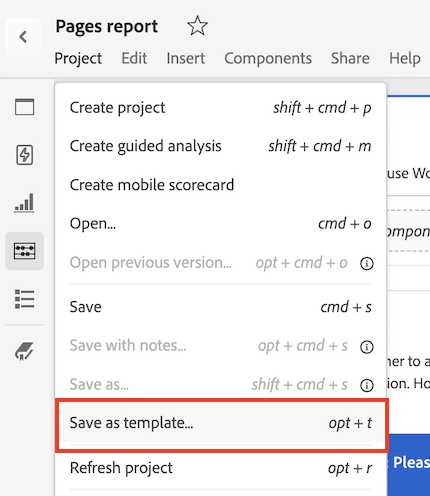
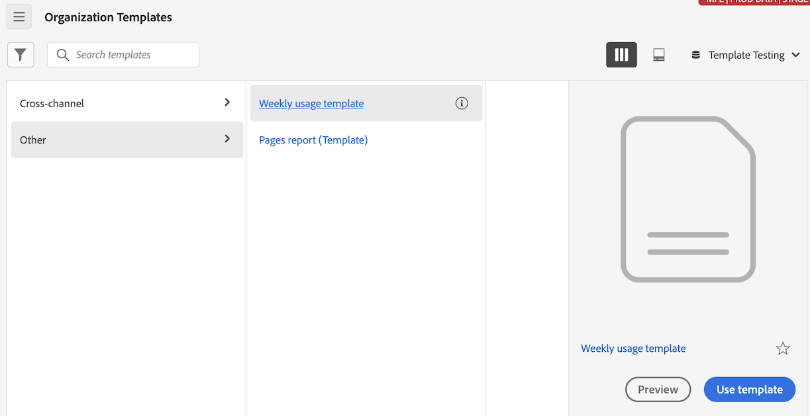
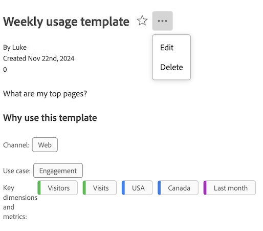
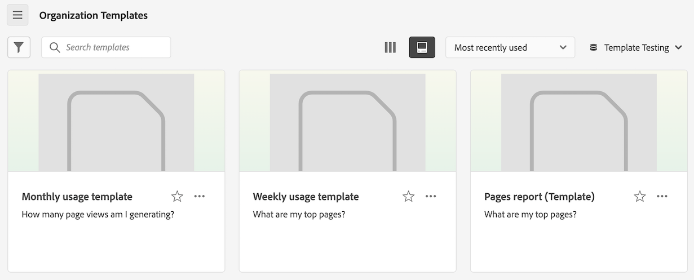
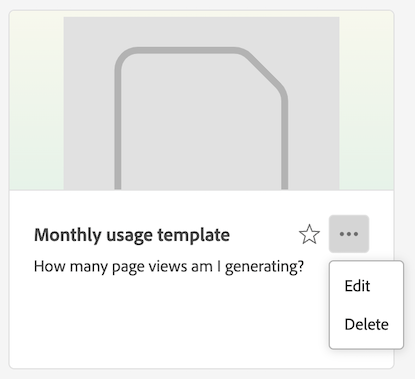
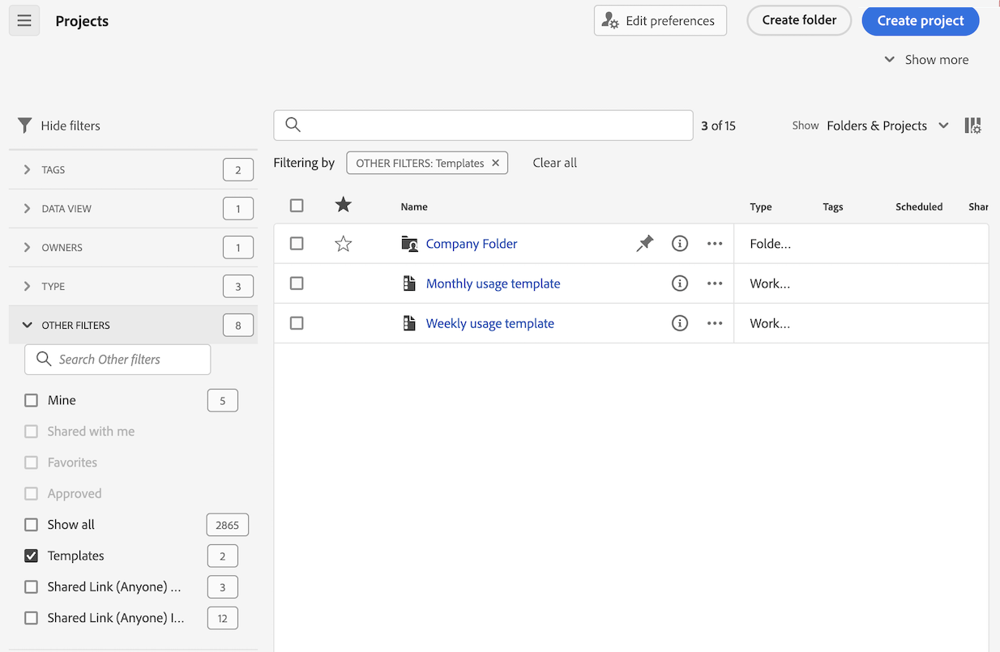
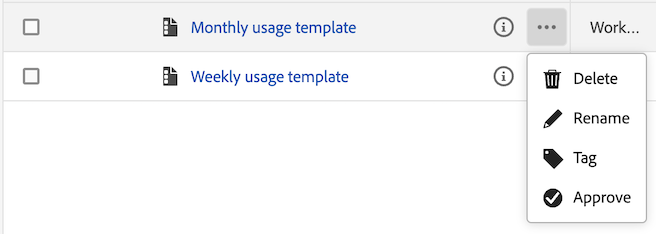

# Creare e gestire i modelli

Gli amministratori possono creare modelli e salvarli affinché possano essere utilizzati da altri utenti dell’azienda da cui accedi

Gli utenti dell’azienda da cui accedi possono utilizzare questi modelli aziendali come descritto in [Utilizzare i modelli](/help/analyze/analysis-workspace/templates/use-templates.md).

## Creare un modello

Per creare un nuovo modello utilizzabile dalle persone dell’azienda da cui accedi:

1. In Analysis Workspace, crea un progetto con lo stato desiderato.

1. Seleziona [!UICONTROL **Progetto**] > **[!UICONTROL Save as template…]**.

   

1. Specifica le informazioni seguenti nella finestra di dialogo [!UICONTROL Save as template]:

   | Campo | Descrizione |
   |---------|----------|
   | **[!UICONTROL Name]** | Inserisci un nome descrittivo per il modello. |
   | **[!UICONTROL Description]** | Fornisci una breve descrizione del modello che ne indichi gli usi previsti. |
   | **[!UICONTROL Why use this template]** | Inserisci una breve spiegazione per indicare alle persone dell’organizzazione come potrebbe essere utilizzato questo modello. Questa spiegazione viene visualizzata nella pagina Anteprima del modello. |
   | **[!UICONTROL Use cases]** | Scegli eventuali casi d’uso applicabili a questo modello. È possibile selezionare più casi d&#39;uso: **[!UICONTROL Engagement]**, **[!UICONTROL Conversion]**, **[!UICONTROL Audience]** e **[!UICONTROL Acquisition]**. 
Le selezioni effettuate determinano dove viene visualizzato il modello e quali sono i filtri applicabili per gli utenti che vi accedono dalla pagina Modelli aziendali.
 |
   | **[!UICONTROL Tags]** | Specifica i tag da applicare al modello. Gli utenti possono filtrare l’elenco dei modelli in base ai tag aggiunti. |

1. Seleziona [!UICONTROL **Salva come modello**].

Per informazioni su come gli utenti possono creare un progetto basato su un modello, consulta [Creare un progetto basato su un modello](/help/analyze/analysis-workspace/templates/use-templates.md#create-a-project-based-on-a-template) in [Utilizzare i modelli](/help/analyze/analysis-workspace/templates/use-templates.md).

## Modificare o eliminare un modello

Gli amministratori possono modificare o eliminare i modelli aziendali.

1. In Analysis Workspace, seleziona la scheda [!UICONTROL **Workspace**], quindi seleziona **[!UICONTROL _login _company_name_ modelli]**.

1. Se visualizzi i modelli in una vista a colonne :

   1. Passa al modello da modificare o eliminare, seleziona l’icona delle informazioni accanto al nome del modello.

      

   1. Seleziona **[!UICONTROL Preview]**.

   1. Seleziona l’icona Altro, quindi seleziona **[!UICONTROL Edit]** o **[!UICONTROL Delete]**.

      

1. Se visualizzi i modelli in una vista a schede :

   1. Individua il modello che desideri modificare o eliminare.

      

   1. Seleziona l’icona Altro, quindi seleziona **[!UICONTROL Edit]** o **[!UICONTROL Delete]**.

      

1. Se stai modificando un modello, apporta le modifiche desiderate, quindi seleziona [!UICONTROL **Progetto**] > **[!UICONTROL Save as template…]**.

   

1. Specifica le informazioni seguenti nella finestra di dialogo [!UICONTROL Save as template]:

   | Campo | Descrizione |
   |---------|----------|
   | **[!UICONTROL Name]** | Inserisci un nome descrittivo per il modello. |
   | **[!UICONTROL Description]** | Fornisci una breve descrizione del modello che ne indichi gli usi previsti. |
   | **[!UICONTROL Why use this template]** | Inserisci una breve spiegazione per indicare alle persone dell’organizzazione come potrebbe essere utilizzato questo modello. Questa spiegazione viene visualizzata nella pagina Anteprima del modello. |
   | **[!UICONTROL Use cases]** | Scegli eventuali casi d’uso applicabili a questo modello. È possibile selezionare più casi d&#39;uso: **[!UICONTROL Engagement]**, **[!UICONTROL Conversion]**, **[!UICONTROL Audience]** e **[!UICONTROL Acquisition]**. 
Le selezioni effettuate determinano dove viene visualizzato il modello e quali sono i filtri applicabili per gli utenti che vi accedono dalla pagina Modelli aziendali.
 |
   | **[!UICONTROL Tags]** | Specifica i tag da applicare al modello. Gli utenti possono filtrare l’elenco dei modelli in base ai tag aggiunti. |

1. Seleziona [!UICONTROL **Salva come modello**].

## Rinominare, assegnare tag o approvare i modelli

Gli amministratori possono rinominare, assegnare tag e approvare i modelli aziendali.

1. In Analysis Workspace, seleziona la scheda [!UICONTROL **Workspace**], quindi scegli la **[!UICONTROL Projects tab]** nella barra a sinistra.

1. Seleziona l’icona del filtro per filtrare l’elenco dei progetti.

1. Nella barra dei filtri, seleziona **ALTRI FILTRI** e quindi seleziona **Modelli aziendali**.

   Viene visualizzato un elenco dei modelli aziendali. Tutti i progetti regolari non vengono visualizzati, a meno che non siano fissati.

   I modelli aziendali possono essere identificati dall’ che precede il nome del modello.

   

1. Fai clic sull’icona con i puntini di sospensione **...** accanto a un modello per visualizzare le opzioni disponibili.

   

1. Seleziona **[!UICONTROL Rename]**, **[!UICONTROL Tag]**, or **[!UICONTROL Approve]**.

   Puoi inoltre eliminare un modello oppure eliminare un modello come descritto in [Modificare o eliminare i modelli](#edit-or-delete-templates).

1. (Facoltativo) Per tornare alla visualizzazione normale, nella barra dei filtri, deseleziona **[!UICONTROL Company templates]**.

## Accedere a un modello aziendale

Come per i modelli forniti da Adobe, gli utenti dell’organizzazione possono accedere ai modelli creati dagli amministratori.

Per informazioni su come accedere a un modello aziendale, consulta [Accedere ed eseguire un modello](/help/analyze/analysis-workspace/templates/use-templates.md#access-and-run-a-template) in [Utilizzare i modelli](/help/analyze/analysis-workspace/templates/use-templates.md).

## Nascondere la scheda Modelli {#hide-reports}

Gli amministratori possono nascondere la scheda Modelli per tutti gli utenti all’interno della propria organizzazione.

1. Passa a **[!UICONTROL Analytics]** > **[!UICONTROL Components]** > **[!UICONTROL Preferences]** > **[!UICONTROL Company]**.
1. Seleziona l’opzione per **[!UICONTROL Hide Templates Tab]**.
