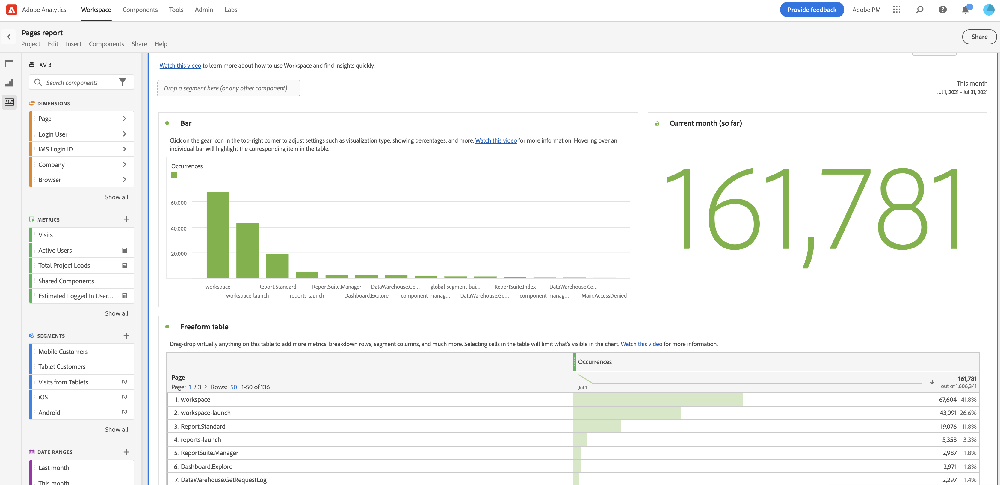

# Utilizzare i modelli

I modelli (o modelli aziendali) in Analysis Workspace forniscono informazioni rapide sugli scenari di reporting più comuni. Di seguito sono riportati alcuni esempi di domande a cui è possibile rispondere con i modelli:

* quante persone visitano il sito
* quanti di questi visitatori sono visitatori univoci (conteggiati una sola volta)
* come sono arrivati al sito (ad esempio, se hanno seguito un collegamento o ci sono arrivati direttamente)
* quali parole chiave hanno utilizzato i visitatori per cercare il contenuto del sito
* per quanto tempo i visitatori sono rimasti su una determinata pagina o sull’intero sito
* su quali collegamenti i visitatori hanno fatto clic e quando hanno lasciato il sito
* quali canali di marketing sono più efficaci nel generare ricavi o eventi di conversione
* quanto tempo hanno trascorso a guardare un video
* quali browser e dispositivi hanno utilizzato per visitare il sito

Le informazioni seguenti descrivono come accedere e utilizzare i modelli dalla scheda [!UICONTROL Templates] in Analysis Workspace.

## Accedere ed eseguire un modello

1. In Analysis Workspace, seleziona la scheda [!UICONTROL **Workspace**].

   <!--update screenshot -->

   

1. Nella sezione [!UICONTROL **Modelli**] selezionare una delle schede seguenti:

   * **[!UICONTROL Adobe templates]**: mostra tutti i modelli forniti da Adobe.

   * **[!UICONTROL _login_company_name _modelli]**: mostra tutti i modelli aziendali creati per la tua organizzazione.

     Solo gli amministratori possono creare modelli aziendali. Per ulteriori informazioni sulla creazione di un modello aziendale, vedere [Creare e gestire modelli](/help/analyze/analysis-workspace/reports/create-company-reports.md).

1. Per modificare la modalità di visualizzazione dei modelli disponibili, utilizzare una delle opzioni seguenti:

   * Scegli se visualizzare i modelli in una vista a colonne o in una vista a schede selezionando l&#39;icona della vista a colonne  o l&#39;icona della vista a schede .

   * Quando si utilizza la vista a schede , scegliere uno dei seguenti criteri di ordinamento: **[!UICONTROL Most recently used]**, **[!UICONTROL Most popular]**, **[!UICONTROL Alphabetical]**, **[!UICONTROL Categorical]**.

1. Nel campo di ricerca, iniziare a digitare il nome del modello che si desidera trovare, quindi selezionarlo dall&#39;elenco dei modelli. Puoi anche effettuare ricerche nell’elenco dei modelli per proprietà, eVar e numero evento. <!-- still true? -->

   Oppure

   Selezionare la categoria di modello che si desidera visualizzare, quindi selezionare il modello dall&#39;elenco dei modelli.

   >[!TIP]
   >
   >Per spostarti nel menu utilizzando i tasti freccia, premi il tasto Barra obliqua (/), quindi premi il tasto Freccia giù. Premi Invio per caricare il modello selezionato.

   Per un elenco dei modelli disponibili, vedere la sezione [Modelli disponibili](#available-reports) di seguito.

## Creare un progetto basato su un modello {#use-reports}

Un modello potrebbe non soddisfare esattamente le tue esigenze, ma può avvicinarti. In questi casi, puoi utilizzare il modello come punto di partenza e personalizzarlo in base alle tue esigenze.

Se si esce da un modello dopo aver apportato modifiche, viene richiesto di salvare o eliminare le modifiche. Quando si salvano le modifiche apportate a un modello, questo viene salvato come nuovo progetto.

Per personalizzare un modello e salvarlo come progetto:

1. In Adobe Analytics, seleziona la scheda [!UICONTROL **Workspace**].

1. Selezionare la scheda [!UICONTROL **Modelli**].

1. Seleziona il modello da visualizzare. Ad esempio, in [!UICONTROL **Più popolari**], seleziona il modello [!UICONTROL **Pagine**].

   

1. Il modello Pagine, visualizzato in Analysis Workspace, mostra due [visualizzazioni](/help/analyze/analysis-workspace/visualizations/freeform-analysis-visualizations.md) ([Grafico a barre](/help/analyze/analysis-workspace/visualizations/bar.md) e [Numero riepilogo](/help/analyze/analysis-workspace/visualizations/summary-number-change.md)) e una [Tabella a forma libera](/help/analyze/analysis-workspace/visualizations/freeform-table/freeform-table.md). La metrica utilizzata è Occorrenze.
1. Esegui una delle operazioni seguenti:

   * Visualizza il modello.
   * Puoi trascinare uno o più segmenti nella zona di rilascio Segmento, nella parte superiore. Ad esempio, trascina il segmento [!UICONTROL **Clienti mobile**] e visualizza i risultati.
   * Modifica l’intervallo di date andando sul calendario in alto a destra.
   * Aggiungi suddivisioni dimensionali, trascina altre metriche e in genere personalizza il modello in base alle tue esigenze.

1. (Facoltativo) Salva il modello come progetto selezionando [!UICONTROL **Progetto**] > [!UICONTROL **Salva**].

   Il modello viene salvato come nuovo progetto e non modifica il modello esistente. Per ulteriori informazioni sul salvataggio dei progetti, vedere [Salva progetti](/help/analyze/analysis-workspace/build-workspace-project/save-projects.md).

## Modelli disponibili

Per accedere a tutti i modelli predefiniti disponibili:

1. In Adobe Analytics, seleziona la scheda [!UICONTROL **Workspace**], quindi la scheda [!UICONTROL **Modelli**].

   I modelli predefiniti sono organizzati per categoria.

   <!--add screenshot-->

1. Selezionare una categoria per visualizzare i modelli al suo interno.

   Le sezioni seguenti corrispondono alle categorie disponibili e forniscono informazioni su ciascun modello.

   * [[!UICONTROL ](#most-popular)

   * [[!UICONTROL ](#engagement)

### Most popular (Più popolari) {#most-popular}

<!--AA only-->

<!-- markdownlint-disable MD034 -->

>[!CONTEXTUALHELP]
>id="aa-template--unitsOvertimeReport"
>title="Visualizza il numero totale di unità acquistate in tutti gli ordini. I dati vengono visualizzati in un periodo di tempo e confrontati con i periodi precedenti."
>abstract="**Questo ti aiuta** a capire meglio come le vendite unitarie aumentano o diminuiscono nel tempo. Puoi applicare un segmento per scoprire quali clienti o aree geografiche acquistano più unità e come queste vendite unitarie tendono nel tempo. **In base a quanto appreso, è possibile** eseguire una serie di operazioni, ad esempio valutare l&#39;efficacia di una campagna di marketing avviata di recente confrontando le vendite unitarie prima e dopo l&#39;avvio della campagna. In alternativa, è possibile confrontare le vendite unitarie annuali durante le festività. Questo modello utilizza la dimensione Giorno e la metrica Unità."

<!-- markdownlint-enable MD034 -->

<!--both AA and CJA-->

<!-- markdownlint-disable MD034 -->

>[!CONTEXTUALHELP]
>id="template--training"
>title="Modello per le esercitazioni"
>abstract="Scopri la terminologia e i passaggi comuni di Analysis Workspace per creare la tua prima analisi."

<!-- markdownlint-enable MD034 -->

<!-- markdownlint-disable MD034 -->

>[!CONTEXTUALHELP]
>id="template--pagesRankedReport"
>title="Identifica le pagine più popolari e meno popolari."
>abstract="**Questo può aiutarti** a comprendere meglio il tuo pubblico e il tipo di informazioni a cui sono più interessati. **In base a ciò che hai appreso, potresti** fare qualsiasi cosa, ad esempio regolare i metadati della pagina per aumentare la visibilità sulle pagine visualizzate meno o passare del tempo a migliorare il contenuto delle pagine più visualizzate. Questo modello utilizza la dimensione Pagina e la metrica Visualizzazioni pagina."

<!-- markdownlint-enable MD034 -->

<!-- markdownlint-disable MD034 -->

>[!CONTEXTUALHELP]
>id="template--pageViewsOvertimeReport"
>title="Visualizzare il numero totale di visualizzazioni di pagina. I dati vengono visualizzati in un periodo di tempo e confrontati con i periodi precedenti. "
>abstract="**Questo può aiutarti** a comprendere meglio come il traffico sul tuo sito potrebbe aumentare o diminuire nel tempo. **In base a ciò che apprendi, potresti** eseguire una serie di operazioni, ad esempio valutare l&#39;efficacia di una campagna di marketing avviata di recente confrontando il traffico del sito prima e dopo l&#39;avvio della campagna. Oppure puoi confrontare il traffico delle vacanze su base annua. Questo modello utilizza la dimensione Giorno e la metrica Visualizzazioni pagina."

<!-- markdownlint-enable MD034 -->

<!-- markdownlint-disable MD034 -->

>[!CONTEXTUALHELP]
>id="template--visitsOvertimeReport"
>title="Visualizza il numero totale di visite. I dati vengono visualizzati in un periodo di tempo e confrontati con i periodi precedenti."
>abstract="**Questo può aiutarti** a comprendere meglio come il traffico sul tuo sito potrebbe aumentare o diminuire nel tempo. **In base a ciò che apprendi, potresti** eseguire una serie di operazioni, ad esempio valutare l&#39;efficacia di una campagna di marketing avviata di recente confrontando il traffico del sito prima e dopo l&#39;avvio della campagna. Oppure puoi confrontare il traffico delle vacanze su base annua. Questo modello utilizza la dimensione Giorno e la metrica Visite."

<!-- markdownlint-enable MD034 -->

<!-- markdownlint-disable MD034 -->

>[!CONTEXTUALHELP]
>id="template--visitorsOvertimeReport"
>title="Visualizza il numero totale di visitatori univoci. I dati vengono visualizzati in un periodo di tempo e confrontati con i periodi precedenti. "
>abstract="**Questo può aiutarti** a comprendere meglio come la portata e la dimensione del pubblico del tuo sito aumentino o diminuiscano nel tempo o rispetto a un periodo precedente. **In base a ciò che hai appreso, potresti** fare un certo numero di cose, ad esempio valutare se una campagna di marketing lanciata di recente è riuscita ad attirare nuove persone sul sito confrontando visitatori univoci prima e dopo il lancio della campagna. Oppure puoi confrontare il numero di persone che visitano il sito durante le festività anno su anno. Questo modello utilizza la dimensione Giorno e la metrica Visitatori univoci. "

<!-- markdownlint-enable MD034 -->

<!-- markdownlint-disable MD034 -->

>[!CONTEXTUALHELP]
>id="template--keyMetricsReport"
>title="Visualizza un rapporto che mostra affiancate le metriche di visualizzazioni di pagina, visite e visitatori univoci. I dati vengono visualizzati in un periodo di tempo e confrontati con i periodi precedenti."
>abstract="**Questo può aiutarti** a confrontare queste metriche importanti per ottenere un quadro più completo del numero di persone univoche che che visitano il sito, del numero di volte in cui sono state visitate le pagine e del numero di sessioni. **In base a ciò che hai appreso, potresti** eseguire un numero qualsiasi di operazioni, ad esempio valutare il numero medio di pagine visualizzate da ogni persona durante la visita al sito in una determinata settimana o mese e come è cambiato durante determinati periodi dell&#39;anno o prima e dopo l&#39;esecuzione di campagne di marketing.  Questo modello utilizza la dimensione Giorno, la metrica Visualizzazioni pagina, la metrica Visite e la metrica Visitatori univoci."

<!-- markdownlint-enable MD034 -->

<!-- markdownlint-disable MD034 -->

>[!CONTEXTUALHELP]
>id="template--siteSectionRankedReport"
>title="Visualizza le sezioni più popolari o con le prestazioni più elevate del sito."
>abstract="**Questo può aiutarti** a capire meglio quali sezioni del tuo sito sono più visitate. **In base a ciò che hai appreso, potresti** fare un certo numero di cose, ad esempio valutare quali prodotti o servizi fornisci generano il maggior interesse. Questo modello utilizza la dimensione Sezione sito e la metrica Visite."

<!-- markdownlint-enable MD034 -->

<!-- markdownlint-disable MD034 -->

>[!CONTEXTUALHELP]
>id="template--next-page-report"
>title="Visualizza i luoghi più comuni in cui le persone vanno immediatamente dopo aver visitato una determinata pagina."
>abstract="**Questo può aiutarti** a comprendere meglio il comportamento degli utenti dopo aver visitato una determinata pagina. **In base a ciò che hai appreso, potresti** eseguire una serie di operazioni, ad esempio valutare se la progettazione o il layout della pagina possa essere ottimizzato per indirizzare gli utenti a pagine più desiderate, ad esempio una pagina per effettuare un acquisto o lasciare una recensione. Questo modello utilizza la dimensione Pagina e la metrica Eventi."

<!-- markdownlint-enable MD034 -->

<!-- markdownlint-disable MD034 -->

>[!CONTEXTUALHELP]
>id="template--previous-page-report"
>title="Visualizza i luoghi più comuni in cui le persone vanno immediatamente prima di visitare una determinata pagina."
>abstract="**Questo può aiutarti** a capire meglio quali pagine indirizzano il maggior traffico verso una determinata pagina. **In base a ciò che hai appreso, potresti** fare un certo numero di cose, ad esempio valutare se le pagine che non sono visualizzate come pagine precedenti richiedono collegamenti più evidenti alla pagina corrente."

<!-- markdownlint-enable MD034 -->

<!-- markdownlint-disable MD034 -->

>[!CONTEXTUALHELP]
>id="template--campaignRankedReport"
>title="Visualizza i collegamenti più efficaci per indirizzare il traffico verso il tuo sito."
>abstract="**Questo può aiutarti** a capire meglio quali codici di tracciamento (e i collegamenti a essi associati) sono stati più utilizzati per accedere al tuo sito. **In base a ciò che hai appreso, potresti** fare un certo numero di cose, ad esempio modificare la tua strategia per la posizione in cui aggiungi collegamenti al tuo sito. Questo modello utilizza la dimensione Codice di tracciamento e la metrica Visite."

<!-- markdownlint-enable MD034 -->

<!-- markdownlint-disable MD034 -->

>[!CONTEXTUALHELP]
>id="template--productsRankedReport"
>title="Visualizza il numero di ordini per prodotto. I dati vengono visualizzati in un arco di tempo."
>abstract="**Questo ti aiuta** a capire quali prodotti sono più richiesti o meno. **In base a ciò che hai appreso, potresti** fare qualsiasi cosa, ad esempio modificare le tue strategie di marketing per promuovere prodotti dalle prestazioni elevate o per migliorare o interrompere prodotti dalle prestazioni insoddisfacenti. Puoi anche regolare l’inventario dei prodotti in base all’analisi dei dati. Questo modello utilizza la dimensione Prodotto e la metrica Ordini."

<!-- markdownlint-enable MD034 -->

<!-- markdownlint-disable MD034 -->

>[!CONTEXTUALHELP]
>id="template--lastTouchChannelRankedReport"
>title="Visualizza i canali di marketing più recenti con cui i visitatori fanno riferimento durante il periodo di coinvolgimento (30 giorni per impostazione predefinita)."
>abstract="**Questo può aiutarti** a capire quali canali di marketing sono stati più efficaci nel portare le persone sul tuo sito e che hanno causato conversioni. **In base a ciò che hai appreso, potresti** eseguire un numero qualsiasi di operazioni, ad esempio allocare più risorse ai canali con prestazioni elevate o allocare meno risorse ai canali con prestazioni insoddisfacenti. Questo modello utilizza la dimensione Canale di ultimo contatto e la metrica Visitatori univoci."

<!-- markdownlint-enable MD034 -->

<!-- markdownlint-disable MD034 -->

>[!CONTEXTUALHELP]
>id="template--lastTouchChannelDetailRankedReport"
>title="Visualizza i dettagli sui canali di marketing più recenti con cui i visitatori corrispondono durante il periodo di coinvolgimento (30 giorni per impostazione predefinita)."
>abstract="**Questo può aiutarti** a capire non solo quali canali di marketing sono stati più efficaci nel portare le persone sul tuo sito che hanno generato conversioni, ma anche i dettagli su tali canali di marketing. Ad esempio, se un visitatore è arrivato sul tuo sito e corrisponde al canale di marketing &quot;Ricerca a pagamento&quot;, puoi utilizzare i dettagli del canale per vedere quale motore di ricerca è stato utilizzato o quale parola chiave ha cercato. **In base a ciò che hai appreso, potresti** eseguire un numero qualsiasi di operazioni, ad esempio allocare più risorse ai canali con prestazioni elevate o allocare meno risorse ai canali con prestazioni insoddisfacenti. Questo modello utilizza la dimensione Dettaglio canale di ultimo contatto e la metrica Visitatori univoci. "

<!-- markdownlint-enable MD034 -->

<!-- markdownlint-disable MD034 -->

>[!CONTEXTUALHELP]
>id="template--revenueOvertimeReport"
>title="Visualizza l&#39;importo monetario di tutti i prodotti acquistati in tutti gli ordini. I dati vengono visualizzati in un periodo di tempo e confrontati con i periodi precedenti."
>abstract="**Questo può aiutarti** a capire come i ricavi aumentano o diminuiscono nel tempo. Puoi combinare questa metrica con qualsiasi dimensione per scoprire quali elementi dimensionali hanno contribuito ai ricavi. **In base a ciò che hai appreso, potresti** fare un certo numero di cose, ad esempio proiettare i ricavi futuri in base alle tendenze precedenti. Puoi anche aggiungere un’altra dimensione, come la dimensione Codice di tracciamento, per scoprire quali campagne generano più ricavi. Questo modello utilizza la dimensione Giorno e la metrica Ricavi."

<!-- markdownlint-enable MD034 -->

<!-- markdownlint-disable MD034 -->

>[!CONTEXTUALHELP]
>id="template--ordersOvertimeReport"
>title="Visualizza il numero totale di eventi di acquisto. I dati vengono visualizzati in un periodo di tempo e confrontati con i periodi precedenti."
>abstract="**Questo ti aiuta** a comprendere meglio come aumenta o diminuisce nel tempo l&#39;interesse per i tuoi prodotti e servizi. Puoi applicare un segmento per scoprire quali clienti o aree geografiche stanno effettuando il maggior numero di ordini e come questi ultimi tendono nel tempo. **In base a quanto appreso, è possibile** eseguire una serie di operazioni, ad esempio valutare l&#39;efficacia di una campagna di marketing avviata di recente confrontando gli ordini prima e dopo il lancio della campagna. Oppure puoi confrontare gli ordini relativi alle festività su base annua. Questo modello utilizza la dimensione Giorno e la metrica Ordini."

<!-- markdownlint-enable MD034 -->

Sono disponibili i seguenti modelli:

| Nome modello | Perché utilizzare questo modello <!-- What do you do with it? What can it help you learn? and What are the potential actions? --> |
| --- | --- | 
| [!UICONTROL **Esercitazione**] | Scopri la terminologia e i passaggi comuni di Analysis Workspace per creare la tua prima analisi |
| [!UICONTROL **Pagine**] | <!--duplicated in Engagement section--> Identifica le pagine più popolari e meno popolari. 
**Questo può aiutarti** a comprendere meglio il tuo pubblico e il tipo di informazioni a cui sono più interessati.

**In base a ciò che hai appreso, potresti** fare qualsiasi cosa, come regolare i metadati della pagina per aumentare la visibilità sulle pagine visualizzate meno o passare del tempo a migliorare il contenuto delle pagine più visualizzate.

Questo modello utilizza la [dimensione Pagina](/help/components/dimensions/page.md) e la [metrica Visualizzazioni pagina](/help/components/metrics/page-views.md).
 |
| [!UICONTROL **Visualizzazioni pagina**] | <!--duplicated in Engagement section--> Visualizzare il numero totale di visualizzazioni di pagina. I dati vengono visualizzati in un periodo di tempo e confrontati con i periodi precedenti. 
**Questo può aiutarti** a comprendere meglio come il traffico sul tuo sito potrebbe aumentare o diminuire nel tempo.

**In base a ciò che apprendi, potresti** eseguire una serie di operazioni, ad esempio valutare l&#39;efficacia di una campagna di marketing avviata di recente confrontando il traffico del sito prima e dopo l&#39;avvio della campagna. Oppure puoi confrontare il traffico delle vacanze su base annua.

Questo modello utilizza la dimensione [Day](/help/components/dimensions/day.md) e la metrica [Page Views](/help/components/metrics/page-views.md).
 |
| [!UICONTROL **Visite**] | <!--duplicated in Engagement section--> Visualizza il numero totale di visite. I dati vengono visualizzati in un periodo di tempo e confrontati con i periodi precedenti. 
**Questo può aiutarti** a comprendere meglio come il traffico sul tuo sito potrebbe aumentare o diminuire nel tempo.

**In base a ciò che apprendi, potresti** eseguire una serie di operazioni, ad esempio valutare l&#39;efficacia di una campagna di marketing avviata di recente confrontando il traffico del sito prima e dopo l&#39;avvio della campagna. Oppure puoi confrontare il traffico delle vacanze su base annua.

Questo modello utilizza la dimensione [Day](/help/components/dimensions/day.md) e la metrica [Visits](/help/components/metrics/visits.md).
 |
| [!UICONTROL **Visitatori**] | <!--duplicated in Engagement section--> Visualizza il numero totale di visitatori univoci. I dati vengono visualizzati in un periodo di tempo e confrontati con i periodi precedenti. 
**Questo può aiutarti** a comprendere meglio come la portata e la dimensione del pubblico del tuo sito aumentino o diminuiscano nel tempo o rispetto a un periodo precedente.

**In base a ciò che hai appreso, potresti** fare un certo numero di cose, ad esempio valutare se una campagna di marketing lanciata di recente è riuscita ad attirare nuove persone sul sito confrontando visitatori univoci prima e dopo il lancio della campagna. Oppure puoi confrontare il numero di persone che visitano il sito durante le festività anno su anno.

Questo modello utilizza la dimensione [Day](/help/components/dimensions/day.md) e la metrica [Visitatori univoci](/help/components/metrics/unique-visitors.md).
 |
| [!UICONTROL **Metriche chiave**] | <!--duplicated in Engagement section--> Visualizza un rapporto che mostra affiancate le metriche di visualizzazioni di pagina, visite e visitatori univoci. I dati vengono visualizzati in un periodo di tempo e confrontati con i periodi precedenti. 
**Questo può aiutarti** a confrontare queste metriche importanti per ottenere un quadro più completo del numero di persone univoche che che visitano il sito, del numero di volte in cui sono state visitate le pagine e del numero di sessioni.

**In base a ciò che hai appreso, potresti** eseguire un numero qualsiasi di operazioni, ad esempio valutare il numero medio di pagine visualizzate da ogni persona durante la visita al sito in una determinata settimana o mese e come è cambiato durante determinati periodi dell&#39;anno o prima e dopo l&#39;esecuzione di campagne di marketing. 

Questo modello utilizza la [dimensione Giorno](/help/components/dimensions/day.md), [metrica Visualizzazioni pagina](/help/components/metrics/page-views.md), [metrica Visite](/help/components/metrics/visits.md) e [metrica Visitatori univoci](/help/components/metrics/unique-visitors.md).
 |
| [!UICONTROL **Sezioni del sito**] | Visualizza le sezioni più popolari o con le prestazioni più elevate del sito. 
**Questo può aiutarti** a capire meglio quali sezioni del tuo sito sono più visitate.

**In base a ciò che hai appreso, potresti** fare un certo numero di cose, ad esempio valutare quali prodotti o servizi fornisci generano il maggior interesse.
 
Questo modello utilizza la [dimensione Sezione sito](/help/components/dimensions/site-section.md) e la [metrica Visite](/help/components/metrics/visits.md).
 |
| [!UICONTROL **Codice di tracking**] | Visualizza i collegamenti più efficaci per indirizzare il traffico verso il tuo sito. 
**Questo può aiutarti** a capire meglio quali codici di tracciamento (e i collegamenti a essi associati) sono stati più utilizzati per accedere al tuo sito.

**In base a ciò che hai appreso, potresti** fare un certo numero di cose, ad esempio modificare la tua strategia per la posizione in cui aggiungi collegamenti al tuo sito.

Questo modello utilizza la dimensione [Codice di tracciamento](/help/components/dimensions/tracking-code.md) e la metrica [Visite](/help/components/metrics/visits.md).
 |
| [!UICONTROL **Pagina successiva**] | Visualizza i luoghi più comuni in cui le persone vanno immediatamente dopo aver visitato una determinata pagina. 
**Questo può aiutarti** a comprendere meglio il comportamento degli utenti dopo aver visitato una determinata pagina.

**In base a ciò che hai appreso, potresti** eseguire una serie di operazioni, ad esempio valutare se la progettazione o il layout della pagina possa essere ottimizzato per indirizzare gli utenti a pagine più desiderate, ad esempio una pagina per effettuare un acquisto o lasciare una recensione.
 
Questo modello utilizza la dimensione Pagina e la metrica Eventi.
 |
| [!UICONTROL **Pagina precedente**] | Visualizza i luoghi più comuni in cui le persone vanno immediatamente prima di visitare una determinata pagina. 
**Questo può aiutarti** a capire meglio quali pagine indirizzano il maggior traffico verso una determinata pagina.

**In base a ciò che hai appreso, potresti** fare un certo numero di cose, ad esempio valutare se le pagine che non sono visualizzate come pagine precedenti richiedono collegamenti più evidenti alla pagina corrente.

Questo modello utilizza la dimensione Pagina e la metrica Eventi.
 |
| [!UICONTROL **Prodotti**] | Visualizza il numero di ordini per prodotto. I dati vengono visualizzati in un arco di tempo. 
**Questo ti aiuta** a capire quali prodotti sono più richiesti o meno.

**In base a ciò che hai appreso, potresti** fare qualsiasi cosa, ad esempio modificare le tue strategie di marketing per promuovere prodotti dalle prestazioni elevate o per migliorare o interrompere prodotti dalle prestazioni insoddisfacenti. Puoi anche regolare l’inventario dei prodotti in base all’analisi dei dati.

Questo modello utilizza la [dimensione prodotto](/help/components/dimensions/product.md) e la [metrica ordini](/help/components/metrics/orders.md).
 |
| [!UICONTROL **Canale di ultimo contatto**] | Visualizza i canali di marketing più recenti con cui i visitatori fanno riferimento durante il periodo di coinvolgimento (30 giorni per impostazione predefinita).
**Questo può aiutarti** a capire quali canali di marketing sono stati più efficaci nel portare le persone sul tuo sito e che hanno causato conversioni.

**In base a ciò che hai appreso, potresti** eseguire un numero qualsiasi di operazioni, ad esempio allocare più risorse ai canali con prestazioni elevate o allocare meno risorse ai canali con prestazioni insoddisfacenti.

Questo modello utilizza la [dimensione Canale di ultimo contatto](/help/components/dimensions/last-touch-channel.md) e la [metrica Visitatori univoci](/help/components/metrics/unique-visitors.md).
 |
| [!UICONTROL **Dettaglio del canale di ultimo contatto**] | Visualizza i dettagli sui canali di marketing più recenti con cui i visitatori corrispondono durante il periodo di coinvolgimento (30 giorni per impostazione predefinita).
**Questo può aiutarti** a capire non solo quali canali di marketing sono stati più efficaci nel portare le persone sul tuo sito che hanno generato conversioni, ma anche i dettagli su tali canali di marketing. Ad esempio, se un visitatore è arrivato sul tuo sito e corrisponde al canale di marketing &quot;Ricerca a pagamento&quot;, puoi utilizzare i dettagli del canale per vedere quale motore di ricerca è stato utilizzato o quale parola chiave ha cercato.

**In base a ciò che hai appreso, potresti** eseguire un numero qualsiasi di operazioni, ad esempio allocare più risorse ai canali con prestazioni elevate o allocare meno risorse ai canali con prestazioni insoddisfacenti.

Questo modello utilizza la dimensione [Dettaglio canale di ultimo contatto](/help/components/dimensions/last-touch-detail.md) e la metrica [Visitatori univoci](/help/components/metrics/unique-visitors.md).
 |
| [!UICONTROL **Ricavi**] | Visualizza l&#39;importo monetario di tutti i prodotti acquistati in tutti gli ordini. I dati vengono visualizzati in un periodo di tempo e confrontati con i periodi precedenti.
**Questo può aiutarti** a capire come i ricavi aumentano o diminuiscono nel tempo. Puoi combinare questa metrica con qualsiasi dimensione per scoprire quali elementi dimensionali hanno contribuito ai ricavi.

**In base a ciò che hai appreso, potresti** fare un certo numero di cose, ad esempio proiettare i ricavi futuri in base alle tendenze precedenti. Puoi anche aggiungere un’altra dimensione, come la dimensione Codice di tracciamento, per scoprire quali campagne generano più ricavi.

Questo modello utilizza la dimensione [Day](/help/components/dimensions/day.md) e la metrica [Revenue](/help/components/metrics/revenue.md).
 |
| [!UICONTROL **Ordini**] | Visualizza il numero totale di eventi di acquisto. I dati vengono visualizzati in un periodo di tempo e confrontati con i periodi precedenti. 
**Questo ti aiuta** a comprendere meglio come aumenta o diminuisce nel tempo l&#39;interesse per i tuoi prodotti e servizi. Puoi applicare un segmento per scoprire quali clienti o aree geografiche stanno effettuando il maggior numero di ordini e come questi ultimi tendono nel tempo.

**In base a quanto appreso, è possibile** eseguire una serie di operazioni, ad esempio valutare l&#39;efficacia di una campagna di marketing avviata di recente confrontando gli ordini prima e dopo il lancio della campagna. Oppure puoi confrontare gli ordini relativi alle festività su base annua.

Questo modello utilizza la dimensione [Day](/help/components/dimensions/day.md) e la metrica [Orders](/help/components/metrics/orders.md).
 |
| [!UICONTROL **Unità**] | Visualizza il numero totale di unità acquistate in tutti gli ordini. I dati vengono visualizzati in un periodo di tempo e confrontati con i periodi precedenti. 
**Questo ti aiuta** a capire meglio come le vendite unitarie aumentano o diminuiscono nel tempo. Puoi applicare un segmento per scoprire quali clienti o aree geografiche acquistano più unità e come queste vendite unitarie tendono nel tempo.

**In base a quanto appreso, è possibile** eseguire una serie di operazioni, ad esempio valutare l&#39;efficacia di una campagna di marketing avviata di recente confrontando le vendite unitarie prima e dopo l&#39;avvio della campagna. In alternativa, è possibile confrontare le vendite unitarie annuali durante le festività.

Questo modello utilizza la dimensione [Day](/help/components/dimensions/day.md) e la metrica [Units](/help/components/metrics/units.md).
 |

### Coinvolgimento {#web-engagement}

<!--AA only-->

<!-- markdownlint-disable MD034 -->

>[!CONTEXTUALHELP]
>id="aa-template--real-time"
>title="Visualizza le dimensioni e le metriche attualmente raccolte sul tuo sito."
>abstract="**Questo può aiutarti** a comprendere meglio le tendenze sul tuo sito. **In base a ciò che hai appreso, potresti** fare qualsiasi cosa, ad esempio rispondere e gestire attivamente le prestazioni dei contenuti e delle campagne di marketing correnti."

<!-- markdownlint-enable MD034 -->

<!-- markdownlint-disable MD034 -->

>[!CONTEXTUALHELP]
>id="aa-template--timeSpentVisitOvertimeReport"
>title="Visualizza il tempo medio che i visitatori trascorrono sul sito durante ogni visita. I dati vengono visualizzati in un periodo di tempo e confrontati con i periodi precedenti."
>abstract="**Questo può aiutarti** a comprendere meglio i livelli di coinvolgimento dei visitatori e quanto tempo i visitatori passano sul sito. **In base a ciò che hai appreso, potresti** eseguire una serie di operazioni, ad esempio valutare se le modifiche al sito determinano una maggiore quantità di tempo da parte dei visitatori. Questo modello utilizza la dimensione Giorno e la metrica Tempo trascorso per visita (secondi)."

<!-- markdownlint-enable MD034 -->

<!-- markdownlint-disable MD034 -->

>[!CONTEXTUALHELP]
>id="aa-template--timePriorRankedReport"
>title="Visualizzare il tempo medio trascorso dagli utenti prima di un evento di successo."
>abstract="**Questo può aiutarti** a comprendere meglio quanto tempo impiegano i visitatori per eseguire un&#39;azione desiderata, ad esempio per effettuare un acquisto. **In base a ciò che hai appreso, potresti** fare qualsiasi cosa, ad esempio valutare se le modifiche al tuo sito migliorano la capacità dei visitatori di raggiungere rapidamente un evento di successo. Questo modello utilizza la dimensione Tempo precedente all&#39;evento e la metrica Visitatori univoci."

<!-- markdownlint-enable MD034 -->

<!-- markdownlint-disable MD034 -->

>[!CONTEXTUALHELP]
>id="aa-template--falloutReport"
>title="Visualizza il punto in cui le persone escono o continuano attraverso una sequenza di pagine predefinita."
>abstract="**Questo può aiutarti** a capire meglio dove le persone stanno abbandonando il percorso di utenti. **In base a ciò che hai appreso, potresti** fare qualsiasi cosa, come analizzare i tassi di conversione attraverso processi specifici sul tuo sito (ad esempio un processo di acquisto o registrazione), o analizzare le correlazioni tra gli eventi sul tuo sito. Ad esempio, la percentuale di persone che hanno guardato l&#39;informativa sulla privacy ha continuato ad acquistare un prodotto. Puoi anche utilizzare questo modello per eseguire confronti affiancati di due segmenti diversi nello stesso rapporto. Questo modello utilizza la visualizzazione Abbandono."

<!-- markdownlint-enable MD034 -->

<!-- markdownlint-disable MD034 -->

>[!CONTEXTUALHELP]
>id="aa-template--cross-device-analysis"
>title="Visualizzare i dispositivi utilizzati da tutti i punti del percorso."
>abstract="**Questo ti aiuta** a capire meglio quante persone interagiscono con il tuo marchio, i tipi di dispositivi che utilizzano e come il loro utilizzo di più dispositivi influisce sulla loro esperienza. Ad esempio, con quale frequenza le persone iniziano un’attività su un dispositivo mobile e successivamente passano a un desktop per completare un’attività? Quali sono i percorsi più comuni seguiti dagli utenti per passare da un dispositivo all’altro? Dove decidono di lasciar perdere? Dove hanno successo? E così via. **In base a ciò che hai appreso, potresti** fare un certo numero di cose, ad esempio ottimizzare alcune parti del percorso di utenti per un&#39;esperienza mobile. Questo modello utilizza le metriche Flusso, Abbandono, Analisi per coorte, Persone e Dispositivi univoci."

<!-- markdownlint-enable MD034 -->

<!-- markdownlint-disable MD034 -->

>[!CONTEXTUALHELP]
>id="aa-template--web-retention"
>title="Visualizza chi sono i tuoi utenti più fedeli e cosa stanno facendo sul tuo sito."
>abstract="**Questo può aiutarti** a comprendere meglio il numero di volte in cui una persona visita il tuo sito in media, la frequenza con cui le persone ritornano al sito e il numero di giorni tra le visite di ritorno. **In base a ciò che hai appreso, potresti** fare un certo numero di cose, ad esempio analizzare quale contenuto è più efficace per riportare le persone sul sito. Questo modello utilizza le metriche Visite e Visitatori univoci."

<!-- markdownlint-enable MD034 -->

<!-- markdownlint-disable MD034 -->

>[!CONTEXTUALHELP]
>id="aa-template--audio-consumption-template"
>title="Visualizza le tendenze e le metriche principali del consumo audio multimediale su tutti i dispositivi digitali."
>abstract="**Questo può aiutarti** a comprendere meglio come i visitatori consumano contenuti audio sul tuo sito. **In base a ciò che hai appreso, potresti** fare un certo numero di cose, ad esempio analizzare quale contenuto viene maggiormente utilizzato. Questo modello utilizza le metriche Visite e Visitatori univoci."

<!-- markdownlint-enable MD034 -->

<!-- markdownlint-disable MD034 -->

>[!CONTEXTUALHELP]
>id="aa-template--media-recency-frequency-loyalty"
>title="Visualizza le tendenze e le metriche principali del consumo di contenuti multimediali su tutti i dispositivi digitali."
>abstract="**Questo può aiutarti** a comprendere meglio il numero di volte in cui una persona visita il tuo sito in media, la frequenza con cui le persone ritornano al sito e il numero di giorni tra le visite di ritorno. **In base a ciò che hai appreso, potresti** fare un certo numero di cose, ad esempio analizzare quale contenuto è più efficace per riportare le persone sul sito. Questo modello utilizza le metriche Visite e Visitatori univoci."

<!-- markdownlint-enable MD034 -->

<!-- markdownlint-disable MD034 -->

>[!CONTEXTUALHELP]
>id="aa-template--reloadsRankedReport"
>title="Visualizza il numero di volte in cui un elemento dimensione era presente durante un ricaricamento. Un visitatore che aggiorna il browser è il modo più comune per attivare un ricaricamento."
>abstract="**Questo può aiutarti** a identificare quando potrebbero verificarsi problemi in una determinata pagina che richiederebbero a un visitatore di ricaricare la pagina. **In base a ciò che hai appreso, potresti** fare un certo numero di cose, ad esempio valutare quali pagine presentano problemi da risolvere. Questo modello utilizza la metrica Ricarica."

<!-- markdownlint-enable MD034 -->

<!-- markdownlint-disable MD034 -->

>[!CONTEXTUALHELP]
>id="aa-template--timeSpentPageRankedReport"
>title="Visualizza il tempo medio che i visitatori trascorrono sul sito durante ogni visita. I dati vengono visualizzati in un periodo di tempo e confrontati con i periodi precedenti."
>abstract="**Questo può aiutarti** a comprendere meglio i livelli di coinvolgimento dei visitatori e quanto tempo i visitatori passano sul sito. **In base a ciò che hai appreso, potresti** eseguire una serie di operazioni, ad esempio valutare se le modifiche al sito determinano una maggiore quantità di tempo da parte dei visitatori. Questo modello utilizza la dimensione Giorno e la metrica Tempo trascorso per visita (secondi)."

<!-- markdownlint-enable MD034 -->

<!-- markdownlint-disable MD034 -->

>[!CONTEXTUALHELP]
>id="aa-template--entryPageOriginalRankedReport"
>title="Visualizza le pagine principali a cui gli utenti accedono quando visitano il tuo sito per la prima volta nel corso della vita del visitatore."
>abstract="**Questo ti aiuta** a capire meglio quali pagine generano maggior traffico verso il tuo sito o le prime impressioni dei visitatori sul tuo sito. **In base a ciò che hai appreso, potresti** fare qualsiasi cosa, come ottimizzare l&#39;esperienza iniziale che le persone trovano sul sito o assicurarti che le pagine che le persone vedono per la prima volta quando accedono al tuo sito siano accoglienti e forniscano i collegamenti necessari ad altre aree del sito. Questo modello utilizza la metrica Sessioni. Utilizza anche la visualizzazione a barre e la visualizzazione a forma libera della tabella."

<!-- markdownlint-enable MD034 -->

<!-- markdownlint-disable MD034 -->

>[!CONTEXTUALHELP]
>id="aa-template--singlePageVisitsRankedReport"
>title="Visualizzare il numero di visite costituito da una singola pagina univoca."
>abstract="**Questo può aiutarti** a comprendere meglio i livelli di coinvolgimento dei visitatori e quanto tempo i visitatori passano sul sito. **In base a ciò che hai appreso, potresti** eseguire una serie di operazioni, ad esempio valutare se le modifiche al sito determinano una maggiore quantità di tempo da parte dei visitatori. Questo modello utilizza la dimensione Visite a pagina singola."

<!-- markdownlint-enable MD034 -->

<!-- markdownlint-disable MD034 -->

>[!CONTEXTUALHELP]
>id="aa-template--sitePerformanceOverview"
>title="Visualizzare i dati sulle prestazioni per il sito Adobe Experience Manager."
>abstract="**Questo può aiutarti** a comprendere meglio la realizzazione del valore da Adobe Experience Manager. **In base a ciò che hai appreso, potresti** fare qualsiasi cosa, come ottimizzare le impostazioni di Experience Manager."

<!-- markdownlint-enable MD034 -->

<!-- markdownlint-disable MD034 -->

>[!CONTEXTUALHELP]
>id="aa-template--formsPerformanceOverview"
>title="Visualizza i dati sulle prestazioni per il tuo Adobe Experience Manager Forms."
>abstract="**Questo può aiutarti** a comprendere meglio la realizzazione del valore da Adobe Experience Manager. **In base a ciò che hai appreso, potresti** fare qualsiasi cosa, come ottimizzare le impostazioni di Experience Manager."

<!-- markdownlint-enable MD034 -->

<!-- markdownlint-disable MD034 -->

>[!CONTEXTUALHELP]
>id="aa-template--itp-impact"
>title="Visualizzare e analizzare gli effetti di Intelligent Tracking Prevention (ITP) sulla raccolta dei dati e sul reporting."
>abstract="**Questo può aiutarti** a comprendere meglio la potenziale perdita di dati dovuta alle restrizioni sui cookie imposte da ITP. **In base a ciò che hai appreso, potresti** fare un certo numero di cose, ad esempio adattare la configurazione di Analytics per ridurre al minimo l&#39;impatto di ITP."

<!-- markdownlint-enable MD034 -->

<!--Both AA and CJA-->

<!-- markdownlint-disable MD034 -->

>[!CONTEXTUALHELP]
>id="template_time_spent"
>title="Visualizza il tempo medio che i visitatori trascorrono sul sito durante ogni visita, nonché il tempo medio che gli utenti trascorrono prima di un evento di successo. I dati vengono visualizzati in un periodo di tempo e confrontati con i periodi precedenti."
>abstract="**Questo può aiutarti** a comprendere meglio i livelli di coinvolgimento dei visitatori e il tempo necessario ai visitatori per eseguire un&#39;azione desiderata, ad esempio per effettuare un acquisto. **In base a ciò che hai appreso, potresti** fare qualsiasi cosa, ad esempio valutare se le modifiche al tuo sito migliorano la capacità dei visitatori di raggiungere rapidamente un evento di successo. Questo modello utilizza la dimensione Giorno e la metrica Tempo trascorso per visita (secondi), la dimensione Giorno e la metrica Tempo trascorso per visita (secondi)."

<!-- markdownlint-enable MD034 -->

<!-- markdownlint-disable MD034 -->

>[!CONTEXTUALHELP]
>id="template--web-content-consumption"
>title="Visualizzare i contenuti web più utilizzati e coinvolge maggiormente gli utenti."
>abstract="**Questo può aiutarti** a capire meglio dove vanno le persone al primo accesso al sito, quali sezioni del sito sono più visitate e quali pagine hanno più probabilità di allontanare le persone dal sito. **In base a ciò che hai appreso, potresti** fare un certo numero di cose, ad esempio valutare quali percorsi sul sito indirizzano le persone alle pagine più importanti e quali sono le pagine che più probabilmente allontanano le persone dal sito. Questo modello utilizza la dimensione Pagina e la metrica Visualizzazioni pagina, la metrica Visite, la metrica Visitatori univoci, la metrica Tasso di ingresso, la metrica Tasso di rimbalzo, la metrica Tasso di uscita e la metrica Velocità contenuto. Vengono inoltre utilizzate le visualizzazioni Flusso per le sezioni di entrata, uscita e superiori."

<!-- markdownlint-enable MD034 -->

<!-- markdownlint-disable MD034 -->

>[!CONTEXTUALHELP]
>id="template--media-content-consumption"
>title="Visualizzare i contenuti multimediali più utilizzati e coinvolge maggiormente gli utenti."
>abstract="**Questo può aiutarti** a capire meglio dove vanno le persone al primo accesso al sito, quali sezioni del sito sono più visitate e quali pagine hanno più probabilità di allontanare le persone dal sito. **In base a ciò che hai appreso, potresti** fare un certo numero di cose, ad esempio valutare quali percorsi sul sito indirizzano le persone alle pagine più importanti e quali sono le pagine che più probabilmente allontanano le persone dal sito. Questo modello utilizza la dimensione Pagina e la metrica Visualizzazioni pagina, la metrica Visite, la metrica Visitatori univoci, la metrica Tasso di ingresso, la metrica Tasso di rimbalzo, la metrica Tasso di uscita e la metrica Velocità contenuto. Inoltre, utilizza le visualizzazioni Flusso per le sezioni di entrata, uscita e principali; una visualizzazione grafico a dispersione che mostra le visualizzazioni di pagina per le pagine più comuni; una visualizzazione a barre che mostra le visualizzazioni di pagina per periodo fisso; e una visualizzazione a linee che mostra una visualizzazione con tendenze del tempo medio trascorso sul sito."

<!-- markdownlint-enable MD034 -->

<!-- markdownlint-disable MD034 -->

>[!CONTEXTUALHELP]
>id="template--flowreport"
>title="Visualizzare i luoghi più comuni in cui le persone vanno immediatamente dopo la visita o immediatamente prima di visitare un determinato luogo."
>abstract="**Questo ti aiuta** a capire come il traffico si sposta da una determinata pagina ad altre parti del sito e i percorsi seguiti dalle persone per arrivare a una determinata pagina. **In base a ciò che hai appreso, potresti** eseguire una serie di operazioni, ad esempio valutare se la progettazione o il layout della pagina possa essere ottimizzato per indirizzare gli utenti a pagine più desiderate, ad esempio una pagina per effettuare un acquisto o lasciare una recensione. Oppure valuta se le informazioni sulla pagina corrente possano fornire la direzione o le azioni che le persone stanno cercando quando arrivano dalle pagine precedenti. Oppure puoi valutare se le pagine che non sono visualizzate come pagine precedenti richiedono collegamenti più prominenti alla pagina corrente. Questo modello utilizza il pannello Elemento successivo o precedente."

<!-- markdownlint-enable MD034 -->

<!-- markdownlint-disable MD034 -->

>[!CONTEXTUALHELP]
>id="template--page-summary-report"
>title="Visualizza informazioni chiave su qualsiasi pagina delle tue proprietà. Mostra le visualizzazioni di pagina, una linea di tendenza, una visualizzazione di flusso e altro ancora."
>abstract="**Questo ti aiuta** a capire meglio come le persone interagiscono con una determinata pagina. **In base a ciò che hai appreso, potresti** fare un certo numero di cose, come analizzare le prestazioni della pagina in un periodo di tempo o capire meglio cosa guida il traffico verso la pagina. Questo modello utilizza la metrica Visualizzazioni pagina. Utilizza anche la visualizzazione Linee e la visualizzazione Flusso."

<!-- markdownlint-enable MD034 -->

<!-- markdownlint-disable MD034 -->

>[!CONTEXTUALHELP]
>id="template--entryPageRankedReport"
>title="Visualizza le pagine principali a cui gli utenti accedono quando visitano il tuo sito per la prima volta."
>abstract="**Questo ti aiuta** a capire meglio quali pagine generano maggior traffico verso il tuo sito o le prime impressioni dei visitatori sul tuo sito. **In base a ciò che hai appreso, potresti** fare qualsiasi cosa, come ottimizzare l&#39;esperienza iniziale che le persone trovano sul sito o assicurarti che le pagine che le persone vedono per la prima volta quando accedono al tuo sito siano accoglienti e forniscano i collegamenti necessari ad altre aree del sito. Questo modello utilizza la metrica Sessioni. Utilizza anche la visualizzazione a barre e la visualizzazione a forma libera della tabella."

<!-- markdownlint-enable MD034 -->

<!-- markdownlint-disable MD034 -->

>[!CONTEXTUALHELP]
>id="template--exitPageRankedReport"
>title="Visualizza le pagine principali a cui gli utenti accedono immediatamente prima di lasciare il sito."
>abstract="**Questo ti aiuta** a capire meglio quali pagine allontanano le persone dal sito.  **In base a ciò che hai appreso, potresti** fare qualsiasi cosa, ad esempio aggiornare le pagine di uscita comuni per ottimizzare l&#39;esperienza che le persone ottengono prima di partire, oppure includere contenuti o collegamenti per incoraggiare le persone a rimanere sul tuo sito. Questo modello utilizza la metrica Sessioni. Utilizza anche la visualizzazione a barre e la visualizzazione a forma libera della tabella."

<!-- markdownlint-enable MD034 -->

Sono disponibili i seguenti modelli:

| Nome modello | Perché utilizzare questo modello <!-- What do you do with it? What can it help you learn? and What are the potential actions? --> |
| --- | --- | 
| [!UICONTROL **Metriche chiave**] | <!--duplicated in Most popular section--> Visualizza un rapporto che mostra affiancate le metriche di visualizzazioni di pagina, visite e visitatori univoci. I dati vengono visualizzati in un periodo di tempo e confrontati con i periodi precedenti. 
**Questo può aiutarti** a confrontare queste metriche importanti per ottenere un quadro più completo del numero di persone univoche che che visitano il sito, del numero di volte in cui sono state visitate le pagine e del numero di sessioni.

**In base a ciò che hai appreso, potresti** eseguire un numero qualsiasi di operazioni, ad esempio valutare il numero medio di pagine visualizzate da ogni persona durante la visita al sito in una determinata settimana o mese e come è cambiato durante determinati periodi dell&#39;anno o prima e dopo l&#39;esecuzione di campagne di marketing. 

Questo modello utilizza la [dimensione Giorno](/help/components/dimensions/day.md), [metrica Visualizzazioni pagina](/help/components/metrics/page-views.md), [metrica Visite](/help/components/metrics/visits.md) e [metrica Visitatori univoci](/help/components/metrics/unique-visitors.md).
 |
| [!UICONTROL **Visualizzazioni pagina**] | <!--duplicated in Most popular section-->Visualizzare il numero totale di visualizzazioni di pagina. I dati vengono visualizzati in un periodo di tempo e confrontati con i periodi precedenti. 
**Questo può aiutarti** a comprendere meglio come il traffico sul tuo sito potrebbe aumentare o diminuire nel tempo.

**In base a ciò che apprendi, potresti** eseguire una serie di operazioni, ad esempio valutare l&#39;efficacia di una campagna di marketing avviata di recente confrontando il traffico del sito prima e dopo l&#39;avvio della campagna. Oppure puoi confrontare il traffico delle vacanze su base annua.

Questo modello utilizza la dimensione [Day](/help/components/dimensions/day.md) e la metrica [Page Views](/help/components/metrics/page-views.md).
 |
| [!UICONTROL **Pagine**] | <!--duplicated in Most popular section-->Identifica le pagine più popolari e meno popolari. 
**Questo può aiutarti** a comprendere meglio il tuo pubblico e il tipo di informazioni a cui sono più interessati.

**In base a ciò che hai appreso, potresti** fare qualsiasi cosa, come regolare i metadati della pagina per aumentare la visibilità sulle pagine visualizzate meno o passare del tempo a migliorare il contenuto delle pagine più visualizzate.

Questo modello utilizza la [dimensione Pagina](/help/components/dimensions/page.md) e la [metrica Visualizzazioni pagina](/help/components/metrics/page-views.md).
 |
| [!UICONTROL **Visite**] | <!--duplicated in Most popular section-->Visualizza il numero totale di visite. I dati vengono visualizzati in un periodo di tempo e confrontati con i periodi precedenti. 
**Questo può aiutarti** a comprendere meglio come il traffico sul tuo sito potrebbe aumentare o diminuire nel tempo.

**In base a ciò che apprendi, potresti** eseguire una serie di operazioni, ad esempio valutare l&#39;efficacia di una campagna di marketing avviata di recente confrontando il traffico del sito prima e dopo l&#39;avvio della campagna. Oppure puoi confrontare il traffico delle vacanze su base annua.

Questo modello utilizza la dimensione [Day](/help/components/dimensions/day.md) e la metrica [Visits](/help/components/metrics/visits.md).
 |
| [!UICONTROL **Visitatori**] | <!--duplicated in Most popular section-->Visualizza il numero totale di visitatori univoci. I dati vengono visualizzati in un periodo di tempo e confrontati con i periodi precedenti. 
**Questo può aiutarti** a comprendere meglio come la portata e la dimensione del pubblico del tuo sito aumentino o diminuiscano nel tempo o rispetto a un periodo precedente.

**In base a ciò che hai appreso, potresti** fare un certo numero di cose, ad esempio valutare se una campagna di marketing lanciata di recente è riuscita ad attirare nuove persone sul sito confrontando visitatori univoci prima e dopo il lancio della campagna. Oppure puoi confrontare il numero di persone che visitano il sito durante le festività anno su anno.

Questo modello utilizza la dimensione [Day](/help/components/dimensions/day.md) e la metrica [Visitatori univoci](/help/components/metrics/unique-visitors.md).
 |
| [!UICONTROL **Tempo trascorso per visita**] | Visualizza il tempo medio che i visitatori trascorrono sul sito durante ogni visita. I dati vengono visualizzati in un periodo di tempo e confrontati con i periodi precedenti. 
**Questo può aiutarti** a comprendere meglio i livelli di coinvolgimento dei visitatori e quanto tempo i visitatori passano sul sito.

**In base a ciò che hai appreso, potresti** eseguire una serie di operazioni, ad esempio valutare se le modifiche al sito determinano una maggiore quantità di tempo da parte dei visitatori.

Questo modello utilizza la dimensione [Giorno](/help/components/dimensions/day.md) e la metrica [Tempo trascorso per visita (secondi)](/help/components/metrics/time-spent-per-visit.md).
 |
| [!UICONTROL **Tempo precedente all’evento**] | Visualizzare il tempo medio trascorso dagli utenti prima di un evento di successo. 
**Questo può aiutarti** a comprendere meglio quanto tempo impiegano i visitatori per eseguire un&#39;azione desiderata, ad esempio per effettuare un acquisto.

**In base a ciò che hai appreso, potresti** fare qualsiasi cosa, ad esempio valutare se le modifiche al tuo sito migliorano la capacità dei visitatori di raggiungere rapidamente un evento di successo.

Questo modello utilizza la dimensione [Tempo precedente all&#39;evento](/help/components/dimensions/time-prior-to-event.md) e la metrica [Visitatori univoci](/help/components/metrics/unique-visitors.md).
 |
| [!UICONTROL **Sezioni del sito**] | <!--duplicated in Most popular section-->Visualizza le sezioni più popolari o con le prestazioni più elevate del sito. 
**Questo può aiutarti** a capire meglio quali sezioni del tuo sito sono più visitate.

**In base a ciò che hai appreso, potresti** fare un certo numero di cose, ad esempio valutare quali prodotti o servizi fornisci generano il maggior interesse.
 
Questo modello utilizza la [dimensione Sezione sito](/help/components/dimensions/site-section.md) e la [metrica Visite](/help/components/metrics/visits.md).
 |
| [!UICONTROL **Tempo reale**] | Visualizza le dimensioni e le metriche attualmente raccolte sul tuo sito. 
**Questo può aiutarti** a comprendere meglio le tendenze sul tuo sito.

**In base a ciò che hai appreso, potresti** rispondere e gestire attivamente le prestazioni dei contenuti e delle campagne di marketing correnti.
 
Questo modello utilizza il [rapporto in tempo reale](/help/admin/admin/c-manage-report-suites/c-edit-report-suites/realtime/realtime.md).
 |
| [!UICONTROL **Consumo di contenuti Web**] | Visualizzare i contenuti web più utilizzati e coinvolge maggiormente gli utenti.
**Questo può aiutarti** a capire meglio dove vanno le persone al primo accesso al sito, quali sezioni del sito sono più visitate e quali pagine hanno più probabilità di allontanare le persone dal sito.

**In base a ciò che hai appreso, potresti** fare un certo numero di cose, ad esempio valutare quali percorsi sul sito indirizzano le persone alle pagine più importanti e quali sono le pagine che più probabilmente allontanano le persone dal sito.
 
Questo modello utilizza la [dimensione Pagina](/help/components/dimensions/page.md) e la [metrica Visualizzazioni pagina](/help/components/metrics/page-views.md), la [metrica Visite](/help/components/metrics/visits.md), la [metrica Visitatori univoci](/help/components/metrics/unique-visitors.md), la [metrica Tasso di ingresso](/help/components/metrics/entries.md), la [metrica Tasso di mancato recapito](/help/components/metrics/bounce-rate.md), la [metrica Tasso di uscita](/help/components/metrics/exits.md) e la [metrica Velocità contenuto](/help/components/metrics/content-velocity.md). Utilizza anche [Visualizzazioni di flusso](/help/analyze/analysis-workspace/visualizations/c-flow/flow.md) per le sezioni di entrata, uscita e superiori.
 |
| [!UICONTROL **Consumo di contenuti multimediali**] | Visualizzare i contenuti multimediali più utilizzati e coinvolge maggiormente gli utenti.
**Questo può aiutarti** a capire meglio dove vanno le persone al primo accesso al sito, quali sezioni del sito sono più visitate e quali pagine hanno più probabilità di allontanare le persone dal sito.

**In base a ciò che hai appreso, potresti** fare un certo numero di cose, ad esempio valutare quali percorsi sul sito indirizzano le persone alle pagine più importanti e quali sono le pagine che più probabilmente allontanano le persone dal sito.
 
Questo modello utilizza la [dimensione Pagina](/help/components/dimensions/page.md) e la [metrica Visualizzazioni pagina](/help/components/metrics/page-views.md), la [metrica Visite](/help/components/metrics/visits.md), la [metrica Visitatori univoci](/help/components/metrics/unique-visitors.md), la [metrica Tasso di ingresso](/help/components/metrics/entries.md), la [metrica Tasso di mancato recapito](/help/components/metrics/bounce-rate.md), la [metrica Tasso di uscita](/help/components/metrics/exits.md) e la [metrica Velocità contenuto](/help/components/metrics/content-velocity.md). Vengono inoltre utilizzate [Visualizzazioni di flusso](/help/analyze/analysis-workspace/visualizations/c-flow/flow.md) per le sezioni di entrata, uscita e superiori; una [Visualizzazione grafico a dispersione](/help/analyze/analysis-workspace/visualizations/scatterplot.md) che mostra le visualizzazioni di pagina per le pagine più comuni; una [Visualizzazione a barre](/help/analyze/analysis-workspace/visualizations/bar.md) che mostra le visualizzazioni di pagina per periodo fisso; e una [Visualizzazione a linee](/help/analyze/analysis-workspace/visualizations/line.md) che mostra una visualizzazione con tendenze del tempo medio trascorso sul sito.
 |
| [!UICONTROL **Flusso pagina successivo e precedente**] | Visualizza i luoghi più comuni in cui le persone vanno prima o dopo aver visitato un determinato luogo.
**Questo può aiutarti** a capire meglio dove vanno le persone al primo accesso al sito, quali sezioni del sito sono più visitate e quali pagine hanno più probabilità di essere visitate prima di lasciare il sito.

**In base a ciò che hai appreso, potresti** fare un certo numero di cose, ad esempio valutare quali percorsi sul sito indirizzano le persone alle pagine più importanti e quali sono le pagine che più probabilmente allontanano le persone dal sito.
 
Questo modello utilizza la [dimensione Pagina](/help/components/dimensions/page.md) e la [metrica Visualizzazioni pagina](/help/components/metrics/page-views.md), la [metrica Visite](/help/components/metrics/visits.md), la [metrica Visitatori univoci](/help/components/metrics/unique-visitors.md), la [metrica Tasso di ingresso](/help/components/metrics/entries.md), la [metrica Tasso di mancato recapito](/help/components/metrics/bounce-rate.md), la [metrica Tasso di uscita](/help/components/metrics/exits.md) e la [metrica Velocità contenuto](/help/components/metrics/content-velocity.md). Vengono inoltre utilizzate [visualizzazioni Flusso](/help/analyze/analysis-workspace/visualizations/c-flow/flow.md) per le sezioni di entrata, uscita e principali; una [visualizzazione Grafico a dispersione](/help/analyze/analysis-workspace/visualizations/scatterplot.md) che mostra le visualizzazioni di pagina per le pagine più comuni; una [visualizzazione a barre](/help/analyze/analysis-workspace/visualizations/bar.md) che mostra le visualizzazioni di pagina per periodo fisso; e una [visualizzazione a linee](/help/analyze/analysis-workspace/visualizations/line.md) che mostra una visualizzazione con tendenze del tempo medio trascorso sul sito.
 |
| [!UICONTROL **Fallout**] | Visualizza il punto in cui le persone escono o continuano attraverso una sequenza di pagine predefinita.
**Questo può aiutarti** a capire meglio dove le persone stanno abbandonando il percorso di utenti.

**In base a ciò che hai appreso, potresti** fare qualsiasi cosa, come analizzare i tassi di conversione attraverso processi specifici sul tuo sito (ad esempio un processo di acquisto o registrazione), o analizzare le correlazioni tra gli eventi sul tuo sito. Ad esempio, la percentuale di persone che hanno guardato l&#39;informativa sulla privacy ha continuato ad acquistare un prodotto. Puoi anche utilizzare questo modello per eseguire confronti affiancati di due segmenti diversi nello stesso rapporto.
 
Questo modello utilizza la [Visualizzazione di fallout](/help/analyze/analysis-workspace/visualizations/fallout/fallout-flow.md).
 |
| [!UICONTROL **Analisi cross-device**] | Visualizzare i dispositivi utilizzati da tutti i punti del percorso.
**Questo ti aiuta** a capire meglio quante persone interagiscono con il tuo marchio, i tipi di dispositivi che utilizzano e come il loro utilizzo di più dispositivi influisce sulla loro esperienza. Ad esempio, con quale frequenza le persone iniziano un’attività su un dispositivo mobile e successivamente passano a un desktop per completare un’attività? Quali sono i percorsi più comuni seguiti dagli utenti per passare da un dispositivo all’altro? Dove decidono di lasciar perdere? Dove hanno successo? E così via.

**In base a ciò che hai appreso, potresti** fare un certo numero di cose, ad esempio ottimizzare alcune parti del percorso di utenti per un&#39;esperienza mobile.
 
Questo modello utilizza la [visualizzazione Flusso](/help/analyze/analysis-workspace/visualizations/c-flow/flow.md), la [visualizzazione Abbandono](/help/analyze/analysis-workspace/visualizations/fallout/fallout-flow.md), la [analisi per coorte](/help/analyze/analysis-workspace/visualizations/cohort-table/cohort-analysis.md), la [metrica Persone](/help/components/metrics/people.md) e la [metrica Dispositivi univoci](/help/components/metrics/unique-devices.md).
 |
| [!UICONTROL **Conservazione Web**] | Visualizza chi sono i tuoi utenti più fedeli e cosa stanno facendo sul tuo sito.
**Questo può aiutarti** a comprendere meglio il numero di volte in cui una persona visita il tuo sito in media, la frequenza con cui le persone ritornano al sito e il numero di giorni tra le visite di ritorno.

**In base a ciò che hai appreso, potresti** fare un certo numero di cose, ad esempio analizzare quale contenuto è più efficace per riportare le persone sul sito.
Questo modello utilizza la metrica [Visite](/help/components/metrics/visits.md) e la metrica [Visitatori univoci](/help/components/metrics/unique-visitors.md).
 |
| [!UICONTROL **Consumo di contenuti multimediali in streaming**] | Visualizza le tendenze e le metriche principali del consumo audio multimediale su tutti i dispositivi digitali.
**Questo può aiutarti** a comprendere meglio come i visitatori consumano contenuti audio sul tuo sito.

**In base a ciò che hai appreso, potresti** fare un certo numero di cose, ad esempio analizzare quale contenuto viene maggiormente utilizzato.
Questo modello utilizza la metrica [Visite](/help/components/metrics/visits.md) e la metrica [Visitatori univoci](/help/components/metrics/unique-visitors.md).
 |
| [!UICONTROL **Recency, frequenza, fedeltà contenuti multimediali**] | Visualizza le tendenze e le metriche principali del consumo di contenuti multimediali su tutti i dispositivi digitali.
**Questo può aiutarti** a comprendere meglio il numero di volte in cui una persona visita il tuo sito in media, la frequenza con cui le persone ritornano al sito e il numero di giorni tra le visite di ritorno.

**In base a ciò che hai appreso, potresti** fare un certo numero di cose, ad esempio analizzare quale contenuto è più efficace per riportare le persone sul sito.
Questo modello utilizza la metrica [Visite](/help/components/metrics/visits.md) e la metrica [Visitatori univoci](/help/components/metrics/unique-visitors.md).
 |
| **[!UICONTROL Page analysis]** > [!UICONTROL **Riepilogo pagina**] | Visualizza il tempo medio che i visitatori trascorrono sul sito durante ogni visita. I dati vengono visualizzati in un periodo di tempo e confrontati con i periodi precedenti. 
**Questo può aiutarti** a comprendere meglio i livelli di coinvolgimento dei visitatori e quanto tempo i visitatori passano sul sito.

**In base a ciò che hai appreso, potresti** eseguire una serie di operazioni, ad esempio valutare se le modifiche al sito determinano una maggiore quantità di tempo da parte dei visitatori.

Questo modello utilizza la dimensione [Giorno](/help/components/dimensions/day.md) e la metrica [Tempo trascorso per visita (secondi)](/help/components/metrics/time-spent-per-visit.md).
 |
| **[!UICONTROL Page analysis]** > [!UICONTROL **Ricarica**] | Visualizza il numero di volte in cui un elemento dimensione era presente durante un ricaricamento. Un visitatore che aggiorna il browser è il modo più comune per attivare un ricaricamento. 
**Questo può aiutarti** a identificare quando potrebbero verificarsi problemi in una determinata pagina che richiederebbero a un visitatore di ricaricare la pagina.

**In base a ciò che hai appreso, potresti** fare un certo numero di cose, ad esempio valutare quali pagine presentano problemi da risolvere.

Questo modello utilizza la metrica [Ricarica](https://experienceleague.adobe.com/en/docs/analytics/components/metrics/reloads).
 |
| **[!UICONTROL Page analysis]** > [!UICONTROL **Tempo trascorso sulla pagina**] | Visualizza il tempo medio che i visitatori trascorrono sul sito durante ogni visita. I dati vengono visualizzati in un periodo di tempo e confrontati con i periodi precedenti. 
**Questo può aiutarti** a comprendere meglio i livelli di coinvolgimento dei visitatori e quanto tempo i visitatori passano sul sito.

**In base a ciò che hai appreso, potresti** eseguire una serie di operazioni, ad esempio valutare se le modifiche al sito determinano una maggiore quantità di tempo da parte dei visitatori.

Questo modello utilizza la dimensione [Giorno](/help/components/dimensions/day.md) e la metrica [Tempo trascorso per visita (secondi)](/help/components/metrics/time-spent-per-visit.md).
 |
| **[!UICONTROL Entries & exits]** > [!UICONTROL **Pagine di ingresso**] | Visualizza le pagine principali a cui gli utenti accedono quando visitano per la prima volta il tuo sito per una determinata sessione. 
**Questo ti aiuta** a capire meglio quali pagine generano maggior traffico verso il tuo sito o le prime impressioni dei visitatori sul tuo sito.

**In base a ciò che hai appreso, potresti** fare qualsiasi cosa, come ottimizzare l&#39;esperienza iniziale che le persone trovano sul sito o assicurarti che le pagine che le persone vedono per la prima volta quando accedono al tuo sito siano accoglienti e forniscano i collegamenti necessari ad altre aree del sito.

Questo modello utilizza la metrica Sessioni. Utilizza anche la visualizzazione a barre e la visualizzazione a forma libera della tabella.
 |
| **[!UICONTROL Entries & exits]** > [!UICONTROL **Pagine di ingresso originali**] | Visualizza le pagine principali a cui gli utenti accedono quando visitano il tuo sito per la prima volta nel corso della vita del visitatore. 
**Questo ti aiuta** a capire meglio quali pagine generano maggior traffico verso il tuo sito o le prime impressioni dei visitatori sul tuo sito.

**In base a ciò che hai appreso, potresti** fare qualsiasi cosa, come ottimizzare l&#39;esperienza iniziale che le persone trovano sul sito o assicurarti che le pagine che le persone vedono per la prima volta quando accedono al tuo sito siano accoglienti e forniscano i collegamenti necessari ad altre aree del sito.

Questo modello utilizza la metrica Sessioni. Utilizza anche la visualizzazione a barre e la visualizzazione a forma libera della tabella.
 |
| **[!UICONTROL Entries & exits]** > [!UICONTROL **Visite a pagina singola**] | Visualizzare il numero di visite costituito da una singola pagina univoca. 
**Questo può aiutarti** a comprendere meglio i livelli di coinvolgimento dei visitatori e quanto tempo i visitatori passano sul sito.

**In base a ciò che hai appreso, potresti** eseguire una serie di operazioni, ad esempio valutare se le modifiche al sito determinano una maggiore quantità di tempo da parte dei visitatori.

Questo modello utilizza la dimensione [Visite a pagina singola](https://experienceleague.adobe.com/en/docs/analytics/components/dimensions/single-page-visits).
 |
| **[!UICONTROL Entries & exits]** > [!UICONTROL **Pagine di uscita**] | Visualizza le pagine principali a cui gli utenti accedono immediatamente prima di lasciare il sito.
**Questo ti aiuta** a capire meglio quali pagine allontanano le persone dal sito. 

**In base a ciò che hai appreso, potresti** fare qualsiasi cosa, ad esempio aggiornare le pagine di uscita comuni per ottimizzare l&#39;esperienza che le persone ottengono prima di partire, oppure includere contenuti o collegamenti per incoraggiare le persone a rimanere sul tuo sito.

Questo modello utilizza la metrica Sessioni. Utilizza anche la visualizzazione a barre e la visualizzazione a forma libera della tabella.
 |
| [!UICONTROL **Adobe Experience Manager**] > [!UICONTROL **Panoramica delle prestazioni del sito**] > [!UICONTROL **Prestazioni del sito AEM**] | Visualizzare i dati sulle prestazioni per il sito Adobe Experience Manager.  
**Questo può aiutarti** a comprendere meglio la realizzazione del valore da Adobe Experience Manager.

**In base a ciò che hai appreso, potresti** fare qualsiasi cosa, come ottimizzare le impostazioni di Experience Manager.
 |
| [!UICONTROL **Adobe Experience Manager**] > [!UICONTROL **Panoramica delle prestazioni dei moduli**] > [!UICONTROL **Prestazioni dei moduli AEM**] | Visualizza i dati sulle prestazioni per il tuo Adobe Experience Manager Forms.  
**Questo può aiutarti** a comprendere meglio la realizzazione del valore da Adobe Experience Manager.

**In base a ciò che hai appreso, potresti** fare qualsiasi cosa, come ottimizzare le impostazioni di Experience Manager.
 |
| [!UICONTROL **Impatto ITP**] | Visualizzare e analizzare gli effetti di Intelligent Tracking Prevention (ITP) sulla raccolta dei dati e sul reporting. 
**Questo può aiutarti** a comprendere meglio la potenziale perdita di dati dovuta alle restrizioni sui cookie imposte da ITP.

**In base a ciò che hai appreso, potresti** fare un certo numero di cose, ad esempio adattare la configurazione di Analytics per ridurre al minimo l&#39;impatto di ITP.
 |

### Conversione   {#web-conversion}

<!--AA only-->

<!-- markdownlint-disable MD034 -->

>[!CONTEXTUALHELP]
>id="aa-template--categoryRankedReport"
>title="Visualizza il numero di visite associate a ciascuna categoria di prodotto sul sito. Questa funzione è utile per le implementazioni che utilizzano la variabile prodotti e desiderano visualizzare metriche sulla categoria del prodotto. La dimensione che compila questo modello può essere intenzionalmente vuota se non hai prodotti sul sito."
>abstract="**Questo ti aiuta** a comprendere meglio i prodotti più venduti o più visualizzati. &lt;/br/>**In base a ciò che hai appreso, potresti** eseguire una serie di operazioni, ad esempio misurare l&#39;efficacia di una campagna di marketing per un determinato prodotto. Questo modello utilizza la dimensione Categoria e la metrica Visite. "

<!-- markdownlint-enable MD034 -->

<!-- markdownlint-disable MD034 -->

>[!CONTEXTUALHELP]
>id="aa-template--commerce-and-marketing-management"
>title="Visualizza informazioni predefinite per i rivenditori sulle attività di e-commerce per migliorare le vendite. Questo è destinato agli utenti di Adobe Commerce, ma può essere utilizzato da qualsiasi rivenditore online."
>abstract="**Questo può aiutarti** a comprendere meglio come le tue attività di e-commerce contribuiscono ai numeri di vendita. **In base a ciò che hai appreso, potresti** fare un certo numero di cose, come regolare i budget per le attività che ottengono il maggior ROI."

<!-- markdownlint-enable MD034 -->

<!--Both AA and CJA-->

<!-- markdownlint-disable MD034 -->

>[!CONTEXTUALHELP]
>id="template--productConversionReport"
>title="Visualizza la conversione del prodotto in una visualizzazione funnel che mostra carrelli, pagamenti e ordini. È inoltre possibile visualizzare le percentuali di conversione, le medie dei ricavi, le medie delle unità e le medie degli ordini."
>abstract="**Questo ti aiuta** a capire meglio come le persone avanzano e abbandonano durante il processo di conversione. **In base a ciò che hai appreso, potresti** fare qualsiasi cosa, ad esempio migliorare il tuo sito Web per facilitare un processo di pagamento più fluido."

<!-- markdownlint-enable MD034 -->

<!-- markdownlint-disable MD034 -->

>[!CONTEXTUALHELP]
>id="template--retail-products-template"
>title="Visualizzare i prodotti con le prestazioni più elevate."
>abstract="**Questo ti aiuta** a capire meglio quali prodotti hanno più successo. **In base a ciò che apprendi, potresti** fare un certo numero di cose, come aumentare i finanziamenti per i prodotti di successo e diminuire i finanziamenti per i prodotti di minor successo. Questo modello utilizza le metriche Visualizzazioni prodotto, Aggiunte carrello, Ordini, Entrate e Unità. Utilizza anche la dimensione Prodotto."

<!-- markdownlint-enable MD034 -->

<!-- markdownlint-disable MD034 -->

>[!CONTEXTUALHELP]
>id="template--cartConversionReport"
>title="Visualizzare il numero di volte in cui le persone hanno eseguito eventi di pagamento chiave, ad esempio l&#39;aggiunta di articoli al carrello, la visualizzazione del carrello, la rimozione di articoli dal carrello e l&#39;estrazione."
>abstract="**Questo può aiutarti** a capire meglio quali parti del funnel del processo di pagamento che portano alla conversione e quali sono più soggette all&#39;abbandono del carrello. **In base a ciò che hai appreso, potresti** fare un certo numero di cose, ad esempio ridurre l&#39;attrito in determinati passaggi del processo di pagamento. Questo modello utilizza"

<!-- markdownlint-enable MD034 -->

<!-- markdownlint-disable MD034 -->

>[!CONTEXTUALHELP]
>id="template--cartsOvertimeReport"
>title="Visualizza il numero di persone che hanno aggiunto un prodotto al carrello."
>abstract="**Questo può aiutarti** a comprendere meglio il numero di persone che aggiungono un prodotto al carrello, rispetto al numero complessivo di prodotti che vengono aggiunti a un carrello. **In base a ciò che hai appreso, potresti** eseguire una serie di operazioni, ad esempio misurare l&#39;efficacia delle pagine dei tuoi prodotti. Questo modello utilizza la metrica Carrelli."

<!-- markdownlint-enable MD034 -->

<!-- markdownlint-disable MD034 -->

>[!CONTEXTUALHELP]
>id="template--cartViewsOvertimeReport"
>title="Visualizza il numero di volte in cui le persone hanno visualizzato il carrello."
>abstract="**Questo può aiutarti** a comprendere meglio l&#39;esperienza di pagamento nel tentativo di ridurre i tassi di abbandono del carrello o di analizzare il tempo tra le aggiunte al carrello e le estrazioni tra i diversi prodotti. **In base a ciò che apprendi, potresti** fare un certo numero di cose, come offrire promozioni per prodotti che rimangono nei carrelli più a lungo e sono a maggior rischio di abbandono. Questo modello utilizza la metrica Visualizzazioni carrello."

<!-- markdownlint-enable MD034 -->

<!-- markdownlint-disable MD034 -->

>[!CONTEXTUALHELP]
>id="template--cartAdditionsOvertimeReport"
>title="Visualizza il numero di volte in cui le persone hanno aggiunto qualcosa al carrello."
>abstract="**Questo può aiutarti** a comprendere meglio la parte del funnel di conversione in cui l&#39;interesse del cliente per un prodotto è sufficientemente elevato da consentirne l&#39;aggiunta al carrello. **In base a ciò che hai appreso, potresti** fare qualsiasi cosa, ad esempio migliorare i consigli di prodotto per tutti i clienti. Questo può essere fatto analizzando quali prodotti vengono spesso aggiunti agli stessi carrelli e suggerendo prodotti correlati in base agli articoli già nel carrello."

<!-- markdownlint-enable MD034 -->

<!-- markdownlint-disable MD034 -->

>[!CONTEXTUALHELP]
>id="template--cartRemovalsOvertimeReport"
>title="Visualizza il numero di volte in cui le persone hanno rimosso qualcosa dal carrello."
>abstract="**Questo può aiutarti** a comprendere meglio la parte del funnel di conversione in cui i clienti non sono più interessati a un prodotto, oppure può aiutarti a capire dove possono esistere problemi nel processo di pagamento. **In base a ciò che hai appreso, potresti** eseguire una serie di operazioni, ad esempio rimuovere eventuali barriere che potrebbero esistere nel processo di pagamento, ad esempio un&#39;esperienza utente complicata. Questo modello utilizza la metrica Rimozioni carrello."

<!-- markdownlint-enable MD034 -->

<!-- markdownlint-disable MD034 -->

>[!CONTEXTUALHELP]
>id="template--purchaseConversionReport"
>title="Visualizza la conversione dell’acquisto in una visualizzazione funnel che mostra sessioni, carrelli e ordini. È inoltre possibile visualizzare le percentuali di conversione, le medie dei ricavi, le medie delle unità e le medie degli ordini."
>abstract="**Questo ti aiuta** a capire meglio come le persone avanzano e abbandonano durante il processo di conversione. **In base a ciò che hai appreso, potresti** fare qualsiasi cosa, ad esempio migliorare il tuo sito Web per facilitare un processo di pagamento più fluido."

<!-- markdownlint-enable MD034 -->

Sono disponibili i seguenti modelli:

| Nome modello | Perché utilizzare questo modello <!-- What do you do with it? What can it help you learn? and What are the potential actions? --> |
| --- | --- | 
| [!UICONTROL **Funnel di conversione prodotto**] | Visualizza la conversione del prodotto in una visualizzazione funnel che mostra carrelli, pagamenti e ordini. È inoltre possibile visualizzare le percentuali di conversione, le medie dei ricavi, le medie delle unità e le medie degli ordini.
**Questo ti aiuta** a capire meglio come le persone avanzano e abbandonano durante il processo di conversione.

**In base a ciò che hai appreso, potresti** fare qualsiasi cosa, ad esempio migliorare il tuo sito Web per facilitare un processo di pagamento più fluido.
 |
| **Prodotti** | Scopri quali prodotti sono più determinanti per le metriche chiave, ad esempio i più venduti o i più visualizzati. 
**Questo ti aiuta** a capire meglio quali prodotti hanno più successo.

**In base a ciò che apprendi, potresti** fare un certo numero di cose, come aumentare i finanziamenti per i prodotti di successo e diminuire i finanziamenti per i prodotti di minor successo.

Questo modello utilizza la metrica Ordini e la dimensione Prodotto. |
| **Prestazioni prodotto** | Visualizzare i prodotti con le prestazioni più elevate.
**Questo ti aiuta** a capire meglio quali prodotti hanno più successo.

**In base a ciò che apprendi, potresti** fare un certo numero di cose, come aumentare i finanziamenti per i prodotti di successo e diminuire i finanziamenti per i prodotti di minor successo.

Questo modello utilizza le metriche Visualizzazioni prodotto, Aggiunte carrello, Ordini, Ricavi e Unità. Utilizza anche la dimensione Prodotto. |
| **Categorie** | Visualizza il numero di visite associate a ciascuna categoria di prodotto sul sito. Questa funzione è utile per le implementazioni che utilizzano la variabile prodotti e desiderano visualizzare metriche sulla categoria del prodotto. La dimensione che compila questo modello può essere intenzionalmente vuota se non hai prodotti sul sito.
**Questo ti aiuta** a comprendere meglio i prodotti più venduti o più visualizzati. 

**In base a ciò che hai appreso, potresti** eseguire un numero qualsiasi di operazioni, ad esempio misurare l&#39;efficacia di una campagna di marketing per un determinato prodotto.

Questo modello utilizza la dimensione Categoria e la metrica Visite. |
| **Funnel di conversione carrello** | Visualizzare il numero di volte in cui le persone hanno eseguito eventi di pagamento chiave, ad esempio l&#39;aggiunta di articoli al carrello, la visualizzazione del carrello, la rimozione di articoli dal carrello e l&#39;estrazione. 
**Questo può aiutarti** a capire meglio quali parti del funnel del processo di pagamento che portano alla conversione e quali sono più soggette all&#39;abbandono del carrello.

**In base a ciò che hai appreso, potresti** fare un certo numero di cose, ad esempio ridurre l&#39;attrito in determinati passaggi del processo di pagamento.

Questo modello utilizza |
| **Carrelli** | Visualizza il numero di persone che hanno aggiunto un prodotto al carrello.
**Questo può aiutarti** a comprendere meglio il numero di persone che aggiungono un prodotto al carrello, rispetto al numero complessivo di prodotti che vengono aggiunti a un carrello.

**In base a ciò che hai appreso, potresti** eseguire una serie di operazioni, ad esempio misurare l&#39;efficacia delle pagine dei tuoi prodotti.

Questo modello utilizza la metrica Carrelli. |
| **Visualizzazioni carrello** | Visualizza il numero di volte in cui le persone hanno visualizzato il carrello. 
**Questo può aiutarti** a comprendere meglio l&#39;esperienza di pagamento nel tentativo di ridurre i tassi di abbandono del carrello o di analizzare il tempo tra le aggiunte al carrello e le estrazioni tra i diversi prodotti.

**In base a ciò che apprendi, potresti** fare un certo numero di cose, come offrire promozioni per prodotti che rimangono nei carrelli più a lungo e sono a maggior rischio di abbandono.

Questo modello utilizza la metrica Visualizzazioni carrello. |
| **Aggiunte carrello** | Visualizza il numero di volte in cui le persone hanno aggiunto qualcosa al carrello. 
**Questo può aiutarti** a comprendere meglio la parte del funnel di conversione in cui l&#39;interesse del cliente per un prodotto è sufficientemente elevato da consentirne l&#39;aggiunta al carrello.

**In base a ciò che hai appreso, potresti** fare qualsiasi cosa, ad esempio migliorare i consigli di prodotto per tutti i clienti. Questo può essere fatto analizzando quali prodotti vengono spesso aggiunti agli stessi carrelli e suggerendo prodotti correlati in base agli articoli già nel carrello. |
| **Rimozioni carrello** | Visualizza il numero di volte in cui le persone hanno rimosso qualcosa dal carrello.
**Questo può aiutarti** a comprendere meglio la parte del funnel di conversione in cui i clienti non sono più interessati a un prodotto, oppure può aiutarti a capire dove possono esistere problemi nel processo di pagamento.

**In base a ciò che hai appreso, potresti** eseguire una serie di operazioni, ad esempio rimuovere eventuali barriere che potrebbero esistere nel processo di pagamento, ad esempio un&#39;esperienza utente complicata.

Questo modello utilizza la metrica Rimozioni carrello. |
| **Acquisto funnel di conversione** | Visualizza la conversione dell’acquisto in una visualizzazione funnel che mostra sessioni, carrelli e ordini. È inoltre possibile visualizzare le percentuali di conversione, le medie dei ricavi, le medie delle unità e le medie degli ordini.
**Questo ti aiuta** a capire meglio come le persone avanzano e abbandonano durante il processo di conversione.

**In base a ciò che hai appreso, potresti** fare qualsiasi cosa, ad esempio migliorare il tuo sito Web per facilitare un processo di pagamento più fluido.
 |
| **Ricavi** | <!--duplicated in Most popular section-->Visualizza l&#39;importo monetario dei prodotti acquistati in tutti gli ordini.
**Questo può aiutarti** a capire meglio quali elementi dimensionali hanno contribuito ai ricavi, combinando la metrica Ricavi con qualsiasi dimensione. Ad esempio, puoi vedere le campagne principali (utilizzando la dimensione Codice di tracciamento) che hanno contribuito ai ricavi. 

**In base a ciò che hai appreso, potresti** fare un certo numero di cose, ad esempio regolare le campagne che non soddisfano gli obiettivi di ricavo previsti.

Questo modello utilizza la metrica Ricavi. |
| **Ordini** | <!--duplicated in Most popular section-->Visualizza il numero totale di eventi di acquisto effettuati sul sito. 
**Questo può aiutarti** a capire meglio quali elementi dimensionali hanno contribuito a un ordine, combinando la metrica Ordini con qualsiasi dimensione. Ad esempio, puoi vedere le campagne principali (utilizzando la dimensione Codice di tracciamento) che hanno contribuito agli acquisti.

**In base a ciò che hai appreso, potresti** fare qualsiasi cosa, ad esempio regolare le campagne che non soddisfano i target di acquisto previsti. 

Questo modello utilizza la metrica Ordini. |
| [!UICONTROL **Unità**] | Visualizza il numero totale di unità acquistate in tutti gli ordini. I dati vengono visualizzati in un periodo di tempo e confrontati con i periodi precedenti. 
**Questo ti aiuta** a capire meglio come le vendite unitarie aumentano o diminuiscono nel tempo. Puoi applicare un segmento per scoprire quali clienti o aree geografiche acquistano più unità e come queste vendite unitarie tendono nel tempo.

**In base a quanto appreso, è possibile** eseguire una serie di operazioni, ad esempio valutare l&#39;efficacia di una campagna di marketing avviata di recente confrontando le vendite unitarie prima e dopo l&#39;avvio della campagna. In alternativa, è possibile confrontare le vendite unitarie annuali durante le festività.

Questo modello utilizza la dimensione [Day](/help/components/dimensions/day.md) e la metrica [Units](/help/components/metrics/units.md).
 |
| [!UICONTROL **Magento: marketing e commerce**] | Visualizza informazioni predefinite per i rivenditori sulle attività di e-commerce per migliorare le vendite. Questo è destinato agli utenti di Adobe Commerce, ma può essere utilizzato da qualsiasi rivenditore online. 
**Questo può aiutarti** a comprendere meglio come le tue attività di e-commerce contribuiscono ai numeri di vendita.

**In base a ciò che hai appreso, potresti** fare un certo numero di cose, come regolare i budget per le attività che ottengono il maggior ROI.
 |

### Pubblico {#web-audience}

<!--AA only-->

<!-- markdownlint-disable MD034 -->

>[!CONTEXTUALHELP]
>id="template--people"
>title="Visualizza il numero di persone che interagiscono con il tuo marchio."
>abstract="**Questo può aiutarti** a comprendere meglio le tendenze di utilizzo sul tuo sito. **In base a ciò che apprendi, potresti** fare un certo numero di cose, come misurare l&#39;efficacia delle recenti attività di marketing nella generazione di nuovi visitatori del tuo sito."

<!-- markdownlint-enable MD034 -->

<!-- markdownlint-disable MD034 -->

>[!CONTEXTUALHELP]
>id="template--bots"
>title="Visualizza le visualizzazioni di pagina e le tendenze relative al traffico da bot sul sito."
>abstract="**Questo può aiutarti** a comprendere meglio la quantità di traffico da bot filtrato dai tuoi rapporti, in base alle regole bot che hai configurato. **In base a ciò che hai appreso, potresti** fare un certo numero di cose, ad esempio continuare a monitorare l&#39;attività dei bot per identificare nuovi pattern."

<!-- markdownlint-enable MD034 -->

<!-- markdownlint-disable MD034 -->

>[!CONTEXTUALHELP]
>id="template--firstvsrepeatvisitors"
>title="Visualizza un confronto tra i visitatori nuovi e quelli ripetuti."
>abstract="**Questo può aiutarti** a comprendere meglio l&#39;efficacia del tuo sito nel mantenere la fedeltà dei clienti o la velocità con cui acquisisci nuovi clienti. **In base a ciò che hai appreso, potresti** fare qualsiasi cosa, ad esempio offrire incentivi per acquisti futuri ai nuovi visitatori per indurli a tornare."

<!-- markdownlint-enable MD034 -->

<!-- markdownlint-disable MD034 -->

>[!CONTEXTUALHELP]
>id="template--personid"
>title="Visualizzare il comportamento dei singoli utenti su vari canali."
>abstract="**Questo può aiutarti** a comprendere meglio il percorso completo dei clienti e le interazioni tra più punti di contatto. **In base a ciò che hai appreso, potresti** fare un certo numero di cose, come personalizzare le attività di marketing per indirizzare meglio le preferenze degli utenti."

<!-- markdownlint-enable MD034 -->

<!-- markdownlint-disable MD034 -->

>[!CONTEXTUALHELP]
>id="aa-template--timeZoneRankedReport"
>title="Visualizza i fusi orari principali dei visitatori che accedono al tuo sito."
>abstract="**Questo può aiutarti** a capire meglio in quali fusi orari vivono i tuoi visitatori. **In base a ciò che hai appreso, potresti** fare un certo numero di cose, come regolare la manutenzione del sito in momenti che influiscono sul minor numero di persone."

<!-- markdownlint-enable MD034 -->

<!-- markdownlint-disable MD034 -->

>[!CONTEXTUALHELP]
>id="aa-template--location"
>title="Visualizza una panoramica della posizione del visitatore in una visualizzazione mappa."
>abstract="**Questo può aiutarti** a capire meglio dove si trovano i visitatori che stanno visitando il tuo sito.  **In base a ciò che apprendi, potresti** fare un certo numero di cose, come concentrare le risorse di marketing nelle posizioni in cui visualizzi più interesse e opportunità."

<!-- markdownlint-enable MD034 -->

<!-- markdownlint-disable MD034 -->

>[!CONTEXTUALHELP]
>id="aa-template--domainRankedReport"
>title="Visualizza i domini principali dei visitatori che accedono al tuo sito."
>abstract="**Questo ti aiuta** a capire meglio da quali organizzazioni provengono i tuoi visitatori. **In base a ciò che hai appreso, potresti** fare un certo numero di cose, ad esempio indirizzare i contenuti ai tuoi clienti più grandi."

<!-- markdownlint-enable MD034 -->

<!-- markdownlint-disable MD034 -->

>[!CONTEXTUALHELP]
>id="aa-template--topLevelDomainRankedReport"
>title="Visualizza i domini principali dei visitatori che accedono al tuo sito."
>abstract="**Questo ti aiuta** a capire meglio da quali organizzazioni provengono i tuoi visitatori. **In base a ciò che hai appreso, potresti** fare un certo numero di cose, ad esempio indirizzare i contenuti ai tuoi clienti più grandi."

<!-- markdownlint-enable MD034 -->

<!-- markdownlint-disable MD034 -->

>[!CONTEXTUALHELP]
>id="aa-template--browserWidthRankedReport"
>title="Visualizzare le larghezze superiori del browser utilizzate per accedere al sito."
>abstract="**Questo può aiutarti** a comprendere meglio come il contenuto viene visualizzato ai visitatori. **In base a ciò che hai appreso, potresti** fare qualsiasi cosa, ad esempio migliorare la qualità del sito testando nuove versioni del sito utilizzando le larghezze più comuni del browser. In questo modo è possibile massimizzare gli sforzi di controllo della qualità. Questo modello utilizza la dimensione Browser."

<!-- markdownlint-enable MD034 -->

<!-- markdownlint-disable MD034 -->

>[!CONTEXTUALHELP]
>id="aa-template--browserHeightRankedReport"
>title="Visualizza le altezze principali del browser utilizzate dagli utenti per accedere al tuo sito."
>abstract="**Questo può aiutarti** a comprendere meglio come il contenuto viene visualizzato ai visitatori. **In base a ciò che hai appreso, potresti** fare qualsiasi cosa, ad esempio migliorare la qualità del sito testando nuove versioni del sito utilizzando le altezze più comuni del browser. In questo modo è possibile massimizzare gli sforzi di controllo della qualità. Questo modello utilizza la dimensione Browser. "

<!-- markdownlint-enable MD034 -->

<!-- markdownlint-disable MD034 -->

>[!CONTEXTUALHELP]
>id="aa-template--operatingSystemRankedReport"
>title="Visualizzare il nome dei sistemi operativi e la versione utilizzati per accedere al sito."
>abstract="**Questo può aiutarti** a comprendere meglio i sistemi operativi e le versioni più comuni utilizzati dai visitatori. **In base a ciò che hai appreso, potresti** fare qualsiasi cosa, ad esempio migliorare la qualità del sito testando nuove versioni del sito utilizzando i sistemi operativi e le versioni principali. In questo modo è possibile massimizzare gli sforzi di controllo della qualità."

<!-- markdownlint-enable MD034 -->

<!-- markdownlint-disable MD034 -->

>[!CONTEXTUALHELP]
>id="aa-template--operatingSystemTypeRankedReport"
>title="Visualizzare il nome dei sistemi operativi utilizzati dagli utenti per accedere al sito."
>abstract="**Questo può aiutarti** a comprendere meglio i sistemi operativi più comuni utilizzati dai visitatori. **In base a ciò che hai appreso, potresti** fare qualsiasi cosa, ad esempio migliorare la qualità del sito testando nuove versioni del sito utilizzando i sistemi operativi principali. In questo modo è possibile massimizzare gli sforzi di controllo della qualità."

<!-- markdownlint-enable MD034 -->

<!-- markdownlint-disable MD034 -->

>[!CONTEXTUALHELP]
>id="aa-template--returnFrequencyRankedReport"
>title="Visualizza la società di telecomunicazioni che fornisce la connettività di rete cellulare ai dispositivi mobili.utilizzati dagli utenti per accedere al sito."
>abstract="**Questo può aiutarti** a capire meglio quali operatori di telefonia mobile sono più popolari nella tua base di utenti. **In base a ciò che hai appreso, potresti** fare qualsiasi cosa, ad esempio personalizzare la distribuzione dei contenuti in base alle funzionalità di rete di diversi gestori per garantire un&#39;esperienza utente fluida. Questo modello utilizza la dimensione Operatore mobile."

<!-- markdownlint-enable MD034 -->

<!-- markdownlint-disable MD034 -->

>[!CONTEXTUALHELP]
>id="aa-template--returnVisitorsOvertimeReport"
>title="Visualizza la società di telecomunicazioni che fornisce la connettività di rete cellulare ai dispositivi mobili.utilizzati dagli utenti per accedere al sito."
>abstract="**Questo può aiutarti** a capire meglio quali operatori di telefonia mobile sono più popolari nella tua base di utenti. **In base a ciò che hai appreso, potresti** fare qualsiasi cosa, ad esempio personalizzare la distribuzione dei contenuti in base alle funzionalità di rete di diversi gestori per garantire un&#39;esperienza utente fluida. Questo modello utilizza la dimensione Operatore mobile."

<!-- markdownlint-enable MD034 -->

<!-- markdownlint-disable MD034 -->

>[!CONTEXTUALHELP]
>id="aa-template--visitNumberRankedReport"
>title="Visualizza quante volte un visitatore ha visitato il sito."
>abstract="**Questo può aiutarti** a comprendere meglio quanto sono coinvolti i visitatori quando ritornano al tuo sito. Questo vale per la durata del visitatore, indipendentemente dall’intervallo di date del progetto. **In base a ciò che apprendi, potresti** fare un certo numero di cose, ad esempio regolare le attività di marketing per i visitatori frequenti. Questo modello utilizza la dimensione Numero visite."

<!-- markdownlint-enable MD034 -->

<!-- markdownlint-disable MD034 -->

>[!CONTEXTUALHELP]
>id="aa-template--customerLoyaltyRankedReport"
>title="Visualizza il numero di visitatori del sito che hanno effettuato 0 acquisti precedenti, 1 acquisto precedente, 2 acquisti precedenti o 3+ acquisti precedenti."
>abstract="**Questo ti aiuta** a capire meglio in che modo il tuo sito influisce sul comportamento d&#39;acquisto. **In base a ciò che hai appreso, potresti** fare qualsiasi cosa, ad esempio concentrarsi sui visitatori che tornano per fare un acquisto, in modo da poter incoraggiare un comportamento simile per i nuovi visitatori. Questo modello utilizza la dimensione Fedeltà del cliente."

<!-- markdownlint-enable MD034 -->

<!-- markdownlint-disable MD034 -->

>[!CONTEXTUALHELP]
>id="aa-template--daysBeforeFirstPurchaseRankedReport"
>title="Visualizza il numero di giorni che trascorrono tra la prima volta che un visitatore raggiunge il sito e il momento in cui effettua un acquisto. Ad esempio, se un visitatore effettua un acquisto un giorno dopo la prima visita, tutte le visite o gli eventi successivi appartengono all’elemento dimensione 1 giorno."
>abstract="**Questo può aiutarti** a capire meglio quanto tempo impiegano i visitatori per effettuare un acquisto. **In base a ciò che hai appreso, potresti** fare un certo numero di cose, ad esempio aggiornare il tuo sito per incoraggiare un&#39;acquisizione più veloce. Questo modello utilizza la dimensione Giorni prima del primo acquisto."

<!-- markdownlint-enable MD034 -->

<!-- markdownlint-disable MD034 -->

>[!CONTEXTUALHELP]
>id="aa-template--daysSinceLastPurchaseRankedReport"
>title="Visualizza il tempo trascorso tra l’hit corrente del visitatore e il suo acquisto più recente in quel momento."
>abstract="**Questo può aiutarti** a comprendere meglio il comportamento dei visitatori dopo l&#39;acquisto di qualcosa sul tuo sito. **In base a ciò che hai appreso, potresti** fare un certo numero di cose, ad esempio aggiornare il tuo sito per incoraggiare gli acquisti successivi. Questo modello utilizza la dimensione Giorni dall&#39;ultimo acquisto."

<!-- markdownlint-enable MD034 -->

<!-- markdownlint-disable MD034 -->

>[!CONTEXTUALHELP]
>id="aa-template--mobileScreenSizeRankedReport"
>title="Visualizza le dimensioni principali dello schermo dei dispositivi mobili utilizzate dagli utenti per accedere al tuo sito."
>abstract="**Questo può aiutarti** a comprendere meglio come il contenuto viene visualizzato ai visitatori. **In base a ciò che hai appreso, potresti** fare qualsiasi cosa, ad esempio migliorare la qualità del sito testando nuove versioni del sito utilizzando le dimensioni più comuni dello schermo dei dispositivi mobili. In questo modo è possibile massimizzare gli sforzi di controllo della qualità."

<!-- markdownlint-enable MD034 -->

<!-- markdownlint-disable MD034 -->

>[!CONTEXTUALHELP]
>id="aa-template--mobileScreenHeightRankedReport"
>title="Visualizza le altezze superiori dello schermo del cellulare utilizzate dagli utenti per accedere al tuo sito."
>abstract="**Questo può aiutarti** a comprendere meglio come il contenuto viene visualizzato ai visitatori. **In base a ciò che hai appreso, potresti** fare qualsiasi cosa, ad esempio migliorare la qualità del sito testando nuove versioni del sito utilizzando le altezze dello schermo più comuni per dispositivi mobili. In questo modo è possibile massimizzare gli sforzi di controllo della qualità."

<!-- markdownlint-enable MD034 -->

<!-- markdownlint-disable MD034 -->

>[!CONTEXTUALHELP]
>id="aa-template--mobileScreenWidthRankedReport"
>title="Visualizzare le larghezze superiori dello schermo dei dispositivi mobili utilizzate dagli utenti per accedere al sito."
>abstract="**Questo può aiutarti** a comprendere meglio come il contenuto viene visualizzato ai visitatori. **In base a ciò che hai appreso, potresti** fare qualsiasi cosa, ad esempio migliorare la qualità del sito testando nuove versioni del sito utilizzando le larghezze più comuni dello schermo dei dispositivi mobili. In questo modo è possibile massimizzare gli sforzi di controllo della qualità."

<!-- markdownlint-enable MD034 -->

<!--Both AA and CJA-->

<!-- markdownlint-disable MD034 -->

>[!CONTEXTUALHELP]
>id="template--countryGeoReport"
>title="Visualizzare il paese da cui provengono le persone che visitano il sito."
>abstract="**Questo può aiutarti** a capire meglio da cosa provengono i visitatori dei paesi più popolari che visitano il tuo sito. **In base a ciò che apprendi, potresti** fare qualsiasi cosa, come utilizzare i dati per concentrarti sulle attività di marketing in questi paesi, o assicurarti che la tua esperienza sul sito sia ottimale in paesi che hanno diverse lingue primarie. Questo modello utilizza la dimensione Paesi."

<!-- markdownlint-enable MD034 -->

<!-- markdownlint-disable MD034 -->

>[!CONTEXTUALHELP]
>id="template--stateGeoReport"
>title="Visualizza lo stato (negli Stati Uniti) da cui hanno avuto origine le persone che visitano il sito. È simile al modello Geo Regions, con la differenza che è specifico per gli Stati Uniti."
>abstract="**Questo può aiutarti** a comprendere meglio gli stati americani più popolari da cui provengono i visitatori che visitano il tuo sito. **In base a ciò che apprendi, potresti** fare un certo numero di cose, come utilizzare i dati per concentrarsi sulle attività di marketing in questi stati. Questo modello utilizza la dimensione Stati Uniti."

<!-- markdownlint-enable MD034 -->

<!-- markdownlint-disable MD034 -->

>[!CONTEXTUALHELP]
>id="template--regionGeoReport"
>title="Visualizzare l&#39;area geografica da cui hanno avuto origine le persone che visitano il sito. Una regione è un&#39;area geografica più piccola di un paese ma più grande di una città. In alcuni paesi, una regione è uno stato, una provincia o una prefettura. In altre aree, è un paese costituente, un dipartimento o una regione metropolitana. "
>abstract="**Questo può aiutarti** a comprendere meglio le aree geografiche da cui provengono i visitatori più popolari che visitano il tuo sito. **In base a ciò che apprendi, potresti** fare qualsiasi cosa, ad esempio utilizzare i dati per concentrarti sulle attività di marketing in queste aree geografiche, oppure assicurarti che l&#39;esperienza del tuo sito sia ottimale nelle aree geografiche che hanno diverse lingue primarie.  Questo modello utilizza le dimensioni ID(variabili/geocountry) e Region. "

<!-- markdownlint-enable MD034 -->

<!-- markdownlint-disable MD034 -->

>[!CONTEXTUALHELP]
>id="template--cityGeoReport"
>title="Visualizza la città da cui provengono le persone che visitano il sito."
>abstract="**Questo può aiutarti** a comprendere meglio le città più popolari da cui provengono i visitatori che visitano il tuo sito. **In base a ciò che apprendi, potresti** fare un certo numero di cose, ad esempio utilizzare i dati per concentrarti sulle attività di marketing in queste città.  Questo modello utilizza la dimensione Città"

<!-- markdownlint-enable MD034 -->

<!-- markdownlint-disable MD034 -->

>[!CONTEXTUALHELP]
>id="template--dmaGeoReport"
>title="Visualizzare le aree di marketing designate (DMA) all’interno degli Stati Uniti da cui hanno avuto origine le persone che visitano il sito."
>abstract="**Questo può aiutarti** a comprendere meglio le aree geografiche da cui provengono i visitatori più popolari che visitano il tuo sito. **In base a ciò che apprendi, potresti** fare un certo numero di cose, ad esempio utilizzare i dati per concentrarti sulle attività di marketing nelle aree di maggior successo. "

<!-- markdownlint-enable MD034 -->

<!-- markdownlint-disable MD034 -->

>[!CONTEXTUALHELP]
>id="template--languageRankedReport"
>title="Visualizza le lingue principali in cui i visitatori preferiscono visualizzare il contenuto."
>abstract="**Questo può aiutarti** a comprendere meglio le lingue preferite più frequentemente dai visitatori. **In base a ciò che apprendi, potresti** fare un certo numero di cose, come concentrare le attività di localizzazione o di marketing per le lingue più popolari. Questo modello utilizza la dimensione Lingua."

<!-- markdownlint-enable MD034 -->

<!-- markdownlint-disable MD034 -->

>[!CONTEXTUALHELP]
>id="template--web-technology-template"
>title="Visualizzare informazioni relative alla tecnologia utilizzata dagli utenti per accedere al sito, ad esempio sistemi operativi, browser e dispositivi."
>abstract="**Questo ti aiuta** a capire meglio quali tecnologie vengono utilizzate più di frequente per accedere al tuo sito. **In base a ciò che hai appreso, potresti** fare un certo numero di cose, come ottimizzare il tuo sito per le tecnologie in uso."

<!-- markdownlint-enable MD034 -->

<!-- markdownlint-disable MD034 -->

>[!CONTEXTUALHELP]
>id="template--browserRankedReport"
>title="Visualizza il nome e la versione dei principali browser utilizzati dagli utenti per accedere al tuo sito."
>abstract="**Questo può aiutarti** a comprendere meglio i browser più comuni utilizzati dai visitatori. **In base a ciò che hai appreso, potresti** fare qualsiasi cosa, ad esempio migliorare la qualità del sito testando nuove versioni del sito utilizzando i browser principali. In questo modo è possibile massimizzare gli sforzi di controllo della qualità. Questo modello utilizza la dimensione Browser."

<!-- markdownlint-enable MD034 -->

<!-- markdownlint-disable MD034 -->

>[!CONTEXTUALHELP]
>id="template--browserTypeRankedReport"
>title="Visualizza i nomi delle organizzazioni che hanno creato i browser principali utilizzati dagli utenti per accedere al sito. Questo è diverso dal modello Browser in quanto non elenca diverse versioni dello stesso browser come elementi dimensionali separati."
>abstract="**Questo ti aiuta** a comprendere meglio i browser più comuni utilizzati dai visitatori  **In base a ciò che apprendi, potresti** fare qualsiasi cosa, ad esempio migliorare la qualità del sito testando nuove versioni del sito utilizzando i browser principali. In questo modo è possibile massimizzare gli sforzi di controllo della qualità.  Questo modello utilizza la dimensione Tipo di browser. "

<!-- markdownlint-enable MD034 -->

<!-- markdownlint-disable MD034 -->

>[!CONTEXTUALHELP]
>id="template--mobileappscreens"
>title="Visualizza il numero di eventi, sessioni e persone associati a ciascuna schermata nell’app mobile."
>abstract="**Questo può aiutarti** a capire meglio quali schermate del tuo sito sono più popolari. **In base a ciò che hai appreso, potresti** fare qualsiasi cosa, ad esempio migliorare i contenuti sugli schermi più popolari."

<!-- markdownlint-enable MD034 -->

<!-- markdownlint-disable MD034 -->

>[!CONTEXTUALHELP]
>id="template--mobileappactions"
>title="Visualizza le azioni che gli utenti stanno intraprendendo sulla tua app mobile."
>abstract="**Questo può aiutarti** a comprendere meglio come le persone usano la tua app e il valore che ne traggono. **In base a ciò che apprendi, potresti** fare un certo numero di cose, come sviluppare funzionalità che si completano o migliorano rispetto a quelle più popolari."

<!-- markdownlint-enable MD034 -->

<!--CJA only-->

<!-- markdownlint-disable MD034 -->

>[!CONTEXTUALHELP]
>id="template--mobile-lifecycle-metrics-app-usage-template"
>title="Visualizza il numero di utenti, avvii e primi avvii nell&#39;app, nonché la durata media della sessione."
>abstract="**Questo ti aiuta** a capire meglio quanto viene utilizzata l&#39;app.  **In base a ciò che hai appreso, potresti** fare qualsiasi cosa, ad esempio migliorare le prestazioni dell&#39;app in modo che possano essere scalate in base alla quantità di utilizzo."

<!-- markdownlint-enable MD034 -->

<!-- markdownlint-disable MD034 -->

>[!CONTEXTUALHELP]
>id="template--mobile-app-journeys"
>title="Visualizza i pattern di utilizzo principali per la tua app mobile."
>abstract="**Questo ti aiuta** a capire meglio come le persone usano la tua app.  **In base a ciò che hai appreso, potresti** fare qualsiasi cosa, ad esempio migliorare il modo in cui le persone possono passare da una schermata all&#39;altra per eseguire il targeting dei flussi di lavoro più comuni."

<!-- markdownlint-enable MD034 -->

<!-- markdownlint-disable MD034 -->

>[!CONTEXTUALHELP]
>id="template--mobile-app-key-metrics"
>title="Visualizza alcune delle metriche più comuni per le app mobili."
>abstract="**Questo ti aiuta** a comprendere meglio le prestazioni di base della tua app mobile. **In base a ciò che hai appreso, potresti** fare un certo numero di cose, ad esempio valutare lo stato e le prestazioni complessive dell&#39;app."

<!-- markdownlint-enable MD034 -->

<!-- markdownlint-disable MD034 -->

>[!CONTEXTUALHELP]
>id="template--mobile-app-messaging"
>title="Visualizza i dati sulle prestazioni per i messaggi in-app e push per la tua app."
>abstract="**Questo ti aiuta** a capire meglio come le persone utilizzano le funzionalità di messaggistica in-app e come le notifiche push indirizzino efficacemente il traffico verso la tua app. **In base a ciò che hai appreso, potresti** fare qualsiasi cosa, ad esempio migliorare l&#39;esperienza di notifica push della messaggistica in-app."

<!-- markdownlint-enable MD034 -->

<!-- markdownlint-disable MD034 -->

>[!CONTEXTUALHELP]
>id="template--mobile-app-performance-template"
>title="Visualizza le prestazioni dell’app e dove gli utenti riscontrano problemi."
>abstract="**Questo può aiutarti** a capire meglio se gli utenti che usano la tua app riscontrano rallentamento o prestazioni ridotte.  **In base a ciò che hai appreso, potresti** fare qualsiasi cosa, come risolvere problemi esistenti o migliorare le prestazioni dell&#39;app prima che si verifichino dei problemi."

<!-- markdownlint-enable MD034 -->

<!-- markdownlint-disable MD034 -->

>[!CONTEXTUALHELP]
>id="template--mobile-app-retention"
>title="Puoi vedere quali utenti sono i più fedeli all’app e cosa fanno all’interno dell’app."
>abstract="**Questo può aiutarti** a capire meglio come i tuoi utenti più fedeli stanno utilizzando la tua app. **In base a ciò che apprendi, potresti** fare qualsiasi cosa, ad esempio migliorare le tue attività di marketing per le funzionalità utilizzate dai tuoi utenti più fedeli."

<!-- markdownlint-enable MD034 -->

Sono disponibili i seguenti modelli:

| Nome modello | Perché utilizzare questo modello <!-- What do you do with it? What can it help you learn? and What are the potential actions? --> |
| --- | --- | 
| [!UICONTROL **Metrica persone**] | Visualizza il numero di persone che interagiscono con il tuo marchio. 
**Questo può aiutarti** a comprendere meglio le tendenze di utilizzo sul tuo sito.

**In base a ciò che apprendi, potresti** fare un certo numero di cose, come misurare l&#39;efficacia delle recenti attività di marketing nella generazione di nuovi visitatori del tuo sito.
 |
| **Profilo visitatore** > **Panoramica sulla posizione** | Visualizza una panoramica della posizione del visitatore in una visualizzazione mappa.
**Questo può aiutarti** a capire meglio dove si trovano i visitatori che stanno visitando il tuo sito. 

**In base a ciò che apprendi, potresti** fare un certo numero di cose, come concentrare le risorse di marketing nelle posizioni in cui visualizzi più interesse e opportunità.
<!-- This template uses the --> |
| **Profilo visitatore** > **Segmentazione geografica** > **Paesi geografici** | Visualizzare il paese da cui provengono le persone che visitano il sito.
**Questo può aiutarti** a capire meglio da cosa provengono i visitatori dei paesi più popolari che visitano il tuo sito.

**In base a ciò che apprendi, potresti** fare qualsiasi cosa, come utilizzare i dati per concentrarti sulle attività di marketing in questi paesi, o assicurarti che la tua esperienza sul sito sia ottimale in paesi che hanno diverse lingue primarie.

Questo modello utilizza la dimensione Paesi. 
 |
| **Profilo visitatore** > **Segmentazione geografica** > **Stati Geo US** | Visualizza lo stato (negli Stati Uniti) da cui hanno avuto origine le persone che visitano il sito. È simile al modello Geo Regions, con la differenza che è specifico per gli Stati Uniti.
**Questo può aiutarti** a comprendere meglio gli stati americani più popolari da cui provengono i visitatori che visitano il tuo sito.

**In base a ciò che apprendi, potresti** fare un certo numero di cose, come utilizzare i dati per concentrarsi sulle attività di marketing in questi stati.

Questo modello utilizza la dimensione Stati Uniti. 
 |
| **Profilo visitatore** > **Segmentazione geografica** > **Aree geografiche** | Visualizzare l&#39;area geografica da cui hanno avuto origine le persone che visitano il sito. Una regione è un&#39;area geografica più piccola di un paese ma più grande di una città. In alcuni paesi, una regione è uno stato, una provincia o una prefettura. In altre aree, è un paese costituente, un dipartimento o una regione metropolitana. 
**Questo può aiutarti** a comprendere meglio le aree geografiche da cui provengono i visitatori più popolari che visitano il tuo sito.

**In base a ciò che apprendi, potresti** fare qualsiasi cosa, ad esempio utilizzare i dati per concentrarti sulle attività di marketing in queste aree geografiche, oppure assicurarti che l&#39;esperienza del tuo sito sia ottimale nelle aree geografiche che hanno diverse lingue primarie. 

Questo modello utilizza le dimensioni ID(variabili/geocountry) e Aree geografiche. 
 |
| **Profilo visitatore** > **Segmentazione geografica** > **Città geografiche** | Visualizza la città da cui provengono le persone che visitano il sito. 
**Questo può aiutarti** a comprendere meglio le città più popolari da cui provengono i visitatori che visitano il tuo sito.

**In base a ciò che apprendi, potresti** fare un certo numero di cose, ad esempio utilizzare i dati per concentrarti sulle attività di marketing in queste città. 

Questo modello utilizza la dimensione Città. 
 |
| **Profilo visitatore** > **Segmentazione geografica** > **DMA Geo US** | Visualizzare le aree di marketing designate (DMA) all’interno degli Stati Uniti da cui hanno avuto origine le persone che visitano il sito.
**Questo può aiutarti** a comprendere meglio le aree geografiche da cui provengono i visitatori più popolari che visitano il tuo sito.

**In base a ciò che apprendi, potresti** fare un certo numero di cose, ad esempio utilizzare i dati per concentrarti sulle attività di marketing nelle aree di maggior successo. 
<!-- This template uses the --> |
| **Profilo visitatore** > **Lingue** | Visualizza le lingue principali in cui i visitatori preferiscono visualizzare il contenuto. 
**Questo può aiutarti** a comprendere meglio le lingue preferite più frequentemente dai visitatori.

**In base a ciò che apprendi, potresti** fare un certo numero di cose, come concentrare le attività di localizzazione o di marketing per le lingue più popolari.

Questo modello utilizza la dimensione Lingua.
 |
| **Profilo visitatore** > **Fusi orari** | Visualizza i fusi orari principali dei visitatori che accedono al tuo sito. 
**Questo può aiutarti** a capire meglio in quali fusi orari vivono i tuoi visitatori.

**In base a ciò che hai appreso, potresti** fare un certo numero di cose, come regolare la manutenzione del sito in momenti che influiscono sul minor numero di persone.
 |
| **Profilo visitatore** > **Domini** | Visualizza i domini principali dei visitatori che accedono al tuo sito. 
**Questo ti aiuta** a capire meglio da quali organizzazioni provengono i tuoi visitatori.

**In base a ciò che hai appreso, potresti** fare un certo numero di cose, ad esempio indirizzare i contenuti ai tuoi clienti più grandi.
 |
| **Profilo visitatore** > **Domini di primo livello** | Visualizza i domini di primo livello dei visitatori che accedono al tuo sito. 
**Questo ti aiuta** a capire meglio da quali organizzazioni provengono i tuoi visitatori.

**In base a ciò che hai appreso, potresti** fare un certo numero di cose, ad esempio indirizzare i contenuti ai tuoi clienti più grandi.
 |
| **Profilo visitatore** > **Tecnologia** > **Panoramica tecnologia** | Visualizzare informazioni relative alla tecnologia utilizzata per accedere al sito, ad esempio sistemi operativi, browser e dispositivi. 
**Questo ti aiuta** a capire meglio quali tecnologie vengono utilizzate più di frequente per accedere al tuo sito.

**In base a ciò che hai appreso, potresti** fare un certo numero di cose, come ottimizzare il tuo sito per le tecnologie utilizzate.
 |
| **Profilo visitatore** > **Tecnologia** > **Browser** | Visualizza il nome e la versione dei principali browser utilizzati dagli utenti per accedere al tuo sito.
**Questo può aiutarti** a comprendere meglio i browser più comuni utilizzati dai visitatori.

**In base a ciò che hai appreso, potresti** fare qualsiasi cosa, ad esempio migliorare la qualità del sito testando nuove versioni del sito utilizzando i browser principali. In questo modo è possibile massimizzare gli sforzi di controllo della qualità.

Questo modello utilizza la dimensione Browser. 
 |
| **Profilo visitatore** > **Tecnologia** > **Tipi di browser** | Visualizza i nomi delle organizzazioni che hanno creato i browser principali utilizzati dagli utenti per accedere al sito. Questo è diverso dal modello Browser in quanto non elenca diverse versioni dello stesso browser come elementi dimensionali separati.
**Questo può aiutarti** a comprendere meglio i browser più comuni utilizzati dai visitatori

**In base a ciò che hai appreso, potresti** fare qualsiasi cosa, ad esempio migliorare la qualità del sito testando nuove versioni del sito utilizzando i browser principali. In questo modo è possibile massimizzare gli sforzi di controllo della qualità. 

Questo modello utilizza la dimensione Tipo di browser. 
 |
| **Profilo visitatore** > **Tecnologia** > **Larghezza browser** | Visualizzare le larghezze superiori del browser utilizzate per accedere al sito.
**Questo può aiutarti** a comprendere meglio come il contenuto viene visualizzato ai visitatori.

**In base a ciò che hai appreso, potresti** fare qualsiasi cosa, ad esempio migliorare la qualità del sito testando nuove versioni del sito utilizzando le larghezze più comuni del browser. In questo modo è possibile massimizzare gli sforzi di controllo della qualità.

Questo modello utilizza la dimensione Browser. 
 |
| **Profilo visitatore** > **Tecnologia** > **Altezza browser** | Visualizza le altezze principali del browser utilizzate dagli utenti per accedere al tuo sito.
**Questo può aiutarti** a comprendere meglio come il contenuto viene visualizzato ai visitatori.

**In base a ciò che hai appreso, potresti** fare qualsiasi cosa, ad esempio migliorare la qualità del sito testando nuove versioni del sito utilizzando le altezze più comuni del browser. In questo modo è possibile massimizzare gli sforzi di controllo della qualità.

Questo modello utilizza la dimensione Browser. 
 |
| **Profilo visitatore** > **Tecnologia** > **Sistema operativo** | Visualizzare il nome dei sistemi operativi e la versione utilizzati per accedere al sito.
**Questo può aiutarti** a comprendere meglio i sistemi operativi e le versioni più comuni utilizzati dai visitatori.

**In base a ciò che hai appreso, potresti** fare qualsiasi cosa, ad esempio migliorare la qualità del sito testando nuove versioni del sito utilizzando i sistemi operativi e le versioni principali. In questo modo è possibile massimizzare gli sforzi di controllo della qualità.
 |
| **Profilo visitatore** > **Tecnologia** > **Tipi di sistemi operativi** | Visualizzare il nome dei sistemi operativi utilizzati dagli utenti per accedere al sito.
**Questo può aiutarti** a comprendere meglio i sistemi operativi più comuni utilizzati dai visitatori.

**In base a ciò che hai appreso, potresti** fare qualsiasi cosa, ad esempio migliorare la qualità del sito testando nuove versioni del sito utilizzando i sistemi operativi principali. In questo modo è possibile massimizzare gli sforzi di controllo della qualità.
 |
| **Profilo visitatore** > **Tecnologia** > [!UICONTROL **Operatore mobile**] | Visualizza la società di telecomunicazioni che fornisce la connettività di rete cellulare ai dispositivi mobili.utilizzati dagli utenti per accedere al sito.
**Questo può aiutarti** a capire meglio quali operatori di telefonia mobile sono più popolari nella tua base di utenti.

**In base a ciò che hai appreso, potresti** fare qualsiasi cosa, ad esempio personalizzare la distribuzione dei contenuti in base alle funzionalità di rete di diversi gestori per garantire un&#39;esperienza utente fluida.

Questo modello utilizza la dimensione Operatore mobile.
 |
| **Fidelizzazione visitatori** > **Frequenza di ritorno** | Visualizza la società di telecomunicazioni che fornisce la connettività di rete cellulare ai dispositivi mobili.utilizzati dagli utenti per accedere al sito.
**Questo può aiutarti** a capire meglio quali operatori di telefonia mobile sono più popolari nella tua base di utenti.

**In base a ciò che hai appreso, potresti** fare qualsiasi cosa, ad esempio personalizzare la distribuzione dei contenuti in base alle funzionalità di rete di diversi gestori per garantire un&#39;esperienza utente fluida.

Questo modello utilizza la dimensione Operatore mobile.
 |
| **Fidelizzazione visitatori** > **Visite di ritorno** | Visualizza la società di telecomunicazioni che fornisce la connettività di rete cellulare ai dispositivi mobili.utilizzati dagli utenti per accedere al sito.
**Questo può aiutarti** a capire meglio quali operatori di telefonia mobile sono più popolari nella tua base di utenti.

**In base a ciò che hai appreso, potresti** fare qualsiasi cosa, ad esempio personalizzare la distribuzione dei contenuti in base alle funzionalità di rete di diversi gestori per garantire un&#39;esperienza utente fluida.

Questo modello utilizza la dimensione Operatore mobile.
 |
| **Fidelizzazione visitatori** > **Numero visite** | Visualizza quante volte un visitatore ha visitato il sito.
**Questo può aiutarti** a comprendere meglio quanto sono coinvolti i visitatori quando ritornano al tuo sito. Questo vale per la durata del visitatore, indipendentemente dall’intervallo di date del progetto.

**In base a ciò che apprendi, potresti** fare un certo numero di cose, ad esempio regolare le attività di marketing per i visitatori frequenti.

Questo modello utilizza la dimensione Numero di visite.
 |
| **Fidelizzazione visitatori** > **Ciclo di vendita** > **Fedeltà clienti** | Visualizza il numero di visitatori del sito che hanno effettuato 0 acquisti precedenti, 1 acquisto precedente, 2 acquisti precedenti o 3+ acquisti precedenti. 
**Questo ti aiuta** a capire meglio in che modo il tuo sito influisce sul comportamento d&#39;acquisto.

**In base a ciò che hai appreso, potresti** fare qualsiasi cosa, ad esempio concentrarsi sui visitatori che tornano per fare un acquisto, in modo da poter incoraggiare un comportamento simile per i nuovi visitatori.

Questo modello utilizza la dimensione Fedeltà del cliente.
 |
| **Fidelizzazione visitatori** > **Ciclo di vendita** > **Giorni prima del primo acquisto** | Visualizza il numero di giorni che trascorrono tra la prima volta che un visitatore raggiunge il sito e il momento in cui effettua un acquisto. Ad esempio, se un visitatore effettua un acquisto un giorno dopo la prima visita, tutte le visite o gli eventi successivi appartengono all’elemento dimensione &quot;1 giorno&quot;.
**Questo può aiutarti** a capire meglio quanto tempo impiegano i visitatori per effettuare un acquisto.

**In base a ciò che hai appreso, potresti** fare un certo numero di cose, ad esempio aggiornare il tuo sito per incoraggiare un&#39;acquisizione più veloce.

Questo modello utilizza la dimensione Giorni prima del primo acquisto.
 |
| **Fidelizzazione visitatori** > **Ciclo di vendita** > **Giorni dall&#39;ultimo acquisto** | Visualizza il tempo trascorso tra l’hit corrente del visitatore e il suo acquisto più recente in quel momento.
**Questo può aiutarti** a comprendere meglio il comportamento dei visitatori dopo l&#39;acquisto di qualcosa sul tuo sito.

**In base a ciò che hai appreso, potresti** fare un certo numero di cose, ad esempio aggiornare il tuo sito per incoraggiare gli acquisti successivi.

Questo modello utilizza la dimensione Giorni dall’ultimo acquisto.
 |
| **Dispositivi mobili** > **Dispositivi** | Visualizza la marca e il modello dei dispositivi mobili utilizzati dagli utenti per accedere al tuo sito.
**Questo può aiutarti** a capire meglio quali dispositivi mobili sono più popolari nella tua base di utenti.

**In base a ciò che hai appreso, potresti** eseguire una serie di operazioni, ad esempio ottimizzare il rendering del sito per i dispositivi mobili più comuni.

Questo modello utilizza la dimensione Nome dispositivo mobile.
 |
| **Mobile** > **Tipo di dispositivo** | Visualizza i tipi di dispositivi mobili utilizzati dagli utenti per accedere al sito, ad esempio telefoni e tablet.
**Questo può aiutarti** a comprendere meglio i vari tipi di dispositivi mobili utilizzati per accedere al tuo sito.

**In base a ciò che hai appreso, potresti** fare qualsiasi cosa, come ottimizzare il tuo sito per i tipi di dispositivi mobili più utilizzati.

Questo modello utilizza la dimensione Tipo di dispositivo mobile.
 |
| **Mobile** > **Produttore** | Visualizza quali produttori producono i dispositivi mobili utilizzati dagli utenti per accedere al tuo sito, ad esempio Apple e Samsung.
**Questo può aiutarti** a capire meglio quali produttori sono più popolari nella tua base di utenti.

**In base a ciò che hai appreso, potresti** fare qualsiasi cosa, ad esempio personalizzare la distribuzione dei contenuti in base alle capacità di diversi produttori per garantire un&#39;esperienza utente fluida.

Questo modello utilizza la dimensione Produttore di dispositivi mobili.
 |
| **Mobile** > **Dimensioni schermo** | Visualizza le dimensioni principali dello schermo dei dispositivi mobili utilizzate dagli utenti per accedere al tuo sito.
**Questo può aiutarti** a comprendere meglio come il contenuto viene visualizzato ai visitatori.

**In base a ciò che hai appreso, potresti** fare qualsiasi cosa, ad esempio migliorare la qualità del sito testando nuove versioni del sito utilizzando le dimensioni più comuni dello schermo dei dispositivi mobili. In questo modo è possibile massimizzare gli sforzi di controllo della qualità.
 |
| **Dispositivi mobili** > **Altezza schermo** | Visualizza le altezze superiori dello schermo del cellulare utilizzate dagli utenti per accedere al tuo sito.
**Questo può aiutarti** a comprendere meglio come il contenuto viene visualizzato ai visitatori.

**In base a ciò che hai appreso, potresti** fare qualsiasi cosa, ad esempio migliorare la qualità del sito testando nuove versioni del sito utilizzando le altezze dello schermo più comuni per dispositivi mobili. In questo modo è possibile massimizzare gli sforzi di controllo della qualità.
 |
| **Dispositivi mobili** > **Larghezza schermo** | Visualizzare le larghezze superiori dello schermo dei dispositivi mobili utilizzate dagli utenti per accedere al sito.
**Questo può aiutarti** a comprendere meglio come il contenuto viene visualizzato ai visitatori.

**In base a ciò che hai appreso, potresti** fare qualsiasi cosa, ad esempio migliorare la qualità del sito testando nuove versioni del sito utilizzando le larghezze più comuni dello schermo dei dispositivi mobili. In questo modo è possibile massimizzare gli sforzi di controllo della qualità.
 |
| **Mobile** > **Utilizzo app mobile** | Visualizza il numero di utenti, avvii e primi avvii nell&#39;app, nonché la durata media della sessione.
**Questo ti aiuta** a capire meglio quanto viene utilizzata l&#39;app. 

**In base a ciò che hai appreso, potresti** fare qualsiasi cosa, ad esempio migliorare le prestazioni dell&#39;app in modo che possano essere scalate in base alla quantità di utilizzo.
<!-- This template uses the --> |
| **Dispositivi mobili** > **percorsi di app mobili** | Visualizza i pattern di utilizzo principali per la tua app mobile. 
**Questo ti aiuta** a capire meglio come le persone usano la tua app. 

**In base a ciò che hai appreso, potresti** fare qualsiasi cosa, ad esempio migliorare il modo in cui le persone possono passare da una schermata all&#39;altra per eseguire il targeting dei flussi di lavoro più comuni. 
<!-- This template uses the --> |
| **Dispositivi mobili** > **Metriche app dispositivi mobili** | Visualizza alcune delle metriche più comuni per le app mobili. 
**Questo ti aiuta** a comprendere meglio le prestazioni di base della tua app mobile.

**In base a ciò che hai appreso, potresti** fare un certo numero di cose, ad esempio valutare lo stato e le prestazioni complessive dell&#39;app.
<!-- This template uses the --> |
| **Mobile** > **Messaggistica app mobile** | Visualizza i dati sulle prestazioni per i messaggi in-app e push per la tua app.
**Questo ti aiuta** a capire meglio come le persone utilizzano le funzionalità di messaggistica in-app e come le notifiche push indirizzino efficacemente il traffico verso la tua app.

**In base a ciò che hai appreso, potresti** fare qualsiasi cosa, ad esempio migliorare l&#39;esperienza di notifica push della messaggistica in-app.
<!-- This template uses the --> |
| **Mobile** > **Prestazioni app mobile** | Visualizza le prestazioni dell’app e dove gli utenti riscontrano problemi. 
**Questo può aiutarti** a capire meglio se gli utenti che usano la tua app riscontrano rallentamento o prestazioni ridotte. 

**In base a ciò che hai appreso, potresti** fare qualsiasi cosa, come risolvere problemi esistenti o migliorare le prestazioni dell&#39;app prima che si verifichino dei problemi.
<!-- This template uses the --> |
| **Mobile** > **Conservazione app mobile** | Puoi vedere quali utenti sono i più fedeli all’app e cosa fanno all’interno dell’app. 
**Questo può aiutarti** a capire meglio come i tuoi utenti più fedeli stanno utilizzando la tua app.

**In base a ciò che apprendi, potresti** fare qualsiasi cosa, ad esempio migliorare le tue attività di marketing per le funzionalità utilizzate dai tuoi utenti più fedeli.
<!-- This template uses the --> |
| **Bot** | Visualizza le visualizzazioni di pagina e le tendenze relative al traffico da bot sul sito. 
**Questo può aiutarti** a comprendere meglio la quantità di traffico da bot filtrato dai tuoi rapporti, in base alle regole bot che hai configurato.

**In base a ciò che hai appreso, potresti** fare un certo numero di cose, ad esempio continuare a monitorare l&#39;attività dei bot per identificare nuovi pattern.
<!-- This template uses the --> |

### Acquisizione {#web-acquisition}

<!--AA only-->

<!-- markdownlint-disable MD034 -->

>[!CONTEXTUALHELP]
>id="aa-template--mobile-app-acquisition-template"
>title="Visualizza in che modo il tuo sito web ottiene visitatori su dispositivi mobili."
>abstract="**Questo può aiutarti** a comprendere meglio i vari fattori che portano all&#39;acquisizione, come le parole chiave di ricerca, il dominio di riferimento e così via. **In base a ciò che apprendi, potresti** fare qualsiasi cosa, ad esempio concentrare le attività di marketing sui canali più efficaci. Questo modello utilizza la metrica Percentuale non recapitate e la metrica Rimbalzi. Vengono inoltre utilizzate le dimensioni Motore di ricerca, Parola chiave di ricerca, Pagina di ingresso, Dominio di riferimento, Codice di tracciamento e Referrer."

<!-- markdownlint-enable MD034 -->

<!-- markdownlint-disable MD034 -->

>[!CONTEXTUALHELP]
>id="aa-template--advertisingAnalyticsPaidSearch"
>title="Visualizza affiancati i dati di Google e di Bing Paid Search."
>abstract="**Questo può aiutarti** a comprendere meglio la quantità di traffico che viene inviato al tuo sito e se i clienti si stanno convertendo. **In base a ciò che hai appreso, potresti** fare un certo numero di cose, ad esempio stimare l&#39;efficacia in termini di costi di una campagna pubblicitaria."

<!-- markdownlint-enable MD034 -->

<!-- markdownlint-disable MD034 -->

>[!CONTEXTUALHELP]
>id="aa-template--searchEngineRankRankedReport"
>title="Puoi vedere quale pagina dei risultati di ricerca un visitatore ha fatto clic sul tuo sito. Ad esempio, se il sito viene visualizzato nella seconda pagina dei risultati di ricerca di un motore di ricerca, l’elemento dimensionale per questa variabile è Pagina di ricerca 2."
>abstract="**Questo ti aiuta** a comprendere meglio il livello di classifica delle pagine nei risultati di ricerca. **In base a ciò che hai appreso, potresti** fare qualsiasi cosa, ad esempio migliorare la tua strategia SEO per garantire che il contenuto venga visualizzato nella prima pagina dei risultati di ricerca."

<!-- markdownlint-enable MD034 -->

<!--Both AA and CJA-->

<!-- markdownlint-disable MD034 -->

>[!CONTEXTUALHELP]
>id="template--marketing-channel-overview-template"
>title="Quando si utilizza l’attribuzione personalizzata, questo modello mostra il modo in cui i visitatori arrivano sul sito."
>abstract="**Questo ti aiuta** a capire meglio quali dei tuoi canali di marketing sono più efficaci. **In base a ciò che apprendi, potresti** fare un certo numero di cose, ad esempio investire di più in canali di marketing efficaci e disinvestire da canali di marketing meno influenti. Questo modello utilizza la dimensione ID(variables/marketingchannel) e la metrica Ricavi."

<!-- markdownlint-enable MD034 -->

<!-- markdownlint-disable MD034 -->

>[!CONTEXTUALHELP]
>id="template--firstouchChannelRankedReport"
>title="Visualizza il primo canale di marketing a cui un visitatore corrisponde durante il periodo di coinvolgimento del visitatore (30 giorni per impostazione predefinita)."
>abstract="**Questo ti aiuta** a capire meglio quali canali di marketing indirizzano il traffico iniziale verso il tuo sito. **In base a ciò che apprendi, potresti** fare qualsiasi cosa, ad esempio concentrare le attività di marketing nelle aree più efficaci. Questo modello utilizza la dimensione Canale di primo contatto."

<!-- markdownlint-enable MD034 -->

<!-- markdownlint-disable MD034 -->

>[!CONTEXTUALHELP]
>id="template--firstouchChannelDetailRankedReport"
>title="Visualizza i dettagli sul primo canale di marketing con cui un visitatore corrisponde durante il periodo di coinvolgimento del visitatore (30 giorni per impostazione predefinita)."
>abstract="**Questo ti può aiutare** a capire meglio cosa ha contribuito all&#39;hit che corrisponde a un canale di marketing. Ad esempio, se un visitatore è arrivato sul tuo sito e corrisponde al canale di marketing &quot;Ricerca a pagamento&quot;, puoi utilizzare i dettagli del canale per vedere quale motore di ricerca è stato utilizzato o quale parola chiave ha cercato. **In base a ciò che apprendi, potresti** fare qualsiasi cosa, ad esempio concentrare le attività di marketing nelle aree più efficaci. Questo modello utilizza la dimensione Dettaglio canale di primo contatto."

<!-- markdownlint-enable MD034 -->

<!-- markdownlint-disable MD034 -->

>[!CONTEXTUALHELP]
>id="template--campaignConversionReport"
>title="Visualizza il numero di click-through e checkout per le campagne."
>abstract="**Questo ti aiuta** a capire meglio come le campagne di marketing stanno guidando la conversione. **In base a ciò che hai appreso, potresti** fare un certo numero di cose, ad esempio determinare quali campagne di marketing generano il maggior ROI."

<!-- markdownlint-enable MD034 -->

<!-- markdownlint-disable MD034 -->

>[!CONTEXTUALHELP]
>id="template--retail-campaign-performance-template"
>title="Visualizza i dettagli sulle prestazioni delle campagne di marketing."
>abstract="**Questo ti aiuta** a comprendere meglio i vari indicatori di successo associati alle campagne, come ricavi, visualizzazioni prodotti, ordini e così via. **In base a ciò che apprendi, potresti** fare un certo numero di cose, ad esempio concentrare le attività di marketing sulle campagne che generano maggior fatturato.  Questo modello utilizza la metrica Ricavi, la metrica Visualizzazioni prodotto, la metrica Aggiunte carrello, la metrica Ordini e la metrica Unità. Vengono inoltre utilizzate le dimensioni Codice di tracciamento e Dominio di riferimento."

<!-- markdownlint-enable MD034 -->

<!-- markdownlint-disable MD034 -->

>[!CONTEXTUALHELP]
>id="template--web-acquisition-template"
>title="Visualizza come il tuo sito web ottiene i visitatori."
>abstract="**Questo può aiutarti** a comprendere meglio i vari fattori che portano all&#39;acquisizione, come le parole chiave di ricerca, il dominio di riferimento e così via. **In base a ciò che apprendi, potresti** fare qualsiasi cosa, ad esempio concentrare le attività di marketing sui canali più efficaci. Questo modello utilizza la metrica Percentuale non recapitate e la metrica Rimbalzi. Vengono inoltre utilizzate le dimensioni Motore di ricerca, Parola chiave di ricerca, Pagina di ingresso, Dominio di riferimento, Codice di tracciamento e Referrer."

<!-- markdownlint-enable MD034 -->

<!-- markdownlint-disable MD034 -->

>[!CONTEXTUALHELP]
>id="template--searchKeywordRankedReport"
>title="Visualizza le parole chiave di ricerca utilizzate dai visitatori per raggiungere il sito, indipendentemente dal fatto che sia a pagamento o naturale."
>abstract="**Questo può aiutarti** a comprendere meglio le parole chiave che gli utenti usano nelle ricerche che generano traffico sul sito.  **In base a ciò che hai appreso, potresti** fare un certo numero di cose, come identificare e colmare i gap SEO tra le parole chiave utilizzate e quelle che determinano il traffico del sito. Questo modello utilizza la dimensione Parola chiave di ricerca."

<!-- markdownlint-enable MD034 -->

<!-- markdownlint-disable MD034 -->

>[!CONTEXTUALHELP]
>id="template--searchPaidKeywordRankedReport"
>title="Visualizza le parole chiave di ricerca utilizzate dai visitatori per raggiungere il sito e corrispondenti al rilevamento di ricerche a pagamento."
>abstract="**Questo può aiutarti** a comprendere meglio le parole chiave che gli utenti usano nelle ricerche che generano traffico sul sito. **In base a ciò che hai appreso, potresti** fare un certo numero di cose, come identificare e colmare i gap SEO tra le parole chiave utilizzate e quelle che determinano il traffico del sito.  Questo modello utilizza la dimensione Parola chiave di ricerca - Pagato. "

<!-- markdownlint-enable MD034 -->

<!-- markdownlint-disable MD034 -->

>[!CONTEXTUALHELP]
>id="template--searchNaturalKeywordRankedReport"
>title="Visualizza le parole chiave di ricerca utilizzate dai visitatori per raggiungere il tuo sito che non corrispondono al rilevamento di ricerche a pagamento."
>abstract="**Questo può aiutarti** a comprendere meglio le parole chiave che gli utenti usano nelle ricerche che generano traffico sul sito. **In base a ciò che hai appreso, potresti** fare un certo numero di cose, come identificare e colmare i gap SEO tra le parole chiave utilizzate e quelle che determinano il traffico del sito. Questo modello utilizza la dimensione Parola chiave di ricerca - Naturale. "

<!-- markdownlint-enable MD034 -->

<!-- markdownlint-disable MD034 -->

>[!CONTEXTUALHELP]
>id="template--searchRankedReport"
>title="Visualizza i motori di ricerca utilizzati dai visitatori per raggiungere il tuo sito, indipendentemente dal fatto che sia a pagamento o naturale."
>abstract="**Questo può aiutarti** a comprendere meglio i motori di ricerca utilizzati dagli utenti che generano traffico sul sito.  **In base a ciò che hai appreso, potresti** fare qualsiasi cosa, come concentrare le tue attività SEO sui motori di ricerca che generano più traffico verso il sito. Questo modello utilizza la dimensione Motore di ricerca. "

<!-- markdownlint-enable MD034 -->

<!-- markdownlint-disable MD034 -->

>[!CONTEXTUALHELP]
>id="template--searchPaidRankedReport"
>title="Visualizza i motori di ricerca utilizzati dai visitatori per raggiungere il tuo sito, che corrispondono al rilevamento di ricerche a pagamento."
>abstract="**Questo può aiutarti** a comprendere meglio i motori di ricerca utilizzati dagli utenti che generano traffico sul sito. **In base a ciò che hai appreso, potresti** fare qualsiasi cosa, come concentrare le tue attività SEO sui motori di ricerca che generano più traffico verso il sito.  Questo modello utilizza la dimensione Motore di ricerca - Pagato."

<!-- markdownlint-enable MD034 -->

<!-- markdownlint-disable MD034 -->

>[!CONTEXTUALHELP]
>id="template--searchNaturalRankedReport"
>title="Visualizza le parole chiave di ricerca utilizzate dai visitatori per raggiungere il tuo sito che non corrispondono al rilevamento di ricerche a pagamento."
>abstract="**Questo può aiutarti** a comprendere meglio i motori di ricerca utilizzati dagli utenti che generano traffico sul sito. **In base a ciò che hai appreso, potresti** fare qualsiasi cosa, come concentrare le tue attività SEO sui motori di ricerca che generano più traffico verso il sito. Questo modello utilizza la dimensione Motore di ricerca - Naturale."

<!-- markdownlint-enable MD034 -->

<!-- markdownlint-disable MD034 -->

>[!CONTEXTUALHELP]
>id="template--referringDomainRankedReport"
>title="Visualizza i domini su cui gli utenti fanno clic per raggiungere il tuo sito."
>abstract="**Questo ti aiuta** a capire meglio quali siti di terze parti indirizzano più traffico verso il tuo. Affinché l’elemento dimensione venga visualizzato, deve esistere un collegamento sul sito esterno su cui un visitatore deve fare clic. **In base a ciò che apprendi, potresti** fare qualsiasi cosa, come creare o regolare il contenuto per allinearlo più strettamente agli interessi dei visitatori provenienti dai principali domini di riferimento.  Questo modello utilizza la dimensione Dominio di riferimento."

<!-- markdownlint-enable MD034 -->

<!-- markdownlint-disable MD034 -->

>[!CONTEXTUALHELP]
>id="template--referringDomainOriginalRankedReport"
>title="Visualizza il primo dominio di riferimento tramite il quale gli utenti hanno fatto clic per raggiungere il sito. Una volta impostato, contiene lo stesso valore per l’intera durata di vita dell’ID visitatore."
>abstract="**Questo può aiutarti** a capire meglio quali siti di terze parti originariamente indirizzano il traffico verso il tuo sito. **In base a ciò che apprendi, potresti** fare qualsiasi cosa, come creare o regolare il contenuto per allinearlo meglio agli interessi dei visitatori provenienti dai principali domini di riferimento originali.  Questo modello utilizza la dimensione Dominio di riferimento originale."

<!-- markdownlint-enable MD034 -->

<!-- markdownlint-disable MD034 -->

>[!CONTEXTUALHELP]
>id="template--referrerRankedReport"
>title="Puoi vedere su quali URL si trovavano i visitatori quando facevano clic per raggiungere il tuo sito. Affinché l’elemento dimensione venga visualizzato, deve esistere un collegamento sull’URL esterno e un visitatore deve fare clic su di esso."
>abstract="**Questo può aiutarti** a capire meglio quali URL specifici indirizzano il maggior traffico verso il tuo sito. **In base a ciò che apprendi, potresti** fare un certo numero di cose, come creare o modificare il contenuto per allinearlo meglio agli interessi dei visitatori provenienti dagli URL principali.  Questo modello utilizza la dimensione Dominio di riferimento.
"

<!-- markdownlint-enable MD034 -->

<!-- markdownlint-disable MD034 -->

>[!CONTEXTUALHELP]
>id="template--referrerTypeRankedReport"
>title="Visualizza i canali generici attraverso i quali i visitatori hanno fatto clic per arrivare al sito. Adobe mantiene le regole per ogni canale. I canali possibili includono motori di ricerca, social network, altri siti web, disco rigido o e-mail."
>abstract="**Questo può aiutarti** a capire meglio quale tipo di referrer gestisce più traffico verso il tuo sito. **In base a ciò che apprendi, potresti** fare un certo numero di cose, come creare o modificare il contenuto per allinearlo meglio agli interessi dei visitatori provenienti da un determinato canale. Questo modello utilizza la dimensione Tipo referrer."

<!-- markdownlint-enable MD034 -->

Sono disponibili i seguenti modelli:

| Nome modello | Perché utilizzare questo modello <!-- What do you do with it? What can it help you learn? and What are the potential actions? --> |
| --- | --- | 
| [!UICONTROL **Canali marketing**] > [!UICONTROL **Rapporto panoramica canale**] | Quando si utilizza l’attribuzione personalizzata, questo modello mostra il modo in cui i visitatori arrivano sul sito.
**Questo ti aiuta** a capire meglio quali dei tuoi canali di marketing sono più efficaci.

**In base a ciò che apprendi, potresti** fare un certo numero di cose, ad esempio investire di più in canali di marketing efficaci e disinvestire da canali di marketing meno influenti.

Questo modello utilizza la dimensione ID(variables/marketingchannel) e la metrica Ricavi.
 |
| [!UICONTROL **Canali marketing**] > [!UICONTROL **Canale primo contatto**] | Visualizza il primo canale di marketing a cui un visitatore corrisponde durante il periodo di coinvolgimento del visitatore (30 giorni per impostazione predefinita). 
**Questo ti aiuta** a capire meglio quali canali di marketing indirizzano il traffico iniziale verso il tuo sito.

**In base a ciò che apprendi, potresti** fare qualsiasi cosa, ad esempio concentrare le attività di marketing nelle aree più efficaci.

Questo modello utilizza la dimensione Canale di primo contatto.
 |
| [!UICONTROL **Canali marketing**] > [!UICONTROL **Dettagli canale di primo contatto**] | Visualizza i dettagli sul primo canale di marketing con cui un visitatore corrisponde durante il periodo di coinvolgimento del visitatore (30 giorni per impostazione predefinita).
**Questo ti può aiutare** a capire meglio cosa ha contribuito all&#39;hit che corrisponde a un canale di marketing. Ad esempio, se un visitatore è arrivato sul tuo sito e corrisponde al canale di marketing &quot;Ricerca a pagamento&quot;, puoi utilizzare i dettagli del canale per vedere quale motore di ricerca è stato utilizzato o quale parola chiave ha cercato.

**In base a ciò che apprendi, potresti** fare qualsiasi cosa, ad esempio concentrare le attività di marketing nelle aree più efficaci.

Questo modello utilizza la dimensione Dettaglio canale di primo contatto.
 |
| [!UICONTROL **Canali marketing**] > [!UICONTROL **Canale ultimo contatto**] | Visualizza il canale di marketing più recente con cui un visitatore corrisponde durante il periodo di coinvolgimento del visitatore (30 giorni per impostazione predefinita).
**Questo ti può aiutare** a capire meglio quali canali di marketing indirizzano il traffico verso il tuo sito che dà luogo a conversioni.

**In base a ciò che apprendi, potresti** fare qualsiasi cosa, ad esempio concentrare le attività di marketing nelle aree più efficaci.

Questo modello utilizza la dimensione Canale di ultimo contatto.  
 |
| [!UICONTROL **Canali marketing**] > [!UICONTROL **Dettaglio canale ultimo contatto**] | Visualizza dettagli sul canale di marketing più recente con cui un visitatore corrisponde durante il periodo di coinvolgimento del visitatore (30 giorni per impostazione predefinita)
**Questo ti può aiutare** a capire meglio cosa ha contribuito all&#39;hit che corrisponde a un canale di marketing. Ad esempio, se un visitatore è arrivato sul tuo sito e corrisponde al canale di marketing &quot;Ricerca a pagamento&quot;, puoi utilizzare i dettagli del canale per vedere quale motore di ricerca è stato utilizzato o quale parola chiave ha cercato.

**In base a ciò che apprendi, potresti** fare qualsiasi cosa, ad esempio concentrare le attività di marketing nelle aree più efficaci. 

Questo modello utilizza la dimensione Dettaglio canale di ultimo contatto. 
 |
| [!UICONTROL **Campagne**] > [!UICONTROL **Funnel di conversione campagna**] | Visualizza il numero di click-through e checkout per le campagne. 
**Questo ti aiuta** a capire meglio come le campagne di marketing stanno guidando la conversione.

**In base a ciò che hai appreso, potresti** fare un certo numero di cose, ad esempio determinare quali campagne di marketing generano il maggior ROI.
 |
| [!UICONTROL **Campagne**] > [!UICONTROL **Prestazioni campagna**] | Visualizza i dettagli sulle prestazioni delle campagne di marketing.
**Questo ti aiuta** a comprendere meglio i vari indicatori di successo associati alle campagne, come ricavi, visualizzazioni prodotti, ordini e così via.

**In base a ciò che apprendi, potresti** fare un certo numero di cose, ad esempio concentrare le attività di marketing sulle campagne che generano maggior fatturato. 

Questo modello utilizza la metrica Ricavi, la metrica Visualizzazioni prodotto, la metrica Aggiunte carrello, la metrica Ordini e la metrica Unità. Vengono inoltre utilizzate le dimensioni Codice di tracciamento e Dominio di riferimento. 
 |
| [!UICONTROL **Campagne**] > [!UICONTROL **Codice di tracciamento**] | Visualizza i nomi dei codici di tracciamento sul tuo sito. Puoi inserire collegamenti con valori di parametri di stringhe di query diversi in posizioni diverse su Internet.
**Questo ti aiuta** a capire meglio quali collegamenti sono stati più efficaci nel traffico verso il tuo sito. L’aggiunta di stringhe di query del codice di tracciamento è comune nelle e-mail, negli annunci pubblicitari, nei post sui social media e in altre attività di marketing utilizzate dalla tua organizzazione

**In base a ciò che apprendi, potresti** fare un certo numero di cose, ad esempio concentrare le attività di marketing sulle campagne che generano maggior fatturato.

Questo modello utilizza la dimensione Codice di tracciamento. 
 |
| **Acquisizione web** | Visualizza come il tuo sito web ottiene i visitatori.
**Questo può aiutarti** a comprendere meglio i vari fattori che portano all&#39;acquisizione, come le parole chiave di ricerca, il dominio di riferimento e così via.

**In base a ciò che apprendi, potresti** fare qualsiasi cosa, ad esempio concentrare le attività di marketing sui canali più efficaci.

Questo modello utilizza le metriche Percentuale non recapitate e Percentuale non recapitate. Vengono inoltre utilizzate le dimensioni Motore di ricerca, Parola chiave di ricerca, Pagina di ingresso, Dominio di riferimento, Codice di tracciamento e Referrer.  
 |
| **Acquisizione mobile** | Visualizza in che modo il tuo sito ottiene visitatori su dispositivi mobili.
**Questo può aiutarti** a comprendere meglio i vari fattori che portano all&#39;acquisizione, come le parole chiave di ricerca, il dominio di riferimento e così via.

**In base a ciò che apprendi, potresti** fare qualsiasi cosa, ad esempio concentrare le attività di marketing sui canali più efficaci.

Questo modello utilizza le metriche Percentuale non recapitate e Percentuale non recapitate. Vengono inoltre utilizzate le dimensioni Motore di ricerca, Parola chiave di ricerca, Pagina di ingresso, Dominio di riferimento, Codice di tracciamento e Referrer.  
 |
| **Advertising Analytics: ricerca a pagamento** | Visualizza affiancati i dati di Google e di Bing Paid Search. 
**Questo può aiutarti** a comprendere meglio la quantità di traffico che viene inviato al tuo sito e se i clienti si stanno convertendo.

**In base a ciò che hai appreso, potresti** fare un certo numero di cose, ad esempio stimare l&#39;efficacia in termini di costi di una campagna pubblicitaria.
 |
| **Parole chiave di ricerca - tutti** | Visualizza le parole chiave di ricerca utilizzate dai visitatori per raggiungere il sito, indipendentemente dal fatto che sia a pagamento o naturale. 
**Questo può aiutarti** a comprendere meglio le parole chiave che gli utenti usano nelle ricerche che generano traffico sul sito. 

**In base a ciò che hai appreso, potresti** fare un certo numero di cose, come identificare e colmare i gap SEO tra le parole chiave utilizzate e quelle che determinano il traffico del sito.

Questo modello utilizza la dimensione Parola chiave di ricerca. 
 |
| **Parole chiave di ricerca - a pagamento** | Visualizza le parole chiave di ricerca utilizzate dai visitatori per raggiungere il sito e corrispondenti al rilevamento di ricerche a pagamento.
**Questo può aiutarti** a comprendere meglio le parole chiave che gli utenti usano nelle ricerche che generano traffico sul sito.

**In base a ciò che hai appreso, potresti** fare un certo numero di cose, come identificare e colmare i gap SEO tra le parole chiave utilizzate e quelle che determinano il traffico del sito. 

Questo modello utilizza la dimensione Parola chiave di ricerca - A pagamento. 
 |
| **Parole chiave di ricerca - naturale** | Visualizza le parole chiave di ricerca utilizzate dai visitatori per raggiungere il tuo sito che non corrispondono al rilevamento di ricerche a pagamento.
**Questo può aiutarti** a comprendere meglio le parole chiave che gli utenti usano nelle ricerche che generano traffico sul sito.

**In base a ciò che hai appreso, potresti** fare un certo numero di cose, come identificare e colmare i gap SEO tra le parole chiave utilizzate e quelle che determinano il traffico del sito.

Questo modello utilizza la dimensione Parola chiave di ricerca - Naturale. 
 |
| **Motori di ricerca - tutti** | Visualizza i motori di ricerca utilizzati dai visitatori per raggiungere il tuo sito, indipendentemente dal fatto che sia a pagamento o naturale. 
**Questo può aiutarti** a comprendere meglio i motori di ricerca utilizzati dagli utenti che generano traffico sul sito. 

**In base a ciò che hai appreso, potresti** fare qualsiasi cosa, come concentrare le tue attività SEO sui motori di ricerca che generano più traffico verso il sito.

Questo modello utilizza la dimensione Motore di ricerca. 
 |
| **Motori di ricerca - a pagamento** | Visualizza i motori di ricerca utilizzati dai visitatori per raggiungere il tuo sito, che corrispondono al rilevamento di ricerche a pagamento.
**Questo può aiutarti** a comprendere meglio i motori di ricerca utilizzati dagli utenti che generano traffico sul sito.

**In base a ciò che hai appreso, potresti** fare qualsiasi cosa, come concentrare le tue attività SEO sui motori di ricerca che generano più traffico verso il sito. 

Questo modello utilizza la dimensione Motore di ricerca - Pagato. 
 |
| **Motori di ricerca - naturale** | Visualizza le parole chiave di ricerca utilizzate dai visitatori per raggiungere il tuo sito che non corrispondono al rilevamento di ricerche a pagamento.
**Questo può aiutarti** a comprendere meglio i motori di ricerca utilizzati dagli utenti che generano traffico sul sito.

**In base a ciò che hai appreso, potresti** fare qualsiasi cosa, come concentrare le tue attività SEO sui motori di ricerca che generano più traffico verso il sito.

Questo modello utilizza la dimensione Motore di ricerca - Naturale. 
 |
| **Classificazione di tutte le pagine di ricerca** | Puoi vedere quale pagina dei risultati di ricerca un visitatore ha fatto clic sul tuo sito. Ad esempio, se il sito viene visualizzato nella seconda pagina dei risultati di ricerca di un motore di ricerca, l’elemento dimensionale per questa variabile è &quot;Pagina di ricerca 2&quot;.
**Questo ti aiuta** a comprendere meglio il livello di classifica delle pagine nei risultati di ricerca.

**In base a ciò che hai appreso, potresti** fare qualsiasi cosa, ad esempio migliorare la tua strategia SEO per garantire che il contenuto venga visualizzato nella prima pagina dei risultati di ricerca. 
 |
| **Domini di riferimento** | Visualizza i domini su cui gli utenti fanno clic per raggiungere il tuo sito.
**Questo ti aiuta** a capire meglio quali siti di terze parti indirizzano più traffico verso il tuo. Affinché l’elemento dimensione venga visualizzato, deve esistere un collegamento sul sito esterno su cui un visitatore deve fare clic.

**In base a ciò che apprendi, potresti** fare qualsiasi cosa, come creare o regolare il contenuto per allinearlo più strettamente agli interessi dei visitatori provenienti dai principali domini di riferimento. 

Questo modello utilizza la dimensione Dominio di riferimento. 
 |
| **Domini di riferimento originali** | Visualizza il primo dominio di riferimento tramite il quale gli utenti hanno fatto clic per raggiungere il sito. Una volta impostato, contiene lo stesso valore per l’intera durata di vita dell’ID visitatore.
**Questo può aiutarti** a capire meglio quali siti di terze parti originariamente indirizzano il traffico verso il tuo sito.

**In base a ciò che apprendi, potresti** fare qualsiasi cosa, come creare o regolare il contenuto per allinearlo più strettamente agli interessi dei visitatori provenienti dai principali domini di riferimento originali. 

Questo modello utilizza la dimensione Dominio di riferimento originale. 
 |
| **Riferimenti** | Puoi vedere su quali URL si trovavano i visitatori quando facevano clic per raggiungere il tuo sito. Affinché l’elemento dimensione venga visualizzato, deve esistere un collegamento sull’URL esterno e un visitatore deve fare clic su di esso.  
**Questo può aiutarti** a capire meglio quali URL specifici indirizzano il maggior traffico verso il tuo sito.

**In base a ciò che apprendi, potresti** fare qualsiasi cosa, come creare o regolare il contenuto per allinearlo più strettamente agli interessi dei visitatori provenienti dagli URL principali. 

Questo modello utilizza la dimensione Dominio di riferimento 

Questo modello utilizza la dimensione Referrer. 
 |
| **Tipi di referrer** | Visualizza i canali generici attraverso i quali i visitatori hanno fatto clic per arrivare al sito. Adobe mantiene le regole per ogni canale. I canali possibili includono motori di ricerca, social network, altri siti web, disco rigido o e-mail.
**Questo può aiutarti** a capire meglio quale tipo di referrer gestisce più traffico verso il tuo sito.

**In base a ciò che apprendi, potresti** fare un certo numero di cose, come creare o regolare il contenuto per allinearlo più strettamente agli interessi dei visitatori provenienti da un determinato canale.

Questo modello utilizza la dimensione Tipo referrer.
 |
