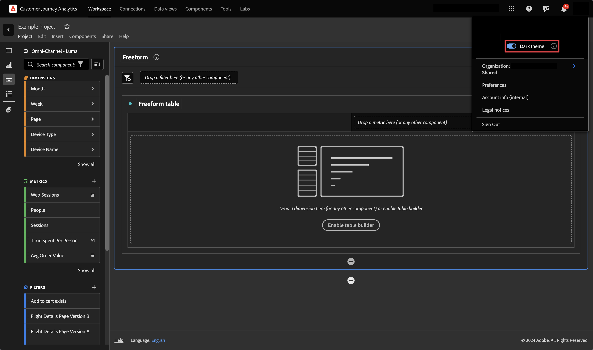

# Preferenze

Puoi gestire le impostazioni di Analysis Workspace e dei relativi componenti per tutti i nuovi progetti o pannelli creati. I progetti e i pannelli esistenti non sono interessati.

Guarda questo video per una breve panoramica delle preferenze:

>[!VIDEO](https://video.tv.adobe.com/v/332600/?quality=12)

## Aggiorna preferenze

1. In Adobe Analytics, passa alla pagina [!UICONTROL **Progetto**] pagina di destinazione, quindi seleziona [!UICONTROL **Preferenze**].

   

1. Per informazioni sulle preferenze disponibili in ogni scheda, continua con una delle sezioni seguenti di questo articolo:

   * [Preferenze generali](#general-preferences)

   * [Preferenze per i progetti](#project-preferences)

   * [Preferenze della tabella a forma libera](#freeform-table-preferences)

   * [Preferenze delle visualizzazioni](#visualizations-preferences)

## Preferenze generali

Puoi personalizzare le preferenze generali per tutti i nuovi progetti creati in Analysis Workspace. Per informazioni su come accedere a queste preferenze, consulta [Aggiorna preferenze](#update-preferences).

| Preferenza | Opzioni |
| --- | --- |
| Pagina di destinazione | Scegli quale pagina visualizzare come pagina predefinita quando accedi ad Adobe Analytics: <ul><li>Elenco progetti (impostazione predefinita)</li><li>Progetto vuoto</li><li>Progetto specifico selezionato da un elenco</li></ul> |
| Mostra suggerimenti | Visualizza i suggerimenti in una casella blu nell’area in basso a destra di Analysis Workspace. 
Questa opzione è attivata per impostazione predefinita.
 |
| Componenti visualizzati nei gruppi della barra a sinistra | Scegli il numero di componenti da visualizzare nel menu Componenti nella barra a sinistra. 
Se scegli 0, il componente non sarà più accessibile dalla barra a sinistra delle aree di lavoro.

Per impostazione predefinita, vengono visualizzati 5 componenti per ciascuno dei seguenti elementi:
 <ul><li>Dimensioni</li><li>Metriche</li><li>Filtri</li><li>Intervalli di date</li></ul> 
Per ulteriori informazioni sui componenti in Analysis Workspace, vedi [Panoramica dei componenti](/help/analyze/analysis-workspace/components/analysis-workspace-components.md).
 |

## Preferenze per i progetti

Puoi personalizzare le preferenze del progetto per tutti i nuovi progetti creati in Analysis Workspace. Per informazioni su come accedere a queste preferenze, consulta [Aggiorna preferenze](#update-preferences).

Alcune di queste preferenze possono essere personalizzate anche per singoli progetti, come descritto in [Panoramica del progetto](/help/analyze/analysis-workspace/build-workspace-project/freeform-overview.md).

Fai clic sui titoli delle preferenze collegati per ulteriori informazioni e contesto su ciascuna preferenza.

| Sezione | Preferenza | Opzioni |
| --- | --- | --- |
| **Visualizzazione** |  |  |
|  | [Densità di visualizzazione](https://experienceleague.adobe.com/docs/analytics/analyze/analysis-workspace/build-workspace-project/view-density.html?lang=it) | Scegli il contenuto da visualizzare sullo schermo riducendo la spaziatura verticale della barra a sinistra, tabelle a forma libera e tabelle a coorte. <ul><li>Compatta</li><li>Comoda</li><li>Espansa (impostazione predefinita)</li></ul> |
|  | [Tavolozza dei colori](https://experienceleague.adobe.com/docs/analytics/analyze/analysis-workspace/build-workspace-project/color-palettes.html?lang=it) | Scegli la palette di colori di visualizzazione utilizzata in Analysis Workspace. <ul><li>Tavolozze fornite da Adobe (impostazione predefinita)</li><li>Formattazione condizionale, palette </li><li>Tavolozza Su/Giù (divergenza)<li>Tavolozze personalizzate</li></ul> |
| **Dati** |  |  |
|  | [Suite di rapporti](https://experienceleague.adobe.com/docs/analytics/analyze/analysis-workspace/panels/panels.html?lang=it#report-suite) | Scegli da dove le tabelle e le visualizzazioni derivano i propri dati. <ul><li>Più recente (impostazione predefinita)</li><li>Suite di rapporti specifica selezionata da un elenco</li></ul> |
|  | [Calendario](https://experienceleague.adobe.com/docs/analytics/analyze/analysis-workspace/panels/panels.html?lang=it#calendar) | Seleziona da un elenco di: <ul><li>Intervalli forniti da Adobe (l’impostazione predefinita è Questo mese)</li><li>Intervalli definiti personalizzati</li></ul> |
|  | [Tipo di pannello](https://experienceleague.adobe.com/docs/analytics/analyze/analysis-workspace/panels/panels.html?lang=it) | <ul><li>A forma libera (impostazione predefinita)</li><li>Vuoto</li><li>Quick Insights</li></ul> |
|  | Conta istanze ripetute | Consente di specificare se conteggiare o meno, per i rapporti, le istanze ripetute. Ad esempio, questa impostazione (se attivata) tratta più visualizzazioni di pagina consecutive sulla stessa pagina di più visualizzazioni di pagina. Con questa opzione, vengono conteggiati come visualizzazione a pagina singola. 
**Nota:** Questa impostazione ha effetto solo su determinate metriche (ad esempio Visite a pagina singola) e non sulle visualizzazioni Flusso o Abbandono.
 |
|  | Formato dei numeri | <ul><li>1.000,00 (impsotazione predefinita)</li><li>1.000,00</li><li>1 000,00</li></ul> |
|  | Separatore CSV   | <ul><li>Virgola (impostazione predefinita)</li><li>Punto e virgola</li><li>Due punti</li><li>Barra verticale</li><li>Punto</li><li>Spazio</li><li>Scheda</li></ul> |
|  | Mostra annotazioni | Scegli se le annotazioni sono visibili nei progetti. Per ulteriori informazioni sulle annotazioni, consulta [Panoramica delle annotazioni](/help/analyze/analysis-workspace/components/annotations/overview.md). |

## Preferenze della tabella a forma libera

Puoi personalizzare le preferenze della tabella a forma libera per tutti i nuovi progetti creati in Analysis Workspace. Per informazioni su come accedere a queste preferenze, consulta [Aggiorna preferenze](#update-preferences).

Alcune di queste preferenze possono essere personalizzate anche per singole tabelle.

Fai clic sui titoli della sezione collegata per ulteriori informazioni e contesto sulle preferenze disponibili.

| Sezione | Preferenza | Opzioni |
| --- | --- | --- |
| **Tabella** |  |  |
|  | Tipo di tabella | <ul><li>Forma libera</li><li>Generatore di tabelle</li></ul> |
|  | Metrica tabella predefinita | <ul><li>Occorrenze</li><li>Visitatori univoci</li><li>Visite</li></ul> |
|  | Dimensione della tabella predefinita | Scegli tra Minuto, Ora, Giorno, Settimana, Mese, Trimestre o Anno. |
|  | Allinea date | Seleziona questa opzione per allineare le date di ogni colonna affinché inizino tutte sulla stessa riga. |
| **[Colonna](/help/analyze/analysis-workspace/visualizations/freeform-table/column-row-settings/column-settings.md)** |  |  |
|  | Testo a capo dell’intestazione | Consente di mandare automaticamente a capo il testo delle intestazioni nelle tabelle a forma libera, per agevolare la lettura delle intestazioni e la condivisione delle tabelle. Questa opzione è utile per la creazione di file PDF e per le metriche con nomi lunghi. È attivata per impostazione predefinita. |
|  | Mostra totali | Questo totale è in genere uguale o un sottoinsieme del [!UICONTROL Grand Total] (Totale complessivo). Riflette eventuali filtri applicati alla tabella a forma libera, inclusa l’opzione [!UICONTROL Include None] (Includi nessuna). |
|  | Mostra totali complessivi | Questo totale rappresenta tutti gli hit che sono stati raccolti, talvolta denominati “totale suite di rapporti”. Quando un segmento viene applicato a livello di pannello o all’interno della tabella a forma libera, questo totale si regola per riflettere tutti gli hit che corrispondono ai criteri del segmento. Il totale complessivo non è supportato per tabelle o raggruppamenti con [righe statiche](/help/analyze/analysis-workspace/visualizations/freeform-table/workspace-totals.md). |
|  | Mostra scintilla | Mostra o nascondi i grafici a linee nella parte inferiore del grafico. Quando è nascosta, la legenda diventa obsoleta e non fa più riferimento visivamente alle linee. |
|  | Numero | Determina se mostrare/nascondere il valore numerico di una metrica nella cella. Ad esempio, se la metrica è Visualizzazioni di pagina, il valore numerico corrisponde al numero di visualizzazioni di pagina per l’elemento riga. |
|  | Percentuale | Determina se mostrare o nascondere il valore percentuale di una metrica nella cella. Ad esempio, se la metrica è Visualizzazioni di pagina, il valore percentuale corrisponde al numero di visualizzazioni di pagina per l’elemento riga, diviso per il totale di visualizzazioni di pagina per la colonna.  Nota: per garantire una maggiore precisione, è possibile visualizzare percentuali superiori al 100%. Inoltre, abbiamo spostato il limite superiore al 1000% per assicurare che le colonne possano crescere anche in larghezza. |
|  | Mostra anomalie <!-- This setting was moved from the "Project" tab. this is already in the tool/docs under "Freeform table, But the doc doesn't give a definition. --> | Determina se eseguire il rilevamento delle anomalie sui valori di questa colonna. |
|  | Interpret zero as no value (Interpreta zero come nessun valore) | Per le celle con valore 0, determina se visualizzare 0 oppure la cella vuota. Questa funzione è particolarmente utile se si esaminano i dati quotidianamente e il mese in corso non è ancora terminato.  Invece di visualizzare valori 0 per le date future, è possibile sostituirli con delle celle vuote. Anche i grafici si adeguano a questa impostazione (ossia, se è stata selezionata, non visualizzano linee o barre con valori 0). |
|  | Informazioni di base | Determina se mostrare o nascondere tutta la formattazione della cella, inclusi il grafico a barre e la formattazione condizionale <ul><li>Grafico a barre</li> Visualizza un grafico a barre orizzontale che rappresenta il valore della cella rispetto al totale della colonna. <li>Formattazione condizionale</li>Per ulteriori informazioni sulla formattazione condizionale, vedere &quot;Formattazione condizionale&quot; in [Impostazioni colonna](/help/analyze/analysis-workspace/visualizations/freeform-table/column-row-settings/column-settings.md)</ul> |
|  | Anteprima cella | Mostra un’anteprima di ciascuna cella con le opzioni di formattazione attualmente selezionate attive. |
| **[Riga](/help/analyze/analysis-workspace/visualizations/freeform-table/column-row-settings/table-settings.md)** |  |  |
|  | Raggruppamento per posizione | Selezionare questa opzione se si desidera che il raggruppamento rimanga nella posizione dell’elemento anziché nell’elemento stesso. Per ulteriori informazioni sulle suddivisioni, consulta [Suddividere dimensioni](/help/analyze/analysis-workspace/components/dimensions/t-breakdown-fa.md). |
|  | Calcolo percentuale | <ul><li>Colonna</li><li>Riga</li></ul> |

## Preferenze delle visualizzazioni

Puoi aggiornare le preferenze di visualizzazione per tutti i nuovi progetti creati in Analysis Workspace. Per informazioni su come accedere a queste preferenze, consulta [Aggiorna preferenze](#update-preferences).

Alcune di queste preferenze possono essere personalizzate anche per le singole visualizzazioni.

Fai clic sui titoli della sezione collegata per ulteriori informazioni e contesto sulle preferenze disponibili.

| Sezione | Preferenza | Opzioni |
| --- | --- | --- |
| **Valori predefiniti generali** |  |  |
|  | Percentuali | Visualizza i valori in percentuale per tutte le visualizzazioni. |
|  | Visualizzazione legenda | Consente di nascondere il testo della legenda dettagliato per tutte le visualizzazioni. |
|  | Limite massimo elementi | Riduce il numero di elementi sull’asse X per tutte le visualizzazioni. Questo può essere utile se disponi di un set di dati di grandi dimensioni. |
|  | Visualizza asse doppio (se applicabile) | Applicabile solo in presenza di due metriche. È possibile avere un asse y a sinistra (per una metrica) e un altro a destra (per l’altra metrica). Questa funzione è utile quando le metriche tracciate hanno dimensioni molto diverse. |
|  | Normalizzazione (se applicabile) | Forza le metriche ad adeguarsi alle proporzioni. Questa funzione è utile quando le metriche tracciate hanno dimensioni molto diverse. |
|  | Ancoraggio asse Y su zero | Se tutti i valori rappresentati sul grafico sono uniformemente al di sopra dello zero, per impostazione predefinita la parte inferiore dell’asse y sarà NON-ZERO. Attivando questa opzione, l’asse y verrà forzata sullo zero (e il grafico verrà ridisegnato). |
|  | Consenti alle anomalie di ridimensionare l’asse Y | Se in un grafico sono presenti più metriche, è necessario passare il cursore sopra ogni anomalia per visualizzare la banda di affidabilità per tale metrica. Per rendere la visualizzazione più leggibile, l’intervallo di affidabilità del rilevamento delle anomalie non ridimensiona automaticamente l’asse y. Questa opzione consente all’intervallo di attendibilità di ridimensionare la visualizzazione. 
Per ulteriori informazioni, consulta [Visualizzare le anomalie in Analysis Workspace](/help/analyze/analysis-workspace/virtual-analyst/c-anomaly-detection/view-anomalies.md).
 |
| **[Linee](/help/analyze/analysis-workspace/visualizations/line.md)** |  |  |
|  | Percentuali | Visualizza i valori in percentuale per le visualizzazioni delle linee. |
|  | Visualizzazione legenda | Consente di nascondere il testo della legenda dettagliato per la visualizzazione delle linee. |
|  | Limite massimo elementi | Riduce il numero di elementi sull’asse X nella visualizzazione Linee. Questo può essere utile se disponi di un set di dati di grandi dimensioni. |
|  | Visualizza asse doppio (se applicabile) | Applicabile solo in presenza di due metriche. È possibile avere un asse y a sinistra (per una metrica) e un altro a destra (per l’altra metrica). Questa funzione è utile quando le metriche tracciate hanno dimensioni molto diverse. |
|  | Normalizzazione (se applicabile) | Forza le metriche ad adeguarsi alle proporzioni. Questa funzione è utile quando le metriche tracciate hanno dimensioni molto diverse. |
|  | Mostra asse x | Visualizza l&#39;asse x nel grafico a linee. |
|  | Mostra asse y | Visualizza l&#39;asse y sul grafico a linee. |
|  | Ancoraggio asse Y | Se tutti i valori rappresentati sul grafico sono uniformemente al di sopra dello zero, per impostazione predefinita la parte inferiore dell’asse y sarà NON-ZERO. Attivando questa opzione, l’asse y verrà forzata sullo zero (e il grafico verrà ridisegnato). |
|  | Mostra min | Sovrapponi un’etichetta di valore minimo per evidenziare rapidamente le valli in una metrica. Nota: I valori minimi sono derivati dai punti di dati visibili nella visualizzazione e non dall’insieme completo di valori all’interno di una dimensione. |
|  | Mostra max | sovrapponi un’etichetta di valore massimo per evidenziare rapidamente i picchi di una metrica. Nota: I valori massimi sono derivati dai punti di dati visibili nella visualizzazione e non dall’insieme completo di valori all’interno di una dimensione. |
|  | Mostra linea di tendenza | Mostra una tendenza di regressione o mobile alla serie di linee. Le linee di tendenza consentono di rappresentare un pattern più chiaro nei dati. |
| **[Coorte](/help/analyze/analysis-workspace/visualizations/cohort-table/t-cohort.md)** |  |  |
|  | Granularity (Granularità) | Per le visualizzazioni con tendenze, puoi modificare la granularità temporale (Giorno, Settimana, Mese, Trimestre o Anno). Questa modifica si applica anche alla tabella dell’origine dati. |
|  | Only show percent (Mostra solo percentuale) | Rimuove il valore del numero e visualizza solo la percentuale. |
|  | Round percent to nearest whole (Arrotonda percentuale a intero più prossimo) | Arrotonda il valore percentuale all’intero più vicino invece di visualizzare il valore decimale. |
|  | Mostra riga percentuale media | Inserisce una nuova riga nella parte superiore della tabella, quindi aggiunge la media dei valori all’interno di ogni colonna. |
|  | Anteprima coorte | Anteprima dell’aspetto della palette di colori nella visualizzazione coorte. |
|  | Palette coorte | La palette di colori utilizzata nella visualizzazione coorte. |
| **[Grafici combinati](/help/analyze/analysis-workspace/visualizations/combo-charts.md)** |  |  |
|  | Mostra asse X | Visualizza l&#39;asse x sul grafico combinato. |
|  | Mostra asse Y | Visualizza l&#39;asse y sul grafico combinato. |
|  | Visualizza le barre sulle linee | Mostra barbells sulle linee nei grafici Combo. |
| **[Riepilogo delle metriche chiave](/help/analyze/analysis-workspace/visualizations/key-metric.md)** |  |  |
|  | Tipo di visualizzazione sintetico | <ul><li>Modifica percentuale enfasi</li><li>Valore del numero di enfasi</li></ul> |
|  | Mostra sparkline | come o nascondere i grafici a linee nella parte inferiore del grafico. Quando è nascosta, la legenda diventa obsoleta e non fa più riferimento visivamente alle linee. |
|  | Mostra max e min sui grafici sparkline | Mostra valori minimi e massimi nei grafici a linee principali e di confronto. |
|  | Mostra confronto | Mostra i dati di confronto. Se nascosti, gli oggetti grafico a linee di confronto e di riepilogo delle modifiche saranno nascosti dalla visualizzazione. |
|  | Opzioni del valore numerico | In [!UICONTROL **Riepilogo della metrica chiave**] sezione <ul><li>Mostra variazione percentuale</li><li>Mostra differenza raw</li>Differenza grezza tra il valore totale della metrica nell’intervallo di date principale e l’intervallo di date secondario</ul> |
| **[Abbandono](/help/analyze/analysis-workspace/visualizations/fallout/configuring-fallout.md)** |  |  |
|  | Contenitore | Consente di passare da Visita a Visitatore per analizzare il percorso dei visitatori. Il valore predefinito è Visitatore. Queste impostazioni consentono di comprendere il coinvolgimento dei visitatori a livello dei singoli visitatori (attraverso più visite) o di limitare l’analisi a una singola visita. 
Sono disponibili le seguenti opzioni:
 <ul><li>Visita</li><li>Visitatore</li></ul> |
| **[Flusso](/help/analyze/analysis-workspace/visualizations/c-flow/create-flow.md)** |  |  |
|  | Contenitore | In [!UICONTROL **Flusso**] sezione <ul><li>Visita</li><li>Visitatore</li></ul> |
|  | Etichette a capo | Di norma, le etichette degli elementi di Flusso vengono troncate per risparmiare spazio sullo schermo, ma selezionando questa casella puoi rendere visibile l’intera etichetta. Impostazione predefinita = non selezionata. |
|  | Includi istanze ripetute | Le visualizzazioni di Flusso si basano su istanze di una dimensione. Questa impostazione offre la possibilità di includere o escludere istanze ripetute, ad esempio i ricaricamenti delle pagine. Tuttavia, le ripetizioni non possono essere rimosse dalle visualizzazioni Flusso che includono dimensioni con più valori, come listVars, listProp, s.product, eVar di merchandising, ecc. Impostazione predefinita = non selezionata. |
|  | Mostra descrizioni a comparsa | Determina se visualizzare le descrizioni comandi contenenti i dati dei nodi quando si passa il mouse sui singoli nodi all’interno di una visualizzazione di flusso. |
|  | Numero di colonne | Determina il numero di colonne desiderato nel diagramma di Flusso. |
|  | Elementi espansi per colonna | Il numero di elementi che desideri inserire in ogni colonna. |
| **Grafici sovrapposti** |  |  |
|  | 100% in pila | Applicata alle visualizzazioni Superfici sovrapposte, Barre sovrapposte o Barre orizzontali sovrapposte, questa impostazione converte il grafico in una visualizzazione con sovrapposizione 100%.  
Per ulteriori informazioni, consulta [Barre e barre sovrapposte](/help/analyze/analysis-workspace/visualizations/bar.md).
 |
| **[Istogramma](/help/analyze/analysis-workspace/visualizations/histogram.md)** |  |  |
|  | Numero di bucket | Scegli il numero di intervalli di dati (bucket) nella visualizzazione. Il numero massimo consentito è 50. 
Per ulteriori informazioni, consulta [Istogramma](/help/analyze/analysis-workspace/visualizations/histogram.md).
 |
|  | Metodo di conteggio | Scegli tra le seguenti opzioni: <ul><li>Hit</li><li>Visita</li><li>Visitatore</li></ul> 
Ad esempio, se utilizzato insieme alle visualizzazioni di pagina, puoi scegliere le visualizzazioni di pagina per visitatore, le visualizzazioni di pagina per visita o le visualizzazioni di pagina per hit. Per Hit, “Occorrenze” viene usato come metrica dell’asse y in una tabella a forma libera.
 |
| **[Mappa](/help/analyze/analysis-workspace/visualizations/map-visualization.md)** |  |  |
|  | Dimensione di plottaggio | <ul><li>Latitudine/longitudine mobile</li><li>Dimensione geografica</li></ul> |
|  | Tipo di mappa | <ul><li>Bolle</li><li>Mappa di calore</li></ul> |
|  | Tema colore | Scegli tra Coral, Rossi, Verdi, Blues, Heatmap e Positive/Negative. |
|  | Stile mappa | Scegli tra Basic, Streets, Bright, Light, Dark e Satellite. |
| **[Variazione di riepilogo](/help/analyze/analysis-workspace/visualizations/summary-number-change.md)** |  |  |
|  | Valore | <!-- Seem to be basically the same options as in "Number value options" --> <ul><li>Modifica percentuale</li><li>Differenza grezza</li></ul> |
|  | Percentuali | Visualizza i valori in percentuale per le visualizzazioni Variazione di riepilogo. |
|  | Visualizzazione legenda | Consente di nascondere il testo della legenda dettagliato per la visualizzazione Variazione di riepilogo . |
| **[Numero di riepilogo](/help/analyze/analysis-workspace/visualizations/summary-number-change.md)** |  |  |
|  | Percentuali | Visualizza i valori in percentuale per le visualizzazioni Summary Number (Numero riepilogo). |
|  | Visualizzazione legenda | Consente di nascondere il testo della legenda dettagliato per la visualizzazione Numero di riepilogo . |
|  | Valore sintetico per | Scegli tra Max, Min, Mean, Median e Sum. |
|  | Abbrevia il valore | In [!UICONTROL **Numero di riepilogo**] sezione |
| **[Mappa ad albero](/help/analyze/analysis-workspace/visualizations/treemap.md)** |  |  |
|  | Percentuali | Visualizza i valori in percentuale per le visualizzazioni Mappa ad albero. |
|  | Limite massimo elementi | Riduce il numero di elementi sull’asse X nella visualizzazione Mappa ad albero. Questo può essere utile se disponi di un set di dati di grandi dimensioni. |
| **[Venn](/help/analyze/analysis-workspace/visualizations/venn.md)** |  |  |
|  | Visualizzazione legenda | Consente di nascondere il testo della legenda dettagliato per la visualizzazione di Venn. |
| **[A dispersione](/help/analyze/analysis-workspace/visualizations/scatterplot.md)** |  |  |
|  | Percentuali | Visualizza i valori in percentuale per le visualizzazioni Dispersione. |
|  | Visualizzazione legenda | Consente di nascondere il testo della legenda dettagliato per la visualizzazione Dispersione. |
|  | Limite massimo elementi | Riduce il numero di elementi sull’asse X nella visualizzazione Dispersione. Questo può essere utile se disponi di un set di dati di grandi dimensioni. |
|  | Ancoraggio asse y a zero | Se tutti i valori rappresentati sul grafico sono uniformemente al di sopra dello zero, per impostazione predefinita la parte inferiore dell’asse y sarà NON-ZERO. Attivando questa opzione, l’asse y verrà forzata sullo zero (e il grafico verrà ridisegnato). |

## Preferenze aziendali

Puoi aggiornare le preferenze aziendali applicabili a tutti gli utenti e ai progetti all’interno della tua organizzazione. Per informazioni su come accedere a queste preferenze, consulta [Aggiorna preferenze](#update-preferences).

| Sezione | Preferenza | Opzioni |
| --- | --- | --- |
| **Scheda Rapporti** |  |  |
|  | Nascondi scheda Rapporti | Nasconde la scheda Report per tutti gli utenti dell’organizzazione. |

{style=&quot;table-layout:auto&quot;}

## Ripristina preferenze predefinite

È possibile ripristinare tutte le preferenze utente alle impostazioni predefinite del sistema. Questo non influisce sulle preferenze dell&#39;amministratore nella scheda Società.

Questa azione non può essere annullata.

1. In Adobe Analytics, seleziona [!UICONTROL **Componenti**] **>** [!UICONTROL **Preferenze**].

   

1. In alto a destra, seleziona **[!UICONTROL Restore defaults]**.

1. Quando richiesto, seleziona **[!UICONTROL Restore defaults]**.

## [!UICONTROL Dark theme]

Se preferisci uno sfondo scuro per l’interfaccia utente di Adobe Analytics, puoi passare a [!UICONTROL Dark theme].

1. Fai clic sull’icona utente Experience Cloud in alto a destra.

   

1. Sposta **[!UICONTROL Dark theme]** verso destra.

