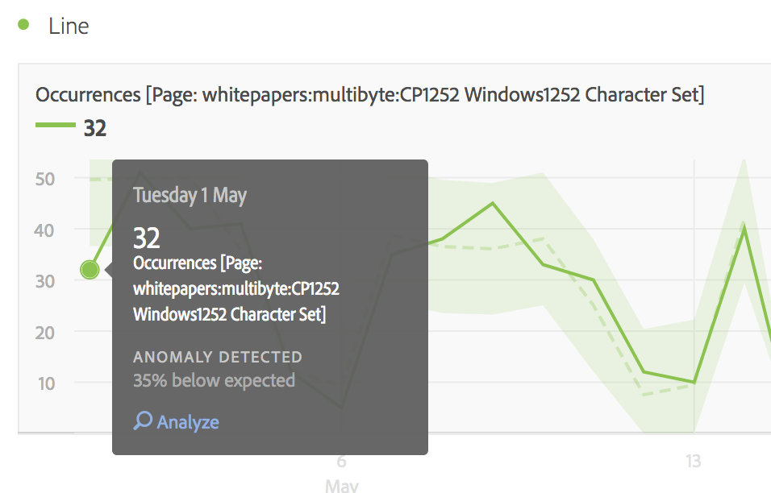

# Visualizzare le anomalie in Analysis Workspace

È possibile visualizzare le anomalie sotto forma di tabella o grafico a linee.

## View anomalies in a table {#section_869A87B92B574A38B017A980ED8A29C5}

In una tabella a forma libera su serie temporale, ogni riga viene ora segnalata con un punto esclamativo grigio scuro se viene rilevata un’anomalia nei dati.

La linea grigia verticale in ogni riga indica il valore previsto. Quando si passa il cursore sul punto esclamativo, viene indicato di quanto l’anomalia si scosta dal valore previsto (sotto forma di +/- %).

## View anomalies in a line chart {#section_7C1192AFDB4345A8A2CCFB3AE0C47D82}

Il grafico a linee mostra la banda di valori affidabili in verde chiaro e i valori anomali come punti bianchi. 

Se fai clic su un punto bianco, questo diventerà verde e mostrerà:

* la data in cui si è verificata l'anomalia
* il valore non elaborato dell'anomalia
* La percentuale superiore o inferiore al valore previsto rappresentata dalla linea verde continua.
* Collegamento Analizza per iniziare un’[Analisi contributi](../../../../analyze/analysis-workspace/virtual-analyst/contribution-analysis/ca-tokens.md).

Nei grafici a linee per più metriche, sono rappresentate solo le anomalie; quando si passa il mouse su un valore anomalo viene visualizzata la relativa banda di valori affidabili.

L’intervallo di attendibilità per il rilevamento delle anomalie non ridimensiona automaticamente l’asse Y di una visualizzazione per rendere potenzialmente più leggibile il grafico.

Un’opzione consente all’intervallo di attendibilità di ridimensionare il grafico. Just click the Settings (gear) icon and check **[!UICONTROL Allow Anomaly Detection to Scale Y Axis]**.

