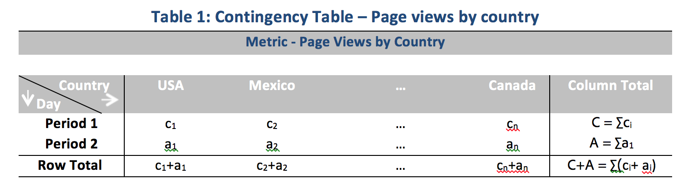

# Tecniche di statistica utilizzate nell’analisi dei contributi

L’analisi dei contributi è un potente processo di machine learning progettato per individuare i fattori che contribuiscono a un’anomalia osservata in Adobe Analytics. Questa funzione è utile per individuare aree di interesse o opportunità per ulteriore analisi, in modo molto più rapido di quanto sarebbe altrimenti possibile.

L’analisi dei contributi applica un algoritmo in due parti a ogni elemento dimensione disponibile per il rapporto Analisi contributo dell’utente. L’algoritmo opera in questo ordine:

1. Per ogni dimensione, elabora il test V di Cramer. Nell’esempio di seguito, considera una tabella di contingenza con visualizzazioni di pagina per paese per periodi di due anni:

   

   Nella tabella 1, il test V di Cramer può essere usato per misurare l’associazione tra le visualizzazioni di pagina per paese per il periodo 1 (storico) e per il periodo 2 (giorno in cui si è verificata l’anomalia). Un indice V di Cramer basso implica un basso livello di associazione. L’indice V di Cramer va da 0 (nessuna associazione) a 1 (associazione completa). La statistica V di Cramer può essere calcolata:

   

1. Per ogni elemento dimensione, il residuo di Pearson (PR) viene usato per misurare l’associazione tra la metrica anomala e ogni elemento di dimensione. Il PR segue una distribuzione normale standard, che consente all’algoritmo di confrontare i PR di due variabili casuali anche se le deviazioni non sono paragonabili. In pratica, l’errore non è noto ed è stimato con correzione a campione finita.

   Nell’esempio della tabella 1, il PR con correzione a campione finita per il paese 1 e il periodo di tempo 2 è dato da

   

   Qui,

   

   (È possibile ottenere una formula simile per il periodo di tempo 1.)

   Per i risultati finali, il punteggio di ogni elemento dimensione viene quindi ponderato dall’indice del V di Cramer e riportato in scala a un numero compreso tra 0 e 1 per ottenere il punteggio di contributo.

