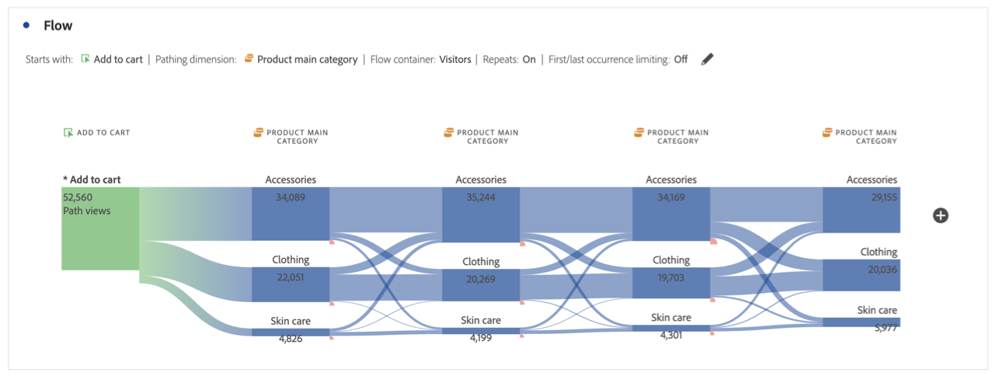

# Configurare una visualizzazione del flusso {#configure-a-flow-visualization}

>[!CONTEXTUALHELP]
>id="workspace_flow_startswith"
>title="Inizia con"
>abstract="Questo campo può essere impostato solo sulla build iniziale. Per aggiornare questo campo, selezionare **[!UICONTROL Reset]** per creare una nuova visualizzazione Flusso."

>[!CONTEXTUALHELP]
>id="workspace_flow_contains"
>title="Contiene"
>abstract="Questo campo può essere impostato solo sulla build iniziale. Per aggiornare questo campo, selezionare **[!UICONTROL Reset]** per creare una nuova visualizzazione Flusso."

>[!CONTEXTUALHELP]
>id="workspace_flow_endswith"
>title="Termina con"
>abstract="Questo campo può essere impostato solo sulla build iniziale. Per aggiornare questo campo, selezionare **[!UICONTROL Reset]** per creare una nuova visualizzazione Flusso."

>[!CONTEXTUALHELP]
>id="workspace_flow_pathingdimension"
>title="Dimensione percorso"
>abstract="Seleziona una dimensione da utilizzare come percorso per passare dal componente selezionato a quello precedente."

>[!CONTEXTUALHELP]
>id="workspace_flow_container"
>title="Contenitore Flusso"
>abstract="Seleziona il contenitore da utilizzare per visualizzare (i numeri per) il percorso."

>[!CONTEXTUALHELP]
>id="workspace_flow_include_repeats_disabled"
>title="Includi ripetizioni (disattivato)"
>abstract="Le ripetizioni non possono essere rimosse dalle visualizzazioni Flusso che includono dimensioni con più valori."

>[!CONTEXTUALHELP]
>id="workspace_flow_include_repeats_default"
>title="Includi ripetizioni"
>abstract="Le visualizzazioni di Flusso si basano su istanze di una dimensione. Questa impostazione consente di includere o escludere istanze ripetute, ad esempio: ricaricamenti della pagina."

>[!CONTEXTUALHELP]
>id="workspace_flow_limit_occurrence"
>title="Limita alla prima/ultima occorrenza"
>abstract="I risultati sono limitati ai percorsi quando il primo/ultimo punto di contatto è un punto di ingresso/uscita."

>[!CONTEXTUALHELP]
>id="workspace_flow_numberofcolumns"
>title="Numero di colonne"
>abstract="Questo campo può essere impostato solo sulla build iniziale. Per aggiornare questo campo, selezionare **[!UICONTROL Reset]** per creare una nuova visualizzazione Flusso."

>[!CONTEXTUALHELP]
>id="workspace_flow_itemsexpandedpercolumn"
>title="Elementi espansi per colonna"
>abstract="Questo campo può essere impostato solo sulla build iniziale. Per aggiornare questo campo, selezionare **[!UICONTROL Reset]** per creare una nuova visualizzazione Flusso."

>[!CONTEXTUALHELP]
>id="workspace_flow_resettoupdate"
>title="Reimposta per aggiornare"
>abstract="Questo campo può essere impostato solo sulla build iniziale. Per aggiornare questo campo, selezionare **[!UICONTROL Reset]** per creare una nuova visualizzazione Flusso."

Le visualizzazioni Flusso ti consentono di comprendere il percorso che deriva da o precede un evento di conversione specifico sul tuo sito web o sulla tua app. Questo traccia un percorso attraverso le dimensioni (e gli elementi dimensionali) o le metriche.

Le visualizzazioni Flusso consentono di configurare l’inizio o la fine del percorso desiderato o di analizzare tutti i percorsi che passano attraverso una dimensione o un elemento dimensionale.

## Utilizzo

1. Aggiungi una visualizzazione  **[!UICONTROL Flow]**. Consulta [Aggiungere una visualizzazione a un pannello](../freeform-analysis-visualizations.md#add-visualizations-to-a-panel).

1. Aggancia la visualizzazione Flusso tramite una delle tre opzioni seguenti:

   * [!UICONTROL **Inizia con**] (metriche, dimensioni o elementi), oppure
   * [!UICONTROL **Contiene**] (dimensioni o elementi), oppure
   * [!UICONTROL **Termina con**] (metriche, dimensioni o elementi)

   Ognuna di queste categorie viene visualizzata come *zona di rilascio*. Puoi popolare la zona di rilascio in tre modi:

   * Utilizza il menu a discesa per selezionare metriche o dimensioni.
   * Trascina dimensioni o metriche dal pannello a sinistra.
   * Inizia a digitare il nome di una dimensione o metrica, quindi selezionala quando viene visualizzata nell’elenco a discesa.

   >[!IMPORTANT]
   >
   >Impossibile utilizzare le metriche calcolate nei campi **[!UICONTROL Starts with]** o **[!UICONTROL Ends with]**.

1. Se scegli una metrica, devi anche fornire un [!UICONTROL **percorso Dimension**] da utilizzare come percorso che porta o proviene dal componente selezionato, come mostrato di seguito. Il valore predefinito è [!UICONTROL **Pagina**].

   

1. (Facoltativo) Seleziona **[!UICONTROL Show advanced settings]** per configurare una delle opzioni seguenti:

   | Impostazione | Descrizione |
   | --- | --- |
   | **[!UICONTROL Wrap labels]** | Di norma, le etichette degli elementi di Flusso vengono troncate per risparmiare spazio sullo schermo, ma selezionando questa casella puoi rendere visibile l’intera etichetta.  Impostazione predefinita = non selezionata. |
   | **[!UICONTROL Include repeat instances]** | Le visualizzazioni di Flusso si basano su istanze di una dimensione. Questa impostazione consente di includere o escludere istanze ripetute, ad esempio i ricaricamenti delle pagine. Tuttavia, le ripetizioni non possono essere rimosse dalle visualizzazioni Flusso che includono dimensioni con più valori, come listVars, listProps, s.product, eVars di merchandising, ecc. 
Questa opzione è disabilitata per impostazione predefinita.
 |
   | **[!UICONTROL Limit to first/last occurrence]** | Limita i percorsi ai percorsi che iniziano o terminano con la prima o l’ultima occorrenza di una dimensione, elemento o metrica. Per una spiegazione più dettagliata, vedi [Limita alla prima/ultima occorrenza](#example-scenario-for-limit-to-firstlast-occurrence). |
   | **[!UICONTROL Number of columns]** | Determina il numero di colonne desiderato nel diagramma Flusso. Puoi indicare un massimo di 5 colonne. |
   | **[!UICONTROL Items expanded per column]** | Il numero di elementi che desideri inserire in ogni colonna. È possibile specificare un massimo di 10 elementi espansi per colonna. |
   | **[!UICONTROL Flow container]** | È possibile passare da **[!UICONTROL Sessions]** a **[!UICONTROL Person]** per analizzare i percorsi. Queste impostazioni consentono di comprendere il coinvolgimento di una persona a livello personale (tra sessioni) o di vincolare l’analisi a una singola sessione. |

   >[!IMPORTANT]
   >
   >La combinazione di **[!UICONTROL Number of columns]** e **[!UICONTROL Items expanded per column]** determina il numero di richieste sottostanti necessarie per creare la visualizzazione del flusso. Più alti sono questi numeri, più tempo sarà necessario per eseguire il rendering di una visualizzazione.

1. Seleziona **[!UICONTROL Build]**.

### Esempio

Supponiamo di voler tracciare il percorso seguito dagli utenti per le pagine più popolari del sito e da esse.

1. Crea una visualizzazione di flusso come descritto in precedenza.
1. Trascina la dimensione [!UICONTROL **Pagina**] nel campo **[!UICONTROL Contains]**, quindi seleziona [!UICONTROL **Genera**].
1. La visualizzazione Flusso si sviluppa, con la pagina più visualizzata visibile nel nodo principale, al centro della visualizzazione. Vengono visualizzate anche le pagine principali che conducono a quella pagina (a sinistra del nodo attivo) e le pagine principali che precedono quella pagina (a destra del nodo attivo).
1. Analizzare i dati nel flusso, come descritto in [Configurazione](#configure).

## Configurare

Nella parte superiore delle visualizzazioni viene visualizzato un riepilogo della configurazione Flusso. I percorsi nel diagramma sono proporzionali. I percorsi con maggiore attività sono più spessi.

Per approfondire ulteriormente i dati, hai a disposizione diverse opzioni:

* Il diagramma di flusso è interattivo. Passa il cursore del mouse sul diagramma per cambiare i dettagli visualizzati.

* Quando selezioni un nodo nel diagramma, vengono visualizzati i dettagli per tale nodo. Seleziona nuovamente il nodo per comprimerlo.

  

* Puoi filtrare una colonna per visualizzare solo alcuni risultati, ad esempio puoi includere ed escludere, specificare criteri, ecc.

* Seleziona  a sinistra o a destra per espandere una colonna.

* Per personalizzare l&#39;output, utilizzare le opzioni del [menu di scelta rapida](#context-menu).

* Per modificare il flusso o ricrearlo con opzioni diverse, seleziona  accanto al riepilogo della configurazione.

## Filtro

Sopra ogni colonna viene visualizzato un filtro  al passaggio del mouse. Selezionando il filtro, si ottiene la stessa finestra di dialogo del filtro presente nella tabella a forma libera. Vedi [Filtro e ordinamento](freeform-table/../../freeform-table/filter-and-sort.md).

* Utilizzare **[!UICONTROL Show advanced]** per configurare le impostazioni avanzate in modo da includere o escludere determinati criteri con un elenco di operatori. Per ulteriori informazioni, vedere [Filtri e ordinamento](../freeform-table/filter-and-sort.md).
* Dopo aver filtrato una colonna, tale colonna specifica riflette il filtro. Un  blu indica che la colonna è filtrata.  Il filtro riduce la colonna in modo da mostrare solo l’elemento consentito nel filtro. In alternativa, vengono rimossi tutti gli elementi, tranne quello desiderato nel filtro.
* Tutte le colonne upstream e downstream persistono, purché i dati fluiscano nei nodi rimanenti.
* Per rimuovere un filtro, selezionare  per aprire il menu dei filtri. Rimuovi i filtri applicati e seleziona **[!UICONTROL Save]**. Il flusso dovrebbe tornare allo stato precedente non filtrato.

## Menu di scelta rapida

Utilizza un menu contestuale su qualsiasi nodo della visualizzazione del flusso con le seguenti opzioni:

| Opzione | Descrizione |
|--- |--- |
| **[!UICONTROL Focus on this node]** | Rende attivo il nodo selezionato. Il nodo attivo è visualizzato al centro del diagramma di flusso. |
| **[!UICONTROL Start over]** | Tornare al generatore di diagrammi a forma libera, dove è possibile creare un nuovo diagramma di flusso. |
| **[!UICONTROL Create a filter for this path]** | Crea un filtro. Questa selezione ti porta al Generatore di filtri, dove puoi configurare il nuovo filtro. |
| **[!UICONTROL Breakdown]** | Suddivide il nodo per dimensioni, metriche o ora. |
| **[!UICONTROL Filter column]** | Vengono visualizzate le stesse opzioni di filtro disponibili nella tabella a forma libera. Per ulteriori informazioni sulle opzioni disponibili, vedere la sezione &quot;Applicare un filtro semplice o avanzato a una tabella&quot; in [Filtrare e ordinare le tabelle](/help/analyze/analysis-workspace/visualizations/freeform-table/filter-and-sort.md). |
| **[!UICONTROL Exclude item]** o **[!UICONTROL Restore excluded items]** | Rimuove un nodo specifico dalla colonna e lo crea automaticamente come filtro nella parte superiore della colonna. Per ripristinare l&#39;elemento escluso, dal menu di scelta rapida selezionare **[!UICONTROL Restore Excluded Item]**. Puoi anche aprire il filtro nella parte superiore della colonna e rimuovere la casella con l’elemento appena escluso. |
| **[!UICONTROL Trend]** | Crea un diagramma di tendenza per il nodo. |
| **[!UICONTROL Show next column]** / **[!UICONTROL Show previous column]** | Mostra la colonna successiva (destra) o precedente (sinistra) della visualizzazione. |
| **[!UICONTROL Hide colum]**n | Nasconde la colonna selezionata dalla visualizzazione. |
| **[!UICONTROL Expand entire column]** | Espande una colonna per mostrare tutti i nodi. Per impostazione predefinita, vengono visualizzati solo i primi cinque nodi. |
| **[!UICONTROL Create audience from selection]** | Crea un pubblico in base alla colonna selezionata. |
| **[!UICONTROL Collapse entire column]** | Nasconde tutti i nodi di una colonna. |

## Limita alla prima/ultima occorrenza

Quando utilizzi questa opzione, tieni presente che:

* **[!UICONTROL Limit to first/last occurrence]** conta solo la prima/ultima occorrenza della serie. Tutte le altre occorrenze del criterio **[!UICONTROL Starts with]** o **[!UICONTROL Ends with]** vengono ignorate.
* Se utilizzata con un flusso **[!UICONTROL Starts with]**, è inclusa solo la prima occorrenza corrispondente ai criteri di inizio.
Nell&#39;esempio seguente sono incluse **tutte** le occorrenze di *Aggiungi al carrello* e *Categoria principale prodotto* in ogni passaggio del flusso.
  

  Nell&#39;esempio seguente, sono incluse solo le **prime** occorrenze di *Aggiungi al carrello* e *Categoria principale prodotto* in ogni passaggio del flusso.
  
* Se utilizzata con un flusso **[!UICONTROL Ends with]**, è inclusa solo l&#39;ultima occorrenza corrispondente ai criteri di fine.
Nell&#39;esempio seguente sono incluse **tutte** le occorrenze di *categoria principale prodotto* e *Aggiungi al carrello* in ogni passaggio del flusso.
  

  Nell&#39;esempio seguente, sono incluse solo le **ultime** occorrenze di *Categoria principale prodotto* e *Aggiungi al carrello* in ogni passaggio del flusso.
  
* La serie utilizzata varia in base al contenitore. Se si utilizza il contenitore **[!UICONTROL Person]**, la serie di eventi corrisponde alla sessione. Se utilizzi il contenitore **[!UICONTROL Session]**, la serie di eventi sono tutti gli eventi per un determinato utente nell&#39;intervallo di date specificato.
* L&#39;opzione **[!UICONTROL Limit to first/last occurrence]** può essere configurata nelle impostazioni avanzate quando si utilizza una metrica o un elemento di Dimension nei campi **[!UICONTROL Starts with]** o **[!UICONTROL Ends with]**.

>[!MORELIKETHIS]
>
>[Aggiungere una visualizzazione a un pannello](/help/analyze/analysis-workspace/visualizations/freeform-analysis-visualizations.md#add-visualizations-to-a-panel)
>[Impostazioni di visualizzazione](/help/analyze/analysis-workspace/visualizations/freeform-analysis-visualizations.md#settings)
>[Menu di scelta rapida della visualizzazione](/help/analyze/analysis-workspace/visualizations/freeform-analysis-visualizations.md#context-menu)
>

<!--
## Create a flow visualization {#configure}

1. Add a blank panel to your project and click the visualizations icon in the left rail. 

   Or
   
   Add a visualization in any of the ways described in the "Add visualizations to a panel" section in [Visualizations overview](/help/analyze/analysis-workspace/visualizations/freeform-analysis-visualizations.md).

1. Anchor your Flow visualization using one of the following options:

   * [!UICONTROL **Starts with**] (metrics, dimensions, or items), or
   * [!UICONTROL **Contains**] (dimensions, or items), or
   * [!UICONTROL **Ends with**] (metrics, dimensions, or items)

   Each of these categories is shown onscreen as a "drop zone." You can populate the drop zone in 3 ways:

   * Use the drop-down menu to select metrics or dimensions.
   * Drag dimensions or metrics from the left rail.
   * Begin typing the name of a dimension or metric, then select it when it appears in the drop-down list.

   >[!IMPORTANT]
   >
   >Calculated metrics cannot be used in the  **[!UICONTROL Starts with]** or **[!UICONTROL Ends with]** fields.

1. If you choose a metric, you also need to provide a [!UICONTROL **Pathing Dimension**] to use as your path leading to or coming from your selected component, as shown here. The default is [!UICONTROL **Page**].

   

1. (Optional) Select **[!UICONTROL Show advanced settings]** to configure any of the following options:

   

   | Setting | Description |
   | --- | --- |
   | **[!UICONTROL Wrap labels]** | Normally, the labels on the Flow elements are truncated to save screen real estate, but you can make the entire label visible by checking this box.  Default = unchecked. |
   | **[!UICONTROL Include repeat instances]** | Flow visualizations are based on instances of a dimension. This setting gives you the option to include or exclude repeated instances, e.g. Page reloads. However, repeats cannot be removed from Flow visualizations that include multi-valued dimensions, such as listVars, listProps, s.product, merchandising eVars, etc. 
This option is disabled by default.
 |
   | **[!UICONTROL Limit to first/last occurrence]** | Limit paths to those that start/end with the first/last occurrence of a dimension/item/metric. See the section below, [Example scenario for 'limit to first/last occurrence'](#example-scenario-for-limit-to-firstlast-occurrence), for a more detailed explanation. |
   | **[!UICONTROL Number of columns]** | The number of columns you want in your Flow diagram. You can specify a maximum of 5 columns. |
   | **[!UICONTROL Items expanded per column]** | The number of items you want in each column. You can specify a maximum of 10 items expanded per column.  |
   | **[!UICONTROL Flow container]** | <ul><li>Visit</li><li>Visitor</li></ul> Lets you switch between Visit and Visitor to analyze visitor pathing. These settings help you understand visitor engagement at the visitor level (across visits), or constrain the analysis to a single visit.|

   >[!IMPORTANT]
   >
   >The combination of **[!UICONTROL Number of columns]** and **[!UICONTROL Items expanded per column]** determine the number of underlying requests required to create the flow visualization. The higher those numbers, the longer it takes to render a visualization.

1. Select **[!UICONTROL Build]**.

>[!INFO]
>
>**Example:** Suppose that you want to trace the path that users took both to and from the most popular pages on your site.
>
>To do this, you would
> 
>1. Begin creating a flow visualization as described above.
>1. Drag the [!UICONTROL **Page**] dimension into the **[!UICONTROL Contains]** field, then select [!UICONTROL **Build**].
>1. The Flow visualization builds with the most-viewed page visible in the focus node in the center of the visualization. You also see the top pages leading into that page (to the left of the focus node) as well as the top pages leading out of that page (to the right of the focus node).
>1. Analyze data in the flow, as described in [View and change the Flow output](#view-and-change-the-flow-output).

## View and change the Flow output {#output}

A summary of the Flow configuration appears at the top of the diagram. The thickness of a path in the diagram is proportional to its activity, with paths with more activity appearing thicker than those with less activity.

To drill down further into the data, you have several options:

* The flow diagram is interactive. Mouse over the diagram to change the details that are shown.

* When you select on a node in the diagram, the details for that node appear. Select on the node again to collapse it.

   

* You can filter a column to display only certain results, such as including and excluding, specifying criteria, and so forth.

* Select the plus sign (+) on the left to expand a column.

* Use the right-click options explained below to further customize the output.

* Select the pencil icon next to the configuration summary to further edit the flow or rebuild it with different options.

* You can also export and further analyze your Flow diagram as part of a project's .CSV file by going to **[!UICONTROL Project]** > **[!UICONTROL Download CSV]**.

## Filtering

Above each column, a filter appears when you hover over it. By selecting the filter, you get the same filter dialog that exists in the Freeform table today. This filter works the same as it does in the Freeform table.

* Use advanced settings to include or exclude certain criteria with our list of operators.
* Once you have filtered an item from the list, that specific column will reflect the filtering. (The filter either reduces it to only show the item allowed in the filter, or it removes all items except for the one item you want in the filter.
* All downstream and upstream columns should persist, as long as there is data flowing into the remaining nodes.
* Once applied, the filter icon appears in blue above the column it is filtering.
* To remove a filter, select the filter icon to open the filter menu. Remove any filters applied and then select **[!UICONTROL Save]**. The flow should return to its previous, unfiltered state.

## Right-click options {#right-click}

| Option | Description |
|--- |--- |
| [!UICONTROL Start over] | Returns you to the Freeform diagram builder, where you can build a new Flow diagram. |
| [!UICONTROL Create segment for this path] | Create a segment. This takes you into the Segment Builder, where you can configure the new segment. |
| [!UICONTROL Breakdown] | Break the node down by available Dimensions, Metrics, or Time. |
| [!UICONTROL Trend] | Create a trended diagram for the node. |
| Show next column / Show previous column | Reveals the next (right) or previous (left) column of the visualization. |
| Hide column | Hides the selected column from the visualization. | 
| [!UICONTROL Expand entire column] | Expand a column to show all nodes. By default, only the top five nodes display. |

## Example scenario for 'limit to first/last occurrence'

When using this option, keep in mind that:

* **[!UICONTROL Limit to first/last occurrence]** counts only the first/last occurrence in the series. All other occurrences of the **[!UICONTROL Starts with]** or **[!UICONTROL Ends with]** criteria are discarded.
* If used with a **[!UICONTROL Starts with]** flow, only the first occurrence that matches the start criteria is included.
* If used with an **[!UICONTROL Ends with]** flow, only the last occurrence that matches the end criteria will be included.
* The series used differs based on the container. If using the **[!UICONTROL Visit]** container, the series of hits will be the session. If using the **[!UICONTROL Visitor]** container, the series of hits will be all the hits for a given user in the provided date range.
* The **[!UICONTROL Limit to first/last occurrence]** option can be configured in the advanced settings when using a Metric or Dimension Item in the "Starts with" or "Ends with" fields.

Example series of hits:

Home > Products > Add to cart > Products > Add to Cart > Billing > Order Confirmation

### Consider a flow analysis using the following settings:

* Start with[!UICONTROL  Add to cart] (Dimension Item)
* [!UICONTROL Page] pathing dimension
* [!UICONTROL Visit] container

If **[!UICONTROL Limit to first/last occurrence]** is *disabled*, then this single series of hits counts 2 occurrences of "Add to Cart".
Expected Flow Output:
"Add to Cart" (2) —> "Products" (1)
                  -> "Billing" (1)

However, if **[!UICONTROL Limit to first/last occurrence]** is *enabled*, only the first occurrence of "Add to cart" is included in the analysis.
Expected Flow Output:
"Add to Cart" (1) —> "Products" (1)

### Consider the same series of hits but using the following settings:

* Ends with [!UICONTROL Add to cart] (Dimension Item)
* [!UICONTROL Page] pathing dimension
* [!UICONTROL Visit] container

If **[!UICONTROL Limit to first/last occurrence]** is *disabled*, then this single series of hits would count 2 occurrences of "Add to Cart".
Expected Flow Output:
"Products" (2) <— "Add to cart" (2)

However, if **[!UICONTROL Limit to first/last occurrence]** is *enabled*, only the last occurrence of [!UICONTROL Add to cart] would be included in the analysis.
Expected Flow Output:
"Products" (1) <— "Add to cart" (1)

-->