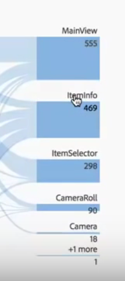

# Flussi interdimensionali

Un flusso interdimensionale consente di esaminare i percorsi seguiti dai clienti attraverso varie dimensioni.

Un’etichetta di dimensione all’inizio di ogni colonna Flusso facilita l’utilizzo di più dimensioni in una visualizzazione di flusso.

Verranno esaminati due casi di utilizzo: per un’app e per un sito Web.

## Caso di utilizzo 1: app {#section_3D31D37B9C9F4134AE46C96291E41294}

La dimensione [!UICONTROL Action Name] (Nome azione) è stata aggiunta al flusso, e il primo elemento restituito è [!UICONTROL ItemAdded]:

Per scoprire l’interazione tra le schermate o pagine e le azioni dell’app, puoi trascinare la Dimensione pagina in più luoghi, a seconda di cosa ti interessa:

* Trascinala a una delle estremità della zona di rilascio (all’interno del rettangolo con bordo nero che viene visualizzato) per **sostituire** i primi risultati di tale estremità:

    

* Trascinala nello spazio bianco alla fine (osserva la parentesi quadra nera) per **aggiungere** altri dati alla visualizzazione:

   

Quando si sostituisce l’elemento ItemScaled nella colonna a destra con la Dimensione pagina, si ottiene questo risultato. Il primo risultato ora diventa il primo risultato per la Dimensione pagina:

Ora puoi vedere quanti clienti si stanno spostando tra le varie azioni e pagine. Per esplorare ulteriormente il flusso, fai clic sui vari nodi:

Quando si aggiunge un’altra dimensione Nome azione alla fine della visualizzazione, si ottiene questo risultato:

Questo ti permette di ottenere informazioni approfondite e di apportare eventuali modifiche all’app che stai analizzando.

## Caso di utilizzo 2: web {#section_8D55983FA0C84926995270052AE01CD8}

Questo caso di utilizzo mostra come individuare le campagne che generano il maggior numero di accessi al sito Web.

Trascina la dimensione Nome campagna in un nuovo flusso:

Per vedere le pagine per le quali queste campagne generano traffico, trascina la dimensione Pagina a destra dei risultati del flusso per aggiungere altri dati alla visualizzazione:

