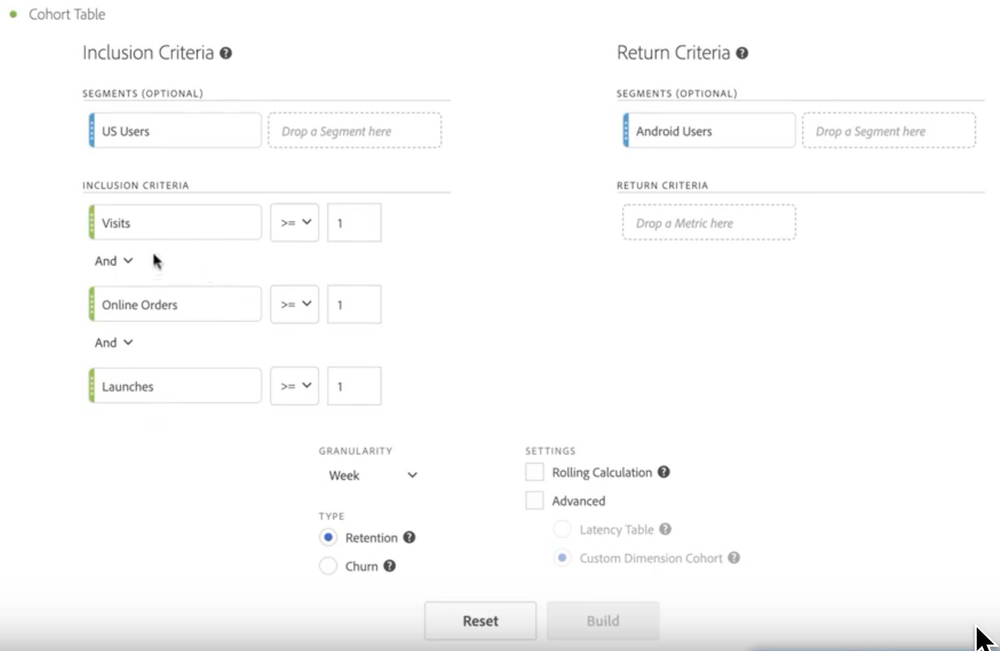

# Configurare un rapporto di [!UICONTROL Cohort Analysis]

Creare una coorte ed eseguire un rapporto di [!UICONTROL Cohort Analysis] in Analysis Workspace.

1. In Analysis Workspace, fai clic sull’icona **[!UICONTROL Visualizations]** nella barra a sinistra e trascina un **[!UICONTROL Cohort Table]** nell’area di lavoro.

   

1. Definisci **[!UICONTROL Inclusion Criteria]**, **[!UICONTROL Return Criteria]**, **[!UICONTROL Cohort Type]** e **[!UICONTROL Settings]** come definito nella tabella seguente.

| Elemento | Descrizione |
|--- |--- |
| **[!UICONTROL Inclusion Criteria]** | Puoi applicare fino a 10 segmenti di inclusione e fino a 3 metriche di inclusione. Il dato definisce se un utente viene incluso in una coorte. Ad esempio, se il dato di inclusione è Orders (Ordini), solo gli utenti che hanno effettuato un acquisto durante l’intervallo di tempo dell’analisi della coorte saranno inclusi nella coorte iniziale. L’operatore predefinito tra più metriche è AND, ma è possibile cambiarlo in OR. Inoltre, è possibile aggiungere alle metriche un filtro numerico. Ad esempio: “Visite >= 1”.  |
| **[!UICONTROL Return Criteria]** | Puoi applicare fino a 10 segmenti di ritorno e fino a 3 metriche di ritorno. Questa metrica indica se l’utente è stato mantenuto (Retention, fidelizzazione) o meno (Churn, abbandono). Ad esempio, se la metrica di ritorno è Visualizzazioni video, saranno considerati fidelizzati solo gli utenti che hanno visualizzato un video durante i periodi successivi (dopo il periodo in cui sono stati aggiunti a una coorte). Un altro dato che quantifica la fidelizzazione è Visits (Visite). |
| **[!UICONTROL Granularity]** | Granularità temporale per Day, Week, Month, Quarter, o Year (Giorno, Settimana, Mese, Trimestre, Anno). |
| **[!UICONTROL Type]** | **[!UICONTROL Retention]**, impostazione predefinita: una coorte di fidelizzazione misura se le coorti dei visitatori ritornano a visitare la proprietà digitale nel tempo. Si tratta della coorte standard che abbiamo sempre usato e indica il comportamento degli utenti in merito a ritorno e visite ripetute. Nella tabella, una coorte [!UICONTROL Retention] è indicata in verde. **[!UICONTROL Churn]**: una coorte di abbandono (anche detta di “perdita” o “attrito”) misura il modo in cui le coorti di visitatori abbandonano la proprietà digitale nel tempo. Abbandono = 1 - Fidelizzazione. [!UICONTROL Churn] è utile per misurare la fedeltà e le opportunità, in quanto mostra con quale frequenza i clienti non ritornano. Utilizzando la coorte di abbandono puoi analizzare e individuare specifiche aree su cui concentrarti, ovvero i segmenti di coorte che richiedono maggiore attenzione. Nella tabella, una coorte [!UICONTROL Churn] è indicata in rosso, in modo analogo all’abbandono nella visualizzazione **[!UICONTROL Flow]**.  |
| **[!UICONTROL Settings]** | **[!UICONTROL Rolling Calculation]**: consente di calcolare il livello di fidelizzazione o abbandono in base alla colonna precedente, non alla colonna Included (che è l’impostazione predefinita). [!UICONTROL Rolling Calculation] cambia il metodo di calcolo per i periodi di “ritorno”. Con il calcolo normale vengono trovati in modo indipendente gli utenti che rispondono ai criteri di “ritorno” e che rientrano nel periodo di inclusione, a prescindere dalla loro inclusione nella coorte per il periodo precedente. Il [!UICONTROL Rolling Calculation], invece, individua gli utenti che rispondono ai criteri di “ritorno” e che rientravano nel periodo precedente. Il [!UICONTROL Rolling Calculation], quindi, filtra e incanala gli utenti che continuano a rispondere ai requisiti di “ritorno” per più periodi di tempo. I criteri di [!UICONTROL Return] vengono applicati a ogni periodo precedente al periodo selezionato.   **[!UICONTROL Latency Table]**: una tabella di [!UICONTROL Latency] misura il tempo trascorso prima e dopo il verificarsi dell’evento di inclusione. La [!UICONTROL Latency] è utile per l’analisi pre/post. Ad esempio, se in previsione del lancio di un prodotto o di una campagna si desidera tenere traccia del comportamento prima del lancio e ottenere le prestazioni successive al lancio, la tabella di [!UICONTROL Latency] visualizza a confronto il comportamento prima e dopo il lancio, per vederne l’impatto diretto. Le celle di pre-inclusione nella tabella di [!UICONTROL Latency] sono calcolate in base agli utenti che rispondono ai criteri di [!UICONTROL Inclusion] nel periodo di inclusione e quindi rispondono ai criteri di [!UICONTROL Return] nei periodi precedenti al periodo di inclusione. Tieni presente che non è possibile usare insieme le tabelle di [!UICONTROL Latency] e le coorti con [!UICONTROL Custom Dimension].  **[!UICONTROL Custom Dimension Cohort]**: consente di creare coorti in base alla dimensione selezionata, anziché in base al tempo (impostazione predefinita). Molti clienti vogliono poter analizzare le coorti in base a fattori diversi dal tempo. Con la nuova funzione per coorti con dimensione personalizzata hai la flessibilità di creare le coorti in base alle dimensioni che rispondono alle tue esigenze. Puoi usare dimensioni quali canale di marketing, campagna, prodotto, pagina, regione, o qualsiasi altra dimensione in Adobe Analytics per mostrare in che modo la fidelizzazione cambia, in base a valori diversi di tali dimensioni. La definizione del segmento di coorte con [!UICONTROL Custom Dimension] applica l’elemento dimensionale solo come parte del periodo di inclusione e non come parte della definizione di ritorno.  Dopo aver scelto l’opzione [!UICONTROL Custom Dimension] Cohort, puoi trascinare nella zona di rilascio la dimensione che ti interessa. Puoi quindi confrontare elementi con dimensione simile in uno stesso periodo di tempo. Ad esempio, puoi confrontare le prestazioni per diverse città, diversi prodotti, diverse campagne ecc. Vengono restituiti i primi 14 elementi per la dimensione in questione. Per visualizzare solo specifici elementi per la dimensione scelta, puoi anche usare un filtro, passando il cursore a destra della dimensione che hai trascinato. Non è possibile utilizzare una coorte con [!UICONTROL Custom Dimension] con la funzione tabella di [!UICONTROL Latency].  |

1. Per regolare gli elementi **[!UICONTROL Cohort Table Settings]**, fai clic sull’icona a forma di ingranaggio.

| Impostazione | Descrizione |
| Only show percent (Mostra solo percentuale) | Rimuove il valore del numero e visualizza solo la percentuale. || Round percent to nearest whole (Arrotonda al valore percentuale più vicino) | Arrotonda il valore percentuale al numero intero più vicino invece di mostrare il valore decimale. |
| Show Average Percent Row (Mostra riga percentuale media) | Inserisce una nuova riga nella parte superiore della tabella, quindi aggiunge la media dei valori all’interno di ogni colonna. |

## Creare il rapporto di [!UICONTROL Cohort Analysis]

1. Fai clic su **[!UICONTROL Build]**.

   

   Il rapporto mostra i visitatori che hanno effettuato un ordine (colonna *`Included`*) e che sono ritornati al sito nelle visite successive. La riduzione delle visite nel tempo consente di individuare i problemi e di prendere delle contro misure.
1. (Facoltativo) Crea un segmento da una selezione.

   Seleziona le celle (contigue o non contigue), quindi fai clic con il pulsante destro del mouse e scegli > **[!UICONTROL Create Segment From Selection]**.

1. In [Segment Builder](/help/components/segmentation/segmentation-workflow/seg-build.md) (Generatore di segmenti), modifica ulteriormente il segmento, quindi fai clic su **[!UICONTROL Save]**.

   Il segmento salvato è disponibile per l’utilizzo nel pannello [!UICONTROL Segment] di [!UICONTROL Analysis Workspace].
1. Rinomina e salva il progetto della coorte.
1. (Facoltativo) [Cura e condividi](/help/analyze/analysis-workspace/curate-share/curate.md) i componenti dei progetti.

   >[!NOTE]
   >
   >Prima di curare un progetto è necessario salvarlo.
