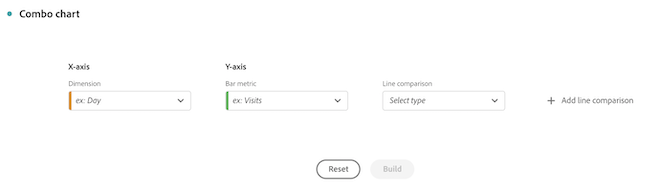

# Grafico combinato

La [!UICONTROL Combo chart] visualizzazione consente di creare rapidamente una visualizzazione di confronto senza dover prima creare una tabella. Puoi visualizzare chiaramente le tendenze nei dati con una combinazione di linee e barre.

Utilizza un [!UICONTROL Combo chart] per

* Confrontare gli ordini di questa settimana con quelli dello stesso momento lo scorso mese (e lo scorso anno), tutto in pochi clic.

* Analizzare e confrontare rapidamente più metriche (come [!UICONTROL Unique Visitors] e [!UICONTROL Revenue]) tra di loro sullo stesso grafico.

* Analizzare una metrica rispetto a una funzione (ad esempio [!UICONTROL Cumulative Average]) su un orizzonte temporale.

Aspetti da considerare:

* È possibile aggiungere più confronti in un unico [!UICONTROL Combo chart].
* Se aggiungi uno o più confronti, questi devono essere dello stesso tipo, ad esempio [!UICONTROL Time comparison].
* Puoi aggiungere fino a 5 confronti.
* Puoi applicare fino a 3 filtri (segmenti) a una metrica.
* Le metriche calcolate non sono supportate nei grafici combinati.

## Creare un grafico combinato

1. Dall’elenco a discesa delle Visualizzazioni nella barra a sinistra, trascina la [!UICONTROL Combo chart] visualizzazione in un pannello vuoto.

   

1. Dall’elenco a discesa, seleziona una dimensione per l’asse X e una metrica per l’asse Y.

1. Seleziona il tipo di [!UICONTROL Line comparison] che desideri utilizzare.

   | Tipo di confronto a linee | Definizione |
   | --- | --- |
   | **[!UICONTROL Time comparison]** | Il tipo di confronto più comune; ad esempio, è utile per paragonare i dati attuali a qualli di 4 settimane fa. Se hai selezionato [!UICONTROL Time comparison], effettua una selezione secondaria per definire il periodo di tempo che desideri confrontare.
 |
   | **[!UICONTROL Function]** | Potresti introdurre nel confronto una funzione come [!UICONTROL Average]. Di seguito trovi un elenco delle funzioni supportate.
 |
   | **[!UICONTROL Secondary metric]** | Per esempio, puoi confrontare [!UICONTROL Revenue] con un’altra metrica.
 |

   {style=&quot;table-layout:auto&quot;}

1. Fai clic su **[!UICONTROL Build]**.

   L’output sarà simile al seguente:

   

   Il periodo corrente viene visualizzato nel grafico a barre; il periodo di confronto è rappresentato dal grafico a linee. I punti nel grafico a linee sono noti come “bar bells”, in quanto sono simili ai pesi di un bilanciere.

## Funzioni supportate

Se scegli **[!UICONTROL Function]** come [!UICONTROL Line comparison type], verrà restituita una funzione della metrica selezionata.

| Funzione | Definizione |
| --- | --- |
| **[!UICONTROL Column Sum]** | Somma tutti i valori numerici di una metrica all’interno di una colonna (negli elementi di una dimensione) |
| **[!UICONTROL Cumulative Average]** | Restituisce la media delle ultime N righe. |
| **[!UICONTROL Median]** | Restituisce la mediana di una metrica in una colonna. La mediana è il numero nel mezzo di un insieme di numeri, ovvero metà dei numeri ha valori che sono maggiori o uguali alla mediana, e metà sono minori o uguali alla mediana. |
| **[!UICONTROL Cumulative]** | Somma cumulativa di N righe. |
| **[!UICONTROL Column Maximum]** | Restituisce il valore più grande in un insieme di elementi dimensionali della colonna di una metrica. |
| **[!UICONTROL Mean]** | Restituisce la media aritmetica di una metrica. |
| **[!UICONTROL Column Minimum]** | Restituisce il valore più piccolo in un insieme di elementi dimensionali della colonna di una metrica. |

{style=&quot;table-layout:auto&quot;}

Ecco un esempio della media cumulativa della metrica Ricavi:

Di seguito è riportato un esempio di grafico combinato con entrambe le funzioni di Media cumulativa e Media:

## Impostazioni del grafico combinato

Fai clic sull’icona a forma di ingranaggio in alto a destra di un grafico combinato per modificarne le impostazioni.

| Impostazione | Definizione |
| --- | --- |
| **[!UICONTROL Visualization type]** | Consente di passare a un altro tipo di visualizzazione. |
| **[!UICONTROL Granularity]** | Per le visualizzazioni con tendenze, puoi modificare la granularità temporale (giorno, settimana, mese, ecc.) da questo menu a discesa. |
| **[!UICONTROL General]** |  |
| **[!UICONTROL Percentages]** | Visualizza i valori in percentuale. |
| **[!UICONTROL Legend visible]** | Consente di nascondere il testo della legenda dettagliata per la visualizzazione dei grafici combinati. |
| **[!UICONTROL Limit max items]** | Riduce il numero di elementi sull’asse X. Se hai un set con numerosi dati, puoi mostrare solo i primi 10 elementi (o qualsiasi valore scelto). |
| **[!UICONTROL Overlays]** | Mostra o nasconde i punti (o “bar bell”) sulle linee. |
| **[!UICONTROL Axis]** |  |
| **[!UICONTROL Display dual axis]** | Applicabile solo in presenza di due metriche. È possibile avere un asse Y a sinistra (per una metrica) e un altro a destra (per l’altra metrica). Questa funzione è utile quando le metriche tracciate hanno dimensioni molto diverse. Il colore del doppio asse corrisponde al colore della tabella, a meno che non siano presenti più confronti. In tal caso, il colore per tutti i confronti è il grigio. |
| **[!UICONTROL Normalization]** | Forza le metriche ad adeguarsi alle proporzioni. Questa funzione è utile quando le metriche tracciate hanno dimensioni molto diverse. |
| **[!UICONTROL Show x-axis]** | Visualizza o nasconde l’asse X. |
| **[!UICONTROL Show y-axis]** | Visualizzare o nascondere l’asse y. |
| **[!UICONTROL Anchor y-axis at zero]** | Se tutti i valori rappresentati sul grafico sono uniformemente al di sopra dello zero, per impostazione predefinita la parte inferiore dell’asse y sarà NON-ZERO. Attivando questa opzione, l’asse y verrà forzata sullo zero (e il grafico verrà ridisegnato). |

{style=&quot;table-layout:auto&quot;}
