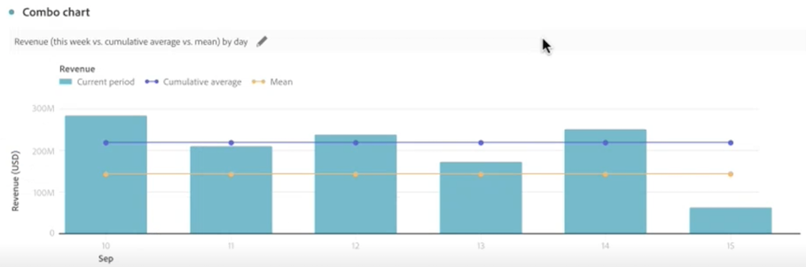

# Grafico combinato

>[!NOTE]
>
>Questa funzionalità è attualmente in [fase di test](/help/release-notes/releases.md).

La [!UICONTROL Combo chart] la visualizzazione consente di creare rapidamente una visualizzazione di confronto senza dover prima creare una tabella. Puoi visualizzare facilmente le tendenze nei tuoi dati in una combinazione riga/barra.

Utilizza un [!UICONTROL Combo chart] a

* Confronta gli ordini di questa settimana con quelli dello scorso mese (e dello scorso anno), il tutto in pochi clic.

* Analizzare e confrontare rapidamente più metriche (come [!UICONTROL Unique Visitors] e [!UICONTROL Revenue]) sullo stesso grafico.

* Analizzare una metrica rispetto a una funzione (ad esempio [!UICONTROL Cumulative Average]) su un orizzonte temporale.

Tieni presente che puoi

* Aggiungere più confronti in un singolo [!UICONTROL Combo chart].
* Se aggiungi uno o più confronti, questi devono essere dello stesso tipo, ad esempio [!UICONTROL Time comparison].
* Puoi aggiungere fino a 5 confronti.
* Puoi applicare fino a 3 filtri (segmenti) a una metrica.

## Creare un grafico combinato

1. Dall’elenco a discesa Visualizzazioni nella barra a sinistra, trascina [!UICONTROL Combo chart] visualizzazione in un pannello vuoto.

   

1. Dall’elenco a discesa, seleziona una dimensione per l’asse X e una metrica per l’asse Y.

1. Seleziona il tipo di [!UICONTROL Line comparison] volete usare.

   | Tipo di confronto delle linee | Definizione |
   | --- | --- |
   | **[!UICONTROL Time comparison]** | Il tipo di confronto più comune - paragonando questo periodo di tempo a 4 settimane fa, per esempio. Se hai selezionato [!UICONTROL Time comparison], seleziona un periodo di tempo secondario da confrontare.
 |
   | **[!UICONTROL Additional metric]** | Ad esempio, puoi confrontare [!UICONTROL Revenue] a un’altra metrica.
 |
   | **[!UICONTROL Function]** | Si potrebbe introdurre una funzione come [!UICONTROL Average] nel confronto. Di seguito è riportato un elenco delle funzioni supportate.
 |

   {style=&quot;table-layout:auto&quot;}

1. Fai clic su **[!UICONTROL Build]**.

   L&#39;output sarà simile al seguente:

   

   Il periodo corrente viene visualizzato nel grafico a barre e il periodo di confronto è rappresentato dal grafico a linee. I punti del grafico a linee sono noti come &quot;campane a barre&quot;.

## Funzioni supportate

Se scegli **[!UICONTROL Function]** come [!UICONTROL Line comparison type], viene restituita una funzione della metrica selezionata.

| Funzione | Definizione |
| --- | --- |
| **[!UICONTROL Column Sum]** | Somma tutti i valori numerici di una metrica all’interno di una colonna (negli elementi di una dimensione) |
| **[!UICONTROL Cumulative Average]** | Restituisce la media delle ultime N righe. |
| **[!UICONTROL Median]** | Restituisce la mediana di una metrica in una colonna. La mediana è il numero nel mezzo di un insieme di numeri, ovvero metà dei numeri ha valori che sono maggiori o uguali alla mediana, e metà sono minori o uguali alla mediana. |
| **[!UICONTROL Cumulative]** | La somma cumulativa di N righe. |
| **[!UICONTROL Column Maximum]** | Restituisce il valore più grande in un insieme di elementi dimensionali della colonna di una metrica. |
| **[!UICONTROL Mean]** | Restituisce la media aritmetica, o media, di una metrica. |
| **[!UICONTROL Column Minimum]** | Restituisce il valore più piccolo in un insieme di elementi dimensionali della colonna di una metrica. |

{style=&quot;table-layout:auto&quot;}

Ecco un esempio della media cumulativa della metrica Ricavo:

Di seguito è riportato un esempio di grafico combinato con funzioni Media cumulativa e Media:

## Impostazioni del grafico combinato

Fai clic sull’icona a forma di ingranaggio in alto a destra di un grafico combinato per modificarne le impostazioni.

| Impostazione | Definizione |
| --- | --- |
| **[!UICONTROL Visualization type]** | Consente di passare a un altro tipo di visualizzazione. |
| **[!UICONTROL Granularity]** | Per le visualizzazioni con tendenze, puoi modificare la granularità temporale (giorno, settimana, mese, ecc.) da questo menu a discesa. |
| **[!UICONTROL General]** |  |
| **[!UICONTROL Percentages]** | Visualizza i valori in percentuale. |
| **[!UICONTROL Legend visible]** | Consente di nascondere il testo della legenda dettagliata per la visualizzazione dei grafici Combo. |
| **[!UICONTROL Limit max items]** | Riduce il numero di elementi sull&#39;asse X. Se hai un set di dati grande, puoi mostrare solo i primi 10 elementi (o qualsiasi valore scelto). |
| **[!UICONTROL Overlays]** | Mostrare o nascondere le campane sulle linee. |
| **[!UICONTROL Axis]** |  |
| **[!UICONTROL Display dual axis]** | Applicabile solo in presenza di due metriche. È possibile avere un asse y a sinistra (per una metrica) e un altro a destra (per l’altra metrica). Questa funzione è utile quando le metriche tracciate hanno dimensioni molto diverse. Il colore del doppio asse corrisponde al colore della tabella, a meno che non siano presenti più confronti. In tal caso, il colore di tutti i confronti è grigio. |
| **[!UICONTROL Normalization]** | Forza le metriche ad adeguarsi alle proporzioni. Questa funzione è utile quando le metriche tracciate hanno dimensioni molto diverse. |
| **[!UICONTROL Show x-axis]** | Visualizzare l&#39;asse x o nasconderlo. |
| **[!UICONTROL Show y-axis]** | Visualizzare l&#39;asse y o nasconderlo. |
| **[!UICONTROL Anchor y-axis at zero]** | Se tutti i valori rappresentati sul grafico sono uniformemente al di sopra dello zero, per impostazione predefinita la parte inferiore dell’asse y sarà NON-ZERO. Attivando questa opzione, l’asse y verrà forzata sullo zero (e il grafico verrà ridisegnato). |

{style=&quot;table-layout:auto&quot;}

