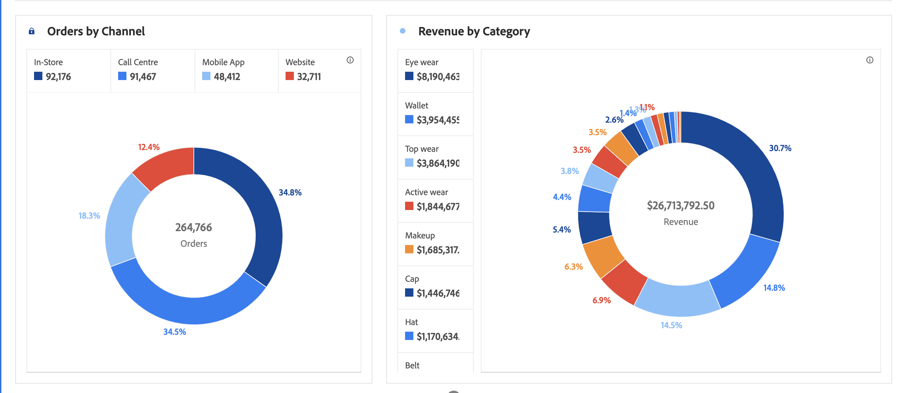

# [!UICONTROL Donut] {#donut}

<!-- markdownlint-disable MD034 -->

>[!CONTEXTUALHELP]
>id="workspace_donut_button"
>title="Ad anello"
>abstract="Crea una visualizzazione ad anello per confrontare le percentuali di un totale, solitamente con un numero ridotto di elementi."

<!-- markdownlint-enable MD034 -->

>[!BEGINSHADEBOX]

_Questo articolo documenta la visualizzazione Anello in_  _&#x200B;**Adobe Analytics**._ _Consulta [Anello](https://experienceleague.adobe.com/it/docs/analytics-platform/using/cja-workspace/visualizations/donut) per la_  _&#x200B;**Customer Journey Analytics** versione di questo articolo._

>[!ENDSHADEBOX]

Simile a un grafico a torta, la visualizzazione  **[!UICONTROL Donut]** presenta i dati come parti o filtri di un insieme. La visualizzazione ad anello è utile per confrontare percentuali di un totale, solitamente con un numero ridotto di voci.

>[!BEGINSHADEBOX]

Per un video demo, guarda  [Aggiungere una visualizzazione ad anello](https://experienceleague.adobe.com/it/docs/analytics-learn/tutorials/analysis-workspace/visualizations/using-the-donut-visualization){target="_blank"}.

>[!ENDSHADEBOX]

>[!MORELIKETHIS]
>
>[Aggiungi una visualizzazione a un pannello](/help/analyze/analysis-workspace/visualizations/freeform-analysis-visualizations.md#add-visualizations-to-a-panel)
>[Impostazioni di visualizzazione](/help/analyze/analysis-workspace/visualizations/freeform-analysis-visualizations.md#settings)
>[Menu di scelta rapida della visualizzazione](/help/analyze/analysis-workspace/visualizations/freeform-analysis-visualizations.md#context-menu)
>

