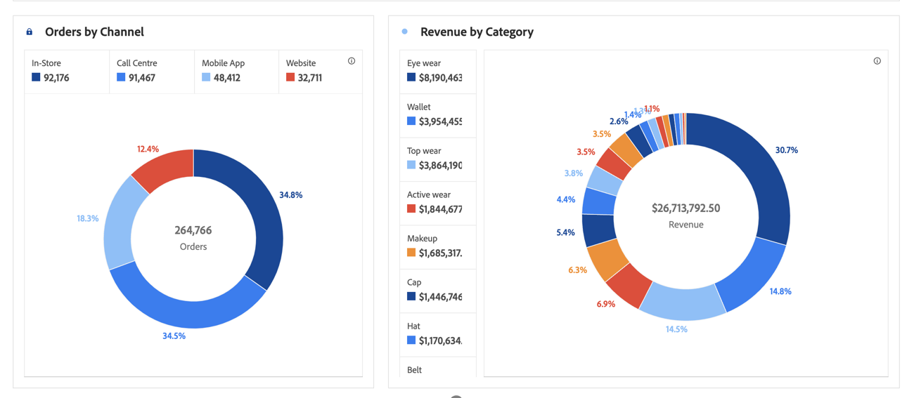

# Anello

Questa visualizzazione è simile al grafico a torta e presenta i dati come parti o segmenti di un intero. Usate un grafico ad anello per confrontare le percentuali di un totale, in genere con un numero limitato di elementi.

