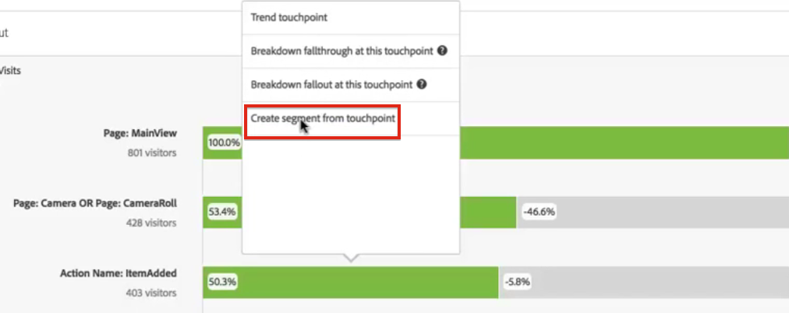
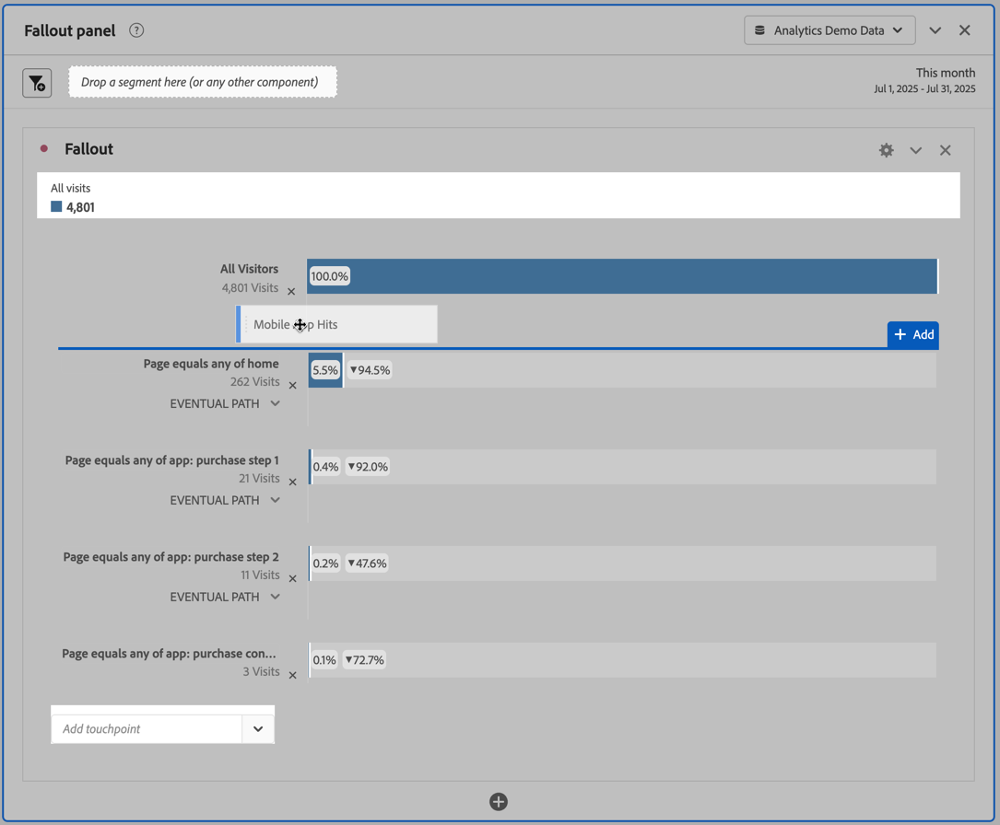

# Applicare i segmenti nell’analisi dell’abbandono

Puoi creare segmenti da un punto di contatto, aggiungere segmenti come punto di contatto e confrontare flussi di lavoro chiave tra vari segmenti in Analysis Workspace.

>[!IMPORTANT] I segmenti utilizzati come punti di controllo in Abbandono devono utilizzare un contenitore di livello inferiore rispetto al contesto generale della visualizzazione Abbandono. Con un Abbandono in contesto visitatore, i segmenti utilizzati come punti di controllo devono essere segmenti basati su visite o hit. Con un Abbandono in contesto visita, i segmenti utilizzati come punto di controllo devono essere segmenti basati su hit. Se si usa una combinazione non valida, l’abbandono sarà 100%. È stato aggiunto un avviso alla visualizzazione Abbandono che verrà attivato se aggiungi un segmento incompatibile come punto di contatto. Alcune combinazioni di contenitori di segmenti non valide genereranno diagrammi di abbandono non validi, ad esempio:

* Utilizzo di un segmento basato su visitatore come punto di contatto all’interno di una visualizzazione Abbandono in un contesto Visitatore
* Utilizzo di un segmento basato su visitatore come punto di contatto all’interno di una visualizzazione Abbandono in un contesto Visita
* Utilizzo di un segmento basato su visite come punto di contatto all’interno di una visualizzazione Abbandono in un contesto Visita

## Creare un segmento da un punto di contatto {#section_915E8FBF35CD4F34828F860C1CCC2272}

1. Crea un segmento da un punto di contatto che ti interessa e che potrebbe essere utile da applicare ad altri rapporti. A tale scopo, fai clic con il pulsante destro sul punto di contatto e seleziona **[!UICONTROL Create segment from touchpoint]** (Crea segmento da punto di contatto).

   

   Viene aperto il Generatore di segmenti, precompilato con il segmento sequenziale pregenerato che corrisponde al punto di contatto selezionato:

   

1. Assegna al segmento un titolo e una descrizione e salvalo.

   Ora puoi usare questo segmento in qualsiasi rapporto.

## Aggiungere un segmento come punto di contatto {#section_17611C1A07444BE891DC21EE8FC03EFC}

Per vedere ad esempio come gli utenti USA influenzano le metriche di abbandono, trascina il segmento degli utenti USA nella sezione Abbandono:

Oppure puoi creare un punto di contatto AND trascinando il segmento degli utenti USA su un altro punto di controllo.

## Confrontare i segmenti in Abbandono {#section_E0B761A69B1545908B52E05379277B56}

Puoi confrontare un numero illimitato di segmenti nella visualizzazione Abbandono.

1. Seleziona i segmenti che desideri confrontare dalla barra [!UICONTROL Segments] (Segmenti) a sinistra. Nel nostro esempio, abbiamo selezionato 2 segmenti: Utenti USA e Utenti non USA.
1. Trascinali nella zona di rilascio Segmento, in alto.

   

1. Facoltativo: puoi mantenere il contenitore predefinito “Tutte le visite”, o eliminarlo.

   

1. Ora puoi confrontare i dati di abbandono tra i due segmenti, ad esempio dove un segmento ha prestazioni migliori dell’altro.
