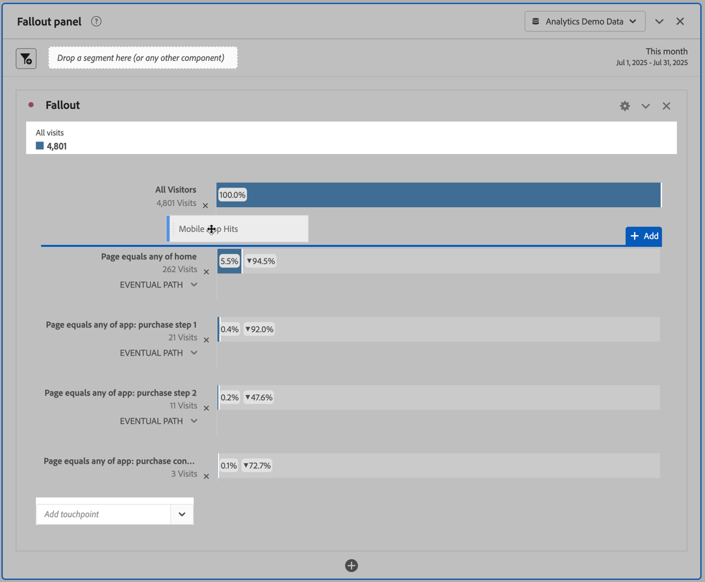

# Applicare i segmenti nell’analisi dell’abbandono

Puoi creare segmenti da un punto di contatto, aggiungere segmenti come punto di contatto e confrontare flussi di lavoro chiave tra vari segmenti in Analysis Workspace.

>[!IMPORTANT]
>
>I segmenti utilizzati come punti di controllo in Abbandono devono utilizzare un contenitore di livello inferiore rispetto al contesto generale della visualizzazione Abbandono. Con un Abbandono in contesto visitatore, i segmenti utilizzati come punti di controllo devono essere segmenti basati su visite o hit. Con un Abbandono in contesto visita, i segmenti utilizzati come punto di controllo devono essere segmenti basati su hit. Se si usa una combinazione non valida, l’abbandono sarà 100%. Quando aggiungi un segmento incompatibile come punto di contatto, nella visualizzazione Abbandono viene visualizzato un avviso. Alcune combinazioni di contenitori di segmenti non valide genereranno diagrammi di abbandono non validi, ad esempio:
>
>* Utilizzo di un segmento basato su visitatore come punto di contatto all’interno di una visualizzazione Abbandono in contesto visitatore.
>* Utilizzo di un segmento basato su visitatore come punto di contatto all’interno di una visualizzazione Abbandono in un contesto visita.
>* Utilizzo di un segmento basato su visite come punto di contatto all’interno di una visualizzazione Abbandono in un contesto visita.
>

## Creare un segmento da un punto di contatto

1. Crea un segmento da un punto di contatto che ti interessa e che potrebbe essere utile da applicare ad altri rapporti. A tale scopo, fai clic con il pulsante destro sul punto di contatto e seleziona **[!UICONTROL Create segment from touchpoint]**.

   

   Viene aperto Segment Builder (Generatore segmenti), precompilato con il segmento sequenziale predefinito che corrisponde al punto di contatto selezionato:

   

1. Assegna al segmento un titolo e una descrizione e salvalo.

   Ora puoi utilizzare questo segmento in qualsiasi progetto.

## Aggiungere un segmento come punto di contatto

Per vedere, ad esempio, la tendenza degli hit per app mobili e l’effetto dell’abbandono, trascina il segmento Hit nell’abbandono:

Oppure puoi creare un punto di contatto AND trascinando il segmento degli hit dell’app mobile su un altro punto di controllo.

## Confrontare i segmenti in Abbandono

Puoi confrontare un numero illimitato di segmenti nella visualizzazione Abbandono. (Il video seguente afferma che è possibile confrontare fino a 3 segmenti, il che è errato.)

1. Selezionare i segmenti da confrontare dal pannello [!UICONTROL Segment] a sinistra. Nell&#39;esempio Nell&#39;esempio sono selezionati due segmenti: **[!UICONTROL iOS]** e **[!UICONTROL Android]**.
1. Trascina i tre segmenti nella zona di rilascio Segmento, nella parte superiore della visualizzazione.

   

1. Facoltativo: è possibile mantenere *Tutti gli utenti* come contenitore predefinito o eliminare il contenitore.

1. Ora puoi confrontare l’abbandono tra i tre segmenti, ad esempio quando un segmento ha prestazioni migliori di un altro o altre informazioni.
