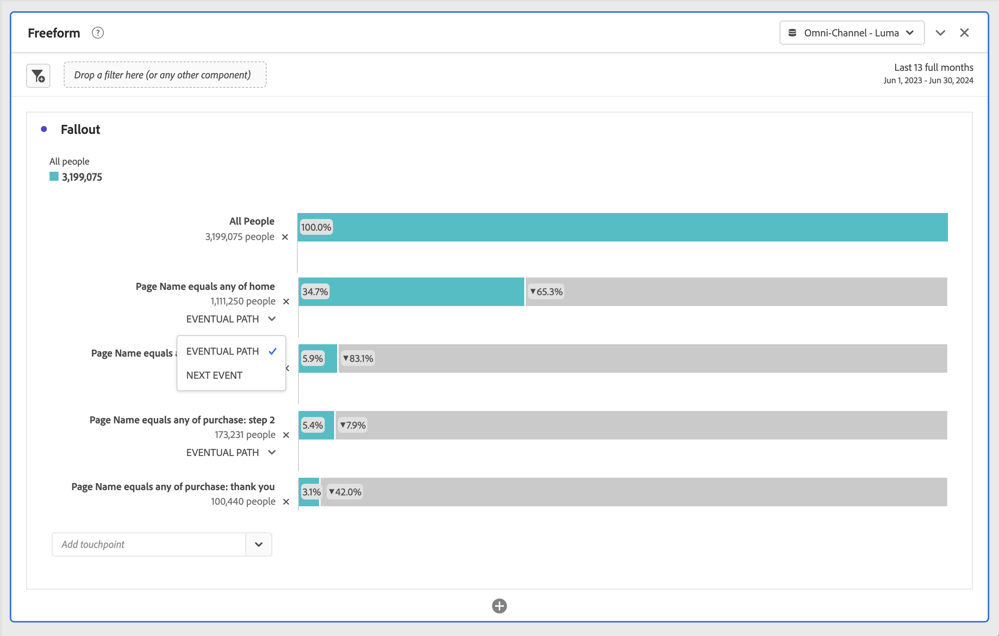

# Configurare una visualizzazione dell’abbandono

Puoi specificare i punti di contatto per creare una sequenza di abbandono multidimensionale. Di solito, un punto di contatto è una pagina del sito. Tuttavia, i punti di contatto non sono limitati alle pagine. Ad esempio, puoi aggiungere eventi, come unità di misura, persone univoche e visite di ritorno. Puoi anche aggiungere dimensioni, come una categoria, un tipo di browser o un termine di ricerca interno.

Puoi anche aggiungere segmenti all’interno di un punto di contatto. Ad esempio, potrebbe essere utile confrontare segmenti, come gli utenti di iOS e Android™. Trascina i segmenti desiderati nella parte superiore dell’abbandono per aggiungere al rapporto le informazioni su di essi. Se desideri visualizzare solo tali segmenti, puoi rimuovere la linea di base Tutte le visite.

Non esiste alcun limite al numero di passaggi che è possibile aggiungere o al numero di dimensioni utilizzate.

Puoi eseguire la tracciatura di percorsi per dimensioni, metriche e segmenti. Ad esempio, supponiamo che qualcuno stia guardando &quot;scarpe, camicie&quot; su una pagina e che nella pagina successiva guardi &quot;camicie, calze&quot;. il prossimo rapporto di flusso dei prodotti da “scarpe” sarà “camicie” e “calze” e NON “camicie”.

## Utilizzo

1. Aggiungi una visualizzazione  **[!UICONTROL Fallout]**. Consulta [Aggiungere una visualizzazione a un pannello](../freeform-analysis-visualizations.md#add-visualizations-to-a-panel).
1. Trascinare un componente nel menu a discesa **[!UICONTROL Add touchpoint]**.

   Ad esempio, puoi aggiungere una singola pagina al rapporto di abbandono, anziché l’intera dimensione. Fare clic sulla freccia destra  nella dimensione pagina per scegliere una pagina specifica, ad esempio **[!UICONTROL home]**, da aggiungere al report Abbandono.

   

1. Continua ad aggiungere punti di contatto fino al completamento della sequenza.

   I numeri cerchiati nella porzione grigia della barra mostrano l’abbandono tra i punti di contatto (non l’abbandono complessivo per quel punto). **[!UICONTROL Touchpoint %]** mostra l&#39;abbandono riuscito dal passaggio precedente al passaggio corrente nel report sull&#39;abbandono.

   

   Quando aggiungi punti di contatto, puoi effettuare una delle seguenti operazioni:

   * Combina più componenti trascinando uno o più componenti aggiuntivi su un singolo punto di contatto.

     >[!NOTE]
     >
     >Per unire più segmenti si usa l’operatore AND; per unire più elementi, ad esempio elementi dimensione, si usa l’operatore OR.

   * Riordina i punti di contatto trascinandoli a un livello diverso all’interno della gerarchia di abbandono.

   * Combinare un punto di contatto con un altro punto di contatto. Per combinare i punti di contatto, trascinateli su un altro. Rilasciarlo quando viene visualizzata la parola **[!UICONTROL Combine]**.

     

   * Vincola singoli punti di contatto all&#39;evento successivo (anziché *alla fine*) all&#39;interno del percorso. Sotto ogni punto di contatto è presente un selettore con le opzioni **[!UICONTROL Eventual path]** e **[!UICONTROL Next event]**, come illustrato di seguito:

     

     | Opzione | Descrizione |
     |---|---|
     | **[!UICONTROL Eventual path]** (predefinito) | Sono conteggiati i visitatori che *alla fine* approderanno sulla pagina successiva del percorso, ma non necessariamente sull&#39;evento successivo. |
     | **[!UICONTROL Next event]** | Sono conteggiati i visitatori che arriveranno alla pagina successiva del percorso nel prossimo evento. |

   * Passa il puntatore del mouse su un punto di contatto per visualizzare l’abbandono e altre informazioni su tale livello. Le informazioni includono il nome del punto di contatto, il conteggio delle persone e la percentuale di successo. Puoi anche confrontare il tasso di successo con altri punti di contatto.

     

## Impostazioni

Come parte della visualizzazione, sono disponibili impostazioni specifiche.

| Contenitore Fallout | Descrizione |
|--- |--- |
| **[!UICONTROL Session]** o **[!UICONTROL Person]** | Passa da [!UICONTROL Session] a [!UICONTROL Person] per analizzare il percorso della persona. Il valore predefinito è [!UICONTROL Person]. Queste impostazioni consentono di comprendere il coinvolgimento di persone a livello di persona singola (attraverso più sessioni) o di limitare l’analisi a una singola sessione. |

## Menu di scelta rapida

Come parte della visualizzazione, sono disponibili opzioni di menu di scelta rapida specifiche.

### Accedere al menu di scelta rapida

È possibile accedere al menu di scelta rapida in uno dei modi seguenti:

* Passa il puntatore del mouse su un punto di contatto nella visualizzazione, quindi seleziona **[!UICONTROL Click to analyze]**.

  

* Fai clic con il pulsante destro del mouse su un punto di contatto nella visualizzazione.

  

### Opzioni del menu di scelta rapida

Sono disponibili le seguenti opzioni del menu di scelta rapida:

| Opzione | Descrizione |
|--- |--- |
| **[!UICONTROL Trend touchpoint]** | Vedi i dati di tendenza per un punto di contatto in un grafico a linee, con alcuni dati predefiniti di rilevamento delle anomalie. |
| **[!UICONTROL Trend touchpoint (%)]** | Genera tendenze sulla percentuale di abbandono totale. |
| **[!UICONTROL Trend all touchpoints (%)]** | Genera tendenze su tutte le percentuali dei punti di contatto nell&#39;abbandono (tranne **[!UICONTROL All People]**, se incluso) nello stesso grafico. |
| **[!UICONTROL Breakdown fallthrough at this touchpoint]** | Puoi vedere cosa hanno fatto i visitatori tra due punti di contatto (questo e il successivo) se hanno continuato fino al punto di contatto successivo. Questa opzione crea una tabella a forma libera che mostra le dimensioni. Potete sostituire le quote e altri elementi della tabella. Ad esempio, una tabella etichettata **[!UICONTROL Fallthrough: All Visitors > Page equals any of home]** e contenente **[!UICONTROL Page]** come dimensione e **[!UICONTROL Unique Visitors]** segmentata dal [segmento rapido solo progetto](/help/components/segmentation/segmentation-workflow/seg-quick.md) **[!UICONTROL Fallthrough: All Visitors > Page equals any of home]** come metrica. Ispeziona il segmento per capire come viene determinato il segmento di fallthrough. |
| **[!UICONTROL Breakdown fallout at this touchpoint]** | Visualizza cosa hanno fatto immediatamente dopo il passaggio selezionato i visitatori che non hanno effettuato il passaggio in funnel. Questa opzione crea una tabella a forma libera che mostra le dimensioni. Potete sostituire le quote e altri elementi della tabella. Ad esempio, una tabella etichettata **[!UICONTROL Fallout: All Visitors > Page equals any of home]** e contenente **[!UICONTROL Page]** come dimensione e **[!UICONTROL Unique Visitors]** segmentata dal segmento rapido [solo progetto](/help/components/segmentation/segmentation-workflow/seg-quick.md) **[!UICONTROL Fallthrough: All Visitors > Page equals any of home]** come metrica. Ispeziona il segmento per capire come viene determinato il segmento di abbandono. |
| **[!UICONTROL Create segment from touchpoint]** | Crea un nuovo segmento dal punto di contatto selezionato. |

>[!MORELIKETHIS]
>
>[Aggiungere una visualizzazione a un pannello](/help/analyze/analysis-workspace/visualizations/freeform-analysis-visualizations.md#add-visualizations-to-a-panel)
>[Impostazioni di visualizzazione](/help/analyze/analysis-workspace/visualizations/freeform-analysis-visualizations.md#settings)
>[Menu di scelta rapida della visualizzazione](/help/analyze/analysis-workspace/visualizations/freeform-analysis-visualizations.md#context-menu)
>

