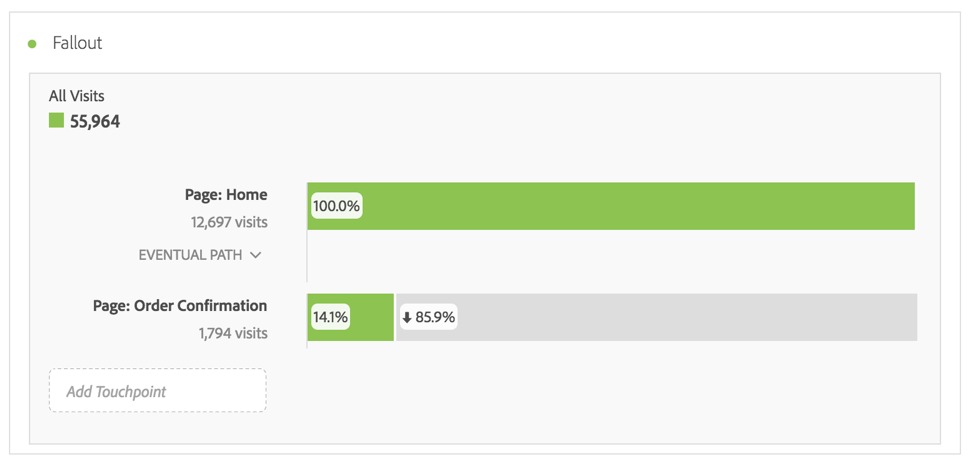

# Panoramica Abbandono

Le visualizzazioni Abbandono offrono opzioni aggiuntive per la generazione dei rapporti di abbandono. I rapporti di abbandono mostrano dove i visitatori hanno lasciato (abbandonato) una sequenza di pagine predefinite e dove hanno proseguito.

Le visualizzazioni Abbandono consentono di:

* Eseguire confronti affiancati di due diversi segmenti nello stesso rapporto.
* Trascinare, rilasciare e spostare i passaggi funnel (punti di contatto)
* Combinare diversi valori, da varie dimensioni e metriche
* Creare un rapporto di abbandono con più dimensioni
* Identificare dove vanno i clienti immediatamente dopo l’abbandono

Il report di abbandono visualizza i tassi di conversione ed abbandono tra ciascun passaggio o punto di contatto in una sequenza.

Ad esempio, puoi tracciare i punti di abbandono di un visitatore durante un processo di acquisto. Per creare un percorso di navigazione nel sito, è sufficiente selezionare un punto di contatto iniziale, uno finale e aggiungere dei punti di contatto intermedi. È inoltre possibile creare visualizzazioni di abbandono con più dimensioni.

La visualizzazione Abbandono è utile per analizzare:

* I tassi di conversione tramite specifici processi sul sito (ad esempio, acquisto o registrazione).
* Flussi di traffico generali di ambito più ampio: per le persone che hanno visto la pagina Home, questo flusso mostra quanti hanno poi fatto una ricerca e quanti sono quindi passati a uno specifico articolo.
* Correlazioni tra eventi attivati sul sito. Le correlazioni mostrano la percentuale di persone che, dopo aver letto l’informativa sulla privacy, proseguono con l’acquisto di un prodotto.

[Visualizzazione Abbandono su YouTube](https://www.youtube.com/watch?v=VcrfHSyIoj8&index=52&list=PL2tCx83mn7GuNnQdYGOtlyCu0V5mEZ8sS) (4:15)

## Segmentation as a foundation for flow and fallout {#section_654F37A398C24DDDB1552A543EE29AA9}

I segmenti applicati ai pannelli di Workspace operano in modo leggermente diverso rispetto ai segmenti applicati ai rapporti di abbandono e di flusso in Reports &amp; Analytics o Ad Hoc Analysis. Nella maggior parte dei casi restituiscono esattamente gli stessi risultati. La principale differenza consiste nel fatto che le funzionalità Reports &amp; Analytics e Ad Hoc Analysis applicano il segmento a ogni passaggio della sequenza, il che può portare a esiti leggermente diversi.

Si prenda ad esempio un abbandono con due passaggi:

Se si applica un segmento a livello di pannello di Workspace, il segmento si combina con l’abbandono come segue:

Per contro, quando le funzioni Reports &amp; Analytics e Ad Hoc Analysis calcolano il segmento, questo si combina come segue:

Reports &amp; Analytics e Ad Hoc Analysis combinano il segmento con ogni passaggio. Quando i contenitori si trovano al medesimo livello dell’abbandono (ad es. a livello di visita o dei singoli visitatori) si ottiene un risultato identico al numero di visite o di visitatori.

Tuttavia, se il segmento applicato al pannello è inferiore al livello di abbandono (ad es. a livello hit), il segmento restituisce risultati diversi, a causa della modalità di combinazione del rapporto. Come già menzionato, nella maggior parte dei casi i valori ottenuti in Analysis Workspace corrispondono a quelli di Reports &amp; Analytics e Ad Hoc Analysis. I valori **non** corrispondono solo se vengono soddisfatte tutte le condizioni elencate di seguito:

* Il segmento non si trova allo stesso livello dell’abbandono.
* Il segmento contiene una variabile che consente di associare a ogni visitatore/visita più valori per visita/visitatore.

In quelle poche situazioni in cui è necessario che Analysis Workspace adotti lo stesso metodo di applicazione dei segmenti all’abbandono/flusso utilizzato da Reports &amp; Analytics, per ottenere valori identici è sufficiente rilasciare il segmento in ciascun passaggio di abbandono in Workspace.
