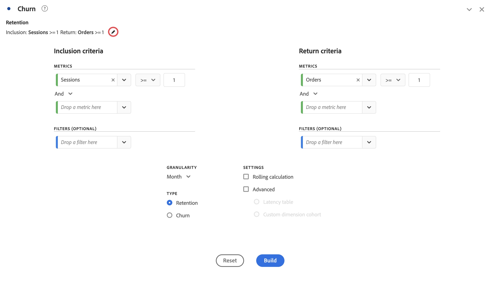

# Panoramica delle visualizzazioni

Workspace offre diverse visualizzazioni per creare rappresentazioni visive dei dati. Ad esempio grafici a barre, grafici ad anello, istogrammi, grafici a linee, mappe, grafici di dispersione e altri.

## Tipi

In Analysis Workspace sono disponibili i seguenti tipi di visualizzazione:

| Icona | Nome | Descrizione |
| :---: | --- | ---| 
|  | [Superfici](/help/analyze/analysis-workspace/visualizations/area.md) | Visualizzazione con grafico a superficie. È simile a un grafico a linee ma presenta una superficie colorata al di sotto della linea. Un grafico a superficie è utile quando si hanno diverse metriche e si desidera visualizzare l’area di intersezione di due o più metriche. |
|  | [Barre](/help/analyze/analysis-workspace/visualizations/bar.md) | La visualizzazione di un grafico a barre con barre verticali che rappresentano diversi valori per una o più metriche. |
|  | [Barre sovrapposte](/help/analyze/analysis-workspace/visualizations/bar.md) | La visualizzazione di un grafico a barre sovrapposte con barre verticali che rappresentano diversi valori per una o più metriche. |
| 
 | [Bullet](/help/analyze/analysis-workspace/visualizations/bullet-graph.md) | La visualizzazione di un grafico bullet, che mostra come un valore desiderato si confronta o misura con altre gamme di prestazioni (obiettivi). |
|  | [Tabella coorte](/help/analyze/analysis-workspace/visualizations/cohort-table/cohort-analysis.md) | Una visualizzazione coorte è un gruppo di persone che condividono caratteristiche comuni per un determinato periodo. Una tabella coorte è utile per le analisi di fidelizzazione, abbandono o latenza. |
|  | [Combinato](combo-charts.md) | Un grafico combinato consente di creare rapidamente una visualizzazione di confronto senza dover prima creare una tabella. |
|  | [Anello](/help/analyze/analysis-workspace/visualizations/donut.md) | Simile a un grafico a torta, questa visualizzazione ad anello mostra i dati come parti o segmenti di un insieme. |
|  | [Fallout](/help/analyze/analysis-workspace/visualizations/fallout/fallout-flow.md) | La visualizzazione Abbandono mostra dove l’utenza ha lasciato (abbandonato) e continuato (proseguito) attraverso una sequenza di pagine predefinite. |
|  | [Flusso](/help/analyze/analysis-workspace/visualizations/c-flow/flow.md) | Una visualizzazione del flusso mostra i percorsi seguiti dal cliente nei tuoi siti Web e nelle tue app. |
| 
 | [Tabella a forma libera](/help/analyze/analysis-workspace/visualizations/freeform-table/freeform-table.md) | Una visualizzazione tabella a forma libera è una visualizzazione interattiva. La visualizzazione tabella a forma libera è la base per l’analisi dei dati in Workspace. |
|  | [Istogramma](/help/analyze/analysis-workspace/visualizations/histogram.md) | Una visualizzazione a istogramma classifica l’utenza, le visite o gli hit in blocchi in base a un volume di metrica. |
|  | [Barre orizzontali](/help/analyze/analysis-workspace/visualizations/horizontal-bar.md) | Una visualizzazione a barre orizzontali mostra barre orizzontali che rappresentano diversi valori per una o più metriche. |
|  | [Barra orizzontale sovrapposta](/help/analyze/analysis-workspace/visualizations/horizontal-bar.md) | Una visualizzazione a barre orizzontali sovrapposte mostra barre orizzontali che rappresentano diversi valori per una o più metriche. |
|  | [Riepilogo delle metriche chiave](/help/analyze/analysis-workspace/visualizations/key-metric.md) | Una visualizzazione di riepilogo delle metriche chiave combina le visualizzazioni di linee, modifiche di riepilogo e numeri di riepilogo. |
|  | [Linee](/help/analyze/analysis-workspace/visualizations/line.md) | La visualizzazione a linee rappresenta le metriche utilizzando linee che mostrano come cambiano i valori nel tempo. In un grafico a linee, l’asse X rappresenta il tempo. |
|  | [Mappa](/help/analyze/analysis-workspace/visualizations/map-visualization.md) | Consente di creare una mappa visiva di qualsiasi metrica (comprese le metriche calcolate) |
|  | [A dispersione](/help/analyze/analysis-workspace/visualizations/scatterplot.md) | La visualizzazione grafico a dispersione mostra la relazione tra gli elementi dimensionali e un massimo di tre metriche. |
|  | [Intestazione sezione](section-header.md) | Per identificare e articolare sezioni all’interno di un pannello. |
|  | [Variazione di riepilogo](/help/analyze/analysis-workspace/visualizations/summary-number-change.md) | Una visualizzazione delle modifiche di riepilogo mostra la modifica tra le celle selezionate come un numero o una percentuale grande. |
| 
 | [Numero di riepilogo](/help/analyze/analysis-workspace/visualizations/summary-number-change.md) | Una visualizzazione a numero di riepilogo mostra la cella selezionata come un numero grande. |
|  | [Testo](/help/analyze/analysis-workspace/visualizations/text.md) | Una visualizzazione a testo consente di aggiungere testo definito dall’utente al progetto Workspace. Utile per aggiungere ulteriore contesto alle analisi e alle informazioni, oltre a sfruttare le descrizioni di pannelli e visualizzazioni. |
|  | [Mappa ad albero](/help/analyze/analysis-workspace/visualizations/treemap.md)
 | Una visualizzazione mappa ad albero visualizza i dati gerarchici (con struttura ad albero) come un insieme di rettangoli nidificati. |
|  | [Venn](/help/analyze/analysis-workspace/visualizations/venn.md) | Una visualizzazione Venn utilizza dei cerchi per rappresentare la sovrapposizione delle metriche fino a 3 segmenti. |

<!--

| Name| Icon | Description |
| --- |:---: | ---|
| [Area](/help/analyze/analysis-workspace/visualizations/area.md)|
 | Like a line graph, but with a colored area below the line. Use an area graph when you have multiple metrics and want to visualize the area expressed by the intersection of two or more metrics. |
| [Bar](/help/analyze/analysis-workspace/visualizations/bar.md)|
 | Shows vertical bars representing various values across one or more metrics. |
| [Bullet graph](/help/analyze/analysis-workspace/visualizations/bullet-graph.md)|
 | Shows how a value you are interested in compares to or measures against other performance ranges (goals). |
| [Cohort table](/help/analyze/analysis-workspace/visualizations/cohort-table/cohort-analysis.md)|
 | A *`cohort`* is a group of people sharing common characteristics over a specified period. Cohort Analysis is useful for retention, churn or latency analysis. |
| [Donut](/help/analyze/analysis-workspace/visualizations/donut.md) | 
 | Similar to a pie chart, this visualization shows data as parts or segments of a whole. |
| [Fallout](/help/analyze/analysis-workspace/visualizations/fallout/fallout-flow.md) | 
 | Fallout reports show where visitors left (fell out) and continued through (fell through) a predefined sequence of pages. Can be set to eventual or exact sequences |
| [Flow](/help/analyze/analysis-workspace/visualizations/c-flow/flow.md) | 
 | Shows exact customer paths through your websites and apps. |
| [Freeform table](/help/analyze/analysis-workspace/visualizations/freeform-table/freeform-table.md) | 
 | A Freeform table is not merely a data table, but also an interactive visualization. It is the foundation for data analysis in Workspace.|
| [Histogram](/help/analyze/analysis-workspace/visualizations/histogram.md) | 
 | A histogram buckets visitors, visits or hits into buckets based on a metric volume. |
| [Horizontal bar](/help/analyze/analysis-workspace/visualizations/horizontal-bar.md) | 
 | Shows horizontal bars representing various values across one or more metrics. |
| [Key metric summary](/help/analyze/analysis-workspace/visualizations/key-metric.md) | 
 | Shows how a metric is trending within a single timeframe, or lets you compare metric performance across two timeframes. |
| [Line](/help/analyze/analysis-workspace/visualizations/line.md) | 
 | Represents metrics using a line in order to show how values change over a period of time. A line chart uses time along the x-axis. |
| [Map](/help/analyze/analysis-workspace/visualizations/map-visualization.md) | 
 | Lets you build a visual map of any metric (including calculated metrics). |
| [Scatterplot](/help/analyze/analysis-workspace/visualizations/scatterplot.md) | 
 | Shows the relationship between dimension items and up to three metrics. |
| [Summary number](/help/analyze/analysis-workspace/visualizations/summary-number-change.md) | 
 | Shows the selected cell as 1 large number. |
| [Summary change](/help/analyze/analysis-workspace/visualizations/summary-number-change.md) | 
 | Shows the change between the selected cells as 1 large number/percent. |
| [Text](/help/analyze/analysis-workspace/visualizations/text.md) | 
 | Lets you add user-defined text to your Workspace. Helpful for adding additional context to your analysis and insights, in addition to leveraging panel/visualization descriptions |
| [Treemap](/help/analyze/analysis-workspace/visualizations/treemap.md) | 
 | Displays hierarchical (tree-structured) data as a set of nested rectangles. |
| [Venn](/help/analyze/analysis-workspace/visualizations/venn.md) | 
 | Uses circles to depict the metric overlap of up to 3 segments. |

-->

## Aggiungere visualizzazioni a un pannello

1. Apri il progetto Analysis Workspace in cui desideri aggiungere una visualizzazione.

1. Per aggiungere una visualizzazione, utilizza uno dei seguenti metodi:

   

   * Nel pannello a sinistra, seleziona  **Visualizzazioni**, quindi trascina una visualizzazione nel pannello in cui desideri aggiungere la visualizzazione.

   * Nel pannello in cui desideri aggiungere la visualizzazione, seleziona , quindi scegli l’icona che rappresenta la visualizzazione che desideri da aggiungere. Passa il puntatore sull’icona di ciascuna visualizzazione per visualizzarne il nome.

   * Aggiungi un [pannello vuoto](/help/analyze/analysis-workspace/c-panels/blank-panel.md), quindi seleziona la visualizzazione da aggiungere.

   * Dal menu di scelta rapida di una visualizzazione esistente nel progetto Analysis Workspace, seleziona **[!UICONTROL Duplicate visualization]** o **[!UICONTROL Copy visualization]**.

   * Utilizza il menu **[!UICONTROL Insert]** di Workspace per inserire una visualizzazione.

   * Dal menu di scelta rapida di una tabella a forma libera, seleziona **[!UICONTROL Visualize]**. Seleziona quindi la visualizzazione dal sottomenu. In base alla selezione corrente nella tabella, Workspace determina la visualizzazione da offrire e interpreta i dati per generare la visualizzazione richiesta.

## Legend (Legenda)

Una legenda consente di correlare la data in una tabella di origine alle serie tracciate nella visualizzazione. La legenda è interattiva: puoi selezionare un elemento della legenda per mostrare o nascondere una serie nella visualizzazione, operazione utile se desideri semplificare i dati visualizzati.

Inoltre, puoi rinominare le etichette delle legende per facilitare la lettura dei grafici. Nota: la modifica della legenda **non** è disponibile per le visualizzazioni Mappa ad albero, Bullet, Variazione di riepilogo o Numero di riepilogo, Testo, Forma libera, Istogramma, Coorte o Flusso.

Per modificare un’etichetta di legenda:

1. Fai clic su una delle etichette della legenda.
1. Fai clic su **[!UICONTROL Edit Label]**.

   

1. Inserisci il nuovo testo dell’etichetta.
1. Fai clic su **[!UICONTROL Enter]** per salvare.

### Impostazioni

Le impostazioni di visualizzazione disponibili dipendono dal tipo di visualizzazione. Nella tabella seguente sono riepilogate le impostazioni più comuni. Alcune visualizzazioni presentano impostazioni specifiche. Per ulteriori informazioni, consulta la documentazione di visualizzazione singola.

| Opzione | Descrizione |
| --- | --- |
| **[!UICONTROL Visualization type]** | Modifica il tipo di visualizzazione utilizzata per rappresentare i dati. |
| **[!UICONTROL Granularity]** | Modifica la granularità temporale per le visualizzazioni con tendenze. Questa modifica si applica anche alla tabella dell’origine dati. |
| **[!UICONTROL Percentages]** | Visualizza i valori in percentuale. |
| **[!UICONTROL 100% stacked]** | Converti il grafico in una visualizzazione con sovrapposizione al 100%.  Applicabile solo a una visualizzazione ad area, barre e barre orizzontali sovrapposte. |
| **[!UICONTROL Legend visible]** | Mostra il testo della legenda. |
| **[!UICONTROL Limit max items]** | Consente di limitare il numero di elementi presentati in una visualizzazione. Se questa opzione è selezionata, definisci il numero massimo di elementi. |
| **[!UICONTROL Show annotations]** | Mostra le annotazioni effettuate per questa visualizzazione. |
| **[!UICONTROL Hide title]** | Nascondi il titolo della visualizzazione. |
| **[!UICONTROL Anchor y-axis at zero]** | Forza la parte inferiore dell’asse y a zero. Se tutti i valori tracciati sul grafico sono notevolmente al di sopra dello zero, per impostazione predefinita la parte inferiore dell’asse y sarà non zero. Se si attiva questa opzione, l’asse y viene forzato a zero (e il grafico viene ridisegnato). |
| **[!UICONTROL Display dual axis]** | Visualizza gli assi y a sinistra e a destra per due metriche diverse. Questa opzione è applicabile solo se si dispone di due metriche. I doppi assi sono utili quando le metriche tracciate hanno dimensioni diverse. |
| **[!UICONTROL Show x-axis]** | Mostra l’asse x nella visualizzazione. |
| **[!UICONTROL Show y-axis]** | Mostra l’asse y nella visualizzazione. |
| **[!UICONTROL Show barbells on lines]** | Mostra i punti (o “bar bell”) sulla visualizzazione a linee in una visualizzazione con grafico combinato. |
| **[!UICONTROL Normalization]** | Forza le metriche per essere adeguate alle proporzioni. Le stesse proporzioni sono utili quando le metriche tracciate hanno dimensioni diverse. |
| **[!UICONTROL Show anomalies]** | Migliora i grafici a linee e le tabelle a forma libera con la visualizzazione del rilevamento delle anomalie. Il rilevamento delle anomalie nelle visualizzazioni a linee include un valore previsto (linea tratteggiata) e un intervallo previsto (banda ombreggiata). |
| **[!UICONTROL Show forecast]** | Migliora i grafici a linee e le tabelle a forma libera con la visualizzazione dei valori di previsione. |
| **[!UICONTROL Show min]** | Mostra il valore minimo nella visualizzazione. |
| **[!UICONTROL Show max]** | Mostra il valore massimo nella visualizzazione. |
| **[!UICONTROL Show trendline]** | Mostra una linea di tendenza nella visualizzazione. Se selezionata, puoi selezionare il tipo di linea di tendenza dal menu a discesa. |

Puoi personalizzare le impostazioni per tutte le visualizzazioni create. Per ulteriori informazioni, consulta la sezione [Preferenze utente](/help/analyze/analysis-workspace/user-preferences.md).

## Menu di scelta rapida {#right-click}

Utilizza il menu di scelta rapida (disponibile tramite selezione alternativa, ad esempio, facendo clic con il pulsante destro del mouse) su un’intestazione di visualizzazione per accedere a funzionalità aggiuntive per una visualizzazione. Non tutte le opzioni sono disponibili per tutte le visualizzazioni.

| Opzione | Descrizione |
| --- | --- |
| **[!UICONTROL Insert copied visualization]** | Incolla (inserisci) una visualizzazione copiata altrove nello stesso progetto o in un altro progetto. |
| **[!UICONTROL Copy data to clipboard]** | [Copia dati](/help/analyze/analysis-workspace/curate-share/download-send.md#copy-to-clipboard) dalla visualizzazione negli Appunti. |
| **[!UICONTROL Copy selection to clipboard]** | [Copia la selezione](/help/analyze/analysis-workspace/curate-share/download-send.md#copy-to-clipboard) dalla visualizzazione negli Appunti. |
| **[!UICONTROL Download items as CSV (*nome dimensione *)]** | [Scarica gli elementi dimensionali](/help/analyze/analysis-workspace/curate-share/download-send.md#download-items-as-csv) (fino a un massimo di 50.000) della visualizzazione sul dispositivo locale. Un massimo di 50.000 elementi dimensionali per la dimensione selezionata. |
| **[!UICONTROL Copy visualization]** | Copia la visualizzazione, in modo da poterla inserire in un’altra posizione all’interno del progetto o in un progetto diverso. |
| **[!UICONTROL Download data CSV]** | [Scarica i dati visualizzati](/help/analyze/analysis-workspace/curate-share/download-send.md#download-as-csv) della visualizzazione sul tuo dispositivo locale. |
| **[!UICONTROL Duplicate visualization]** | Crea un duplicato esatto della visualizzazione. |
| **[!UICONTROL Edit description]** | Aggiungi (o modifica) una descrizione di testo per la visualizzazione. Consulta [Testo](text.md). |
| **[!UICONTROL Get visualization link]** | Copia e condividi un collegamento direttamente alla visualizzazione. La finestra di dialogo Condividi collegamento consente di visualizzare il collegamento. Seleziona Copia per copiare il collegamento negli appunti. |
| **[!UICONTROL Start over]** | Elimina la configurazione della visualizzazione corrente in modo da poterla riconfigurare da zero. |

## Configurazione

Alcune visualizzazioni (come a tabella coorte, abbandono, flusso e altri) dispongono di una finestra di dialogo per la configurazione che consente di creare la visualizzazione. Utilizza  nella parte superiore della visualizzazione per accedere e modificare la configurazione.

## Visualizza

Se non sai quale visualizzazione scegliere, seleziona  che **[!UICONTROL Visualize]** una qualsiasi riga della tabella a forma libera (disponibile sul puntatore). Questa selezione è il modo più veloce per aggiungere una visualizzazione. Analysis Workspace cerca di fare una stima ragionata per individuare la visualizzazione più idonea per i tuoi dati. Ad esempio, se hai selezionato una riga, si crea un [grafico a linee](line.md) con tendenze. Se sono state selezionate tre righe di filtri, viene creato un diagramma di [Venn](venn.md).

<!--
## Settings {#settings}

| Setting | Description |
| --- | --- |
| Visualization Type | Change the type of visual used to depict the data. |
| Granularity | For trended visualizations, you can change the time granularity (day, week, month, etc.) from this drop-down list. This change also applies to the data source table. |
| Percentages | Displays values in percentages. |
| 100% Stacked | This setting on area stacked, bar stacked or horizontal bar stacked visualizations turns the chart into a "100% stacked" visualization. Example:  |
| Legend Visible | Lets you hide the detailed legend text for the Summary Number/Summary Change visualization. |
| Limit Max Items | Lets you limit the number of items that a visualization displays. |
| Anchor Y Axis at Zero | If all the values plotted on the chart are considerably above zero, the chart default will make the bottom of the y-axis NON-ZERO. If you check this box, the y-axis will be forced to zero (and it will re-draw the chart). |
| Normalization | Forces metrics to equal proportions. This is helpful when plotted metrics are of very different magnitudes. |
| Display Dual Axis | Only applies if you have two metrics - you can have a y-axis on the left (for one metric) and on the right (for the other metric). This is helpful when plotted metrics are of very different magnitudes. |
| Show Anomalies | Enhances line graphs and freeform tables by displaying anomaly detection. Anomaly detection in line visualizations includes an expected value (dashed line) and an expected range (shaded band). |

## Legend {#legend}

A visualization legend helps you to relate date in a source table to plotted series in the visualization. The legend is interactive - you can click a legend item to show/hide a series in the visualization. This is helpful if you want to simplify the data being visualized. 

Additionally, you can rename legend labels to help you make visuals more consumable. Note: legend editing does **not** apply to: Treemap, Bullet, Summary Change/Number, Text, Freeform, Histogram, Cohort or Flow visualizations.

To edit a legend label:

1. Right-click one of the legend labels.
1. Click **[!UICONTROL Edit Label]**.

   

1. Enter the new label text.
1. Press **[!UICONTROL Enter]** to save.

## Right-click menu {#right-click}

Additional functionality for a visualziation is available by right-clicking on the visualization header. Settings will vary by visualization. Some of the settings available are:

| Setting | Description |
| --- | --- |
| Insert Copied Panel/Visualization|Lets you paste ("insert") a copied panel or visualization to another place within the project, or into a completely different project. |
| Copy Visualization | Lets you right-click and copy a visualization, so that you can insert it to another place within the project, or into a completely different project. |
| [Download items as CSV](https://experienceleague.adobe.com/docs/analytics/analyze/analysis-workspace/curate-share/download-send.html?lang=it&#download-items) | Download up to 50,000 dimension items for the selected dimension as a CSV. |
| [Download data as CSV](https://experienceleague.adobe.com/docs/analytics/analyze/analysis-workspace/curate-share/download-send.html?lang=it&#download-data) | Download visualization data source as a CSV. |
| Duplicate Visualization | Makes an exact duplicate of the current visualization, which you can then modify. |
| Edit Description | Add (or edit) a text description for the visualization. |
| Get Visualization Link | Lets you direct someone to a specific visualization within a project. When the link is clicked, the recipient will be required to login before being directed to the exact visualization linked to. |
| Start Over | (Works for Flow, Venn, Histogram) Deletes the configuration for the current visualization so you can re-configure it from scratch. |

## Create Visual icon {#quick-viz}

If you are not sure which visualization to pick, click the **[!UICONTROL Create Visual]** icon in any table row (available on hover). This the the fastest way to add a visualization. Clicking it prompts Analysis Workspace to take an educated guess at which visualization would best fit your data. For example, if you have 1 row selected, it will create a trended line graph. If you have 3 segment rows selected, it will create a Venn diagram. 

## Change the scale axis on visualizations

Here is a video overview:

>[!VIDEO](https://video.tv.adobe.com/v/24708/?quality=12)

-->
