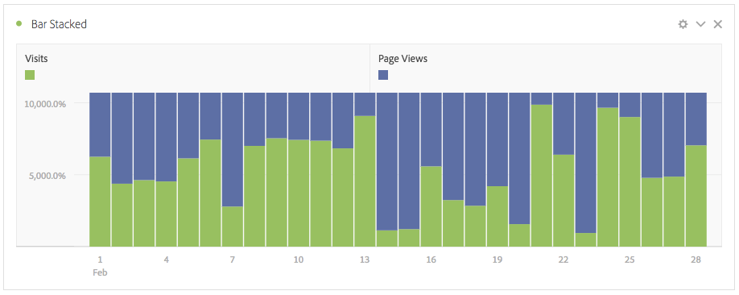

# Panoramica delle visualizzazioni

Workspace offre diverse visualizzazioni che consentono di generare rappresentazioni visive dei dati, ad esempio grafici a barre, grafici ad anello, istogrammi, grafici a linee, mappe, grafici a dispersione e altri. La maggior parte dei tipi di visualizzazione ti sarà familiare se utilizzi  Adobe Analytics. Tuttavia, Analysis Workspace consente di configurare le impostazioni di visualizzazione e offre molti tipi di visualizzazioni nuovi o unici, con funzionalità interattive.

Puoi accedere alle visualizzazioni dall’icona in alto a sinistra in Workspace, da un pannello vuoto o dal menu di scelta rapida del flusso di lavoro. In  Analysis Workspace sono disponibili i seguenti tipi di visualizzazione:

| Nome della visualizzazione | Descrizione |
| --- | --- |
| [Superfici](/help/analyze/analysis-workspace/visualizations/area.md) | Come un grafico a linee, ma con un&#39;area colorata sotto la linea. Un grafico a superficie è utile quando si hanno diverse metriche e si desidera visualizzare l’area di intersezione di due o più metriche. |
| [Barre](/help/analyze/analysis-workspace/visualizations/bar.md) | Mostra barre verticali che rappresentano diversi valori su una o più metriche. |
| [Grafico bullet](/help/analyze/analysis-workspace/visualizations/bullet-graph.md) | Mostra come un valore desiderato si confronta con altre gamme di prestazioni (obiettivi). |
| [Tabella coorte](/help/analyze/analysis-workspace/visualizations/cohort-table/cohort-analysis.md) | Una *`cohort`* è un gruppo di persone che condividono le stesse caratteristiche per un determinato periodo di tempo. L’analisi per coorte è utile per l’analisi del mantenimento, del churn o della latenza. |
| [Anello](/help/analyze/analysis-workspace/visualizations/donut.md) | Questa visualizzazione è simile al grafico a torta e presenta i dati come parti o segmenti di un intero. |
| [Abbandono](/help/analyze/analysis-workspace/visualizations/fallout/fallout-flow.md) | I rapporti di abbandono mostrano dove i visitatori hanno lasciato (abbandonato) una sequenza di pagine predefinite e dove hanno proseguito. Può essere impostato su sequenze finali o esatte |
| [Flusso](/help/analyze/analysis-workspace/visualizations/c-flow/flow.md) | Mostra i percorsi esatti dei clienti attraverso i siti Web e le app. |
| [Tabella a forma libera](/help/analyze/analysis-workspace/visualizations/freeform-table/freeform-table.md) | Una tabella a forma libera non è semplicemente una tabella di dati, ma è soprattutto una visualizzazione interattiva. È la base per l’analisi dei dati in Workspace. |
| [Istogramma](/help/analyze/analysis-workspace/visualizations/histogram.md) | Un istogramma invia visitatori, visite o hit in bucket in base a un volume di metrica. |
| [Barre orizzontali](/help/analyze/analysis-workspace/visualizations/horizontal-bar.md) | Mostra barre orizzontali che rappresentano diversi valori su una o più metriche. |
| [Linee](/help/analyze/analysis-workspace/visualizations/line.md) | Rappresenta le metriche utilizzando una linea per mostrare il cambiamento dei valori nel corso di un intervallo di tempo. Un grafico a linee utilizza il tempo lungo l&#39;asse x. |
| [Mappa](/help/analyze/analysis-workspace/visualizations/map-visualization.md) | Consente di creare una mappa visiva di qualsiasi metrica (comprese le metriche calcolate). |
| [Grafico a dispersione](/help/analyze/analysis-workspace/visualizations/scatterplot.md) | Mostra la relazione tra gli elementi dimensionali fino a tre metriche. |
| [Numero di riepilogo](/help/analyze/analysis-workspace/visualizations/summary-number-change.md) | Mostra la cella selezionata come 1 numero grande. |
| [Variazione di riepilogo](/help/analyze/analysis-workspace/visualizations/summary-number-change.md) | Mostra la modifica tra le celle selezionate come 1 numero/percentuale grande. |
| [Testo](/help/analyze/analysis-workspace/visualizations/text.md) | Consente di aggiungere testo definito dall’utente al progetto Workspace. Utile per aggiungere ulteriore contesto alle analisi e alle informazioni, oltre a sfruttare le descrizioni dei pannelli e delle visualizzazioni |
| [Mappa ad albero](/help/analyze/analysis-workspace/visualizations/treemap.md) | Visualizza i dati gerarchici (con struttura ad albero) come un insieme di rettangoli nidificati. |
| [Venn](/help/analyze/analysis-workspace/visualizations/venn.md) | Utilizza i cerchi per rappresentare la sovrapposizione metrica fino a 3 segmenti. |

## Impostazioni {#settings}

Ogni visualizzazione ha le proprie impostazioni che è possibile gestire. Per accedere [!UICONTROL Visualization Settings], fate clic sull&#39;icona [!UICONTROL Visualization Settings] a forma di ingranaggio. Alcune impostazioni includono:

| Impostazione | Descrizione |
| --- | --- |
| Tipo di visualizzazione | Modificare il tipo di elemento visivo utilizzato per rappresentare i dati. |
| Granularity (Granularità) | Per le visualizzazioni con tendenze, puoi modificare la granularità dell’ora (giorno, settimana, mese, ecc.) da questo menu a discesa. Questa modifica verrà applicata anche alla tabella dell&#39;origine dati. |
| Percentuali | Visualizza i valori in percentuale. |
| Sovrapposizione 100% | Questa impostazione sulle visualizzazioni sovrapposte di area, sovrapposte a barre o sovrapposte a barre orizzontali trasforma il grafico in una visualizzazione &quot;impilata al 100%&quot;. Esempio:  |
| Visualizzazione legenda | Consente di nascondere il testo della legenda dettagliato per la visualizzazione Summary Number (Numero riepilogo)/Summary Change (Modifica riepilogo). |
| Limite massimo elementi | Consente di limitare il numero di elementi presentati in una visualizzazione. |
| Ancoraggio asse Y su zero | Se tutti i valori rappresentati sul grafico sono uniformemente al di sopra dello zero, per impostazione predefinita la parte inferiore dell’asse y sarà NON-ZERO. Attivando questa opzione, l’asse y verrà forzata sullo zero (e il grafico verrà ridisegnato). |
| Normalizzazione | Forza le metriche ad adeguarsi alle proporzioni. Questa funzione è utile quando le metriche tracciate hanno dimensioni molto diverse. |
| Visualizza asse doppia | Applicabile solo in presenza di due metriche. È possibile avere un asse y a sinistra (per una metrica) e un altro a destra (per l’altra metrica). Questa funzione è utile quando le metriche tracciate hanno dimensioni molto diverse. |
| Mostra anomalie | Ottimizza i grafici a linee e le tabelle a forma libera mediante la visualizzazione della definizione delle anomalie. Il rilevamento delle anomalie nelle visualizzazioni di linea include un valore previsto (linea tratteggiata) e un intervallo previsto (banda ombreggiata). |

## Legend (Legenda){#legend}

Una legenda di visualizzazione consente di correlare la data in una tabella di origine alle serie plottate nella visualizzazione. La legenda è interattiva. Potete fare clic su un elemento legenda per mostrare o nascondere una serie nella visualizzazione. È utile per semplificare i dati visualizzati.

È inoltre possibile rinominare le etichette delle legende per rendere le immagini più fruibili. Note: legend editing does **not** apply to: Treemap, Bullet, Summary Change/Number, Text, Freeform, Histogram, Cohort or Flow visualizations.

Per modificare un&#39;etichetta di legenda:

1. Fai clic su una delle etichette della legenda.
1. Fai clic su **[!UICONTROL Edit Label]** (Modifica etichetta).

   

1. Inserisci il nuovo testo dell’etichetta.
1. Fai clic su **[!UICONTROL Enter]** per salvare.

Per approfondire, utilizza questo [collegamento a un video](https://docs.adobe.com/content/help/en/analytics-learn/tutorials/analysis-workspace/visualizations/series-label-editing.html) sull’argomento.

## Menu di scelta rapida {#right-click}

Per aggiungere altre funzionalità a una visualizzazione, fai clic con il pulsante destro del mouse sull’intestazione della visualizzazione. Le impostazioni variano a seconda della visualizzazione. Alcune delle impostazioni disponibili sono:

| Impostazione | Descrizione |
| --- | --- |
| Inserisci pannello copiato/visualizzazione | Consente di incollare (&quot;inserire&quot;) un pannello o una visualizzazione copiati in un’altra posizione all’interno del progetto o in un progetto completamente diverso. |
| Copia visualizzazione | Consente di fare clic con il pulsante destro del mouse e copiare una visualizzazione, in modo da poterla inserire in un&#39;altra posizione all&#39;interno del progetto o in un progetto completamente diverso. |
| [Download di elementi come CSV](https://experienceleague.adobe.com/docs/analytics/analyze/analysis-workspace/curate-share/download-send.html?#download-items) | Scarica come CSV fino a 50.000 elementi dimensionali per la dimensione selezionata. |
| [Scarica dati come CSV](https://experienceleague.adobe.com/docs/analytics/analyze/analysis-workspace/curate-share/download-send.html?#download-data) | Scarica l’origine dati di visualizzazione come CSV. |
| Duplica visualizzazione | Crea una copia della visualizzazione corrente, che potrai quindi modificare. |
| Modifica descrizione | Aggiungi (o modifica) una descrizione di testo per la visualizzazione. |
| Ottieni collegamento visualizzazione | Consente di indirizzare un utente a una visualizzazione specifica all&#39;interno di un progetto. Quando si fa clic sul collegamento, il destinatario dovrà effettuare il login prima di essere indirizzato alla visualizzazione esatta a cui è collegato. |
| Ricomincia | (Funziona per Flusso, Venn, Istogramma) Elimina la configurazione per la visualizzazione corrente e puoi riconfigurarla da zero. |

## Icona “Crea elemento visivo” {#quick-viz}

If you are not sure which visualization to pick, click the **[!UICONTROL Create Visual]** icon in any table row (available on hover). Questo è il modo più veloce per aggiungere una visualizzazione. Facendo clic su di essa, Analysis Workspace cerca di fare una stima ragionata per individuare la visualizzazione più idonea ai tuoi dati. Ad esempio, se hai selezionato 1 riga, verrà creato un grafico a linee con tendenze. Se sono selezionate 3 righe di segmento, verrà creato un diagramma di Venn.

