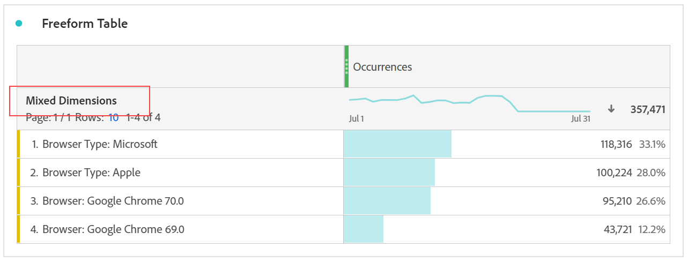

# Elementi dimensionali dinamici e statici nelle tabelle a forma libera

Le righe e le colonne nelle tabelle a forma libera possono contenere diversi valori dei componenti. Questi valori possono essere dinamici (ovvero cambiare con il tempo) o statici (non cambiare con il tempo), a seconda dell’analisi che desideri generare.

## Elementi dimensionali dinamici

Gli elementi dimensionali dinamici cambiano con il tempo e dipendono dalla metrica per cui si effettua l’ordinamento nella tabella a forma libera. Gli elementi dimensionali dinamici sono consigliati quando si desidera analizzare gli elementi principali per un determinato periodo di tempo.

Quando rilasci una dimensione in una tabella a forma libera, vengono restituite righe dinamiche. Esse rappresentano gli elementi principali che corrispondono alla dimensione per una metrica e un periodo di tempo specifici. È inoltre possibile rilasciare una dimensione nelle colonne di una tabella a forma libera. Così facendo la dimensione si espande automaticamente nei primi 5 elementi dimensionali.

Ad esempio, quando si trascina la dimensione Tipo di browser nella tabella, gli elementi principali della dimensione (ad esempio Microsoft, Apple, Google, ecc.) sono restituiti nelle righe della tabella in modo dinamico. Se viene rilasciata in una colonna, sono restituiti in modo dinamico i primi cinque elementi della dimensione Tipo di browser.

Gli elementi dimensionali dinamici dispongono dell’opzione filtro righe e **non** dispongono di icone lucchetto e X.

## Elementi dimensionali statici

Gli elementi dimensionali statici non cambiano con il tempo, sono componenti fissi che vengono sempre restituiti in una tabella a forma libera. Gli elementi dimensionali statici sono consigliati quando si desidera analizzare sempre gli stessi elementi, siano essi campagne o giorni della settimana specifici.

Ogni volta che selezioni e rilasci manualmente valori di componenti specifici (dimensione, metrica, segmento, intervallo di date) in una tabella, il risultato è un elenco statico di righe o colonne. Puoi inoltre creare elementi dimensionali statici se lo desideri:

* Dalle righe, fai clic con il pulsante destro del mouse e scegli [!UICONTROL Display only selected rows]
* Dalle colonne, fai clic con il pulsante destro del mouse e scegli [!UICONTROL Make item static]

Ad esempio, quando trascini su specifici elementi della dimensione Tipo di browser, come Microsoft e Apple, questi due elementi specifici vengono sempre inseriti nella tabella.

Gli elementi dimensionali statici **non** dispongono dell’opzione filtro righe. Su ogni elemento sono invece presenti le icone lucchetto e X. Fai clic sull’icona X per rimuovere l’elemento dimensionale dalla tabella.

## Elementi dimensionali misti

È possibile aggiungere alla stessa tabella elementi dimensionali di dimensioni diverse. In questi casi, l’intestazione della riga indica “dimensioni miste”. Questi elementi dimensionali sono statici. Ad esempio, è possibile aggiungere elementi dimensionali specifici dalla dimensione Tipo di browser e altri elementi dimensionali dalla dimensione Browser.

## Righe del totale a forma libera

Le righe dinamiche e statiche si comportano in modo diverso nella riga del totale a forma libera. Per impostazione predefinita:

* Le righe dinamiche vengono sommate lato server e deduplicano metriche quali visite o visitatori
* Le righe statiche vengono sommate lato client e **non** duplicano le metriche. Per calcolare la riga del totale lato server, modifica l’impostazione della riga in **Mostra totale**. [Ulteriori informazioni](https://experienceleague.adobe.com/docs/analytics/analyze/analysis-workspace/visualizations/freeform-table/workspace-totals.html?lang=it-IT)
