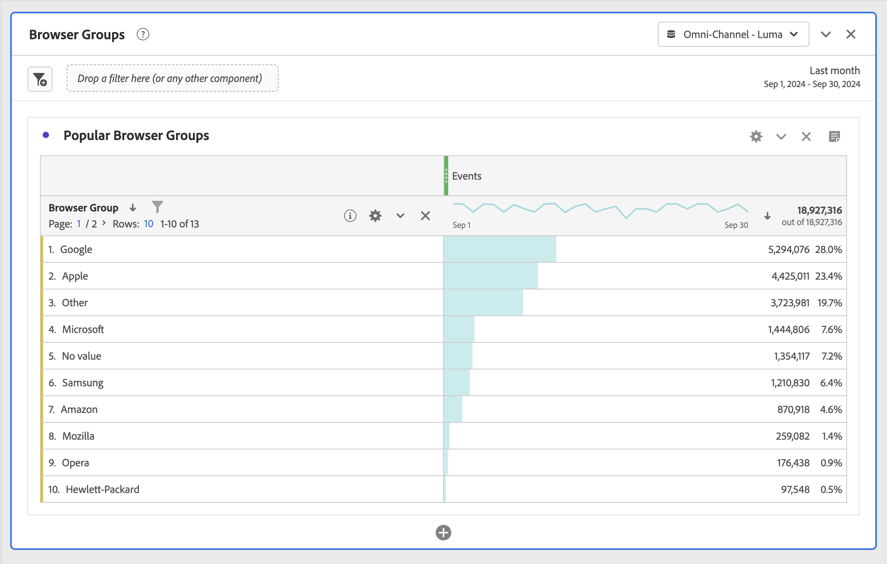

# Elementi dimensionali dinamici e statici

Nelle tabelle a forma libera, le righe e le colonne possono contenere vari valori dei componenti. Questi valori possono essere dinamici (cambiare nel tempo) o statici (non cambiare nel tempo), a seconda dell’analisi che desideri generare.

## Elementi dimensionali dinamici

Gli elementi dimensionali dinamici cambiano nel tempo e dipendono dalla metrica in base alla quale viene ordinato nella tabella a forma libera. Gli elementi dimensionali dinamici sono consigliati quando si desidera analizzare gli elementi principali per un determinato periodo di tempo.

Quando rilasci una dimensione in una tabella a forma libera, vengono restituite righe dinamiche. Le righe dinamiche rappresentano gli elementi principali che corrispondono alla dimensione per una metrica e un periodo di tempo specifici. È inoltre possibile rilasciare una dimensione nelle colonne di una tabella a forma libera. Così facendo la dimensione si espande automaticamente nei primi 5 elementi dimensionali.

Ad esempio, quando trascini la dimensione Tipo di browser nella tabella, gli elementi dimensionali principali (ad esempio Microsoft, Apple, Google, ecc.) tornare dinamicamente alle righe della tabella. Se viene rilasciata in una colonna, sono restituiti in modo dinamico i primi cinque elementi della dimensione Tipo di browser.

Gli elementi dimensionali dinamici dispongono dell&#39;opzione filtro righe  e di una  e **non** dispongono di un blocco . <!--do they have the lock icon? --> Quando fai clic su  accanto a un elemento di dimensione dinamica, viene applicato automaticamente un filtro. Per ulteriori informazioni sull&#39;applicazione di filtri alle tabelle, vedere [Filtrare e ordinare le tabelle](/help/analyze/analysis-workspace/visualizations/freeform-table/filter-and-sort.md).

## Elementi dimensionali statici

Gli elementi dimensionali statici non cambiano con il tempo, sono componenti fissi che vengono sempre restituiti in una tabella a forma libera. Gli elementi dimensionali statici sono consigliati quando si desidera analizzare sempre gli stessi elementi, siano essi campagne o giorni della settimana specifici.

Ogni volta che selezioni e rilasci manualmente valori di componenti specifici (dimensione, metrica, filtro, intervallo di date) in una tabella, il risultato è un elenco statico di righe o colonne.

Ad esempio, quando trascini su specifici elementi della dimensione Tipo di browser, come Microsoft e Apple, questi due elementi specifici vengono sempre inseriti nella tabella.

È inoltre possibile creare elementi dimensionali statici se si sceglie di selezionare **[!UICONTROL Display only selected rows]** dal menu di scelta rapida per le righe selezionate.

Gli elementi dimensionali statici **non** dispongono dell’opzione filtro righe. Su ogni elemento sono invece presenti  e . Seleziona  per rimuovere l&#39;elemento dimensione dalla tabella.

## Elementi dimensionali misti

È possibile aggiungere alla stessa tabella elementi dimensionali di dimensioni diverse. In questi casi, l&#39;intestazione di riga indica **[!UICONTROL Mixed Dimensions]**. Questi elementi dimensionali sono statici. Ad esempio, è possibile aggiungere elementi dimensionali specifici dalla dimensione Gruppo di browser e altri elementi dimensionali dalla dimensione Nome browser.

## Righe del totale a forma libera

Le righe dinamiche e statiche si comportano in modo diverso nella riga del totale a forma libera. Per impostazione predefinita:

* Le righe dinamiche vengono sommate lato server e deduplicano metriche quali sessioni o persone.
* Le righe statiche vengono sommate lato client e **non** duplicano le metriche. Per calcolare la riga del totale lato server, modifica l’impostazione della riga in **Mostra totale**. [Ulteriori informazioni](/help/analyze/analysis-workspace/visualizations/freeform-table/workspace-totals.md)

>[!BEGINSHADEBOX]

Vedi  [Riordinare le righe statiche](https://experienceleague.adobe.com/en/docs/analytics-learn/tutorials/analysis-workspace/building-freeform-tables/reordering-static-rows-in-analysis-workspace){target="_blank"} per un video demo.

>[!ENDSHADEBOX]

