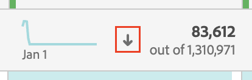

# Filtrare e ordinare tabelle

Le tabelle a forma libera in Analysis Workspace sono alla base dell’analisi interattiva dei dati. In quanto tali, possono contenere migliaia di righe di informazioni. Filtrare e ordinare i dati può essere una parte fondamentale per una corretta visualizzazione delle informazioni più importanti.

## Tabelle di filtro

I filtri in Analysis Workspace ti aiutano a far emergere le informazioni più importanti.

Per filtrare i dati nelle tabelle a forma libera:

1. In una tabella a forma libera, passa il cursore del mouse sulla colonna contenente i dati da filtrare. <!--only some types of columns show the filter... Which? Just Dimensions?-->

1. Seleziona la **Filtro** quando appare.

   

1. In [!UICONTROL **Ricerca di parole o frasi**] specificare una parola o una frase che si desidera filtrare. Vengono visualizzate solo le righe contenenti la parola o la frase esatta specificata.

1. (Facoltativo) Per filtrare in base a criteri diversi o a più criteri, seleziona [!UICONTROL **Mostra avanzate**].

   Sono disponibili le seguenti opzioni

   | Opzione | Funzione |
   |---------|----------|
   | [!UICONTROL **Includi non specificato (nessuno)**] | Selezionare questa opzione per visualizzare nella tabella i dati che non rientrano in nessuna delle dimensioni della tabella. <!--what is this?--> |
   | [!UICONTROL **Corrispondenza**] | 
Scegli [!UICONTROL **Se tutti i criteri sono soddisfatti**] per mostrare solo i dati che soddisfano tutti i criteri specificati. In genere, questa opzione genera dati più precisi.
 
Scegli [!UICONTROL **Se sono soddisfatti dei criteri**] per mostrare i dati che soddisfano uno qualsiasi dei criteri di filtro specificati. Questa opzione genera in genere dati meno elaborati.
 |
   | [!UICONTROL **Criteri**] | 
Seleziona tra le seguenti opzioni filtro:

(Seleziona [!UICONTROL **Aggiungi riga**] per aggiungere più criteri di filtro. L’opzione selezionata nella [!UICONTROL **Corrispondenza**] determina se tutti i criteri aggiunti devono essere soddisfatti o meno.)
<ul><li>
[!UICONTROL **Contiene la frase**]: Nei risultati filtrati vengono inclusi solo i dati che contengono la frase esatta specificata. Le parole devono essere nell&#39;ordine specificato nel [!UICONTROL **Campo parola o frase di ricerca**].
Questa è l’impostazione predefinita quando si esegue una ricerca semplice.

</li><li>
[!UICONTROL **Contiene qualsiasi termine**]: Nei risultati filtrati sono inclusi solo i dati contenenti una o più parole della frase specificata. 
</li><li>
[!UICONTROL **Contiene tutti i termini**]: Nei risultati filtrati sono inclusi solo i dati che contengono tutte le parole della frase specificata. Le parole non devono necessariamente essere nell&#39;ordine specificato nel [!UICONTROL **Campo parola o frase di ricerca**].
</li><li>
[!UICONTROL **Non contiene alcun termine**]: Nei risultati filtrati sono inclusi solo i dati che non contengono alcuna delle parole della frase specificata. 
</li><li>
[!UICONTROL **Non contiene la frase**]: Nei risultati filtrati sono inclusi solo i dati che non contengono la frase esatta specificata. Le parole devono essere nell&#39;ordine specificato nel [!UICONTROL **Campo parola o frase di ricerca**].
</li><li>
[!UICONTROL **Uguale**]: Nei risultati filtrati vengono inclusi solo i dati che corrispondono esattamente alla frase specificata. 
</li><li>
[!UICONTROL **Non uguale a**]: Nei risultati filtrati vengono inclusi solo i dati che non corrispondono esattamente alla frase specificata. 
</li><li>
[!UICONTROL **Inizia con**]: Nei risultati filtrati sono inclusi solo i dati che iniziano con la parola o la frase esatta specificata. 
</li><li>
[!UICONTROL **Termina con**]: Nei risultati filtrati sono inclusi solo i dati che terminano con la parola o la frase esatta specificata. 
</li></ul> |
   | [!UICONTROL **Escludere sempre gli elementi**] | Specifica il nome degli elementi da escludere dai dati filtrati. |

1. Seleziona [!UICONTROL **Applica**] per filtrare i dati.

   La **Filtro** icona  diventa blu quando un filtro viene applicato alla tabella.

## Ordinare le tabelle

Puoi ordinare i dati di una tabella a forma libera in base a una qualsiasi delle colonne disponibili in Analysis Workspace.

Icona a freccia giù  è visibile nell’intestazione della colonna in base alla quale i dati vengono ordinati.

Per ordinare i dati di una tabella a forma libera in base a una particolare colonna:

1. Passa il puntatore del mouse sul titolo della colonna in base al quale vuoi ordinare i dati.

1. Seleziona l’icona a forma di freccia giù quando viene visualizzata.

   

   I dati della tabella sono ordinati in base alla colonna selezionata.
