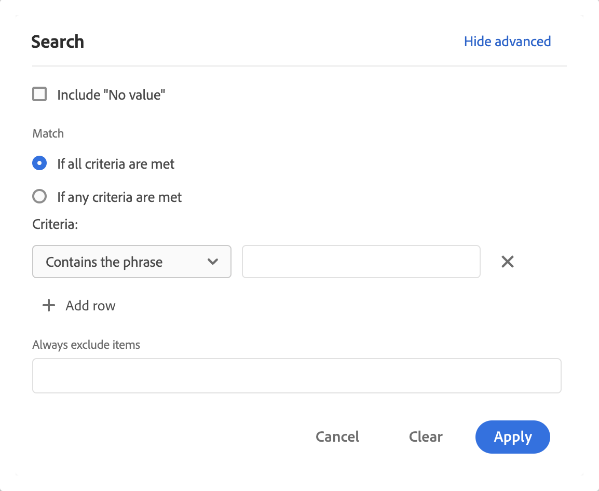
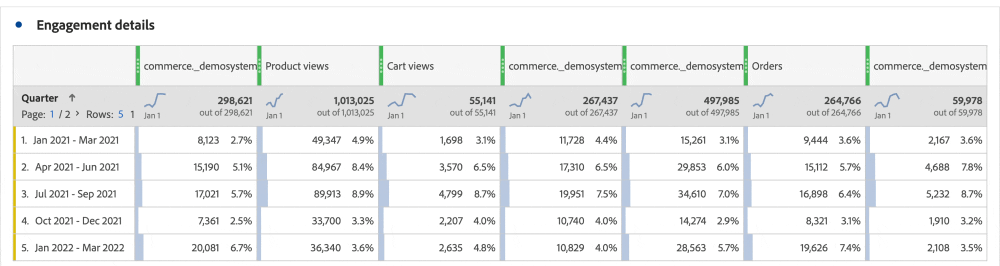

# Filtra e ordina tabelle a forma libera

Le tabelle a forma libera in Analysis Workspace sono la base dell’analisi interattiva dei dati. In quanto tali, possono contenere migliaia di righe di informazioni. Filtrare e ordinare i dati può essere fondamentale per far emergere in modo efficace le informazioni più importanti.

## Filtrare le tabelle

I filtri in Analysis Workspace ti aiutano a far emergere le informazioni più importanti.

>[!NOTE]
>
> Solo gli elementi dimensionali dinamici possono essere filtrati come descritto in questa sezione. Gli elementi dimensionali statici non possono essere filtrati. Per ulteriori informazioni, vedere [Elementi dimensionali dinamici e statici nelle tabelle a forma libera](/help/analyze/analysis-workspace/visualizations/freeform-table/column-row-settings/manual-vs-dynamic-rows.md).

Puoi utilizzare diversi metodi per filtrare le righe da una tabella a forma libera.

- Escludere righe specifiche da una tabella
- Applicare filtri a una tabella
- Utilizzare i filtri per il pubblico

Assicurati di leggere l&#39;impatto di ogni metodo sui [totali delle tabelle a forma libera](/help/analyze/analysis-workspace/visualizations/freeform-table/workspace-totals.md).

### Escludere righe specifiche da una tabella

È possibile escludere rapidamente righe specifiche dalla tabella senza dover utilizzare  **[!UICONTROL Filter]**.

>[!NOTE]
>
>Quando si escludono le righe come descritto in questa sezione, viene aggiunta automaticamente una regola [!UICONTROL Always exclude items] nella finestra di dialogo del filtro [!UICONTROL Advanced]. Puoi visualizzare la regola applicata selezionando l&#39;icona Filtro , quindi [**[!UICONTROL Show advanced]**](#apply-a-simple-or-advanced-filter-to-a-table).

Per escludere righe specifiche da una tabella a forma libera:

1. Passa il puntatore del mouse sulla riga da escludere, quindi seleziona .

   Tenere premuto il tasto ***shift*** per selezionare un intervallo di righe, oppure il tasto ***cmd*** (in Mac) o il tasto ***ctrl*** (in Windows) per selezionare più righe.

<!--### Right-click > Delete selected rows

Note: this option does not seem to work. AN-338422

1. Select 1 or more rows. 
1. Right-click and select **[!UICONTROL Delete Selected Rows]**. 

   This action will remove the rows from the table and apply a table filter.-->

### Applicare un filtro semplice o avanzato a una tabella

Per filtrare i dati nelle tabelle a forma libera:

1. Passa il puntatore del mouse sulla colonna contenente i dati da filtrare. <!--only some types of columns show the filter... Which? Just Dimensions?-->

1. Selezionare  **Filtro** quando viene visualizzato.

   

   Nella finestra di dialogo **[!UICONTROL Search]** sono disponibili le seguenti opzioni:

   {width="500"}

   | Opzione | Funzione |
   |---------|----------|
   | [!UICONTROL **Includi &quot;Nessun valore&quot;**] | Selezionare questa opzione per visualizzare una riga **[!UICONTROL No value]** nella tabella per i dati privi di valore per la dimensione selezionata. Deselezionare questa opzione per nascondere la riga **[!UICONTROL No value]**. |
   | [!UICONTROL **Parola o frase di ricerca**] | Specificare una parola o una frase in base alla quale si desidera filtrare. Vengono visualizzate solo le righe contenenti la parola o la frase esatta specificata. |

1. (Facoltativo) Per filtrare in base a criteri diversi o a più criteri, seleziona [!UICONTROL **Mostra avanzate**].

   Sono disponibili le seguenti opzioni di filtro avanzate:

   {width=500}

   | Opzione | Funzione |
   |---------|----------|
   | [!UICONTROL **Includi &quot;Nessun valore&quot;**] | Selezionare questa opzione per visualizzare una riga **[!UICONTROL No value]** nella tabella per i dati privi di valore per la dimensione selezionata. Deselezionare questa opzione per nascondere la riga **[!UICONTROL No value]**. |
   | [!UICONTROL **Corrispondenza**] | Scegli [!UICONTROL **Se sono soddisfatti tutti i criteri**] per mostrare solo i dati che soddisfano tutti i criteri specificati. In genere, questa opzione genera dati più precisi.  Scegliere [!UICONTROL **Se sono soddisfatti dei criteri**] per visualizzare i dati che soddisfano uno dei criteri di filtro specificati. Di solito, questa opzione genera dati meno precisi. |
   | [!UICONTROL **Criteri**] | Selezionare una delle opzioni di filtro seguenti: <ul><li>[!UICONTROL **Contiene la frase**] (impostazione predefinita): solo i dati che contengono la frase esatta specificata vengono inclusi nei risultati filtrati. Le parole devono essere nell’ordine specificato nel [!UICONTROL **campo Cerca parola o frase**].</li><li>[!UICONTROL **Contiene qualsiasi termine**]: nei risultati filtrati sono inclusi solo i dati contenenti una o più parole della frase specificata. </li><li>[!UICONTROL **Contiene tutti i termini**]: nei risultati filtrati sono inclusi solo i dati che contengono tutte le parole della frase specificata. Le parole non devono necessariamente essere nell&#39;ordine specificato nel [!UICONTROL **campo Cerca parola o frase**].</li><li>[!UICONTROL **Non contiene alcun termine**]: nei risultati filtrati sono inclusi solo i dati che non contengono le parole della frase specificata. </li><li>[!UICONTROL **Non contiene la frase**]: nei risultati filtrati sono inclusi solo i dati che non contengono la frase esatta specificata. Le parole devono essere nell’ordine specificato nel [!UICONTROL **campo Cerca parola o frase**].</li><li>[!UICONTROL **È uguale a**]: solo i dati che corrispondono esattamente alla frase specificata vengono inclusi nei risultati filtrati. </li><li>[!UICONTROL **Non è uguale a**]: nei risultati filtrati vengono inclusi solo i dati che non corrispondono esattamente alla frase specificata. </li><li>[!UICONTROL **Inizia con**]: nei risultati filtrati sono inclusi solo i dati che iniziano con la parola o la frase esatta specificata. </li><li>[!UICONTROL **Termina con**]: nei risultati filtrati sono inclusi solo i dati che terminano con la parola o la frase esatta specificata. </li></ul>Seleziona  [!UICONTROL **Aggiungi riga**] per aggiungere più criteri di filtro. L&#39;opzione selezionata per [!UICONTROL **Corrispondenza**] determina **[!UICONTROL If all criteria are met]** o **[!UICONTROL If any criteria are met]**. |
   | [!UICONTROL **Escludi sempre gli elementi**] | Specifica il nome degli elementi da escludere dai dati filtrati. |

1. Selezionare **[!UICONTROL Apply]** per filtrare i dati. Selezionare **[!UICONTROL Clear]** per cancellare tutti gli input. Selezionare **[!UICONTROL Cancel]** per annullare e chiudere la finestra di dialogo.  Un&#39;icona  **Filtro** colorata indica e visualizza i dettagli quando un filtro viene applicato alla tabella.

## Ordinare le tabelle

Puoi ordinare i dati di una tabella a forma libera in base a qualsiasi colonna in Analysis Workspace che sia una dimensione o una metrica. Una freccia indica l&#39;ordinamento dei dati (**↓** per decrescente o **↑** per crescente).

