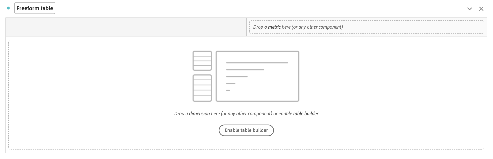
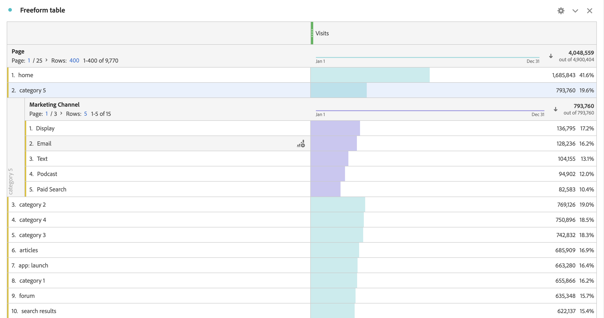

# Tabella a forma libera

In Analysis Workspace, una tabella a forma libera è la base per l’analisi dei dati interattivi. Puoi trascinare una combinazione di [componenti](https://experienceleague.adobe.com/docs/analytics/analyze/analysis-workspace/components/analysis-workspace-components.html?lang=it) nelle righe e nelle colonne per creare una tabella personalizzata per l’analisi. Man mano che ciascun componente viene rilasciato, la tabella viene aggiornata immediatamente, in modo da poter analizzare e approfondire rapidamente.

Per illustrare l’aspetto, inizia con una tabella a forma libera vuota.

Se rilasci **[!UICONTROL ** Visite **]** metrica **[!UICONTROL ** Rilascia una metrica qui (o qualsiasi altro componente)**]**, la tabella a forma libera si popola automaticamente con le visite al giorno per il periodo selezionato.

Se poi rilascia la **[!UICONTROL ** Pagina **]** per sostituire la **[!UICONTROL ** Giorno **]** nella colonna delle dimensioni , la tabella a forma libera riflette automaticamente le visite per ogni pagina.

E poi si può scomporre, per esempio, il **[!UICONTROL ** categoria:5 **]** rilasciando la pagina **[!UICONTROL ** Canale di marketing **]** della dimensione **[!UICONTROL ** categoria:5 **]** fila.

## Tabelle automatizzate

Come illustrato in precedenza, il modo più rapido per creare una tabella consiste nel rilasciare i componenti direttamente in un progetto, un pannello o una tabella a forma libera vuota. Una tabella a forma libera verrà creata automaticamente in un formato consigliato. [Guarda il tutorial](https://experienceleague.adobe.com/docs/analytics-learn/tutorials/analysis-workspace/building-freeform-tables/auto-build-freeform-tables-in-analysis-workspace.html?lang=it).

## Generatore di tabelle a forma libera

Se prima preferisci aggiungere diversi componenti alla tabella e quindi eseguire il rendering dei dati, puoi attivare il Generatore di tabelle a forma libera. Con il generatore abilitato, puoi trascinare e rilasciare più dimensioni, raggruppamenti, metriche e segmenti per creare tabelle che rispondano a domande più complesse. I dati non verranno aggiornati istantaneamente, ma solo dopo aver fatto clic su **[!UICONTROL Build]**.

## Interazioni possibili nelle tabelle

Puoi interagire con una tabella a forma libera e personalizzarla in diversi modi:

* **Righe**
   * È possibile inserire più righe in una singola schermata regolando la [densità di visualizzazione](https://experienceleague.adobe.com/docs/analytics/analyze/analysis-workspace/build-workspace-project/view-density.html?lang=it) del progetto.
   * Prima dell’impaginazione ogni riga delle dimensioni può visualizzare fino a 400 righe. Fai clic sul numero accanto a “Rows” (Righe) per visualizzare più righe su una pagina. Passa a una pagina diversa utilizzando la freccia delle pagine nell’intestazione.
   * Le righe possono essere suddivise per componenti aggiuntivi. Per suddividere più righe alla volta, seleziona semplicemente più righe e quindi trascina il componente successivo sopra le righe selezionate. Scopri di più sulle [suddivisioni](https://experienceleague.adobe.com/docs/analytics/analyze/analysis-workspace/components/dimensions/t-breakdown-fa.html?lang=it).
   * Le righe possono essere [filtrate](https://experienceleague.adobe.com/docs/analytics/analyze/analysis-workspace/visualizations/freeform-table/filter-and-sort.html?lang=it) per visualizzare un set ridotto di elementi. Sono disponibili altre impostazioni in [Impostazioni riga](https://experienceleague.adobe.com/docs/analytics/analyze/analysis-workspace/visualizations/freeform-table/column-row-settings/table-settings.html?lang=it).

* **Colonne**
   * I componenti possono essere impilati all’interno di colonne per creare metriche segmentate, analisi incrociate e altro ancora.
   * La visualizzazione di ogni colonna può essere regolata nelle [impostazioni della colonna](https://experienceleague.adobe.com/docs/analytics/analyze/analysis-workspace/build-workspace-project/column-row-settings/column-settings.html?lang=it).
   * Sono disponibili diverse azioni tramite il [menu di scelta rapida](https://experienceleague.adobe.com/docs/analytics-learn/tutorials/analysis-workspace/building-freeform-tables/using-the-right-click-menu.html?lang=it). A seconda dell’elemento su cui fai clic (intestazione della tabella, righe o colonne), il menu fornisce azioni diverse.

## Esportare i dati dalla tabella a forma libera

Ulteriori informazioni su tutte le [opzioni di esportazione](https://experienceleague.adobe.com/docs/analytics/analyze/analysis-workspace/curate-share/download-send.html?lang=it) dei dati per Analysis Workspace.

* Fai clic con il pulsante destro del mouse e scegli **[!UICONTROL Copy data to clipboard]** per esportare i dati della tabella visualizzati. Se è selezionata una parte della tabella, questa opzione diventa **[!UICONTROL Copy selection to clipboard]**. È possibile copiare i dati selezionati anche con la scelta rapida da tastiera **Ctrl + C**.
* Fai clic con il pulsante destro del mouse e scegli **[!UICONTROL Download data as CSV]** per scaricare come CSV i dati della tabella visualizzata. Se è selezionata una parte della tabella, questa opzione diventa **[!UICONTROL Download selection as CSV]**.
* Clic con il pulsante destro del mouse > **[!UICONTROL Project > Download items as CSV]** esporta fino a 50.000 elementi dimensionali per la dimensione selezionata.

Ulteriori informazioni su tutte le [opzioni di esportazione](https://experienceleague.adobe.com/docs/analytics/analyze/analysis-workspace/curate-share/download-send.html?lang=it) dei dati per Analysis Workspace.

## Video

Panoramica del generatore di tabelle a forma libera:

>[!VIDEO](https://video.tv.adobe.com/v/31318/?quality=12)

Filtri per tabelle a forma libera:

>[!VIDEO](https://video.tv.adobe.com/v/23232/?quality=12)

Totali nelle tabelle a forma libera:

>[!VIDEO](https://video.tv.adobe.com/v/29273/?quality=12)
