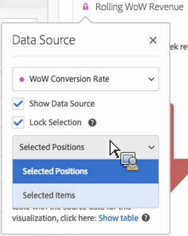

# Istogramma

Un istogramma è simile a un grafico a barre, ma con i numeri raggruppati in intervalli. Analytics automatizza la creazione di intervalli di numeri, ma puoi comunque cambiare le impostazioni in [Impostazioni avanzate](#section_09D774C584864D4CA6B5672DC2927477).

## Build a histogram {#section_74647707CC984A1CB6D3097F43A30B45}

Per creare un istogramma:

1. Click **[!UICONTROL Visualizations]** in the left rail.
1. Drag **[!UICONTROL Histogram]** to the panel.
1. Choose a Metric to drag to the Histogram visualization and click **[!UICONTROL Build]**.

>[!NOTE]
>
>Gli istogrammi supportano solo metriche standard, non le metriche calcolate.

In questo esempio abbiamo usato la metrica Visualizzazioni di pagina per Visitatori unici. Il primo intervallo (a sinistra) corrisponde a 1 visualizzazione di pagina per visitatore univoco; il secondo a 2 visualizzazioni di pagina, ecc.

## Advanced settings {#section_09D774C584864D4CA6B5672DC2927477}

Per regolare le impostazioni dell’istogramma, fai clic sull’icona Impostazioni (a forma di ingranaggi) in alto a destra. Puoi modificare le seguenti impostazioni:

| Impostazioni istogramma | Azione |
|---|---|
| Intervallo iniziale | Determina con quale intervallo inizia l’istogramma. L’impostazione predefinita è 1. Puoi impostare il numero iniziale da 0 all’infinito (non sono consentiti numeri negativi). |
| Intervalli di metrica | Puoi aumentare o ridurre il numero di intervalli di dati. Il numero massimo consentito è 50. |
| Dimensione intervalli di metrica | Puoi impostare la dimensione di ogni intervallo. Ad esempio, puoi cambiare la dimensione dell’intervallo da 1 a 2 visualizzazioni di pagina. |
| Metodo di conteggio | Consente di scegliere tra [Visitatore](https://marketing.adobe.com/resources/help/en_US/reference/visitors.html), [Visita](https://marketing.adobe.com/resources/help/en_US/reference/metrics_visit.html) o [Hit](https://marketing.adobe.com/resources/help/en_US/reference/hit.html). Ad esempio, visualizzazioni di pagina per visita, per visitatore o per hit. Per Hit, “Occorrenze” viene usato come metrica dell’asse y in una tabella a forma libera. |

**Esempi**:

* Con Intervallo iniziale: 1; Intervalli di metrica: 5; Dimensione intervalli di metrica: 2 viene generato l’istogramma: 1-2, 3-4, 5-6, 7-8, 9-10.
* Con Intervallo iniziale: 0; Intervalli di metrica: 3; Dimensione intervalli di metrica: 5 viene generato l’istogramma: 0-4, 5-9, 10-14.

## View and edit histogram data {#section_B2CD7CDF0F6B432F928103AE7AAA3617}

To view or change the data source for the histogram chart, click the dot next to the Histogram header to go to **[!UICONTROL Data Source Settings]** &gt; **[!UICONTROL Show Data Source]**.

I segmenti pregenerati che compaiono nella tabella sono segmenti interni e non saranno visualizzati nel selettore dei segmenti. Click the "i" icon next to the segment name, then click **[!UICONTROL Make public]** to make the segment public.

Per scoprire altri modi di gestire le tabelle di dati a forma libera e altre visualizzazioni, ad esempio per suddividere i dati, visita [questa pagina](https://marketing.adobe.com/resources/help/en_US/analytics/analysis-workspace/freeform-analysis-visualizations.html).
