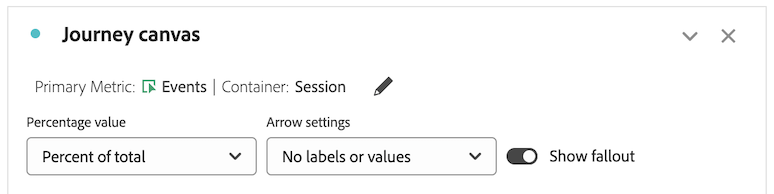

# Configurare una visualizzazione dell’area di lavoro del percorso {#configure-journey-canvas}

>[!BEGINSHADEBOX]

_In questo articolo viene documentata la visualizzazione dell&#39;area di lavoro del Percorso in_  _&#x200B;**Adobe Analytics**.  _ Vedere [Configurare una visualizzazione dell&#39;area di lavoro del Percorso](https://experienceleague.adobe.com/it/docs/analytics-platform/using/cja-workspace/visualizations/journey-canvas/configure-journey-canvas) per la versione __&#x200B;**Customer Journey Analytics**&#x200B;di questo articolo._

>[!ENDSHADEBOX]

{{release-limited-testing}}

La visualizzazione dell’area di lavoro del percorso consente di analizzare e ottenere informazioni approfondite sui percorsi forniti agli utenti e alla clientela.

## Panoramica dell’area di lavoro del percorso

Per ulteriori informazioni sull’area di lavoro del percorso, consulta [Panoramica dell’area di lavoro del percorso](/help/analyze/analysis-workspace/visualizations/journey-canvas/journey-canvas.md), incluse:

* Funzioni chiave

* Insight potenziali

* Differenze tra l’area di lavoro del percorso e il fallout

* E altro ancora

## Iniziare a creare una visualizzazione dell’area di lavoro del percorso

1. Aggiungi un pannello vuoto al progetto, seleziona l’icona [!UICONTROL **Visualizzazioni**] nella barra a sinistra, quindi trascina la visualizzazione [!UICONTROL **Area di lavoro del percorso**]  nel pannello.

   Oppure

   Aggiungi una visualizzazione dell’area di lavoro del percorso utilizzando uno dei modi descritti nella sezione [Aggiungere visualizzazioni a un pannello](/help/analyze/analysis-workspace/visualizations/freeform-analysis-visualizations.md#add-visualizations-to-a-panel) in [Panoramica delle visualizzazioni](/help/analyze/analysis-workspace/visualizations/freeform-analysis-visualizations.md).

   

1. Per configurare l’area di lavoro del percorso, specifica le informazioni di base seguenti:

   | Campo | Funzione |
   |---------|----------|
   | [!UICONTROL **Metrica primaria**] | Determina la metrica utilizzata per calcolare i valori percentuali e numerici su ciascun nodo del percorso.
**Nota**: l&#39;ambito dei dati inclusi in ogni valore percentuale e numerico è determinato dalla metrica scelta nel campo **[!UICONTROL Journey canvas container]**. Se ad esempio **[!UICONTROL Person]** è impostato come contenitore, le statistiche visualizzate nel percorso si estendono su più sessioni per una determinata persona. Se **[!UICONTROL Session]** è impostato come contenitore, le statistiche mostrate nel percorso sono vincolate a una singola sessione definita per una determinata persona.

Prendi in considerazione gli esempi seguenti di come la metrica primaria influisce sui valori percentuali e numerici di ciascun nodo:
<ul><li>Se _Persone_ è la metrica primaria e _Persona_ è il contenitore, solo le persone che hanno un evento che corrisponde ai criteri di ogni nodo successivo nel percorso si spostano in tutto il percorso. Il fallout si verifica su un nodo quando una persona non raggiunge nessuno dei nodi immediatamente successivi nel percorso. Tale persona potrebbe aver eseguito altre azioni sul sito, ma non ha soddisfatto i criteri definiti da nessuno dei nodi immediatamente successivi.</li><li>Se _Persone_ è la metrica primaria e _Sessione_ è il contenitore, solo le persone che dispongono di un evento che corrisponde ai criteri di ciascun nodo del percorso all’interno di una singola sessione proseguono nel percorso. Il fallout si verifica su un nodo quando una persona non raggiunge nessuno dei nodi immediatamente successivi nel percorso all’interno di una singola sessione. Tale persone potrebbe aver eseguito altre azioni sul sito all’interno della sessione, ma non ha soddisfatto i criteri definiti da nessuno dei nodi immediatamente successivi.</li></ul> 
La metrica primaria influisce sugli aspetti seguenti della visualizzazione dell’area di lavoro del percorso:
<ul><li>Numero totale mostrato su ciascun nodo.  
Ad esempio, se Eventi è la metrica primaria, ciascun nodo mostra il numero di persone che hanno avuto un evento che corrisponde ai criteri di quel nodo e di ogni nodo precedente che lo precede nel percorso.
</li><li>Percentuale mostrata su ciascun nodo. Una volta creata la visualizzazione, è possibile utilizzare il menu a discesa **[!UICONTROL Percentage value]** per scegliere di visualizzare la percentuale del totale, la percentuale del nodo precedente o la percentuale del nodo iniziale.
Ad esempio, se Eventi è la metrica primaria, ciascun nodo mostra la percentuale di persone che hanno avuto un evento che corrisponde ai criteri di quel nodo e di ogni nodo precedente che lo precede nel percorso.
</li><li>Quando aggiungi una dimensione alla visualizzazione, vengono aggiunti i primi 3 nodi della visualizzazione, in base alla metrica primaria.</li></ul> |
   | [!UICONTROL **Metrica secondaria**] | Determina la metrica secondaria utilizzata per calcolare i valori percentuali e numerici su ciascun nodo del percorso. La metrica secondaria è facoltativa. 
**Nota**: l&#39;ambito dei dati inclusi in ogni valore percentuale e numerico è determinato dalla metrica scelta nel campo **[!UICONTROL Journey canvas container]**. Se ad esempio **[!UICONTROL Person]** è impostato come contenitore, le statistiche visualizzate nel percorso si estendono su più sessioni per una determinata persona. Se **[!UICONTROL Session]** è impostato come contenitore, le statistiche mostrate nel percorso sono vincolate a una singola sessione definita per una determinata persona.

La configurazione di una metrica secondaria influisce sui seguenti aspetti della visualizzazione area di lavoro del percorso:
<ul><li>Numero totale mostrato su ciascun nodo sotto la metrica primaria. 
Ad esempio, se Account è la metrica secondaria, il numero di account viene mostrato sul nodo per tutte le persone che hanno raggiunto tale nodo nel percorso.
</li><li>Percentuale mostrata su ciascun nodo sotto la metrica primaria. Una volta creata la visualizzazione, puoi scegliere se mostrare la percentuale del totale o del nodo iniziale.</li>
Ad esempio, se Sessioni è la metrica secondaria, ciascun nodo mostra la percentuale di sessioni che hanno raggiunto tale nodo nel percorso, la percentuale del totale o del nodo iniziale.
</li></ul> |

1. (Facoltativo) Seleziona [!UICONTROL **Mostra impostazioni avanzate**], quindi specifica le seguenti informazioni:

   | Campo | Funzione |
   |---------|----------|
   | [!UICONTROL **Contenitore dell’area di lavoro del percorso**] | Seleziona il contenitore su cui desideri concentrarti in tutto il percorso. Il contenitore scelto determina l’ambito dei dati acquisiti nel percorso. Questo influisce sulle statistiche visualizzate nella visualizzazione. (Se i nomi dei contenitori sono diversi da quelli predefiniti mostrati di seguito, sono stati personalizzati nella suite di rapporti.)<ul><li>**Sessione:** limita le statistiche della visualizzazione in modo che rientrino in una singola sessione definita per una determinata persona. Ciò significa che i numeri e le percentuali visualizzati su ciascun nodo, basati sulle metriche primarie e secondarie, devono verificarsi all’interno di una singola sessione per ciascuna persona. In altre parole, una persona può essere rappresentata più volte in un singolo percorso.
Questo contenitore utilizza la metrica Sessioni.
</li><li>**Persona:** (impostazione predefinita) consente alle statistiche della visualizzazione di estendersi in più sessioni per una determinata persona. Ciò significa che i numeri e le percentuali visualizzati su ciascun nodo, che sono basati sulle metriche primaria e secondaria, possono verificarsi in qualsiasi numero di sessioni, purché le sessioni appartengano alla stessa persona. In altre parole, una persona può essere rappresentata una sola volta in un singolo percorso.
Questo contenitore utilizza la metrica Persone.
</li></ul> |

1. Seleziona [!UICONTROL **Genera**].

1. Configurare il percorso come descritto in [Configurare le impostazioni di visualizzazione](#configure-visualization-settings).

## Configurare le impostazioni di visualizzazione {#configure-visualization-settings}

<!-- markdownlint-disable MD034 -->

>[!CONTEXTUALHELP]
>id="aa_journeycanvas_percentage_value"
>title="Scegli come vengono calcolate le percentuali"
>abstract="Le percentuali visualizzate su ciascun nodo si basano sulle metriche primarie e secondarie configurate. Puoi scegliere se le percentuali si riferiscono al nodo iniziale, al nodo precedente o a tutti i dati nella suite di rapporti."

<!-- markdownlint-enable MD034 -->

Nell’intestazione dell’area di lavoro del percorso sono disponibili varie opzioni di configurazione.

Configurare le impostazioni per la visualizzazione dell’area di lavoro del percorso:

1. In Analysis Workspace, apri una visualizzazione dell’area di lavoro del percorso esistente oppure [creane una nuova](#begin-building-a-journey-canvas-visualization).

   Le opzioni che consentono di configurare la visualizzazione dell’area di lavoro del percorso sono disponibili nell’intestazione:

   

1. Configura una delle seguenti impostazioni visualizzate nella parte superiore della visualizzazione:

   | Impostazione | Funzione |
   |---------|----------|
   | [!UICONTROL **Valore percentuale**] | Il valore percentuale mostrato su ciascun nodo del percorso.

 
Quando configuri i valori percentuali mostrati sui nodi del percorso, considera quanto segue:
<ul><li>Su ciascun nodo viene mostrata una percentuale per la metrica primaria. Viene mostrata anche una percentuale per la metrica secondaria, se ne è stata configurata una. Per ulteriori informazioni sulle impostazioni delle metriche primaria e secondaria, consulta [Inizia a creare una visualizzazione area di lavoro del percorso](#begin-building-a-journey-canvas-visualization).</li><li>Le percentuali includono tutte le persone o le sessioni incluse nella suite di rapporti all’interno dell’intervallo di date del pannello. L’utilizzo di _persone_ o _sessioni_ dipende dall’impostazione del contenitore. Per ulteriori informazioni sull’impostazione del contenitore, consulta [Inizia a creare una visualizzazione area di lavoro del percorso](#begin-building-a-journey-canvas-visualization).</li></ul> 
Scegli tra le seguenti opzioni:
 <ul><li>[!UICONTROL **Percentuale del nodo iniziale**]: calcola le percentuali mostrate in ciascun nodo in relazione al nodo iniziale. Le percentuali si basano sulla metrica primaria e secondaria selezionata. 
Un nodo _iniziale_ è un nodo che non dispone di nodi connessi che lo precedono.

Un percorso può contenere più nodi iniziali. Tuttavia, viene utilizzata la [!UICONTROL **Percentuale del totale**] se il percorso contiene 2 o più nodi iniziali che conducono a un nodo comune. Per utilizzare la [!UICONTROL **Percentuale del nodo iniziale**], aggiorna il percorso in modo che ciascun nodo del percorso possa essere ricondotto a un singolo nodo iniziale.
</li><li>[!UICONTROL **Percentuale del nodo precedente**]: calcola le percentuali mostrate in ciascun nodo in relazione al nodo precedente. Le percentuali si basano sulla metrica primaria e secondaria selezionata.</li><li>[!UICONTROL **Percentuale del totale**]: calcola le percentuali visualizzate in ogni nodo in relazione a tutti i dati nella suite di rapporti. Le percentuali si basano sulla metrica primaria e secondaria selezionata.</li></ul> |
   | [!UICONTROL **Impostazioni freccia**] | Le frecce visualizzate tra i nodi nell’area di lavoro del percorso possono essere configurate per mostrare etichette e valori personalizzati. 

_Le etichette_ sono nomi personalizzati che è possibile aggiungere nell&#39;area di lavoro del Percorso, come descritto in [Aggiungere o aggiornare un&#39;etichetta in una freccia](#add-or-update-a-label-on-an-arrow).</li></ol>
_I valori_ sono i numeri e le percentuali visualizzati sulle frecce e indicano le persone o le sessioni che si sono spostate da un nodo al nodo successivo nel percorso. In altre parole, coloro che non sono usciti dal percorso in un determinato momento. 

Sono disponibili le seguenti opzioni:
<ul><li>[!UICONTROL **Nessuna etichetta**]: nessuna etichetta visualizzata sulle frecce del percorso.   Questa opzione è disponibile solo se il percorso è stato modificato in </li><li>[!UICONTROL **Solo etichette**]: le etichette sono mostrate sulle frecce del percorso.</li></ul> |
   | [!UICONTROL **Mostra i fallout**] | I dati di fallout mostrano una percentuale e un numero che non rientrano in ciascun nodo del percorso. I dati di fallout si basano sulla metrica associata alle impostazioni del contenitore del percorso; non si basano sulla metrica primaria o secondaria. 

Per impostazione predefinita, il contenitore è _Persona_, quindi la metrica utilizzata per i dati di fallout è _Persone_. Se il contenitore viene modificato in _Sessione_, la metrica utilizzata per i dati di fallout sarà _Sessioni_ e così via.

Ad esempio, se l’impostazione del contenitore è _Persona_, il fallout mostra la percentuale e il numero di persone in ciascun nodo del percorso che non sono mai arrivate ai nodi immediatamente successivi. Tale persona potrebbe aver eseguito altre azioni sul sito, ma non ha soddisfatto i criteri definiti da nessuno dei nodi immediatamente successivi.
 
Per ulteriori informazioni sull’impostazione del contenitore area di lavoro del percorso, consulta [Iniziare a creare una visualizzazione area di lavoro del percorso](#begin-building-a-journey-canvas-visualization). |
   | **Controlli zoom** | Nell’angolo superiore destro dell’area di lavoro sono disponibili i seguenti controlli dello zoom:<ul><li>**Ingrandisci** : ingrandisce aree specifiche della visualizzazione.
Puoi inoltre utilizzare i controlli del mouse, ad esempio il pizzicamento su un trackpad.</li><li>**Riduci** : riduce la visualizzazione per avere più spazio nell’area di lavoro.
Puoi inoltre utilizzare i controlli del mouse, ad esempio il pizzicamento su un trackpad.
</li><li>**Adatta schermo** : regola le impostazioni correnti di zoom e scorrimento per riempire lo schermo con la visualizzazione completa.</li></ul>
Per spostarti nell’area di lavoro dopo aver ingrandito o ridotto, fai clic con il mouse e trascina nella posizione che desideri.
 |

1. Continua con [Aggiungere nodi](#add-nodes).

## Aggiungere nodi

I nodi in una visualizzazione dell’area di lavoro del percorso rappresentano gli eventi o le azioni di un percorso utente.

Puoi creare i nodi nei seguenti modi: trascinando i componenti di Workspace dalla barra a sinistra all’area di lavoro; consentendo all’area di lavoro del percorso di scegliere i nodi superiori successivi o precedenti in base ai nodi esistenti; oppure duplicando i nodi esistenti.

### Trascinare i componenti dalla barra a sinistra

1. In Analysis Workspace, apri una visualizzazione dell’area di lavoro del percorso esistente oppure [creane una nuova](#begin-building-a-journey-canvas-visualization).

1. Trascina metriche, dimensioni, elementi dimensionali, segmenti o intervalli di date dalla barra a sinistra all’area di lavoro. Tuttavia, le metriche calcolate non sono supportate.

   Puoi selezionare più componenti nella barra a sinistra tenendo premuto Maiusc oppure tenendo premuto Comando (su Mac) o Ctrl (su Windows).

   La visualizzazione viene aggiornata in base alla metrica primaria, a seconda del tipo di componente e dell’area di lavoro in cui la inserisci, come segue:

   | Tipo di componente | Posizionamento del componente | La visualizzazione viene aggiornata dopo l’aggiunta del nodo |
   |---------|----------|----------|
   | Metrica | Area vuota dell’area di lavoro | Il nodo mostra il punto dove è staro rilasciato il componente, senza essere collegato ai nodi esistenti. |
   | Metrica | Un nodo esistente | Il componente viene combinato automaticamente con il nodo esistente. Per ulteriori informazioni, consulta [Combinare i nodi](#combine-nodes). |
   | Metrica | Una freccia tra 2 nodi esistenti | Il nodo viene visualizzato tra i due nodi esistenti in cui il componente è stato rilasciato ed è connesso a entrambi i nodi esistenti. Per ulteriori informazioni, consulta [Connettere i nodi](#connect-nodes). |
   | Dimensione | Area vuota dell’area di lavoro | Vengono creati 3 nodi per i primi 3 elementi dimensionali in cui il componente è stato rilasciato, senza connessione con i nodi esistenti. **Nota:** se vengono visualizzati solo 1 o 2 nodi, significa che i dati sono disponibili solo per 1 o 2 degli elementi dimensionali. Se non vengono visualizzati nodi, significa che i dati non sono disponibili per nessuno degli elementi dimensionali. In questo caso, prova ad aggiungerla a un punto diverso del percorso, a regolare l’intervallo di date della visualizzazione o a scegliere una dimensione diversa.
Quando rilasci la dimensione nell’area di lavoro, tieni premuto il tasto Maiusc per aggiungerla come nodo singolo con 3 elementi dimensionali.
 |
   | Dimensione | Un nodo esistente | Al nodo viene applicato automaticamente un raggruppamento con i primi 5 elementi dimensionali visualizzati.<!--what happens if you hold Shift?-->
Per visualizzare il raggruppamento in una nuova visualizzazione tabella a forma libera, seleziona il collegamento [!UICONTROL **Apri in una tabella a forma libera**] sul nodo.
 |
   | Dimensione | Una freccia che connette 2 nodi esistenti | Vengono creati 3 nodi per i primi 3 elementi dimensionali che seguono il primo evento dopo il primo nodo, persone/sessioni che alla fine raggiungono il secondo nodo. I nodi vengono visualizzati tra i due nodi esistenti in cui il componente è stato rilasciato e ogni nodo è connesso a entrambi i nodi esistenti. **Nota:** se vengono visualizzati solo 1 o 2 nodi, significa che i dati sono disponibili solo per 1 o 2 degli elementi dimensionali. Se non vengono visualizzati nodi, significa che i dati non sono disponibili per nessuno degli elementi dimensionali. In questo caso, prova ad aggiungerla a un punto diverso del percorso, a regolare l’intervallo di date della visualizzazione o a scegliere una dimensione diversa.
Quando rilasci la dimensione nell’area di lavoro, tieni premuto il tasto Maiusc per aggiungerla come nodo singolo con 3 elementi dimensionali. Per ulteriori informazioni, consulta [Connettere i nodi](#connect-nodes).
 |
   | Elemento dimensionale | Area vuota dell’area di lavoro | Il nodo mostra il punto dove è staro rilasciato il componente, senza essere collegato ai nodi esistenti. |
   | Elemento dimensionale | Un nodo esistente | Il componente viene combinato automaticamente con il nodo esistente. |
   | Elemento dimensionale | Una freccia che connette 2 nodi esistenti | Il nodo viene visualizzato tra i due nodi esistenti in cui il componente è stato rilasciato ed è connesso a entrambi i nodi esistenti. Per ulteriori informazioni, consulta [Connettere i nodi](#connect-nodes). |
   | Segmento | Area vuota dell’area di lavoro | Il nodo visualizza dove il componente è stato rilasciato senza essere connesso con altri nodi.
Il numero e la percentuale visualizzati sul nodo includono il totale della metrica primaria, segmentato per il segmento selezionato.
 
Ad esempio, se Persone è selezionata come metrica primaria per il percorso, l’aggiunta di un segmento Oggi a un’area vuota dell’area di lavoro mostra tutte le persone che hanno avuto un evento oggi.
 |
   | Segmento | Un nodo esistente | Applica il segmento al nodo esistente. |
   | Segmento | Una freccia che connette 2 nodi | Il nodo viene visualizzato tra i due nodi esistenti in cui il componente è stato rilasciato ed è connesso a entrambi i nodi esistenti. Per ulteriori informazioni, consulta [Connettere i nodi](#connect-nodes).
Applica il segmento al punto del percorso in cui è stato rilasciato il componente.
 |
   | Intervallo di date | Area vuota dell’area di lavoro | Il nodo visualizza dove il componente è stato rilasciato, senza connessione con altri nodi.
Il numero e la percentuale visualizzati sul nodo includono il totale della metrica primaria, segmentato per l’intervallo di date selezionato.
 
Ad esempio, se Persone è selezionata come metrica primaria per il percorso, l’aggiunta di un intervallo di date Questo mese a un’area vuota dell’area di lavoro mostra tutte le persone che hanno avuto un evento nel corso del mese corrente.
 |
   | Intervallo di date | Un nodo esistente | Applica l’intervallo di date al nodo esistente. |
   | Intervallo di date | Una freccia che connette 2 nodi | Il nodo viene visualizzato tra i due nodi esistenti in cui il componente è stato rilasciato ed è connesso a entrambi i nodi esistenti. Per ulteriori informazioni, consulta [Connettere i nodi](#connect-nodes).
Applica l’intervallo di date al punto del percorso in cui è stato rilasciato il componente.
 |
   | Componenti multipli | Area vuota dell’area di lavoro | **Se nessuno dei componenti sono dimensioni:**
Ogni componente viene visualizzato come un nodo separato in cui i componenti sono stati rilasciati, senza connessione con i nodi esistenti.

Quando rilasci i componenti nell’area di lavoro, tieni premuto il tasto Maiusc per aggiungerli come un nodo combinato. 

**Se uno dei componenti che stai aggiungendo sono dimensioni:**

Ogni componente viene visualizzato come un nodo separato in cui i componenti sono stati rilasciati, senza connessione con i nodi esistenti.

Puoi aggiungere una sola dimensione alla volta. Quando aggiungi la dimensione, vengono creati 3 nodi per i primi 3 elementi dimensionali in cui il componente è stato rilasciato.

Quando rilasci i componenti nell’area di lavoro, tieni premuto il tasto Maiusc per aggiungerli come un nodo combinato. I primi 3 elementi dimensionali sono combinati con ciascun nodo. Per ulteriori informazioni, consulta [Combinare i nodi](#combine-nodes).
 |
   | Componenti multipli | Un nodo esistente | Tutti i componenti sono combinati con il nodo esistente.
Se uno dei componenti che stai aggiungendo sono dimensioni, i primi 3 elementi dimensionali vengono combinati con il nodo.
 
Puoi aggiungere una sola dimensione alla volta.
 |
   | Componenti multipli | Una freccia che connette 2 nodi esistenti | **Se nessuno dei componenti sono dimensioni:**
Ogni componente viene visualizzato come un nodo separato in cui i componenti sono stati rilasciati e ogni nodo è connesso a entrambi i nodi esistenti. Per ulteriori informazioni, consulta [Connettere i nodi](#connect-nodes).
Quando rilasci i componenti nell’area di lavoro, tieni premuto il tasto Maiusc per aggiungerli come un nodo combinato. I componenti devono essere dello stesso tipo per essere combinati in un singolo nodo. Per ulteriori informazioni, consulta [Combinare i nodi](#combine-nodes).

**Se uno dei componenti che stai aggiungendo sono dimensioni:**

Ogni componente viene visualizzato come un nodo separato in cui i componenti sono stati rilasciati e ogni nodo è connesso a entrambi i nodi esistenti.

Puoi aggiungere una sola dimensione alla volta. Quando aggiungi la dimensione, vengono creati 3 nodi per i primi 3 elementi della dimensione che seguono il primo evento dopo il primo nodo, persone o sessioni che alla fine raggiungono il secondo nodo. Ogni nodo è connesso a entrambi i nodi esistenti. Per ulteriori informazioni, consulta [Connettere i nodi](#connect-nodes).

Quando rilasci i componenti nell’area di lavoro, tieni premuto il tasto Maiusc per aggiungerli come un nodo combinato. I primi 3 elementi dimensionali sono combinati con ciascun nodo e ogni nodo è connesso a entrambi i nodi esistenti. Per ulteriori informazioni, consulta [Combinare i nodi](#combine-nodes).
 |

   I nodi vengono visualizzati come una casella rettangolare con le seguenti informazioni:

   * Nome componente

   * Il tipo di componente, ad esempio metrica o dimensione

   * Statistiche delle metriche primarie, totale e percentuale

   * Statistiche metriche secondarie, totale e percentuale

   Un nodo con pulsazioni o luminoso indica che i dati sono in fase di caricamento per quel nodo.

1. Ripeti questo processo per continuare ad aggiungere nodi per creare il percorso.

1. Continua a personalizzare il percorso come descritto nelle sezioni seguenti. Puoi connettere nodi, rinominare nodi, applicare suddivisioni, aggiungere vincoli di tempo e altro ancora.

### Mostrare i nodi principali in base ai nodi esistenti

Puoi mostrare automaticamente i principali nodi immediati in base ai nodi già presenti nell’area di lavoro. Puoi aggiungere i nodi principali all’area di lavoro del percorso o visualizzarli in una tabella a forma libera.

L’area di lavoro del percorso utilizza la metrica primaria per determinare quali nodi visualizzare.

Questa opzione è disponibile per i seguenti oggetti nell’area di lavoro:

* Singoli nodi

* La freccia tra i nodi

#### Mostrare i nodi principali dopo un nodo esistente

Puoi selezionare un nodo e mostrare gli elementi dimensionali principali che vengono immediatamente dopo di esso nel percorso. Puoi aggiungere i primi 3 elementi dimensionali all’area di lavoro del percorso come nodi separati, oppure visualizzare tutti gli elementi dimensionali principali in una tabella a forma libera.

1. Fai clic con il pulsante destro del mouse sul nodo in cui desideri mostrare gli elementi dimensionali principali che seguono nel percorso.

   Il nodo non può avere nodi esistenti che escono da esso nel percorso.

1. Seleziona [!UICONTROL **Mostra i nodi principali dopo questo nodo**].

1. Seleziona dove mostrare gli elementi dimensionali:

   * [!UICONTROL **Nell’area di lavoro del percorso**]: aggiunge i primi 3 nodi all’area di lavoro che seguono questo nodo nel percorso. Ciascun nodo è connesso al nodo selezionato come ramo separato nell’area di lavoro.

   * [!UICONTROL **In una tabella a forma libera**]: crea una visualizzazione tabella a forma libera che mostra tutti gli elementi dimensionali principali che seguono questo nodo nel percorso.

1. Seleziona la dimensione desiderata dall’elenco delle dimensioni.

   A seconda di ciò che scegli nel passaggio precedente, i primi 3 elementi dimensionali vengono aggiunti all’area di lavoro come 3 nodi separati, oppure tutti gli elementi dimensionali principali vengono mostrati in una tabella a forma libera.

#### Mostrare i nodi principali prima di un nodo esistente

Puoi selezionare un nodo e mostrare gli elementi dimensionali principali immediatamente precedenti ad esso nel percorso. Puoi aggiungere i primi 3 elementi dimensionali all’area di lavoro del percorso come nodi separati, oppure visualizzare tutti gli elementi dimensionali principali in una tabella a forma libera.

1. Fai clic con il pulsante destro del mouse sul nodo in cui mostrare gli elementi dimensionali principali che lo precedono nel percorso.

   Questo nodo non può contenere nodi esistenti che entrano in esso durante il l percorso.

1. Seleziona [!UICONTROL **Mostra i nodi principali prima di questo nodo**].

1. Seleziona dove mostrare gli elementi dimensionali:

   * [!UICONTROL **Nell’area di lavoro del percorso**]: aggiunge i primi 3 nodi all’area di lavoro che precedono questo nodo nel percorso. Ciascun nodo è connesso al nodo selezionato come ramo separato nell’area di lavoro.

   * [!UICONTROL **In una tabella a forma libera**]: crea una visualizzazione tabella a forma libera che mostra tutti gli elementi dimensionali principali che precedono questo nodo nel percorso.

1. Seleziona la dimensione desiderata dall’elenco delle dimensioni.

   A seconda di ciò che scegli nel passaggio precedente, i primi 3 elementi dimensionali vengono aggiunti all’area di lavoro come 3 nodi separati, oppure tutti gli elementi dimensionali principali vengono mostrati in una tabella a forma libera.

#### Mostrare i nodi principali tra i nodi esistenti

Puoi selezionare una freccia e mostrare gli elementi dimensionali principali compresi tra 2 nodi esistenti nel percorso. Puoi aggiungere i primi 3 elementi dimensionali all’area di lavoro del percorso come nodi separati, oppure visualizzare tutti gli elementi dimensionali principali in una tabella a forma libera.

1. Fai clic con il pulsante destro del mouse sulla freccia tra i 2 nodi in cui mostrare gli elementi dimensionali principali.

1. Seleziona [!UICONTROL **Mostra i nodi principali tra questi**].

1. Seleziona dove mostrare gli elementi dimensionali:

   * [!UICONTROL **Nell’area di lavoro del percorso**]: aggiunge i primi 3 nodi all’area di lavoro compresi tra i 2 nodi esistenti. Ciascun nodo è connesso ai nodi circostanti come ramo separato nell’area di lavoro.

   * [!UICONTROL **In una tabella a forma libera**]: crea una visualizzazione tabella a forma libera che mostra tutti gli elementi dimensionali principali compresi tra i 2 nodi esistenti.

1. Seleziona la dimensione desiderata dall’elenco delle dimensioni.

   A seconda di ciò che scegli nel passaggio precedente, i primi 3 elementi dimensionali vengono aggiunti all’area di lavoro come 3 nodi separati, oppure tutti gli elementi dimensionali principali vengono mostrati in una tabella a forma libera.

### Duplicare i nodi

L’opzione per duplicare è disponibile per i seguenti oggetti nell’area di lavoro:

* Singoli nodi

* Nodi multipli

Per duplicare i nodi:

1. Seleziona uno o più nodi da duplicare.

   Per selezionare più nodi, tieni premuto Comando (su Mac) o Ctrl (su Windows).

1. Fai clic con il pulsante destro del mouse su uno dei nodi selezionati, quindi seleziona [!UICONTROL **Duplica**].

## Progettare il percorso

L’ordine dei nodi e le connessioni tra di essi influiscono sui dati dell’area di lavoro del percorso. I percorsi devono riflettere visivamente e in modo accurato la sequenza di eventi su cui desideri creare un rapporto.

Dopo aver aggiunto i nodi all’area di lavoro, puoi ridisporli, combinarli, connmetterli e aggiungere vincoli di tempo tra di essi.

### Riorganizzare i nodi

I percorsi nell’area di lavoro del percorso sono costituiti da un grafico flessibile di nodi e frecce che rappresentano qualsiasi combinazione di eventi, elementi dimensionali e segmenti.

Puoi trascinare i nodi nell’area di lavoro per riorganizzare gli eventi e le condizioni del percorso.

Quando riorganizzi l’ordine dei nodi nel percorso, i dati vengono aggiornati di conseguenza.

### Combinare i nodi

Un nodo combinato nell’area di lavoro del percorso è un singolo punto nel percorso utente (nodo) che contiene 2 o più componenti uniti tra loro tramite la logica.

#### Creare nodi combinati

Per combinare i nodi nell’area di lavoro del percorso, puoi eseguire una delle operazioni seguenti:

* Dalla barra a sinistra, trascina un singolo componente su un nodo nell’area di lavoro.

* Dalla barra a sinistra, trascina più componenti contemporaneamente su un nodo nell’area di lavoro.

* Dalla barra a sinistra, trascina più componenti contemporaneamente su un’area vuota dell’area di lavoro tenendo premuto il tasto Maiusc.

<!-- * On the canvas, select the nodes that you want to combine, right-click one of the selected nodes, then select **Combine**. Is there a limit on how many you can combine? -->

#### Logica durante la combinazione dei nodi

La logica applicata ai nodi quando vengono combinati varia a seconda dei tipi di componenti che stai combinando, come segue:

>[!TIP]
>
>Puoi visualizzare la logica di un nodo combinato facendo clic con il pulsante destro del mouse sul nodo e selezionando [!UICONTROL **Crea segmento dal nodo**]. La logica è mostrata nella sezione [!UICONTROL **Definizione**].

| Tipi di componenti da combinare | Logica (operatore) utilizzata |
|---------|----------|
| Metrica + Metrica | Uniti con OR |
| Elemento dimensionale + Elemento dimensionale (dalla stessa dimensione principale) | Uniti con OR |
| Elemento dimensionale + Elemento dimensionale (da dimensioni principali diverse) | Uniti con AND |
| Segmento + Segmento | Uniti con AND |
| Dimensione + Metrica, Intervallo di date o Segmento | Uniti con AND |
| Intervallo di date + Metrica, Segmento o Dimensione | Uniti con AND |
| Segmento + Metrica, Intervallo di date o Dimensione | Uniti con AND |

### Connettere i nodi

Puoi connettere nodi già presenti nell’area di lavoro oppure un nodo quando lo aggiungi all’area di lavoro.

Puoi connettere i nodi per definire la sequenza di eventi del percorso.

#### Frecce tra nodi

I nodi sono connessi da una freccia. Sia la direzione della freccia che la larghezza hanno un significato:

* **Direzione**: indica la sequenza di eventi del percorso

* **Larghezza**: indica il volume percentuale da un nodo all’altro

  

#### Logica durante la connessione dei nodi

Quando connetti nodi nell’area di lavoro del percorso, questi vengono connessi utilizzando l’operatore THEN. Questa operazione è nota anche come [segmentazione sequenziale](/help/components/segmentation/segmentation-workflow/seg-sequential-build.md).

I nodi sono connessi come un “percorso finale”, il che significa che i visitatori vengono conteggiati finché si spostano da un nodo all’altro, indipendentemente dagli eventi che si verificano tra i 2 nodi. Il tempo assegnato agli utenti per spostarsi lungo il percorso è determinato dalle impostazioni del contenitore. <!-- It can also be controlled by [adding a time constraint](#add-a-time-constraint-between-nodes). -->

Puoi visualizzare la logica dei nodi connessi facendo clic con il pulsante destro del mouse sul nodo e selezionando [!UICONTROL **Crea segmento dal nodo**]. La logica è mostrata nella sezione [!UICONTROL **Definizione**].

#### Connettere i nodi esistenti

I percorsi non possono essere circolari e tornare ai nodi connessi in precedenza.

Per connettere i nodi nell’area di lavoro del percorso:

1. In una visualizzazione area di lavoro del percorso, passa il puntatore sul nodo che si trova per primo nella sequenza del percorso da connettere a un altro nodo.

   Su ogni lato del nodo selezionato vengono visualizzati 4 punti blu.

1. Trascina uno dei 4 punti blu su uno dei 4 lati del nodo a cui connetterti.

   Viene visualizzata una freccia che connette i 2 nodi. Per ulteriori informazioni, consulta [Frecce tra nodi](#arrows-between-nodes).

#### Connettere i nodi durante l’aggiunta di un nodo

Quando aggiungi un nodo all’area di lavoro, puoi posizionarlo tra due nodi connessi. Il nodo viene aggiunto al flusso del percorso tra i 2 nodi esistenti.

Per ulteriori informazioni, consulta [Aggiungere nodi](#add-nodes).

<!--

### Add a time constraint between nodes

>[!AVAILABILITY]
>
>This feature is not yet available.

You can set a time constraint between nodes. When a time constraint is in place, people are considered to have fallen out of the journey if they follow the defined journey but take longer than the allotted time period to move between the nodes.

The option to add a time constraint is available for the following objects on the canvas:

* The arrow between nodes

To add a time constraint:

1. In a Journey canvas visualization, right-click the arrow between 2 nodes, then select [!UICONTROL **Add time constraint**].

from Travis: You can set time to be within X amount of time or after X amount of time (those are the only two options I think, but we can check with Brandon). 
1. Choose from the following options: 

-->

## Gestire nodi o frecce

<!--

### Change the color of a node or arrow

>[!AVAILABILITY]
>
>This feature is not yet available.

You can visually customize a journey by changing the color of any node or arrow on the canvas. For example, you could adjust colors to indicate a desirable or undesirable event.

The option to change the color is available for the following objects on the canvas:

* Individual nodes

* The arrow between nodes

To change the color of a node or arrow:

1. In a Journey canvas visualization, right-click the node or arrow whose color you want to change.

1. Select [!UICONTROL **Change color**]. 

1. Select the desired color. 

   The following colors are available: 

-->

### Rinominare un nodo

Quando trascini un componente in una visualizzazione area di lavoro del percorso, viene creato un nodo con lo stesso nome del componente. Puoi rinominare il nodo in modo che corrisponda meglio al passaggio del percorso rappresentato dal nodo.

L’opzione per rinominare è disponibile per i seguenti oggetti nell’area di lavoro:

* Singoli nodi

Per rinominare un nodo:

1. In una visualizzazione area di lavoro del percorso, fai clic con il pulsante destro del mouse sul nodo da rinominare.

1. Seleziona [!UICONTROL **Rinomina**].

1. Specifica un nuovo nome, quindi premi Invio.<!--is that right?-->

### Aggiungere o aggiornare un’etichetta su una freccia

Le frecce visualizzate tra i nodi nell’area di lavoro del percorso possono essere configurate per mostrare etichette e valori personalizzati.

Le etichette sono nomi personalizzati visualizzati sulle frecce. Su una determinata freccia viene mostrata una sola etichetta.

Per ulteriori informazioni sulle etichette e i valori visualizzati sulle frecce, consultare “Impostazioni freccia” in [Configurare le impostazioni di visualizzazione](#configure-visualization-settings).

L’opzione per aggiungere o aggiornare un’etichetta è disponibile per i seguenti oggetti nell’area di lavoro:

* La freccia tra i nodi

Per aggiungere un’etichetta a una freccia:

1. In una visualizzazione area di lavoro del percorso, fai clic con il pulsante destro del mouse sulla freccia in cui aggiungere un’etichetta.

1. Seleziona **[!UICONTROL Add label]**.

1. Specifica un nome per l’etichetta, quindi premi Invio.

   Se le impostazioni freccia sono attualmente configurate per nascondere le etichette, viene visualizzato un messaggio che richiede di mostrare le etichette.

Per aggiornare un’etichetta esistente su una freccia:

1. In una visualizzazione area di lavoro del percorso, fai clic con il pulsante destro del mouse sulla freccia in cui aggiungere un’etichetta.

1. Seleziona **[!UICONTROL Update label]**.

1. Specifica un nome per l’etichetta, quindi premi Invio.

   Se le impostazioni freccia sono attualmente configurate per nascondere le etichette, viene visualizzato un messaggio che richiede di mostrare le etichette.

### Applicare un raggruppamento

L’opzione per applicare un raggruppamento ai dati è disponibile per i seguenti oggetti nell’area di lavoro:

* Singoli nodi

* Nodi multipli

* La freccia tra i nodi

* Più frecce tra nodi

* Dati di fallout (quando l’abbandono è mostrato su un nodo)

Quando applichi un raggruppamento, tieni presente quanto segue:

* I raggruppamenti vengono applicati alla metrica primaria. La metrica secondaria non verrà interessata.

* L’applicazione di un raggruppamento non cambia il percorso. Al contrario, mostra semplicemente un raggruppamento dei dati per il nodo in cui viene applicato.

* Se un nodo presenta già un raggruppamento, l’applicazione di un nuovo raggruppamento sostituisce quello esistente.

* I dati del raggruppamento vengono aggiornati se vengono apportate modifiche in un punto precedente del percorso.

#### Applicare un raggruppamento a nodi, frecce o dati di abbandono

1. In una visualizzazione con area di lavoro di Percorso, effettua una delle seguenti operazioni:

   * Fai clic con il pulsante destro del mouse sull’abbandono che fuoriesce da un nodo (quando viene visualizzato l’abbandono) per il quale desideri applicare un raggruppamento.

   * Seleziona uno o più nodi per i quali desideri applicare un raggruppamento, quindi fai clic con il pulsante destro del mouse su uno dei nodi selezionati.

   * Selezionare una o più frecce tra 2 nodi per cui si desidera applicare un raggruppamento, quindi fare clic con il pulsante destro del mouse su una delle frecce selezionate.

     Per selezionare più nodi o frecce, tieni premuto Comando (su Mac) o Ctrl (su Windows).

1. Seleziona [!UICONTROL **Raggruppamento**].

1. Seleziona il punto in cui desideri visualizzare il raggruppamento:

   * [!UICONTROL **Nell’area di lavoro del percorso**]

   * [!UICONTROL **In una tabella a forma libera**]

1. Seleziona la dimensione da utilizzare per il raggruppamento.

   Se hai scelto di visualizzare il raggruppamento nell’area di lavoro del percorso, sul nodo vengono mostrati i primi 5 elementi dimensionali. Sul nodo è disponibile un’opzione per aprire il raggruppamento in una tabella a forma libera.

   Se hai scelto di visualizzare il raggruppamento in una tabella a forma libera, gli elementi dimensionali principali vengono mostrati in una nuova tabella a forma libera immediatamente sopra la visualizzazione area di lavoro del percorso.

#### Applicare un raggruppamento a un singolo nodo

Puoi trascinare una dimensione dalla barra a sinistra sul nodo nell’area di lavoro in cui applicare il raggruppamento.

Per ulteriori informazioni, consulta [Aggiungere nodi](#add-nodes).

#### Rimuovere un raggruppamento

Per rimuovere un raggruppamento applicato:

1. Fai clic con il pulsante destro del mouse sul nodo a cui è applicato il raggruppamento.

1. Seleziona **[!UICONTROL Remove breakdown]**.

### Visualizzare dati di tendenza

Puoi visualizzare i dati di tendenza in un grafico a linee per gli oggetti nell’area di lavoro del percorso. <!--, with some prebuilt anomaly detection data (this is the definition in Fallout) -->

L’opzione tendenza è disponibile per i seguenti oggetti nell’area di lavoro:

* Singoli nodi

* Nodi multipli

* Frecce tra i nodi

* Più frecce tra nodi

* Dati di fallout (quando l’abbandono è mostrato su un nodo)

Per visualizzare i dati di tendenza:

1. In una visualizzazione con area di lavoro di Percorso, effettua una delle seguenti operazioni:

   * Fai clic con il pulsante destro del mouse sull’abbandono che fuoriesce da un nodo (quando viene visualizzato l’abbandono) per il quale desideri visualizzare i dati delle tendenze.

   * Selezionare uno o più nodi per i quali si desidera visualizzare i dati sulle tendenze, quindi fare clic con il pulsante destro del mouse su uno dei nodi selezionati.

   * Selezionare una o più frecce tra 2 nodi per i quali si desidera visualizzare i dati di tendenza, quindi fare clic con il pulsante destro del mouse su una delle frecce selezionate.

     Per selezionare più nodi o frecce, tieni premuto Comando (su Mac) o Ctrl (su Windows).

1. Seleziona [!UICONTROL **Tendenza**].

### Creare un segmento basato su un nodo, una freccia o un abbandono

L’opzione per creare un segmento è disponibile per i seguenti oggetti nell’area di lavoro:

* Singoli nodi

* Frecce tra i nodi

* Dati di fallout (quando l’abbandono è mostrato su un nodo)

Una volta creato il segmento, puoi utilizzarlo ovunque in Analysis Workspace.

I segmenti creati dall’area di lavoro del percorso utilizzano la [segmentazione sequenziale](/help/components/segmentation/segmentation-workflow/seg-sequential-build.md). Significa che il segmento utilizza l’operatore THEN per collegare la sequenza di eventi (il percorso) che le persone hanno attraversato, fino al nodo o alla freccia selezionati. Tutti gli eventi che corrispondono al nodo o alla freccia selezionato sono inclusi nel segmento.

Se crei un segmento basato su un nodo in cui confluiscono più percorsi, tutti i percorsi vengono inclusi nel segmento. I percorsi separati vengono uniti con l’operatore OR.

Per creare un segmento:

1. In una visualizzazione dell’area di lavoro del Percorso, fai clic con il pulsante destro del mouse sul nodo, sulla freccia o sui dati di abbandono che desideri utilizzare per creare il segmento.

1. Seleziona [!UICONTROL **Crea segmento da nodo**], [!UICONTROL **Crea segmento da freccia**] o [!UICONTROL **Crea segmento da abbandono**].

   Viene visualizzato il Generatore di segmenti. Nella sezione [!UICONTROL **Definizione**], la definizione del segmento viene creata in base al nodo o alla freccia selezionato e al relativo contesto all’interno del percorso.

1. Specifica un titolo per il segmento e apporta eventuali altre modifiche. Per ulteriori informazioni sulla creazione di un segmento, consulta [Generatore di segmenti](/help/components/segmentation/segmentation-workflow/seg-build.md).

1. Seleziona [!UICONTROL **Salva**] per salvare il segmento.

### Eliminare i nodi

Puoi eliminare uno o più nodi alla volta all’interno di un percorso. Quando elimini un nodo connesso tra 2 nodi all’interno del percorso, i 2 nodi rimanenti diventano direttamente connessi.

Per eliminare i nodi nell’area di lavoro del percorso:

1. In una visualizzazione area di lavoro del percorso, seleziona uno o più nodi da eliminare, quindi fai clic con il pulsante destro del mouse su uno dei nodi selezionati.

1. Seleziona [!UICONTROL **Elimina**].

### Escludi nodi

Quando escludi un nodo da un percorso, i dati del percorso vengono aggiornati per escludere i percorsi che hanno attraversato quel nodo. Anche la definizione del segmento del percorso viene aggiornata per escludere i percorsi che hanno attraversato quel nodo.

Per escludere un nodo da un percorso:

1. In una visualizzazione area di lavoro Percorso, fai clic con il pulsante destro del mouse sul nodo da escludere.

1. Selezionare [!UICONTROL **Escludi dal percorso**].

Per includere nuovamente un nodo escluso nel percorso:

1. In una visualizzazione con area di lavoro Percorso, fai clic con il pulsante destro del mouse sul nodo escluso.

1. Selezionare [!UICONTROL **Rimuovi esclusione percorso**].

### Eliminare frecce tra nodi

Puoi eliminare una o più frecce alla volta all’interno di un percorso. Quando elimini una freccia tra 2 nodi, i nodi non sono più connessi. Se la freccia faceva parte di un percorso più lungo, il percorso viene disconnesso.

Per eliminare le frecce tra i nodi nell’area di lavoro del percorso:

1. In una visualizzazione area di lavoro del percorso, seleziona una o più frecce tra 2 nodi da eliminare, quindi fai clic con il pulsante destro del mouse su una delle frecce selezionate.

1. Seleziona [!UICONTROL **Elimina**].
