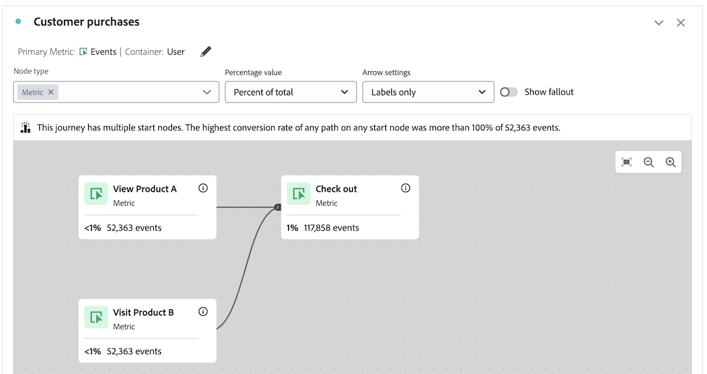

# Risoluzione dei problemi dell’area di lavoro del percorso

>[!BEGINSHADEBOX]

_In questo articolo viene documentata la visualizzazione dell&#39;area di lavoro del Percorso in_  _&#x200B;**Adobe Analytics**.  _ Vedere [Panoramica dell&#39;area di lavoro del Percorso](https://experienceleague.adobe.com/en/docs/analytics-platform/using/cja-workspace/visualizations/journey-canvas/journey-canvas-troubleshooting) per la versione __&#x200B;**Customer Journey Analytics**&#x200B;di questo articolo._

>[!ENDSHADEBOX]

La visualizzazione dell’area di lavoro del percorso consente di analizzare e ottenere informazioni approfondite sui percorsi forniti agli utenti e alla clientela.

Per ulteriori informazioni sull’area di lavoro del percorso, consulta [Panoramica sull’area di lavoro del percorso](/help/analyze/analysis-workspace/visualizations/journey-canvas/configure-journey-canvas.md) e [Configurare una visualizzazione dell’area di lavoro del percorso](/help/analyze/analysis-workspace/visualizations/journey-canvas/configure-journey-canvas.md).

Le seguenti informazioni possono aiutarti a risolvere eventuali problemi imprevisti, ad esempio i nodi che si trovano più avanti nel percorso e che presentano una percentuale o conteggio numerico più elevato rispetto ai nodi che si trovano prima nel percorso.

## Nodi con una percentuale o un valore superiore rispetto ai nodi precedenti

Nell’area di lavoro del percorso, i nodi che si trovano in una fase successiva del percorso possono mostrare una percentuale o un conteggio numerico superiore rispetto ai nodi precedenti.

In altre parole, a differenza delle visualizzazioni fallout, che sono sempre a forma di funnel, con una partecipazione che diminuisce con ogni passaggio, le visualizzazioni area di lavoro del percorso possono avere una partecipazione più elevata nei passaggi successivi del percorso rispetto ai passaggi precedenti.

Ciò può verificarsi nei seguenti scenari:

* Quando utilizzi una metrica primaria diversa da Persone o Sessioni

* Quando più percorsi convergono in un singolo nodo

### Il percorso utilizza una metrica primaria diversa da Persone o Sessioni

Poiché l’area di lavoro del percorso ti consente di utilizzare qualsiasi metrica come metrica primaria, ciò può comportare che i nodi che si trovano più avanti nel percorso mostrino una percentuale o conteggio numerico più elevato rispetto ai nodi che si trovano prima nel percorso.

Il percorso utilizzato negli scenari seguenti è configurato con queste impostazioni:

* **[!UICONTROL Person]** è impostato come contenitore

* **[!UICONTROL Event]** è impostato come metrica principale

#### Scenario 1: l’utente A segue il percorso nella prima sessione. In una sessione successiva, l’utente dispone di un evento che corrisponde solo a un nodo successivo.

Supponi che l’utente A visiti il sito e completi il percorso. Nodo 1: “Visita il sito” > Nodo 2: “Visualizza il prodotto A” > Nodo 3: “Pagamento”. Poiché l’utente A disponeva di un evento che corrispondeva a ciascun nodo del percorso secondo l’ordine, viene conteggiato un evento su ciascun nodo del percorso.

Ora, supponi che l’utente A visiti di nuovo il sito in una sessione successiva. Poiché l’utente A ha già completato il percorso in una sessione precedente seguendo il percorso, ogni volta che l’utente A dispone di un evento che corrisponde a qualsiasi nodo del percorso, anche se non ha seguito il percorso nella sessione corrente, viene conteggiato un evento sul nodo pertinente del percorso. Ad esempio, se l’utente A esegue il pagamento, viene conteggiato un evento sul nodo “Pagamento”. Ciò può comportare una percentuale e un numero più elevati sul nodo “Pagamento” rispetto al nodo precedente, “Visualizza il prodotto A”.

In questo esempio, l’impostazione contenitore del percorso “Persona” svolge un ruolo fondamentale nel determinare che l’evento sul terzo nodo (“Pagamento”) viene conteggiato nella sessione successiva.

In alternativa, se l’impostazione contenitore fosse stata impostata su “Sessione”, l’evento che si è verificato solo sul terzo nodo nella visita successiva non sarebbe stato conteggiato nel percorso, perché le statistiche mostrate nel percorso sarebbero state vincolate a una singola sessione definita per una determinata persona. Per ulteriori informazioni sull&#39;impostazione del contenitore, vedere [Inizia a creare una visualizzazione dell&#39;area di lavoro del Percorso](/help/analyze/analysis-workspace/visualizations/journey-canvas/configure-journey-canvas.md#begin-building-a-journey-canvas-visualization) nell&#39;articolo [Configura una visualizzazione dell&#39;area di lavoro del Percorso](/help/analyze/analysis-workspace/visualizations/journey-canvas/configure-journey-canvas.md).

<!-- The time allotted for users to move along the path is determined by the container setting. Because "Person" is selected as the container setting in this example, people who followed the journey's path in one session (moving from Node 1 to Node 2 and to Node 3) met the criteria of the journey. On any subsequent visits to the site, any event they have that matches any node on the journey is counted on that node. -->

#### Scenario 2: fallout dell’utente B dal percorso

Supponi che l’utente B visiti il sito e non completi il percorso: visita il sito, visualizza il prodotto B e quindi esegue il pagamento. In questo caso, per il nodo iniziale del percorso viene conteggiato un evento “Visita il sito”, ma un evento non viene conteggiato per i nodi rimanenti e si verifica il fallout dell’utente B dal percorso. Anche se l’utente B ha effettuato il pagamento, sul terzo nodo non viene conteggiato un evento (“Pagamento”) perché l’utente B non ha completato il percorso visualizzando il prodotto A prima di effettuare il pagamento.

Questo perché gli eventi vengono conteggiati per ogni nodo solo quando le persone seguono il “percorso finale” del percorso. Ciò significa che gli eventi vengono conteggiati solo se la persona alla fine si sposta da un nodo all’altro, indipendentemente da eventuali eventi che si verificano tra i due nodi.

### Il percorso dispone di più percorsi che convergono in un singolo nodo

L’area di lavoro del percorso consente di includere più nodi iniziali in un singolo percorso, con conseguente molteplicità di percorsi. Questi percorsi possono convergere in un nodo comune, facendo sì che i nodi che si trovano più avanti nel percorso mostrino una percentuale o conteggio numerico più elevato rispetto ai nodi che si trovano prima nel percorso.

<!--

The journey used in the following scenarios is configured with the following settings:

* **[!UICONTROL Person]** is set as the container

* **[!UICONTROL Event]** is set as the primary metric

#### Scenario 

When a journey contains multiple paths that converge into a single node, the two paths are combined into the single node using the OR operator. This can result in the

-->

### Percentuali percorso

Anche se i numeri visualizzati su ciascun nodo di un percorso rimangono costanti indipendentemente da ciò che è selezionato nel campo **[!UICONTROL Percentage value]**, le percentuali stesse possono cambiare.

Le sezioni seguenti mostrano come le percentuali possono cambiare per lo stesso percorso, a seconda di quale delle seguenti opzioni è selezionata nel campo **[!UICONTROL Percentage value]**:

+++Percentuale del nodo iniziale

I nodi di questo percorso contengono le statistiche seguenti quando il campo **[!UICONTROL Percentage value]** è impostato su **[!UICONTROL Percent of start node]**:

| Nodo | Statistiche |
|---------|----------|
| Nodo 1 - “Visita sito” | In questo percorso, c’erano 354.147 eventi sul sito all’interno dell’intervallo di date di reporting, come mostrato nel nodo iniziale del percorso, “Visita sito”. |
| Nodo 2 - “Visualizza prodotto A” | Del numero totale di eventi mostrati nel nodo iniziale, il 14% (48.394) corrispondeva ai criteri del secondo nodo del percorso, “Visualizza prodotto A”. |
| Nodo 3 - “Pagamento” | Del numero totale di eventi visualizzati nel nodo iniziale, il 32% (113.782) corrispondeva ai criteri del terzo nodo del percorso, “Estrai”. |

+++

+++Percentuale del nodo precedente

I nodi di questo percorso contengono le statistiche seguenti quando il campo **[!UICONTROL Percentage value]** è impostato su **[!UICONTROL Percent of previous node]**:

| Nodo | Statistiche |
|---------|----------|
| Nodo 1 - “Visita sito” | In questo percorso, c’erano 354.147 eventi sul sito all’interno dell’intervallo di date di reporting, come mostrato nel nodo iniziale del percorso, “Visita sito”. |
| Nodo 2 - “Visualizza prodotto A” | Del numero totale di eventi visualizzati nel nodo precedente, il 14% (48.394) corrispondeva ai criteri del secondo nodo del percorso, “Visualizza prodotto A”. |
| Nodo 3 - “Pagamento” | Del numero totale di eventi visualizzati nel nodo precedente, più del 100% (113.782) corrispondeva ai criteri del terzo nodo del percorso, “Estrai”. |

+++

+++Percentuale del totale

I nodi di questo percorso contengono le statistiche seguenti quando il campo **[!UICONTROL Percentage value]** è impostato su **[!UICONTROL Percent of total]**:

| Nodo | Statistiche |
|---------|----------|
| Nodo 1 - “Visita sito” | In questo percorso, c’erano 354.147 eventi sul sito all’interno dell’intervallo di date di reporting, come mostrato nel nodo iniziale del percorso, “Visita sito”. |
| Nodo 2 - “Visualizza prodotto A” | Del numero totale di eventi, meno dell’1% (48.394) corrispondeva ai criteri del secondo nodo del percorso, “Visualizza prodotto A”. |
| Nodo 3 - “Pagamento” | Del numero totale di eventi, l’1% (113.782) corrispondeva ai criteri del terzo nodo del percorso, “Estrai”. |

+++

## Compatibilità tra la metrica contenitore e la metrica primaria

Puoi configurare il contenitore dell’area di lavoro del percorso come Persona (che utilizza la metrica Persone) o Sessione (che utilizza la metrica Sessioni).

Assicurati di scegliere una metrica primaria compatibile con la metrica contenitore attualmente selezionata. La maggior parte delle metriche è compatibile con le metriche contenitore disponibili. Tuttavia, è necessario evitare alcune combinazioni di metriche contenitore e metriche primarie.

Ad esempio, l’utilizzo di Persona come contenitore con Sessione come metrica primaria può causare risultati non desiderati.

<!--

## Percentages that exceed 100%

The following configurations can result in nodes that show percentages that exceed 100%:

* When the **[!UICONTROL Percentage value]** field is set to **[!UICONTROL Percent of total]** or **[!UICONTROL Percent of start node]**, and a primary metric is selected that results in less data for the start node than on subsequent nodes.

  For example, if Revenue is selected as the primary metric, and no revenue is being realized on the primary metric, then on any node where revenue is being realized will show as exceeding 100%. 
-->
