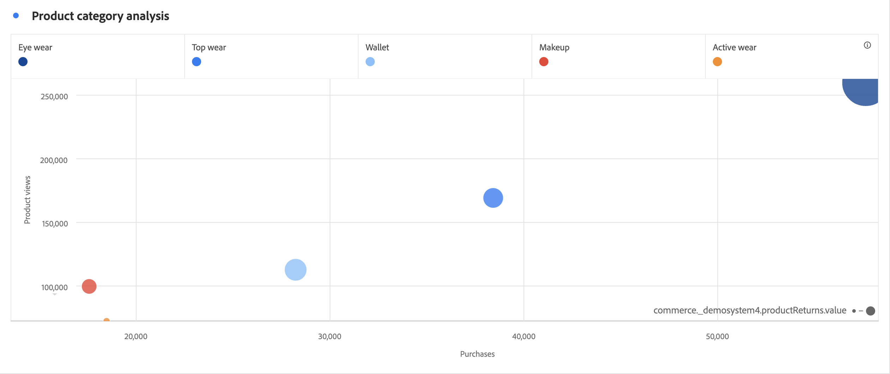

# Grafico a dispersione

Mostra le impressioni e quanti utenti unici le hanno visualizzate.

Le dimensioni di ogni punto corrispondono a un dato visivo sul numero medio di volte in cui un visualizzatore è stato esposto a una pubblicità. Le dimensioni e i dati sono variabili in base a dimensioni, intervallo di date e filtri selezionati.

>[!NOTE]
>
>Una tabella associata a un grafico a dispersione richiede almeno due colonne. La prima colonna definisce l’asse delle X e la seconda definisce l’asse delle Y. Nel caso in cui sia presente una terza colonna, il grafico a dispersione la utilizzerà per determinare il raggio del punto. In altre parole: le colonne *1*, *2* e *3* corrispondono a *X*, *Y* e *raggio del punto*.

