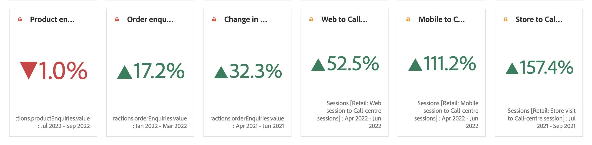

# Numero di riepilogo e Variazione di riepilogo

## Visualizzazione Numero di riepilogo {#summary-number}

Utilizza la visualizzazione Numero di riepilogo per evidenziare un numero elevato importante in un progetto. Questa visualizzazione si comporta come segue:

* Se non è selezionata alcuna cella, viene selezionato il totale della colonna.
* Se è selezionata una cella, viene visualizzato il riepilogo per tale cella.
* Se sono selezionate più celle, viene visualizzata la prima cella selezionata.
* Se è selezionata la colonna, viene preso il valore della prima cella della colonna.

Fai clic sull’ingranaggio delle **impostazioni di visualizzazione** in alto a destra per configurare le impostazioni del Numero di riepilogo:

| Impostazione | Definizione |
|--- |--- |
| Percentuali | Visualizza le percentuali invece dei numeri. |
| Visualizzazione legenda | Mostra informazioni sulla metrica visualizzata. |
| Abbrevia il valore | Scegli di abbreviare i valori e visualizzare fino a 3 posizioni decimali. |
| Riepiloga valore per | Scegli di visualizzare il massimo, il minimo, la media, la mediana o la somma per una selezione di dati. |

Fai clic sull’ingranaggio delle **impostazioni di visualizzazione** in alto a destra per configurare le impostazioni del Numero di riepilogo:

| Impostazione | Definizione |
|--- |--- |
| Percentuali | Visualizza le percentuali invece dei numeri. |
| Visualizzazione legenda | Mostra informazioni sulla metrica visualizzata. |
| Abbrevia il valore | Scegli di abbreviare i valori e visualizzare fino a 3 posizioni decimali. |
| Riepiloga valore per | Scegli di visualizzare il massimo, il minimo, la media, la mediana o la somma per una selezione di dati. |

## Visualizzazione Variazione di riepilogo {#summary-change}

Utilizza la visualizzazione Variazione di riepilogo per visualizzare il delta (variazione) tra due numeri. Il colore verde e rosso della Variazione di riepilogo può essere controllato tramite [polarità degli eventi personalizzata](https://experienceleague.adobe.com/docs/analytics/admin/admin-tools/success-events/success-event.html?lang=it) o con l’opzione [Mostra tendenza verso l’alto come...](https://experienceleague.adobe.com/docs/analytics/components/calculated-metrics/calcmetric-workflow/cm-build-metrics.html?lang=it) di una metrica calcolata.

Questa visualizzazione si comporta come segue:

* Se non è selezionata alcuna cella, vengono confrontati i valori delle prime due celle della colonna.
* Se è selezionata una cella, viene riportato 0 perché il valore della cella viene confrontato con se stesso e quindi non si verifica alcuna variazione nei valori.
* Se sono selezionate due celle, la prima cella selezionata funge da numeratore e la seconda da denominatore.
* Se sono selezionate più celle, per il confronto vengono considerate solo le prime due celle.
* Se è selezionato un intervallo di celle, vengono confrontate la prima e l’ultima cella selezionata nell’intervallo.
* Se è selezionata la colonna, il primo valore viene confrontato con se stesso, e la variazione risulta quindi pari a 0.

Fai clic sull’ingranaggio delle **impostazioni di visualizzazione** in alto a destra per configurare le impostazioni della Variazione di riepilogo:

| Impostazione | Definizione |
|--- |--- |
| Percentuali | Visualizza le percentuali invece dei numeri. |
| Visualizzazione legenda | Mostra informazioni sulla metrica visualizzata. |
| Mostra variazione percentuale | Mostra la variazione percentuale tra i 2 numeri. |
| Mostra differenza grezza | Mostra la differenza grezza tra i 2 numeri. Con questa opzione è inoltre possibile abbreviare i valori e visualizzare fino a 3 posizioni decimali. |
