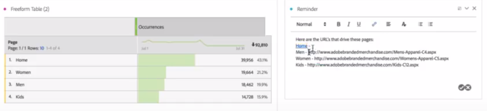

# Testo

Consente di aggiungere testo definito dall’utente al progetto Workspace.

Puoi cambiare le impostazioni del font (grassetto, corsivo, ecc.) e aggiungere collegamenti ipertestuali nelle visualizzazioni di tipo casella di testo e nelle descrizioni di pannelli o visualizzazioni.

## Change font settings {#section_32727EE03FD04A8EB1D1B387DCAF6537}

Dopo aver trascinato una visualizzazione di tipo Testo in un pannello e aver aggiunto del testo, puoi formattarlo aggiungendo livelli di intestazione, cambiando il testo in grassetto, corsivo o sottolineato, cambiando il colore del font, e così via.

## Add hyperlinks {#section_D55B857188A74A06B49006DF3511DC7C}

Per aggiungere un collegamento ipertestuale, evidenzia il testo e fai clic sull’icona dei collegamenti ipertestuali nel menu di formattazione.
