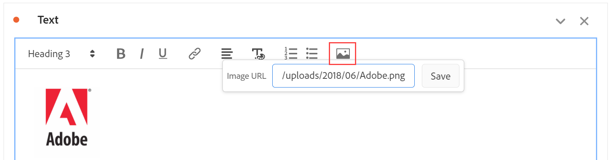

# Testo {#text-visualization}

>[!CONTEXTUALHELP]
>id="workspace_text_button"
>title="Testo"
>abstract="Aggiungi al progetto una visualizzazione di testo formattato definito dall’utente."

<!-- markdownlint-enable MD034 -->

>[!BEGINSHADEBOX]

_In questo articolo viene documentata la visualizzazione Testo in_  _**Adobe Analytics**._ _Vedere [Testo](https://experienceleague.adobe.com/en/docs/analytics-platform/using/cja-workspace/visualizations/text) per la_  _**Customer Journey Analytics** versione di questo articolo._

>[!ENDSHADEBOX]

È possibile eseguire le seguenti azioni:
Per aggiungere testo RTF definito dall&#39;utente al progetto Workspace, puoi utilizzare una visualizzazione  **[!UICONTROL Text]** o una descrizione per una visualizzazione e un pannello.

## Utilizzo

Puoi utilizzare la visualizzazione Testo nei seguenti modi:

1. Aggiungi una visualizzazione  **[!UICONTROL Text]**. Consulta [Aggiungere una visualizzazione a un pannello](freeform-analysis-visualizations.md#add-visualizations-to-a-panel).

1. In un pannello o in una visualizzazione, dal menu di scelta rapida seleziona **[!UICONTROL Edit description]**.

   Seleziona  al termine della modifica della descrizione, seleziona  per annullare.

Puoi inoltre modificare la formattazione del testo e aggiungere collegamenti ipertestuali e immagini.

## Regolare la formattazione {#format}

Quando si modifica una casella di testo o una descrizione, è possibile regolare le dimensioni del font (livelli di intestazione), il colore, lo stile (grassetto, corsivo, sottolineato) e l’allineamento del testo selezionato. È inoltre possibile aggiungere elenchi puntati e numerati.

## Aggiungere collegamenti ipertestuali {#hyperlinks}

Per aggiungere un collegamento ipertestuale, evidenzia il testo e seleziona  nel menu. Puoi utilizzare i collegamenti ipertestuali per fornire ulteriore assistenza ai destinatari del progetto. I collegamenti ipertestuali possono collegare a siti web esterni, pagine di documentazione, [progetti, pannelli o visualizzazioni di Workspace](/help/analyze/analysis-workspace/curate-share/shareable-links.md) e altro ancora.

## Aggiungere immagini {#images}

Per aggiungere un&#39;immagine al progetto, seleziona  nel menu e specifica un URL immagine in **[!UICONTROL Image URL]** (ad esempio `https://www.adobe.com/uploads/2018/06/Adobe.png`), quindi seleziona **[!UICONTROL Save]**.

L’URL dell’immagine deve essere accessibile al pubblico, deve iniziare con `https` e deve essere in formato `.png`, `.jpeg`, `.jpg` o `.gif`. Sono supportate le immagini statiche e animate.

L&#39;inserimento tramite trascinamento di un&#39;immagine non è supportato.

