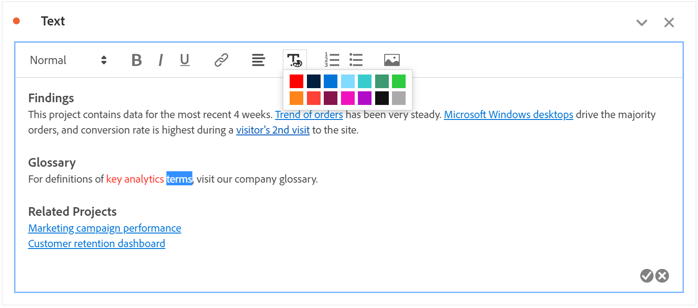

# Testo

Puoi aggiungere testo definito dall’utente al progetto Workspace utilizzando una visualizzazione di testo o una descrizione del pannello o della visualizzazione (fai clic con il pulsante destro del mouse su intestazione > **[!UICONTROL Edit description]**). È inoltre possibile modificare la formattazione del testo, aggiungere collegamenti ipertestuali e aggiungere immagini.

## Regolare la formattazione {#format}

Quando si modifica una casella di testo o una descrizione, è possibile regolare le dimensioni del font (livelli di intestazione), il colore, lo stile (grassetto, corsivo, sottolineato) e l’allineamento del testo selezionato. È inoltre possibile aggiungere elenchi puntati e numerati.

## Aggiungere collegamenti ipertestuali {#hyperlinks}

Per aggiungere un collegamento ipertestuale, evidenziare il testo e fare clic sull&#39;icona del collegamento ipertestuale nel menu. I collegamenti ipertestuali possono collegarsi a siti web esterni, pagine di documentazione, [progetti/pannelli/visualizzazioni di Workspace](https://experienceleague.adobe.com/docs/analytics/analyze/analysis-workspace/curate-share/shareable-links.html) e altro ancora per assistere ulteriormente i destinatari del progetto.

## Aggiungi immagini {#images}

Per aggiungere un’immagine al progetto, fai clic sull’icona dell’immagine nel menu e inserisci un URL immagine pubblico. L’URL dell’immagine deve essere accessibile al pubblico, deve iniziare con `https` e deve essere in formato `.png`, `.jpeg`, `.jpg` o `.gif`. Sono supportate le immagini statiche e animate.

