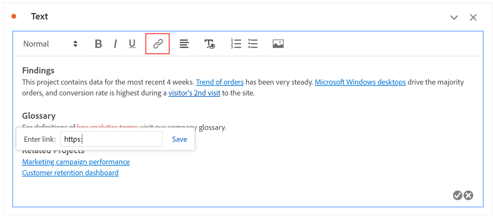

# Testo {#text-visualization}

>[!CONTEXTUALHELP]
>id="workspace_text_button"
>title="Testo"
>abstract="Aggiungi al progetto una visualizzazione di testo formattato definito dall’utente."

<!-- markdownlint-enable MD034 -->

>[!BEGINSHADEBOX]

_Questo articolo documenta la visualizzazione Testo in_  _**Adobe Analytics**._ _Consulta [Testo](https://experienceleague.adobe.com/en/docs/analytics-platform/using/cja-workspace/visualizations/text) per la_  _**versione del Customer Journey Analytics** di questo articolo._

>[!ENDSHADEBOX]

Puoi aggiungere testo definito dall’utente al progetto Workspace, utilizzando una visualizzazione di testo o una descrizione del pannello o della visualizzazione (fai clic con il pulsante destro del mouse sull’intestazione e scegli **[!UICONTROL Edit description]**). È inoltre possibile modificare la formattazione del testo, e aggiungere collegamenti ipertestuali e immagini.

## Regolare la formattazione {#format}

Quando si modifica una casella di testo o una descrizione, è possibile regolare le dimensioni del font (livelli di intestazione), il colore, lo stile (grassetto, corsivo, sottolineato) e l’allineamento del testo selezionato. È inoltre possibile aggiungere elenchi puntati e numerati.

## Aggiungere collegamenti ipertestuali {#hyperlinks}

Per aggiungere un collegamento ipertestuale, evidenzia il testo e fai clic sull’icona del collegamento ipertestuale nel menu. I collegamenti ipertestuali possono portare a siti web esterni, pagine di documentazione, [progetti, pannelli o visualizzazioni di Workspace](https://experienceleague.adobe.com/docs/analytics/analyze/analysis-workspace/curate-share/shareable-links.html?lang=it) e altro ancora, per assistere ulteriormente i destinatari del progetto.

## Aggiungere immagini {#images}

Per aggiungere un’immagine al progetto, fai clic sull’icona dell’immagine nel menu e inserisci l’URL pubblico dell’immagine. L’URL dell’immagine deve essere accessibile al pubblico, deve iniziare con `https` e deve essere in formato `.png`, `.jpeg`, `.jpg` o `.gif`. Sono supportate le immagini statiche e animate.

