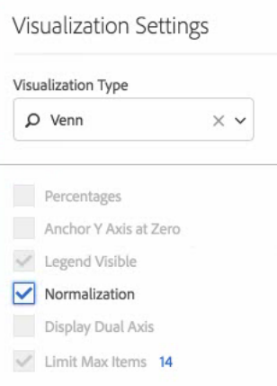

# Venn {#venn}

<!-- markdownlint-disable MD034 -->

>[!CONTEXTUALHELP]
>id="workspace_venn_button"
>title="Venn"
>abstract="Crea una visualizzazione con diagramma di Venn per confrontare visivamente in modo rapido due elementi e la dimensione della relativa sovrapposizione."

<!-- markdownlint-enable MD034 -->

>[!BEGINSHADEBOX]

_Questo articolo documenta la visualizzazione Venn in_  _**Adobe Analytics**._ _Consulta [Venn](https://experienceleague.adobe.com/en/docs/analytics-platform/using/cja-workspace/visualizations/venn) per la_  _**Customer Journey Analytics** versione di questo articolo._

>[!ENDSHADEBOX]

La visualizzazione  **[!UICONTROL Venn]** consente di trascinare fino a 3 filtri e una metrica (dal pannello Componenti) per creare un diagramma di Venn.

>[!NOTE]
>
>Analysis Workspace utilizza diagrammi di Venn proporzionali all’area. I diagrammi di Venn con tre o più cerchi rappresentati in due dimensioni non possono sempre essere disegnati con proporzioni perfette.
> 
>Workspace tenta di creare Venn approssimativamente il più vicino possibile, ma i risultati potrebbero non essere sempre visivamente precisi.

Puoi passare il puntatore sui filtri per ottenere più informazioni approfondite sulle percentuali e altro ancora.

Per generare un [!UICONTROL Freeform table] dalla visualizzazione [!UICONTROL Venn], seleziona lo  colorato accanto all’intestazione **[!UICONTROL Venn]**, quindi seleziona **[!UICONTROL Show data source]**. Verrà visualizzata una tabella a forma libera di **[!UICONTROL Venn Data]** con i dati utilizzati per creare la visualizzazione [!UICONTROL Venn].

<!--
To normalize the Venn diagram (take the size out of it), go select  and select **[!UICONTROL Normalization]**.

-->

>[!BEGINSHADEBOX]

Per un video dimostrativo, consulta [visualizzazione di Venn](https://experienceleague.adobe.com/en/docs/analytics-learn/tutorials/analysis-workspace/visualizations/venn-diagram-visualization){target="_blank"} .

>[!ENDSHADEBOX]

>[!MORELIKETHIS]
>
>[Aggiungi una visualizzazione a un pannello](/help/analyze/analysis-workspace/visualizations/freeform-analysis-visualizations.md#add-visualizations-to-a-panel)
>[Impostazioni di visualizzazione](/help/analyze/analysis-workspace/visualizations/freeform-analysis-visualizations.md#settings)
>[Menu di scelta rapida della visualizzazione](/help/analyze/analysis-workspace/visualizations/freeform-analysis-visualizations.md#context-menu)
>

