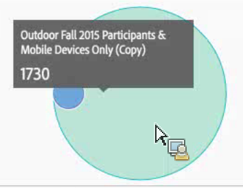

# Venn

La visualizzazione di Venn consente di trascinare fino a 3 segmenti (da Componenti) e una metrica per creare un diagramma di Venn.

Puoi passare il mouse sui segmenti per avere più informazioni dettagliate sulle percentuali, ecc.

Per trasformare il diagramma di Venn in una tabella a forma libera, fai clic sul punto colorato accanto all’intestazione **[!UICONTROL Venn]** (Venn) e seleziona **[!UICONTROL Manage Data Sources]** (Gestisci origini dati) > **[!UICONTROL Available Data Sources]** (Origini dati disponibili) > **[!UICONTROL Freeform Table]** (Tabella a forma libera).

Per normalizzare il diagramma di Venn (estrarre la dimensione), fai clic sulla relativa icona Impostazioni visualizzazione e seleziona **[!UICONTROL Normalization]** (Normalizzazione).

