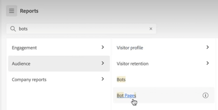

# Pagina di destinazione di Adobe Analytics

La pagina di destinazione di Adobe Analytics riunisce [!DNL Analysis Workspace] e [!DNL Reports & Analytics] in un’unica interfaccia e un unico punto di accesso sotto l’ombrello di [!DNL Workspace]. Sono disponibili una pagina Home per project manager, un menu aggiornato per i rapporti, che hanno ora un design più attuale, nonché una sezione di apprendimento per aiutarti a iniziare in modo più efficace. Panoramica video:

>[!VIDEO](https://video.tv.adobe.com/v/334278/?quality=12)

## Caratteristiche della nuova pagina di destinazione {#new-features}

| Funzione | Descrizione | Schermata |
| --- | --- | --- |
| Espandere la tabella [!UICONTROL Projects] a schermo intero | Per espandere la tabella, fai clic sull’icona del menu con le tre linee. Le schede della barra a sinistra vengono compresse. |  |
| Personalizzare la larghezza delle colonne | In precedenza, la larghezza delle colonne era fissa. Ora è possibile regolarla trascinando il separatore di colonne. |  |
| Riordinare gli elementi fissati | Per spostare verso l’alto o verso il basso un elemento fissato, fai clic sui suoi puntini di sospensione e seleziona **[!UICONTROL Move up]** o **[!UICONTROL Move down]**. |  |
| Nuove colonne di tabella | Fai clic sull’icona [!UICONTROL Customize table] in alto a destra nella tabella. Le nuove colonne della tabella includono: <ul><li>**[!UICONTROL Scheduled]**: è impostato su [!UICONTROL On] quando un progetto è pianificato o su [!UICONTROL Off] quando non lo è. Fai clic sul collegamento [!UICONTROL On] per visualizzare informazioni sul progetto pianificato. Puoi anche [modificare la pianificazione del progetto](/help/analyze/analysis-workspace/curate-share/t-schedule-report.md) se ne sei il proprietario.</li><li>**[!UICONTROL Project ID]**: l’ID del progetto può essere utilizzato a scopo di debug dei progetti.</li><li>**[!UICONTROL Longest Date Range]**: intervalli di date più lunghi aumentano la complessità del progetto e possono richiedere tempi di elaborazione e caricamento più lunghi. </li><li>**[!UICONTROL Number of Queries]**: numero totale di richieste effettuate ad Analytics al caricamento del progetto. Un numero elevato di query di progetto aumenta la complessità del progetto e può comporare tempi di elaborazione e caricamento più lunghi. Questi dati sono disponibili solo dopo il caricamento di un progetto o l’invio di un progetto pianificato. </li></ul> |  |
| Un solo clic per aprire un rapporto | In precedenza era necessario fare doppio clic. |  |
| Nuovi collegamenti ai rapporti **[!UICONTROL Reports & Analytics]** | <ul><li>**[!UICONTROL Reports]** > **[!UICONTROL Audience]** > **[!UICONTROL Bots]**</li><li>**[!UICONTROL Reports]** > **[!UICONTROL Audience]** > **[!UICONTROL Bot Pages]**<li>**[!UICONTROL Reports]** > **[!UICONTROL Engagement]** > **[!UICONTROL Real-Time]**</li></ul> |  |
| Nuovi rapporti pronti all’uso | <ul><li>**[!UICONTROL Reports]** > **[!UICONTROL Most popular]** > **[!UICONTROL Next page]**</li><li>**[!UICONTROL Reports]** > **[!UICONTROL Most popular]** > **[!UICONTROL Previous page]**</li><li>**[!UICONTROL Reports]** > **[!UICONTROL Engagement]** > **[!UICONTROL Page analysis]** > **[!UICONTROL Page summary]**</li></ul>Questi rapporti sono in formato [!UICONTROL Workspace] e devono essere configurati e generati. L’output è costituito da un pannello di metriche di alto livello, dati con tendenze, visualizzazione [!UICONTROL Flow] e altro ancora. Puoi modificare questi rapporti e cambiare dimensioni, elementi dimensionali, ecc. Questi rapporti sono disponibili anche come pannelli di Workspace. |  |
| È tornata la finestra modale **[!UICONTROL Create Project]** | Quando fai clic su **[!UICONTROL Create Project]** in Workspace, puoi nuovamente scegliere tra [!UICONTROL Blank project] e [!UICONTROL Blank mobile scorecard]. Puoi anche scegliere tra tutti i modelli creati dalla tua azienda. |  |
| Disponibile anche in Customer Journey Analytics | Questa pagina di destinazione, in forma modificata, è disponibile anche in Customer Journey Analytics. |  |

{style="table-layout:auto"}

## Struttura del menu superiore {#top-menu}

* Menu superiore di Analytics: la maggior parte dei rapporti si trova ora nel menu [!UICONTROL Reports], nella barra a sinistra.
* La barra a sinistra presenta tre schede: [!UICONTROL Projects], [!UICONTROL Reports] e [!UICONTROL Learning].

### Terminologia

* **[!UICONTROL Projects]** (Progetti) contiene progetti personalizzati che combinano componenti dati, tabelle e visualizzazioni creati dall’utente o che altri utenti hanno creato e condiviso con te. [!UICONTROL Projects] fa riferimento anche a progetti vuoti e scorecard per dispositivi mobili vuote.
* **[!UICONTROL Reports]** fa riferimento a qualsiasi cosa pregenerata da Adobe, ad esempio i rapporti di Reports &amp; Analytics e i modelli di Workspace.
* **[!UICONTROL Templates]** non viene più utilizzato come termine per i progetti Workspace forniti da Adobe. Questi sono ora compresi in [!UICONTROL Reports]. Il termine [!UICONTROL Templates] viene ancora utilizzato per i modelli creati dalla tua azienda.

## Scheda [!UICONTROL Projects] {#navigate-projects}

[!UICONTROL Projects] funge da pagina home di [!UICONTROL Workspace]. Nella scheda Projects (Progetti) viene visualizzata la cartella Company (Azienda), le cartelle personali create, i progetti e le scorecard per dispositivi mobili. In questa pagina puoi visualizzare, creare e modificare cartelle, progetti e scorecard per dispositivi mobili. Per ulteriori informazioni, consulta la sezione [Informazioni sulle cartelle in Analytics](/help/analyze/analysis-workspace/build-workspace-project/workspace-folders/about-folders.md).

>[!NOTE]
>
>Molte delle seguenti impostazioni vengono mantenute durante la sessione e tra sessioni diverse. Ad esempio, la scheda selezionata, i filtri selezionati, le colonne selezionate e la direzione di ordinamento delle colonne. I risultati della ricerca non vengono mantenuti.

| Elemento nell’interfaccia utente | Definizione |
| --- | --- |
| Modifica preferenze | Consente di scegliere [!UICONTROL View Tutorials] (Mostra tutorial) e di [modificare le preferenze utente](/help/analyze/analysis-workspace/user-preferences.md). |
| [!UICONTROL Create new] | Apre la finestra modale del progetto in cui puoi creare un progetto Workspace o una scorecard per dispositivi mobili oppure aprire un modello aziendale. |
| [!UICONTROL Show less  Mostra altro] | Consente di visualizzare o meno il banner:  |
| [!UICONTROL Workspace project] | Crea un [progetto Workspace](https://experienceleague.adobe.com/docs/analytics/analyze/analysis-workspace/home.html?lang=it) vuoto da progettare e costruire. |
| [!UICONTROL Mobile scorecard] | Crea una [scorecard per dispositivi mobili](https://experienceleague.adobe.com/docs/analytics/analyze/mobapp/curator.html?lang=it) vuota da progettare e costruire. |
| [!UICONTROL Open Training Tutorial] | Apre la formazione di Workspace sul processo di creazione di un nuovo progetto iniziale in un tutorial dettagliato. |
| [!UICONTROL Open release notes] | Apre la sezione Adobe Analytics delle ultime note sulla versione di Adobe Experience Cloud. |
| Icona Filtro | Consente di filtrare in base a tag, suite di rapporti, proprietari, tipi e altri filtri (Personali, Condivisi con me, Preferiti e Approvati) |
| Barra di ricerca | Cerca in tutte le colonne della tabella. |
| Casella di selezione | Seleziona uno o più progetti per visualizzare le azioni di Project Management eseguibili: **Elimina**, **Condividi**, **Rinomina**, **Copia**, **Rimuovi**, **Sposta su**, **Sposta giù**, **Contrassegna**, **Approva**, **Esporta CSV** e **Sposta in**. Potresti non disporre delle autorizzazioni necessarie per eseguire tutte le azioni elencate. |
| [!UICONTROL Favorites] | Aggiunge una stella accanto a un progetto o a una cartella preferita che può essere utilizzata come filtro. |
| [!UICONTROL Name] | Identifica il nome del progetto. |
| Icona Fissa (a forma di puntina) | Consente di fissare gli elementi in modo che siano sempre visualizzati in cima all’elenco, ma è possibile modificare l’ordine spostandoli verso l’alto o verso il basso. Utilizza il menu delle opzioni contrassegnato dai puntini di sospensione e seleziona **Sposta su** o **Sposta giù** nell’elenco. |
| Icona Info (i) | Mostra le seguenti informazioni su un progetto: Tipo, Ruolo progetto, Proprietario, Descrizione e con chi è condiviso. Indica anche chi può [modificare o duplicare](https://experienceleague.adobe.com/docs/analytics/analyze/analysis-workspace/curate-share/share-projects.html?lang=it) il progetto. |
| Puntini di sospensione (…) | Mostra le azioni di Project Management eseguibili: **Elimina**, **Condividi**, **Rinomina**, **Copia**, **Rimuovi**, **Sposta su**, **Sposta giù**, **Contrassegna**, **Approva**, **Esporta CSV** e **Sposta in**. Potresti non disporre delle autorizzazioni necessarie per eseguire tutte le azioni elencate. |
| [!UICONTROL Type] | Indica se si tratta di un progetto Workspace, di una scorecard per dispositivi mobili o di una cartella. |
| [!UICONTROL Tags] | Assegna tag ai progetti per organizzarli in gruppi. |
| [!UICONTROL Project Role] | Identifica i ruoli di progetto: se l’utente è il proprietario del progetto e se dispone delle autorizzazioni necessarie per modificarlo o duplicarlo. |
| [!UICONTROL Report Suite] | Identifica le suite di rapporti associate al progetto. Le tabelle e le visualizzazioni all’interno di un pannello derivano i dati dalla suite di rapporti selezionata in alto a destra nel pannello. La suite di rapporti determina anche i componenti disponibili nella barra a sinistra. All’interno di un progetto, puoi utilizzare una o più suite di rapporti a seconda dei casi di utilizzo dell’analisi. L’elenco delle suite di rapporti è ordinato in base alla rilevanza. Adobe definisce la rilevanza in base a quanto recentemente e con quale frequenza la suite è stata utilizzata dall’utente corrente, e alla frequenza con cui viene utilizzata all’interno dell’organizzazione. |
| [!UICONTROL Owner] | Identifica la persona che ha creato il progetto. |
| [!UICONTROL Last opened] | Identifica la data dell’ultima apertura del progetto. |
| Icona Personalizza tabella | Seleziona le colonne da visualizzare nella tabella. Per aggiungere o rimuovere colonne dall’elenco dei progetti, fai clic sull’icona della colonna () in alto a destra, quindi seleziona o deseleziona i titoli delle colonne. |
| MOSTRA: Cartelle e Progetti o Tutti i progetti | Modifica le impostazioni di visualizzazione nella tabella per mostrare cartelle e progetti in base all’organizzazione delle cartelle **oppure** mostra tutti i progetti in un elenco non organizzato. |
| &lt; (pulsante Indietro) | Consente di tornare alla configurazione della pagina di destinazione più recente in un progetto Workspace o in un rapporto. Quando torni alla pagina di destinazione, ritrovi la stessa configurazione che era attiva al momento in cui hai lasciato la pagina. |

### Obsolescenza della pagina Project Manager {#deprecate-pm-page}

Con il rilascio della nuova pagina di destinazione, la pagina Project Manager (Gestione progetti) elencata in Component Manager (Gestione componenti) è diventata obsoleta. La nuova pagina di destinazione gestisce tutte le funzionalità della vecchia pagina Project Manager (Gestione progetti) e altro ancora.

Un caso d’uso comune per la pagina Gestione progetti era quello di visualizzare tutti i tuoi progetti.

Per visualizzare tutti i progetti nella nuova pagina di destinazione utilizzando la barra dei filtri, seleziona **ALTRI FILTRI** e quindi **Mostra tutto**.

Se ti trovi nella visualizzazione “Folders &amp; Projects” (Cartelle e progetti), verrà visualizzata una finestra modale che chiede se desideri passare alla visualizzazione “All projects” (Tutti i progetti), facilitando la visualizzazione di tutti i progetti al di fuori delle cartelle in cui possono essere organizzati.   Seleziona **Switch to “All projects” view** (Passa alla visualizzazione “Tutti i progetti”) per visualizzare meglio tutti i progetti a cui hai accesso.

Un altro caso d’uso per gli amministratori è la gestione dei rapporti aziendali per eliminare, rinominare, assegnare tag o approvare i rapporti. Per informazioni sulla gestione dei rapporti, consulta [Gestione dei rapporti aziendali](#manage-company-reports).

## Scheda [!UICONTROL Reports] {#navigate-reports}

La scheda [!UICONTROL Reports] consolida tre set di rapporti:

* I modelli [!UICONTROL Workspace] predefiniti che si trovavano in precedenza in [!UICONTROL Workspace] > [!UICONTROL Project] > [!UICONTROL New]. Adobe non utilizza più il termine “modello” in questo contesto.
* La maggior parte dei rapporti predefiniti che si trovavano nel precedente menu superiore [!UICONTROL Reports] di Adobe Analytics. Questi rapporti sono ora visualizzati in [Analysis Workspace](https://experienceleague.adobe.com/docs/analytics/analyze/analysis-workspace/home.html?lang=it).

>[!IMPORTANT]
>
>In Rapporti, la cartella Preferiti viene visualizzata solo se contrassegni un nuovo rapporto come Preferito. Non vengono riportati i precedenti preferiti di Reports &amp; Analytics.

Come già accennato, qui sono disponibili solo i rapporti più utilizzati tra quelli che erano precedentemente raggruppati in Reports &amp; Analytics. Non è stata effettuata la migrazione di alcuni rapporti raramente utilizzati o non più rilevanti. Per maggiori informazioni, consulta le domande frequenti riportate di seguito.

### Menu e sottomenu {#menus}

Ecco i menu e i relativi sottomenu. Se non riesci a trovare un rapporto specifico, usa la funzione di ricerca sulla pagina per trovarlo.

| Opzione di menu | Rapporti sotto questa voce di menu |
| --- | --- |
| **[!UICONTROL Most Popular]** | <ul><li>Tutorial di formazione (modello Workspace preesistente)</li><li>Pagine (quali sono le pagine principali?)</li><li>Visualizzazioni pagina (quante visualizzazioni di pagina vengono generate?)</li><li>Visite (quante visite ricevo?)</li><li>Visitatori (quanti visitatori ricevo?)</li><li>Metriche chiave (come sono le prestazioni delle metriche più importanti?)</li><li>Sezioni del sito (quali sezioni del sito hanno generato il maggior numero di visualizzazioni di pagina?)</li><li>Pagina successiva (quali sono le pagine successive visitate dagli utenti?)</li><li>Pagina precedente (quali sono le pagine precedenti visitate dagli utenti?)</li><li>Campagne (quali campagne sono più determinanti per le metriche chiave?)</li><li>Prodotti (quali prodotti sono più determinanti per le metriche chiave?)</li><li>Canale ultimo contatto (quale canale di ultimo contatto offre le prestazioni migliori?)</li><li>Dettaglio canale ultimo contatto (quale canale di ultimo contatto specifico ha prestazioni migliori degli altri?)</li><li>Ricavi (come stanno andando i ricavi?)</li><li>Ordini (come vanno gli ordini?)</li><li>Unità (quante unità vengono vendute?)</li></ul> |
| **[!UICONTROL Engagement]** | <ul><li>Metriche chiave (come sono le prestazioni delle metriche più importanti?)</li><li>Visualizzazioni pagina (quante visualizzazioni di pagina vengono generate?)</li><li>Pagine (quali sono le pagine principali?)</li><li>Visite (quante visite ricevo?)</li><li>Visitatori (quanti visitatori ricevo?)</li><li>Tempo trascorso per visita (quanto tempo trascorrono gli utenti per visita?)</li><li>Tempo precedente all’evento (quanto tempo trascorrono gli utenti prima di un evento di successo?)</li><li>Sezioni del sito (quali sezioni del sito hanno generato il maggior numero di visualizzazioni di pagina?)</li><li>Consumo di contenuti web (quali contenuti vengono maggiormente consumati e coinvolgono maggiormente gli utenti?)</li><li>Consumo di contenuti multimediali (quali contenuti vengono maggiormente consumati e coinvolgono maggiormente gli utenti?)</li><li>Flusso pagine successive e precedenti (quali sono o sono stati i percorsi successivi/precedenti seguiti dai visitatori?)</li><li>Abbandono (dove si verifica l’abbandono nelle proprietà digitali?)</li><li>Analisi tra dispositivi (tramite analisi tra dispositivi in Analysis Workspace)</li><li>Fidelizzazione web (chi sono gli utenti più fedeli e cosa fanno?)</li><li>Consumo audio multimediale (quali sono le tendenze e le metriche migliori in merito al consumo audio?)</li><li>Recency, frequenza, fedeltà per contenuti multimediali (chi sono i lettori più fedeli?)</li><li>Analisi pagina > Ricaricamenti (quali pagine vengono ricaricate maggiormente?)</li><li>Analisi pagina > Tempo trascorso su pagina (quanto tempo passano gli utenti sulle pagine?)</li><li>Entrate e uscite > Pagine di ingresso (quali sono le pagine di ingresso principali?)</li><li>Entrate e uscite > Pagine di entrata originali (da quale pagina è entrato originariamente il visitatore?)</li><li>Entrate e uscite > Visite pagina singola (quali pagine hanno generato più visite a una singola pagina?)</li><li>Entrate e uscite > Pagine di uscita (quali sono le pagine di uscita principali?)</li></ul> |
| **[!UICONTROL Conversion]** | <ul><li>Prodotti > Prodotti (quali prodotti sono più determinanti per le metriche chiave?)</li><li>Prodotti > Prestazioni prodotto (quali prodotti hanno prestazioni migliori?)</li><li>Prodotti > Categorie (quali sono le categorie di prodotti con le migliori prestazioni?)</li><li>Carrello acquisti > Carrelli (quanti utenti hanno aggiunto un prodotto al carrello?)</li><li>Carrello acquisti > Visualizzazioni carrello (quante volte i visitatori hanno visualizzato il carrello?)</li><li>Carrello acquisti > Aggiunte al carrello (con quale frequenza gli utenti aggiungono un prodotto al carrello?)</li><li>Carrello acquisti > Rimozioni dal carrello (con quale frequenza gli utenti rimuovono un prodotto dal carrello?)</li><li>Acquisti > Ricavi (come stanno andando i ricavi?)</li><li>Acquisti > Ordini (come vanno gli ordini?)</li><li>Acquisti > Unità (quante unità sto vendendo?)</li><li>[Magento: marketing e commerce](https://experienceleague.adobe.com/docs/analytics/analyze/analysis-workspace/build-workspace-project/starter-projects.html?lang=it#commerce)</li></ul> |
| **[!UICONTROL Audience]** | <ul><li>Metrica persone (quante persone interagiscono con il marchio?)</li><li>Profilo visitatore > Panoramica posizioni (quali posizioni generano maggior utilizzo tra gli utenti?)</li><li>Profilo visitatore > Geosegmentazione > Geo Counties, Geo Stati Uniti, Geo Region, Geo Cities, Geo US DMA (da quali aree geografiche provengono i visitatori?)</li><li>Profilo visitatore > Lingue (quali lingue preferiscono gli utenti?)</li><li>Profilo visitatore > Fusi orari (da quali fusi orari provengono gli utenti?)</li><li>Profilo visitatore > Domini (quali ISP utilizzano i visitatori per accedere al sito?)</li><li>Profilo visitatore > Domini di primo livello (quali domini sono più determinanti per il traffico verso il sito?)</li><li>Profilo visitatore > Tecnologia > Panoramica tecnologia (quali tecnologie vengono utilizzate dalle persone per accedere al sito?)</li><li>Profilo visitatore > Tecnologia > Browser, Tipo di browser, Larghezza browser, Altezza browser (quale browser, versione del browser e relative dimensioni vengono utilizzati per accedere al sito?)</li><li>Profilo visitatore > Tecnologia > Sistema operativo, Tipi di sistema operativo (quale sistema operativo e quale versione utilizzano i visitatori?)</li><li>Profilo visitatore > Tecnologia > Operatore mobile (quali operatori mobili utilizzano i visitatori per accedere al sito?)</li><li>Fidelizzazione visitatori > Frequenza di ritorno (quanto tempo trascorre tra la visita corrente dell’utente e le visite precedenti?)</li><li>Fidelizzazione visitatori > Visite di ritorno (quante visite sono riconducibili a utenti di ritorno?)</li><li>Fidelizzazione visitatori > Numero di visite (quale numero di visite determina la maggior parte delle metriche chiave?)</li><li>Fidelizzazione visitatori > Ciclo di vendita > Fedeltà cliente (a quale segmento di fedeltà appartengono gli utenti?)</li><li>Fidelizzazione visitatori > Ciclo di vendita > Giorni prima del primo acquisto (quanti giorni sono trascorsi tra la prima visita e il primo acquisto?)</li><li>Fidelizzazione visitatori > Ciclo di vendita > Giorni dall’ultimo acquisto (quanti giorni sono passati tra la visita corrente e l’ultimo acquisto?) )</li><li>Fidelizzazione visitatori > Dispositivi mobili > Dispositivi e tipi di dispositivi (quali dispositivi e tipi di dispositivi utilizzano i visitatori?)</li><li>Fidelizzazione visitatori > Dispositivi mobili > Produttore (quale produttore di dispositivi mobili usano i visitatori?)</li><li>Fidelizzazione visitatori > Dispositivi mobili > Dimensioni schermo, Altezza schermo, Larghezza schermo (quali sono le dimensioni/altezza/larghezza dello schermo dei dispositivi mobili usati dai visitatori?)</li><li>Fidelizzazione visitatori > Dispositivi mobili > [Utilizzo app mobile](https://experienceleague.adobe.com/docs/analytics/analyze/analysis-workspace/build-workspace-project/starter-projects.html?lang=it#mobile)</li><li>Fidelizzazione visitatori > Dispositivi mobili > [Percorsi in app mobile](https://experienceleague.adobe.com/docs/analytics/analyze/analysis-workspace/build-workspace-project/starter-projects.html?lang=it#mobile)</li><li>Fidelizzazione visitatori > Dispositivi mobili > [Metriche app mobile](https://experienceleague.adobe.com/docs/analytics/analyze/analysis-workspace/build-workspace-project/starter-projects.html?lang=it#mobile)</li><li>Fidelizzazione visitatori > Dispositivi mobili > [Messaggistica app mobile](https://experienceleague.adobe.com/docs/analytics/analyze/analysis-workspace/build-workspace-project/starter-projects.html?lang=it#mobile)</li><li>Fidelizzazione visitatori > Dispositivi mobili > [Prestazioni app mobile](https://experienceleague.adobe.com/docs/analytics/analyze/analysis-workspace/build-workspace-project/starter-projects.html?lang=it#mobile)</li><li>Fidelizzazione visitatori > Dispositivi mobili > [Fidelizzazione app mobile](https://experienceleague.adobe.com/docs/analytics/analyze/analysis-workspace/build-workspace-project/starter-projects.html?lang=it#mobile)</li></ul> |
| **[!UICONTROL Acquisition]** | <ul><li>Canali marketing > Canale primo contatto, Dettaglio canale primo contatto (quale canale di primo contatto e quale canale di primo contatto specifico offre le prestazioni migliori?)</li><li>Canali marketing > Primo ultimo canale, Dettaglio primo ultimo canale (quale canale di ultimo contatto e quale canale di ultimo contatto specifico ha prestazioni migliori?)</li><li>Campagne > Campagne (quali campagne sono più determinanti per le metriche chiave?)</li><li>Campagne > Prestazione campagna (quali campagne generano maggior fatturato?)</li><li>Campagne > Codice di tracciamento (quali codici di tracciamento delle campagne hanno le migliori prestazioni?)</li><li>[Acquisizione web](https://experienceleague.adobe.com/docs/analytics/analyze/analysis-workspace/build-workspace-project/starter-projects.html?lang=it#web)</li><li>[Acquisizione mobile](https://experienceleague.adobe.com/docs/analytics/analyze/analysis-workspace/build-workspace-project/starter-projects.html?lang=it#mobile)</li><li>[Advertising Analytics: ricerca a pagamento](https://experienceleague.adobe.com/docs/analytics/analyze/analysis-workspace/build-workspace-project/starter-projects.html?lang=it#advertising)</li><li>Parole chiave di ricerca - tutto, a pagamento, naturale (quali parole chiave di ricerca e parole chiave di ricerca a pagamento/naturale sono più determinanti per le metriche chiave?)</li><li>Motori di ricerca - tutti, a pagamento, naturali (quali motori di ricerca e motori di ricerca a pagamento/naturali sono più determinanti per le metriche chiave?)</li><li>Classificazione di tutte le pagine di ricerca (da quale pagina di ricerca arrivano gli utenti?)</li><li>Domini di riferimento (quali domini indirizzano il traffico al sito?)</li><li>Domini di riferimento originali (qual era il primo dominio in cui si trovavano gli utenti prima di visitare il sito?)</li><li>Riferimenti (su quali URL si trovavano gli utenti prima di fare clic e arrivare al mio sito?)</li><li>Tipi di riferimento (a quale categoria appartengono gli URL di riferimento?)</li></ul> |

### Posizione dei modelli (ora denominati rapporti) {#templates}

| Nome del rapporto (modello) | Posizione del rapporto |
| --- | --- |
| Tutorial di formazione | Più popolare > Tutorial di formazione |
| Consumo di contenuti web | Coinvolgimento > Consumo di contenuti web |
| Consumo di contenuti multimediali | Coinvolgimento > Consumo di contenuti multimediali |
| Analisi cross-device | Coinvolgimento > Analisi cross-device |
| Conservazione web | Coinvolgimento > Conservazione web |
| Consumo audio di contenuti multimediali | Coinvolgimento > Consumo audio di contenuti multimediali |
| Attualità di contenuti multimediali, Frequenza, Fedeltà | Coinvolgimento > Attualità di contenuti multimediali, Frequenza, Fedeltà |
| Impatto ITP | Coinvolgimento > Impatto ITP |
| Prestazioni del prodotto | Conversione > Prodotti > Prestazioni del prodotto |
| Magento: marketing e commerce | Conversione > Magento: marketing e commerce |
| Metrica Persone | Pubblico > Metrica Persone |
| Panoramica sulla posizione | Pubblico > Profilo visitatore > Panoramica sulla posizione |
| Panoramica della tecnologia | Pubblico > Profilo visitatore > Tecnologia > Panoramica della tecnologia |
| Utilizzo app mobili | Pubblico > Mobile > Utilizzo app mobili |
| Percorsi di app mobili | Pubblico > Mobile > Percorsi di app mobili |
| Metriche di app mobili | Pubblico > Mobile > Messaggistica da app mobile |
| Prestazioni app mobili | Pubblico > Mobile > Prestazioni app mobili |
| Conservazione delle app mobili | Pubblico > Mobile > Conservazione delle app mobili |
| Prestazione campagna | Acquisizione > Campagne > Prestazioni delle campagne |
| Acquisizione mobile | Acquisizione > Acquisizione mobile |
| Acquisizione web | Acquisizione > Acquisizione web |
| Advertising Analytics: ricerca a pagamento | Acquisizione > Advertising Analytics: ricerca a pagamento |

### Utilizzare la scheda Rapporti {#use-reports}

Questa breve introduzione spiega come utilizzare in Workspace i rapporti che si utilizzavano in Reports &amp; Analytics. I rapporti si comportano come i modelli: se si apportano modifiche, viene richiesto di salvarle o eliminarle quando si esce o si passa a un altro rapporto. Quando si salvano le modifiche, il rapporto viene salvato come un nuovo progetto.

1. Passa alla scheda [!UICONTROL Reports]
1. Seleziona il rapporto che desideri visualizzare, ad esempio, in [!UICONTROL Most popular], seleziona il rapporto [!UICONTROL Pages].
1. A destra, fai clic su **[!UICONTROL Open report]**.

   

1. in Analysis Workspace, il rapporto Pagine presenta due [visualizzazioni](/help/analyze/analysis-workspace/visualizations/freeform-analysis-visualizations.md) ([Grafico a barre](/help/analyze/analysis-workspace/visualizations/bar.md) e [Numero di riepilogo](/help/analyze/analysis-workspace/visualizations/summary-number-change.md)) e una [tabella a forma libera](/help/analyze/analysis-workspace/visualizations/freeform-table/freeform-table.md). La metrica utilizzata è Occorrenze.
1. Da qui, sono disponibili più opzioni. Ad esempio, puoi eseguire le seguenti operazioni:

   * Puoi utilizzare il rapporto così com’è.
   * Puoi trascinare uno o più segmenti nella zona di rilascio Segmento, nella parte superiore. Ad esempio, trascina il segmento [!UICONTROL Mobile Customers] e osserva come cambiano i risultati.
   * Puoi modificare l’intervallo di date dal calendario in alto a destra.
   * Puoi aggiungere suddivisioni dimensionali, trascinare altre metriche e in genere personalizzare il rapporto come preferisci.

### Creare un rapporto aziendale personalizzato {#company-report}

I rapporti personalizzati creati e salvati per l’utilizzo da parte di altri utenti dell’azienda da cui si accede sono denominati rapporti aziendali. I rapporti aziendali creati in precedenza e quelli appena creati sono elencati nella finestra modale Crea progetto, come illustrato di seguito.

Per creare un nuovo Rapporto aziendale,

1. Imposta l’area di lavoro Workspace nello stato desiderato.
1. Apri il menu [!UICONTROL Project] e fai clic su **[!UICONTROL Save as company report…]**.

   

1. Aggiungi tutti i campi desiderati al modale e salvalo.

   Il rapporto viene aggiunto all’elenco dei rapporti aziendali nella finestra modale Crea progetto ed è disponibile per coloro che fanno parte dell’azienda da cui accedi.

Altre opzioni di apprendimento:

* Puoi accedere a una panoramica video di 20 minuti su Analysis Workspace, in alto a sinistra su qualsiasi rapporto aperto.
* Per i nuovi utenti, consigliamo il video [Training Tutorial](https://www.youtube.com/watch?v=lCH1Kl1q9Wk) che illustra come creare un nuovo progetto.
* Questo è un collegamento alla [documentazione completa di Analysis Workspace](/help/analyze/analysis-workspace/home.md).
* Ecco la [playlist YouTube completa per Analysis Workspace](https://www.youtube.com/playlist?list=PL2tCx83mn7GuNnQdYGOtlyCu0V5mEZ8sS).

### Gestione dei rapporti aziendali {#manage-company-reports}

Gli amministratori possono filtrare l’elenco dei progetti per visualizzare e gestire i rapporti aziendali. Gli elementi fissati rimangono tali e sono seguiti dall’elenco dei rapporti aziendali identificati dall’. In questa vista è possibile eliminare, rinominare, assegnare tag o approvare uno o più rapporti.

Visualizzazione e gestione dei rapporti aziendali

1. Nella barra dei filtri, seleziona **ALTRI FILTRI** e quindi **Rapporti aziendali**.
Viene visualizzato un elenco dei rapporti aziendali. Tutti i progetti regolari, a meno che non siano bloccati, non vengono visualizzati.

   

   Con la visualizzazione dei rapporti aziendali, gli amministratori possono eliminare, rinominare, aggiungere un tag o approvare il rapporto.

1. Nell’elenco dei rapporti, seleziona un singolo rapporto o più rapporti.

1. Fai clic sull’icona con i puntini di sospensione **...** accanto a un rapporto per visualizzare le opzioni disponibili (Elimina, Rinomina, Assegna tag e Approva).

   

1. Seleziona un’opzione (Elimina, Rinomina, Assegna tag e Approva).

1. Per tornare alla visualizzazione normale al termine dell’operazione, nella barra dei filtri deseleziona nuovamente l’opzione Rapporti aziendali.

### Eliminare un rapporto aziendale

Gli amministratori possono eliminare un rapporto utilizzando l’opzione di elenco dei rapporti aziendali (descritta in precedenza) o dalla finestra modale Crea progetto.

## Passare alla scheda Apprendimento {#navigate-learning}

La pagina Apprendimento contiene tutorial e presentazioni video pratiche, nonché collegamenti alla documentazione.

* La presentazione [!UICONTROL Workspace Fundamentals] porta direttamente a Workspace, descrive il layout di Workspace e mostra dove si possono trovare ed eseguire le azioni più comuni. Questa presentazione può essere riavviata in qualsiasi momento direttamente in Workspace tramite la descrizione a comparsa accessibile dall’intestazione del pannello.
* Quando si fa clic su un video o una presentazione, viene aggiunto un tag **[!UICONTROL Viewed]**. Questo tag consente di tenere traccia dei contenuti di apprendimento già visualizzati. Se non hai ancora completato il contenuto, puoi fare clic sul tag per rimuoverlo.
* Il pulsante **[!UICONTROL Learn more]** nella finestra modale del video apre una pagina della documentazione Adobe Experience League in cui puoi trovare ulteriori contenuti relativi al video appena guardato. **[!UICONTROL View more videos]** consente di accedere alla playlist YouTube completa su Analysis Workspace.

## Impostare la pagina di destinazione {#set-landing}

Gli utenti possono impostare la pagina di destinazione preferita.

1. Vai a Analytics > [!UICONTROL Components] > [!UICONTROL Preferences] > [!UICONTROL General].
1. Seleziona la pagina di destinazione preferita:

   

## Nascondere la scheda Rapporto {#hide-reports}

Gli amministratori possono nascondere la scheda Rapporti per tutti gli utenti all’interno della propria organizzazione.

1. Vai a [!UICONTROL Analytics] > [!UICONTROL Components] > [!UICONTROL Preferences] > [!UICONTROL Company].
1. Seleziona **[!UICONTROL Hide Reports Tab]**.

## Domande frequenti sulla pagina di destinazione {#landing-faq}

| Domanda | Risposta |
| --- | --- |
| Dove sono i modelli che trovavo in [!UICONTROL Workspace]? | Questi modelli sono raggruppati sotto la scheda [!UICONTROL Reports]. |
| Il lavoro che eseguo nell’interfaccia utente del programma beta viene riportato all’esperienza [!UICONTROL Workspace] di produzione? | Sì, qualsiasi lavoro svolto nella versione beta viene trasferito all’esperienza precedente/corrente di [!UICONTROL Workspace]. |
| Vengono riportati gli elementi che avevo contrassegnato come preferiti in [!DNL Reports & Analytics]? | No, NON sono riportati. Tuttavia, vengono riportati tutti i progetti preferiti di [!UICONTROL Workspace]. |
| Esiste un limite massimo al numero di progetti che è possibile fissare? | No, non esiste alcun limite al numero di progetti che è possibile fissare. |
| Gli amministratori possono designare questa nuova pagina di destinazione per i loro utenti? | No, gli amministratori non possono designare la pagina di destinazione per conto degli utenti. I singoli utenti devono attivarla autonomamente. |
| Sono ancora disponibili tutti i rapporti che si trovano ora in [!DNL Reports & Analytics]? | No, i seguenti rapporti sono stati gradualmente eliminati in base ai dati di utilizzo generali: <ul><li>Eventuali eVar/prop/eventi/classificazioni personalizzati<li>I miei rapporti consigliati</li><li>Visitatori univoci orari/giornalieri/settimanali/mensili/trimestrali/annuali</li><li>Clienti univoci giornalieri/settimanali/mensili/trimestrali/annuali</li><li>Profondità nome azione</li><li>Riepilogo nomi azioni</li><li>Aggiungi dashboard</li><li>Età</li><li>Supporto audio</li><li>Dati di fatturazione</li><li>Clic verso la pagina</li><li>Profondità colore</li><li>Supporto per cookie</li><li>Cookie</li><li>Tipi di connessione</li><li>Elementi creativi</li><li>Tipo di carta di credito</li><li>Cross-selling</li><li>Funnel evento personalizzato</li><li>Collegamenti personalizzati</li><li>Customer ID</li><li>Giorno della settimana</li><li>Nome azione di entrata</li><li>Nome azione di uscita</li><li>Collegamenti di uscita</li><li>Abbandono</li><li>Download di file</li><li>Trova in negozio</li><li>Percorsi completi</li><li>Genere</li><li>Regola VISTA di tipo Hit</li><li>Supporto immagini</li><li>Java</li><li>JavaScript</li><li>JavaScript versione</li><li>Gestione segnalibri</li><li>Gestione dashboard</li><li>Profondità colore del monitor</li><li>Risoluzione monitor</li><li>Registrazioni per newsletter</li><li>Nome azione successivo</li><li>Flusso nomi azioni successive</li><li>Ricerche Null</li><li>Sistema operativo</li><li>Revisione ordine</li><li>Pagina del giorno</li><li>Pagine non trovate</li><li>Pathfinder</li><li>Lunghezza percorso</li><li>Nome azione precedente</li><li>Flusso nomi azioni precedenti</li><li>Attività sul prodotto</li><li>Costo del prodotto</li><li>Reparto prodotto</li><li>Categoria inventario prodotto</li><li>Nome del prodotto</li><li>Recensioni prodotto</li><li>Stagione prodotto</li><li>Quote prodotto</li><li>Zoom sul prodotto</li><li>Ricaricamento</li><li>Ricerche</li><li>Server</li><li>Visite a pagina singola</li><li>Informazioni spedizione</li><li>Gerarchia sito</li><li>Menzioni social</li><li>Ora del giorno</li><li>Tempo trascorso su nome azione</li><li>Supporto video</li><li>Stato visitatore</li></ul> |
