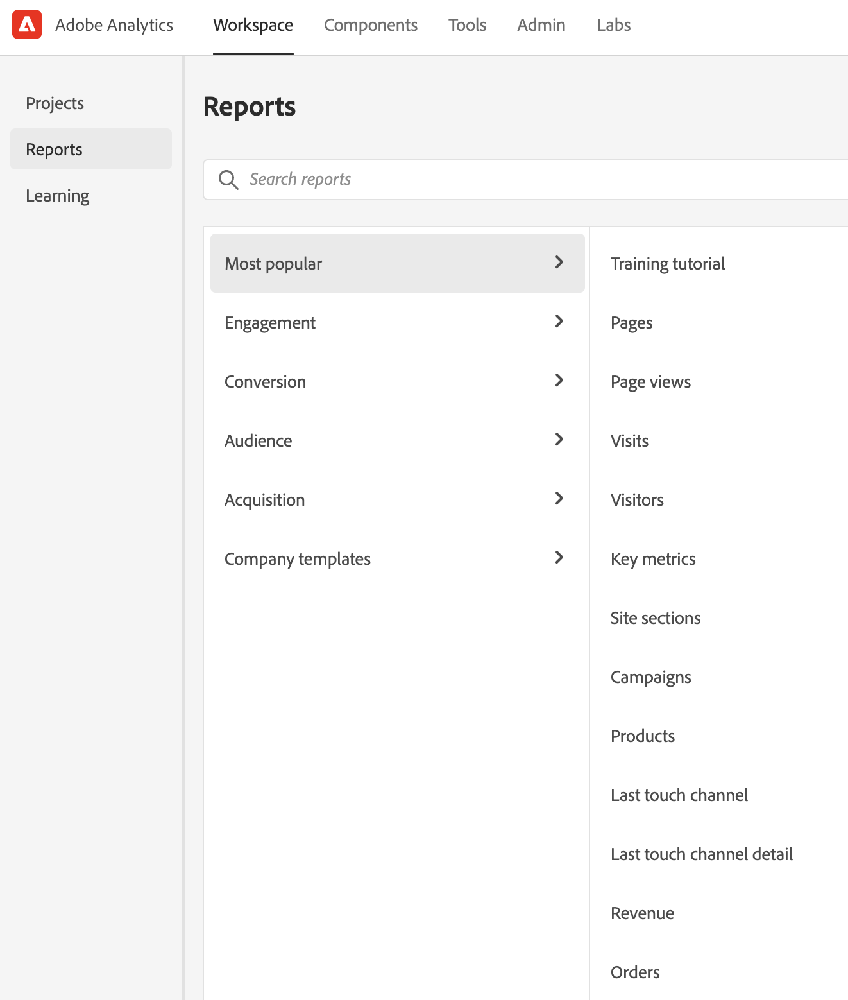

# Pagina di destinazione di Adobe Analytics

La pagina di destinazione di Adobe Analytics riunisce Analysis Workspace e Reports &amp; Analytics in un’unica interfaccia e un unico punto di accesso sotto l’ombrello di Workspace. Sono disponibili una pagina Home per project manager, un menu aggiornato per i rapporti, che hanno ora un design più attuale, nonché una sezione di apprendimento per aiutarti a iniziare in modo più efficace.

>[!IMPORTANT]
>
>Questa pagina di destinazione sarà in disponibile in versione Open Beta a partire dal 21 luglio 2021. È comunque facoltativa. Se lo desideri, puoi utilizzare la pagina di destinazione esistente, che si tratti di Workspace o dei rapporti. Se decidi di partecipare al programma beta, accedi alla pagina e fai clic su **[!UICONTROL Provide feedback]**, nella parte superiore dello schermo per fornire i tuoi feedback e registrare eventuali bug riscontrati. In qualsiasi momento puoi rinunciare o accedere nuovamente al programma beta. Eventuale lavoro svolto nell’interfaccia beta viene trasferito all’esperienza Workspace esistente/corrente.

>[!VIDEO](https://video.tv.adobe.com/v/334278/?quality=12)

## Accedere alla pagina di destinazione {#access-landing}

Dopo aver effettuato l’accesso ad Adobe Experience Cloud e Analytics, attiva il pulsante [!UICONTROL New landing page - Beta], in basso a sinistra. L’accesso a questo pulsante è specifico per l’utente in base all’organizzazione e non specifico per l’azienda.

## Struttura del menu

* Menu superiore di Analytics: la maggior parte dei rapporti si trova ora nel menu [!UICONTROL Reports], nella barra a sinistra.
* La barra a sinistra presenta tre schede: [!UICONTROL Projects], [!UICONTROL Reports] e [!UICONTROL Learning].

### Terminologia

* **[!UICONTROL Projects]** sono cose che hai creato o che un altro utente ha creato e condiviso con te. [!UICONTROL Projects] fa riferimento anche a progetti vuoti e scorecard per dispositivi mobili vuote.
* **[!UICONTROL Reports]** fa riferimento a qualsiasi cosa pregenerata da Adobe, ad esempio i rapporto di Reports &amp; Analytics e i modelli di Workspace. [!UICONTROL Reports] sono anche modelli di rapporti creati per te dalla tua azienda.
* **[!UICONTROL Templates]** non viene più utilizzato come termine per i progetti Workspace forniti da Adobe. Questi sono ora compresi in [!UICONTROL Reports].

## Scheda [!UICONTROL Projects] {#navigate-projects}

[!UICONTROL Projects] funge da pagina home di [!UICONTROL Workspace]. Tutti i progetti Workspace vengono visualizzati qui, comprese le scorecard per dispositivi mobili.

>[!NOTE]
>
>Molte delle seguenti impostazioni persistono (vengono ricordate) sia durante la sessione che tra sessioni diverse. Esempi: scheda attiva, filtri selezionati, colonne selezionate e direzione dell’ordinamento delle colonne. Tuttavia, i risultati delle ricerche non vengono mantenuti.

| Elemento nell’interfaccia utente | Definizione |
| --- | --- |
| ... Altro | Consente di [!UICONTROL View Tutorials] e [modificare le preferenze utente](/help/analyze/analysis-workspace/user-preferences.md). |
| Crea progetto | Il menu a discesa consente di creare un [!UICONTROL Workspace project] o un [!UICONTROL Mobile project]. |
| Mostra meno/altro | Consente di visualizzare o meno il banner:  |
| Progetto vuoto | Crea un [progetto Workspace](https://experienceleague.adobe.com/docs/analytics/analyze/analysis-workspace/home.html?lang=it) vuoto da compilare. |
| Scorecard per dispositivi mobili vuota | Crea una [scorecard per dispositivi mobili](https://experienceleague.adobe.com/docs/analytics/analyze/mobapp/curator.html?lang=it) vuota da compilare. |
| Apri tutorial |  Il tutorial su Workspace che mostra ai nuovi utenti come creare un progetto, illustrando i vari passaggi. |
| Apri note sulla versione | Apre la sezione Adobe Analytics delle ultime note sulla versione di Adobe Experience Cloud. |
| Icona Filtro | Puoi filtrare in base a tag, suite di rapporti, proprietari, tipi e altri filtri (Personali, Condivisi con me, Preferiti e Approvati) |
| Barra di ricerca | La ricerca ora include tutte le colonne della tabella. |
| Casella di selezione | Failic su questa casella accanto a uno o più progetti per visualizzare le azioni di gestione del progetto eseguibili: Elimina, Assegna tag, Fissa, Approva, Condividi, Rinomina, Copia ed Esporta in CSV. Potresti non disporre delle autorizzazioni necessarie per eseguire tutte queste azioni. |
| Preferiti | Se imposti un progetto come Preferito, viene contrassegnato da una stella e verrà incluso tra i risultati del filtro Preferiti. |
| Nome | Nome del progetto. |
| Icona Fissa (a forma di puntina) | Puoi fissare gli elementi in modo che vengano *sempre* visualizzati all’inizio dell’elenco. |
| Icona Info (i) | Fai clic sull’icona Informazioni per visualizzare i seguenti dati sul progetto: Tipo, Ruolo progetto, Proprietario, Descrizione e con chi è condiviso. Indica anche chi può [modificare o duplicare](https://experienceleague.adobe.com/docs/analytics/analyze/analysis-workspace/curate-share/share-projects.html?lang=it) il progetto. |
| Puntini di sospensione (…) | Fai clic sui puntini di sospensione accanto a un progetto per visualizzare le azioni di gestione del progetto disponibili: Elimina, Assegna tag, Fissa, Approva, Condividi, Rinomina, Copia ed Esporta in CSV. Potresti non disporre delle autorizzazioni necessarie per eseguire tutte queste azioni. |
| Tipo | Indica se si tratta di un progetto Workspace o di una scorecard per dispositivi mobili. |
| Tag | Puoi assegnare tag ai rapporti per organizzarli in gruppi. |
| Ruolo progetto | I ruoli di progetto indicano che sei il proprietario del progetto e se disponi delle autorizzazioni necessarie per modificarlo o duplicarlo. |
| Suite di rapporti | Le tabelle e le visualizzazioni all’interno di un pannello derivano i dati dalla suite di rapporti selezionata in alto a destra nel pannello. La suite di rapporti determina anche i componenti disponibili nella barra a sinistra. All’interno di un progetto, puoi utilizzare una o più suite di rapporti a seconda dei casi di utilizzo dell’analisi. L’elenco delle suite di rapporti è ordinato in base alla rilevanza. Adobe definisce la rilevanza in base a quanto recentemente e con quale frequenza la suite è stata utilizzata dall’utente corrente, e alla frequenza con cui viene utilizzata all’interno dell’organizzazione. |
| Proprietario | Persona che ha creato il progetto. |
| Ultima apertura | Indica l’ultima volta che hai aperto il progetto. |
| Selettore colonna | Per aggiungere o rimuovere colonne dall’elenco dei progetti, selezionale o deselezionale. |
| &lt; (pulsante Indietro) | Questo pulsante in un progetto Workspace o in un rapporto ti riporta alla configurazione della pagina di destinazione più recente. Quando torni alla pagina di destinazione, ritrovi la stessa configurazione che era attiva al momento in cui hai lasciato la pagina. |

## Scheda [!UICONTROL Reports] {#navigate-reports}

La scheda [!UICONTROL Reports] consolida tre set di rapporti:

* I modelli [!UICONTROL Workspace] predefiniti che si trovavano in precedenza in [!UICONTROL Workspace] > [!UICONTROL Project] > [!UICONTROL New]. Adobe non utilizza più il termine “modello” in questo contesto.
* La maggior parte dei rapporti predefiniti che si trovavano nel precedente menu superiore [!UICONTROL Reports] di Adobe Analytics. Questi rapporti sono ora visualizzati in [Analysis Workspace](https://experienceleague.adobe.com/docs/analytics/analyze/analysis-workspace/home.html?lang=it).
* Eventuali elementi creati dalla tua azienda.

>[!IMPORTANT]
>
>In Rapporti, la cartella Preferiti viene visualizzata solo se contrassegni un nuovo rapporto come Preferito. Non vengono riportati i precedenti preferiti di Reports &amp; Analytics.

Come già accennato, qui sono disponibili solo i rapporti più utilizzati tra quelli che erano precedentemente raggruppati in Reports &amp; Analytics. Non è stata effettuata la migrazione di alcuni rapporti raramente utilizzati o non più rilevanti. Per maggiori informazioni, consulta le domande frequenti riportate di seguito.

Ecco i menu e i relativi sottomenu. Se non riesci a trovare un rapporto specifico, usa la funzione di ricerca sulla pagina per trovarlo.

| Opzione di menu | Rapporti sotto questa voce di menu |
| --- | --- |
| **[!UICONTROL Most Popular]** | <ul><li>Tutorial di formazione (modello Workspace preesistente)</li><li>Pagine (quali sono le pagine principali?)</li><li>Visualizzazioni pagina (quante visualizzazioni di pagina vengono generate?)</li><li>Visite (quante visite ricevo?)</li><li>Visitatori (quanti visitatori ricevo?)</li><li>Metriche chiave (come sono le prestazioni delle metriche più importanti?)</li><li>Sezioni del sito (quali sezioni del sito hanno generato il maggior numero di visualizzazioni di pagina?)</li><li>Pagina successiva (quali sono le pagine successive visitate dagli utenti?)</li><li>Pagina precedente (quali sono le pagine precedenti visitate dagli utenti?)</li><li>Campagne (quali campagne sono più determinanti per le metriche chiave?)</li><li>Prodotti (quali prodotti sono più determinanti per le metriche chiave?)</li><li>Canale ultimo contatto (quale canale di ultimo contatto offre le prestazioni migliori?)</li><li>Dettaglio canale ultimo contatto (quale canale di ultimo contatto specifico ha prestazioni migliori degli altri?)</li><li>Ricavi (come stanno andando i ricavi?)</li><li>Ordini (come vanno gli ordini?)</li><li>Unità (quante unità vengono vendute?)</li></ul> |
| **[!UICONTROL Engagement]** | <ul><li>Metriche chiave (come sono le prestazioni delle metriche più importanti?)</li><li>Visualizzazioni pagina (quante visualizzazioni di pagina vengono generate?)</li><li>Pagine (quali sono le pagine principali?)</li><li>Visite (quante visite ricevo?)</li><li>Visitatori (quanti visitatori ricevo?)</li><li>Tempo trascorso per visita (quanto tempo trascorrono gli utenti per visita?)</li><li>Tempo precedente all’evento (quanto tempo trascorrono gli utenti prima di un evento di successo?)</li><li>Sezioni del sito (quali sezioni del sito hanno generato il maggior numero di visualizzazioni di pagina?)</li><li>Consumo di contenuti web (quali contenuti vengono maggiormente consumati e coinvolgono maggiormente gli utenti?)</li><li>Consumo di contenuti multimediali (quali contenuti vengono maggiormente consumati e coinvolgono maggiormente gli utenti?)</li><li>Flusso pagine successive e precedenti (quali sono o sono stati i percorsi successivi/precedenti seguiti dai visitatori?)</li><li>Abbandono (dove si verifica l’abbandono nelle proprietà digitali?)</li><li>Analisi tra dispositivi (tramite analisi tra dispositivi in Analysis Workspace)</li><li>Fidelizzazione web (chi sono gli utenti più fedeli e cosa fanno?)</li><li>Consumo audio multimediale (quali sono le tendenze e le metriche migliori in merito al consumo audio?)</li><li>Recency, frequenza, fedeltà per contenuti multimediali (chi sono i lettori più fedeli?)</li><li>Analisi pagina > Ricaricamenti (quali pagine vengono ricaricate maggiormente?)</li><li>Analisi pagina > Tempo trascorso su pagina (quanto tempo passano gli utenti sulle pagine?)</li><li>Entrate e uscite > Pagine di ingresso (quali sono le pagine di ingresso principali?)</li><li>Entrate e uscite > Pagine di entrata originali (da quale pagina è entrato originariamente il visitatore?)</li><li>Entrate e uscite > Visite pagina singola (quali pagine hanno generato più visite a una singola pagina?)</li><li>Entrate e uscite > Pagine di uscita (quali sono le pagine di uscita principali?)</li></ul> |
| **[!UICONTROL Conversion]** | <ul><li>Prodotti > Prodotti (quali prodotti sono più determinanti per le metriche chiave?)</li><li>Prodotti > Prestazioni prodotto (quali prodotti hanno prestazioni migliori?)</li><li>Prodotti > Categorie (quali sono le categorie di prodotti con le migliori prestazioni?)</li><li>Carrello acquisti > Carrelli (quanti utenti hanno aggiunto un prodotto al carrello?)</li><li>Carrello acquisti > Visualizzazioni carrello (quante volte i visitatori hanno visualizzato il carrello?)</li><li>Carrello acquisti > Aggiunte al carrello (con quale frequenza gli utenti aggiungono un prodotto al carrello?)</li><li>Carrello acquisti > Rimozioni dal carrello (con quale frequenza gli utenti rimuovono un prodotto dal carrello?)</li><li>Acquisti > Ricavi (come stanno andando i ricavi?)</li><li>Acquisti > Ordini (come vanno gli ordini?)</li><li>Acquisti > Unità (quante unità sto vendendo?)</li><li>[Magento: marketing e commerce](https://experienceleague.adobe.com/docs/analytics/analyze/analysis-workspace/build-workspace-project/starter-projects.html?lang=it#commerce)</li></ul> |
| **[!UICONTROL Audience]** | <ul><li>Metrica persone (quante persone interagiscono con il marchio?)</li><li>Profilo visitatore > Panoramica posizioni (quali posizioni generano maggior utilizzo tra gli utenti?)</li><li>Profilo visitatore > Geosegmentazione > Geo Counties, Geo Stati Uniti, Geo Region, Geo Cities, Geo US DMA (da quali aree geografiche provengono i visitatori?)</li><li>Profilo visitatore > Lingue (quali lingue preferiscono gli utenti?)</li><li>Profilo visitatore > Fusi orari (da quali fusi orari provengono gli utenti?)</li><li>Profilo visitatore > Domini (quali ISP utilizzano i visitatori per accedere al sito?)</li><li>Profilo visitatore > Domini di primo livello (quali domini sono più determinanti per il traffico verso il sito?)</li><li>Profilo visitatore > Tecnologia > Panoramica tecnologia (quali tecnologie vengono utilizzate dalle persone per accedere al sito?)</li><li>Profilo visitatore > Tecnologia > Browser, Tipo di browser, Larghezza browser, Altezza browser (quale browser, versione del browser e relative dimensioni vengono utilizzati per accedere al sito?)</li><li>Profilo visitatore > Tecnologia > Sistema operativo, Tipi di sistema operativo (quale sistema operativo e quale versione utilizzano i visitatori?)</li><li>Profilo visitatore > Tecnologia > Operatore mobile (quali operatori mobili utilizzano i visitatori per accedere al sito?)</li><li>Fidelizzazione visitatori > Frequenza di ritorno (quanto tempo trascorre tra la visita corrente dell’utente e le visite precedenti?)</li><li>Fidelizzazione visitatori > Visite di ritorno (quante visite sono riconducibili a utenti di ritorno?)</li><li>Fidelizzazione visitatori > Numero di visite (quale numero di visite determina la maggior parte delle metriche chiave?)</li><li>Fidelizzazione visitatori > Ciclo di vendita > Fedeltà cliente (a quale segmento di fedeltà appartengono gli utenti?)</li><li>Fidelizzazione visitatori > Ciclo di vendita > Giorni prima del primo acquisto (quanti giorni sono trascorsi tra la prima visita e il primo acquisto?)</li><li>Fidelizzazione visitatori > Ciclo di vendita > Giorni dall’ultimo acquisto (quanti giorni sono passati tra la visita corrente e l’ultimo acquisto?) )</li><li>Fidelizzazione visitatori > Dispositivi mobili > Dispositivi e tipi di dispositivi (quali dispositivi e tipi di dispositivi utilizzano i visitatori?)</li><li>Fidelizzazione visitatori > Dispositivi mobili > Produttore (quale produttore di dispositivi mobili usano i visitatori?)</li><li>Fidelizzazione visitatori > Dispositivi mobili > Dimensioni schermo, Altezza schermo, Larghezza schermo (quali sono le dimensioni/altezza/larghezza dello schermo dei dispositivi mobili usati dai visitatori?)</li><li>Fidelizzazione visitatori > Dispositivi mobili > [Utilizzo app mobile](https://experienceleague.adobe.com/docs/analytics/analyze/analysis-workspace/build-workspace-project/starter-projects.html?lang=it#mobile)</li><li>Fidelizzazione visitatori > Dispositivi mobili > [Percorsi in app mobile](https://experienceleague.adobe.com/docs/analytics/analyze/analysis-workspace/build-workspace-project/starter-projects.html?lang=it#mobile)</li><li>Fidelizzazione visitatori > Dispositivi mobili > [Metriche app mobile](https://experienceleague.adobe.com/docs/analytics/analyze/analysis-workspace/build-workspace-project/starter-projects.html?lang=it#mobile)</li><li>Fidelizzazione visitatori > Dispositivi mobili > [Messaggistica app mobile](https://experienceleague.adobe.com/docs/analytics/analyze/analysis-workspace/build-workspace-project/starter-projects.html?lang=it#mobile)</li><li>Fidelizzazione visitatori > Dispositivi mobili > [Prestazioni app mobile](https://experienceleague.adobe.com/docs/analytics/analyze/analysis-workspace/build-workspace-project/starter-projects.html?lang=it#mobile)</li><li>Fidelizzazione visitatori > Dispositivi mobili > [Fidelizzazione app mobile](https://experienceleague.adobe.com/docs/analytics/analyze/analysis-workspace/build-workspace-project/starter-projects.html?lang=it#mobile)</li></ul> |
| **[!UICONTROL Acquisition]** | <ul><li>Canali marketing > Canale primo contatto, Dettaglio canale primo contatto (quale canale di primo contatto e quale canale di primo contatto specifico offre le prestazioni migliori?)</li><li>Canali marketing > Primo ultimo canale, Dettaglio primo ultimo canale (quale canale di ultimo contatto e quale canale di ultimo contatto specifico ha prestazioni migliori?)</li><li>Campagne > Campagne (quali campagne sono più determinanti per le metriche chiave?)</li><li>Campagne > Prestazione campagna (quali campagne generano maggior fatturato?)</li><li>Campagne > Codice di tracciamento (quali codici di tracciamento delle campagne hanno le migliori prestazioni?)</li><li>[Acquisizione web](https://experienceleague.adobe.com/docs/analytics/analyze/analysis-workspace/build-workspace-project/starter-projects.html?lang=it#web)</li><li>[Acquisizione mobile](https://experienceleague.adobe.com/docs/analytics/analyze/analysis-workspace/build-workspace-project/starter-projects.html?lang=it#mobile)</li><li>[Advertising Analytics: ricerca a pagamento](https://experienceleague.adobe.com/docs/analytics/analyze/analysis-workspace/build-workspace-project/starter-projects.html?lang=it#advertising)</li><li>Parole chiave di ricerca - tutto, a pagamento, naturale (quali parole chiave di ricerca e parole chiave di ricerca a pagamento/naturale sono più determinanti per le metriche chiave?)</li><li>Motori di ricerca - tutti, a pagamento, naturali (quali motori di ricerca e motori di ricerca a pagamento/naturali sono più determinanti per le metriche chiave?)</li><li>Classificazione di tutte le pagine di ricerca (da quale pagina di ricerca arrivano gli utenti?)</li><li>Domini di riferimento (quali domini indirizzano il traffico al sito?)</li><li>Domini di riferimento originali (qual era il primo dominio in cui si trovavano gli utenti prima di visitare il sito?)</li><li>Riferimenti (su quali URL si trovavano gli utenti prima di fare clic e arrivare al mio sito?)</li><li>Tipi di riferimento (a quale categoria appartengono gli URL di riferimento?)</li></ul> |
| **[!UICONTROL Company reports]** | Rapporti creati dalla tua azienda per il tuo utilizzo. |

### Utilizzare la scheda Rapporti

Questa breve introduzione spiega come utilizzare in Workspace i rapporti che si utilizzavano in Reports &amp; Analytics. I rapporti si comportano come i modelli: se si apportano modifiche, viene richiesto di salvarle o eliminarle quando si esce o si passa a un altro rapporto. Quando si salvano le modifiche, il rapporto viene salvato come un nuovo progetto.

1. Passa alla scheda [!UICONTROL Reports].
1. Seleziona il rapporto che desideri visualizzare, ad esempio, in [!UICONTROL Most popular], seleziona il rapporto [!UICONTROL Pages].
1. A destra, fai clic su **[!UICONTROL Open report]**.

   

1. in Analysis Workspace, il rapporto Pagine presenta due [visualizzazioni](/help/analyze/analysis-workspace/visualizations/freeform-analysis-visualizations.md) ([Grafico a barre](/help/analyze/analysis-workspace/visualizations/bar.md) e [Numero di riepilogo](/help/analyze/analysis-workspace/visualizations/summary-number-change.md)) e una [tabella a forma libera](/help/analyze/analysis-workspace/visualizations/freeform-table/freeform-table.md). La metrica utilizzata è Occorrenze.
1. Da qui, sono disponibili più opzioni. Ad esempio, puoi eseguire le seguenti operazioni:

   * Puoi utilizzare il rapporto così com’è.
   * Puoi trascinare uno o più segmenti nella zona di rilascio Segmento, nella parte superiore. Ad esempio, trascina il segmento [!UICONTROL Mobile Customers] e osserva come cambiano i risultati.
   * Puoi modificare l’intervallo di date dal calendario in alto a destra.
   * Puoi aggiungere suddivisioni dimensionali, trascinare altre metriche e in genere personalizzare il rapporto come preferisci.

Altre opzioni di apprendimento:

* Puoi accedere a una panoramica video di 20 minuti su Analysis Workspace, in alto a sinistra su qualsiasi rapporto aperto.
* Per i nuovi utenti, consigliamo il video [Training Tutorial](https://www.youtube.com/watch?v=lCH1Kl1q9Wk) che illustra come creare un nuovo progetto.
* Questo è un collegamento alla [documentazione completa di Analysis Workspace](/help/analyze/analysis-workspace/home.md).
* Ecco la [playlist YouTube completa per Analysis Workspace](https://www.youtube.com/playlist?list=PL2tCx83mn7GuNnQdYGOtlyCu0V5mEZ8sS).

## Passare alla scheda Apprendimento {#navigate-learning}

La pagina Apprendimento contiene tutorial e presentazioni video pratiche, nonché collegamenti alla documentazione.

* La presentazione [!UICONTROL Workspace Fundamentals] porta direttamente a Workspace, descrive il layout di Workspace e mostra dove si possono trovare ed eseguire le azioni più comuni. Questa presentazione può essere riavviata in qualsiasi momento direttamente in Workspace tramite la descrizione a comparsa accessibile dall’intestazione del pannello.
* Quando si fa clic su un video o una presentazione, viene aggiunto un tag **[!UICONTROL Viewed]**. Questo tag consente di tenere traccia dei contenuti di apprendimento già visualizzati. Se non hai ancora completato il contenuto, puoi fare clic sul tag per rimuoverlo.
* Il pulsante **[!UICONTROL Learn more]** nella finestra modale del video apre una pagina della documentazione Adobe Experience League in cui puoi trovare ulteriori contenuti relativi al video appena guardato. **[!UICONTROL View more videos]** consente di accedere alla playlist YouTube completa su Analysis Workspace.

## Domande frequenti sulla pagina di destinazione {#landing-faq}

| Domanda | Risposta |
| --- | --- |
| Dove sono i modelli che trovavo in Workspace? | Questi modelli sono raggruppati sotto la scheda [!UICONTROL Reports]. |
| Posso rinunciare alla versione beta? | Puoi rinunciare alla versione beta in qualsiasi momento. |
| Il lavoro che eseguo nell’interfaccia utente del programma beta viene riportato all’esperienza Workspace di produzione? | Sì, qualsiasi lavoro svolto nella versione beta viene trasferito all’esperienza precedente/corrente di Workspace. |
| Vengono riportati gli elementi che erano stati contrassegnati come preferiti in Reports &amp; Analytics? | No, NON sono riportati. Tuttavia, vengono riportati tutti i progetti preferiti di Workspace. |
| Esiste un limite massimo al numero di progetti che è possibile fissare? | No, non esiste alcun limite al numero di progetti che è possibile fissare. |
| Gli amministratori possono designare questa nuova pagina di destinazione per i loro utenti? | No, gli amministratori non possono designare la pagina di destinazione per conto degli utenti. I singoli utenti devono attivarla autonomamente. |
| Sono ancora disponibili tutti i rapporti esistenti in Reports &amp; Analytics? | No, i seguenti rapporti sono stati gradualmente eliminati in base ai dati di utilizzo generali: <ul><li>Eventuali eVar/prop/eventi/classificazioni personalizzati<li>I miei rapporti consigliati</li><li>Visitatori univoci orari/giornalieri/settimanali/mensili/trimestrali/annuali</li><li>Clienti univoci giornalieri/settimanali/mensili/trimestrali/annuali</li><li>Profondità nome azione</li><li>Riepilogo nomi azioni</li><li>Aggiungi dashboard</li><li>Età</li><li>Supporto audio</li><li>Dati di fatturazione</li><li>Clic verso la pagina</li><li>Profondità colore</li><li>Supporto per cookie</li><li>Cookie</li><li>Tipi di connessione</li><li>Elementi creativi</li><li>Tipo di carta di credito</li><li>Cross-selling</li><li>Funnel evento personalizzato</li><li>Collegamenti personalizzati</li><li>Customer ID</li><li>Giorno della settimana</li><li>Nome azione di entrata</li><li>Nome azione di uscita</li><li>Collegamenti di uscita</li><li>Abbandono</li><li>Download di file</li><li>Trova in negozio</li><li>Percorsi completi</li><li>Genere</li><li>Regola VISTA di tipo Hit</li><li>Supporto immagini</li><li>Java</li><li>JavaScript</li><li>JavaScript versione</li><li>Gestione segnalibri</li><li>Gestione dashboard</li><li>Profondità colore del monitor</li><li>Risoluzione monitor</li><li>Registrazioni per newsletter</li><li>Nome azione successivo</li><li>Flusso nomi azioni successive</li><li>Ricerche Null</li><li>Sistema operativo</li><li>Revisione ordine</li><li>Pagina del giorno</li><li>Pagine non trovate</li><li>Pathfinder</li><li>Lunghezza percorso</li><li>Nome azione precedente</li><li>Flusso nomi azioni precedenti</li><li>Attività sul prodotto</li><li>Costo del prodotto</li><li>Reparto prodotto</li><li>Categoria inventario prodotto</li><li>Nome del prodotto</li><li>Recensioni prodotto</li><li>Stagione prodotto</li><li>Quote prodotto</li><li>Zoom sul prodotto</li><li>Ricaricamento</li><li>Ricerche</li><li>Server</li><li>Visite a pagina singola</li><li>Informazioni spedizione</li><li>Gerarchia sito</li><li>Menzioni social</li><li>Ora del giorno</li><li>Tempo trascorso su nome azione</li><li>Supporto video</li><li>Stato visitatore</li></ul> |
