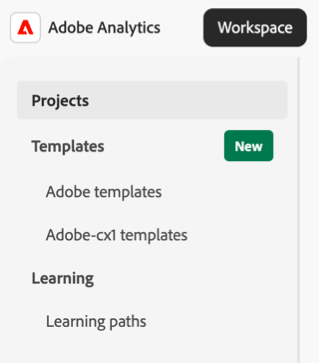
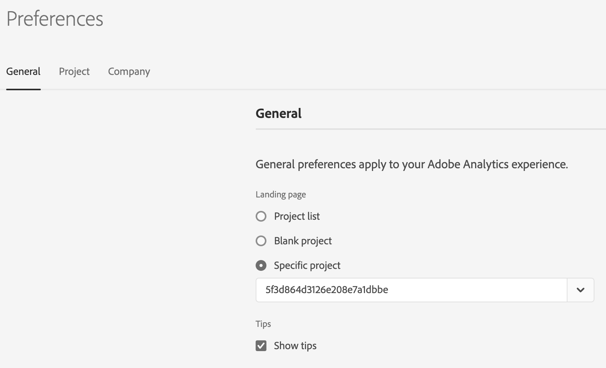

# Pagina di destinazione di Adobe Analytics

La pagina di destinazione di Adobe Analytics include le seguenti schede secondarie:

**[!UICONTROL Projects]**: progettazioni personalizzate che combinano componenti dati, tabelle e visualizzazioni create dall&#39;utente o create e condivise da un altro utente. [!UICONTROL Projects] fa riferimento anche a progetti vuoti e scorecard per dispositivi mobili vuote.

**[!UICONTROL Templates]**: include i modelli forniti da Adobe e tutti i modelli specifici dell&#39;organizzazione.

**[!UICONTROL Learning]**: contiene presentazioni video pratiche, tutorial e collegamenti alla documentazione.

>[!BEGINSHADEBOX]

Per un video dimostrativo, consulta la  [VideoCheckedOut](https://experienceleague.adobe.com/it/docs/analytics-learn/tutorials/analysis-workspace/analysis-workspace-basics/navigating-the-new-landing-page){target="_blank"}.

>[!ENDSHADEBOX]

## Progetti {#navigate-projects}

La sezione **[!UICONTROL Projects]** nella barra a sinistra funge da home page per la scheda [!UICONTROL **Workspace**].

Per accedere ai progetti in Adobe Analytics:

1. Seleziona la scheda [!UICONTROL **Workspace**].

1. Seleziona [!UICONTROL **Progetti**] nella barra a sinistra.

La sezione Progetti mostra la cartella Azienda, tutte le cartelle personali create, i progetti Workspace e le scorecard per dispositivi mobili. In questa pagina puoi visualizzare, creare e modificare cartelle, progetti e scorecard per dispositivi mobili. Per ulteriori informazioni, consulta [Progetti](/help/analyze/analysis-workspace/build-workspace-project/freeform-overview.md).

**[!UICONTROL Projects]** (Progetti) contiene progetti personalizzati che combinano componenti dati, tabelle e visualizzazioni creati dall’utente o che altri utenti hanno creato e condiviso con te. [!UICONTROL Projects] fa riferimento anche a progetti vuoti e scorecard per dispositivi mobili vuote.

>[!NOTE]
>
>Molte delle seguenti impostazioni persistono nelle sessioni. Ad esempio, la scheda selezionata, i segmenti selezionati, le colonne selezionate e la direzione di ordinamento delle colonne. I risultati della ricerca non persistono.

Per ulteriori informazioni, consulta [Progetti](/help/analyze/analysis-workspace/build-workspace-project/freeform-overview.md).

### Personalizzare le colonne in tabella

Per personalizzare la larghezza delle colonne, trascinare la barra verticale che separa ciascuna colonna.

Per aggiungere o rimuovere colonne dall’elenco dei progetti, fai clic sull’icona della colonna () in alto a destra, quindi seleziona o deseleziona i titoli delle colonne.

Le colonne disponibili sono:

| Nome colonna | Descrizione |
|---------|----------|
| [!UICONTROL **Nome**] | Identifica il nome del progetto. |
| [!UICONTROL **Tipo**] | Indica se si tratta di un progetto Workspace, di una scorecard per dispositivi mobili o di una cartella. |
| [!UICONTROL **Tag**] | Assegna tag ai progetti per organizzarli in gruppi. |
| [!UICONTROL **Pianificato**] | Impostato su [!UICONTROL On] se il progetto è pianificato, su [!UICONTROL Off] se non lo è. Fai clic sul collegamento [!UICONTROL On] per visualizzare informazioni sul progetto pianificato. Puoi anche [modificare la pianificazione del progetto](/help/analyze/analysis-workspace/curate-share/t-schedule-report.md) se ne sei il proprietario. |
| [!UICONTROL **Ruolo progetto**] | Identifica i ruoli di progetto: se l’utente è il proprietario del progetto e se dispone delle autorizzazioni necessarie per modificarlo o duplicarlo. |
| [!UICONTROL **Suite di rapporti**] | Identifica le suite di rapporti associate al progetto. Le tabelle e le visualizzazioni all’interno di un pannello derivano i dati dalla suite di rapporti selezionata in alto a destra nel pannello. La suite di rapporti determina anche i componenti disponibili nella barra a sinistra. All’interno di un progetto, puoi utilizzare una o più suite di rapporti a seconda dei casi di utilizzo dell’analisi. L’elenco delle suite di rapporti è ordinato in base alla rilevanza. Adobe definisce la rilevanza in base a quanto recentemente e con quale frequenza la suite è stata utilizzata dall’utente corrente, e alla frequenza con cui viene utilizzata all’interno dell’organizzazione. |
| [!UICONTROL **Proprietario**] | Identifica la persona che ha creato il progetto. |
| [!UICONTROL **Condiviso con**] | Mostra con chi è attualmente condiviso il progetto. |
| [!UICONTROL **Ultima modifica**] | La data e l’ora dell’ultima volta che il progetto è stato modificato. |
| [!UICONTROL **Ultima apertura**] | Identifica la data dell’ultima apertura di un progetto da parte dell’utente che sta visualizzando la pagina Progetti. |
| [!UICONTROL **Ultimo utilizzo**] | Consente di determinare se un progetto è utile per gli utenti dell’organizzazione, mostrando la data e l’ora dell’ultima apertura del progetto da parte di qualsiasi utente all’interno dell’organizzazione.
Quando visualizzi questa colonna, prendi in considerazione quanto segue:
<ul><li>Le informazioni sull’utilizzo sono disponibili a partire da settembre 2023.</li><li>Questa colonna è disponibile solo per gli amministratori di sistema.</li></ul> |
| [!UICONTROL **ID Progetto**] | Può essere utilizzato per i progetti di debugging. |
| [!UICONTROL **Intervallo di date più lungo**] | Intervalli di date più lunghi aumentano la complessità del progetto e possono comportare tempi di elaborazione e di caricamento più lunghi. |
| [!UICONTROL **Numero di query**] | Numero totale di richieste effettuate ad Analytics quando il progetto viene caricato. Un numero elevato di query di progetto aumenta la complessità del progetto e può comportare tempi di elaborazione e di caricamento più lunghi. Questi dati sono disponibili solo dopo il caricamento di un progetto o l’invio di un progetto pianificato. |
| [!UICONTROL **Posizione**] | Mostra la cartella in cui si trova il progetto. |

### Altri elementi dell’interfaccia utente nella pagina Progetti

| Elemento nell’interfaccia utente | Definizione |
| --- | --- |
| Modifica preferenze | Consente di scegliere [!UICONTROL View Tutorials] (Mostra tutorial) e di [modificare le preferenze utente](/help/analyze/analysis-workspace/user-preferences.md). |
| [!UICONTROL Create new] | Apre la finestra modale del progetto in cui puoi creare un progetto Workspace o una scorecard per dispositivi mobili oppure aprire un modello aziendale. |
| [!UICONTROL Show less  Mostra altro] | Consente di visualizzare o meno il banner:  |
| [!UICONTROL Workspace project] | Crea un [progetto Workspace](/help/analyze/analysis-workspace/home.md) vuoto da progettare e costruire. |
| [!UICONTROL Mobile scorecard] | Crea una [scorecard per dispositivi mobili](/help/analyze/mobile-app/curator.md) vuota da progettare e costruire. |
| [!UICONTROL Open Training Tutorial] | Apre la formazione di Workspace sul processo di creazione di un nuovo progetto iniziale in un tutorial dettagliato. |
| [!UICONTROL Open release notes] | Apre la sezione Adobe Analytics delle ultime note sulla versione di Adobe Experience Cloud. |
| Icona Filtro | Consente di filtrare in base a tag, suite di rapporti, proprietari, tipi e altri filtri (Personali, Condivisi con me, Preferiti e Approvati) |
| Barra di ricerca | Cerca in tutte le colonne della tabella. |
| Casella di selezione | Seleziona uno o più progetti per visualizzare le azioni di Project Management eseguibili: **Elimina**, **Condividi**, **Rinomina**, **Copia**, **Rimuovi**, **Sposta su**, **Sposta giù**, **Contrassegna**, **Approva**, **Esporta CSV** e **Sposta in**. Potresti non disporre delle autorizzazioni necessarie per eseguire tutte le azioni elencate. |
| [!UICONTROL Favorites] | Aggiunge una stella accanto a un progetto o a una cartella preferita che può essere utilizzata come filtro. |
| [!UICONTROL Name] | Identifica il nome del progetto. |
| Icona Fissa (a forma di puntina) | Consente di fissare gli elementi in modo che siano sempre visualizzati in cima all’elenco, ma è possibile modificare l’ordine spostandoli verso l’alto o verso il basso. Utilizza il menu delle opzioni contrassegnato dai puntini di sospensione e seleziona **Sposta su** o **Sposta giù** nell’elenco. |
| Icona Info (i) | Mostra le seguenti informazioni su un progetto: Tipo, Ruolo progetto, Proprietario, Descrizione e con chi è condiviso. Indica anche chi può [modificare o duplicare](/help/analyze/analysis-workspace/curate-share/share-projects.md) il progetto. |
| Puntini di sospensione (…) | Mostra le azioni di Project Management eseguibili: **Elimina**, **Condividi**, **Rinomina**, **Copia**, **Rimuovi**, **Sposta su**, **Sposta giù**, **Contrassegna**, **Approva**, **Esporta CSV** e **Sposta in**. Potresti non disporre delle autorizzazioni necessarie per eseguire tutte le azioni elencate. |
| MOSTRA: Cartelle e Progetti o Tutti i progetti | Modifica le impostazioni di visualizzazione nella tabella per mostrare cartelle e progetti in base all’organizzazione delle cartelle **oppure** mostra tutti i progetti in un elenco non organizzato. |
| &lt; (pulsante Indietro) | Consente di tornare alla configurazione della pagina di destinazione più recente in un progetto Workspace o in un rapporto. Quando torni alla pagina di destinazione, ritrovi la stessa configurazione che era attiva al momento in cui hai lasciato la pagina. |

## Modelli {#navigate-reports}

Per accedere ai modelli in Adobe Analytics:

1. Seleziona la scheda [!UICONTROL **Workspace**].

1. Nella sezione [!UICONTROL **Modelli**] della barra a sinistra, puoi selezionare modelli Adobe o modelli aziendali.

Per informazioni sull’utilizzo dei modelli, consulta le risorse seguenti:

* [Utilizzare i modelli](/help/analyze/analysis-workspace/templates/use-templates.md)

* [Creare e gestire i modelli](/help/analyze/analysis-workspace/templates/create-templates.md)

## Utilizzare la scheda Apprendimento {#navigate-learning}

La pagina Apprendimento contiene tutorial, presentazioni video pratiche e collegamenti alla documentazione.

Utilizza la pagina Apprendimento di Adobe Analytics per scoprire le funzioni principiante, intermedie o avanzate e i casi d’uso in Adobe Analytics.

### Accedere alla pagina Apprendimento

1. In Adobe Analytics, seleziona [!UICONTROL **Workspace**] > [!UICONTROL **Apprendimento**].

### Funzioni della pagina di apprendimento

* **Filtrare i contenuti:** l’icona Filtro nella barra a sinistra consente di filtrare i contenuti di apprendimento in base al livello di esperienza (principiante, intermedio o avanzato) e al tipo di contenuto (documento, video o presentazione e tutorial).
* **Tracciare l’avanzamento:** dopo aver selezionato una parte del contenuto, viene visualizzato un tag **[!UICONTROL Viewed]**. Questo tag consente di tenere traccia dei contenuti di apprendimento già visualizzati. È possibile selezionare il tag **[!UICONTROL Viewed]** per rimuoverlo da una parte del contenuto.
* **Visualizza contenuto aggiuntivo:** quando visualizzi un video, seleziona il pulsante **[!UICONTROL Learn more]** per visualizzare il contenuto della documentazione correlata su Experience League. In alternativa, dalla pagina Apprendimento, seleziona una delle seguenti opzioni per visualizzare contenuto aggiuntivo:
   * **[!UICONTROL Visit YouTube]:** visualizza la playlist di YouTube completa di Analysis Workspace.
   * [!UICONTROL **Visita Experience League**]: consulta la suite completa della documentazione di Adobe Analytics su Experience League.
* **Nozioni di base per i nuovi utenti:** La presentazione [!UICONTROL Workspace Fundamentals] è consigliata per i nuovi utenti. Questa presentazione consente di entrare direttamente in Workspace e di scoprire le azioni più comuni. Questa presentazione può essere riavviata in qualsiasi momento direttamente in Workspace tramite la descrizione a comparsa accessibile dall’intestazione del pannello.

## Impostare la pagina di destinazione {#set-landing}

Gli utenti possono impostare la pagina di destinazione preferita.

1. In Adobe Analytics, seleziona [!UICONTROL **Componenti**] > [!UICONTROL **Preferenze**] > [!UICONTROL **Generali**].
1. Seleziona la pagina di destinazione preferita.

   

## Domande frequenti sulla pagina di destinazione {#landing-faq}

| Domanda | Risposta |
| --- | --- |
| Dove sono i modelli che trovavo in [!UICONTROL Workspace]? | Questi modelli sono raggruppati sotto la scheda [!UICONTROL Templates]. |
| Il lavoro che eseguo nell’interfaccia utente del programma beta viene riportato all’esperienza [!UICONTROL Workspace] di produzione? | Sì, qualsiasi lavoro svolto nella versione beta viene trasferito all’esperienza precedente/corrente di [!UICONTROL Workspace]. |
| I miei preferiti precedenti in Reports &amp; Analytics sono stati riportati? | No, NON sono riportati. Tuttavia, vengono riportati tutti i progetti preferiti di [!UICONTROL Workspace]. |
| Esiste un limite massimo al numero di progetti che è possibile fissare? | No, non esiste alcun limite al numero di progetti che è possibile fissare. |
| Gli amministratori possono designare questa nuova pagina di destinazione per i loro utenti? | No, gli amministratori non possono designare la pagina di destinazione per conto degli utenti. I singoli utenti devono attivarla autonomamente. |
